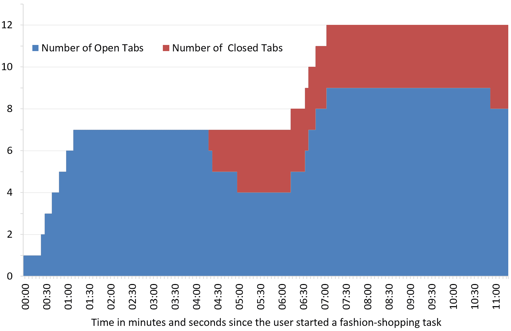
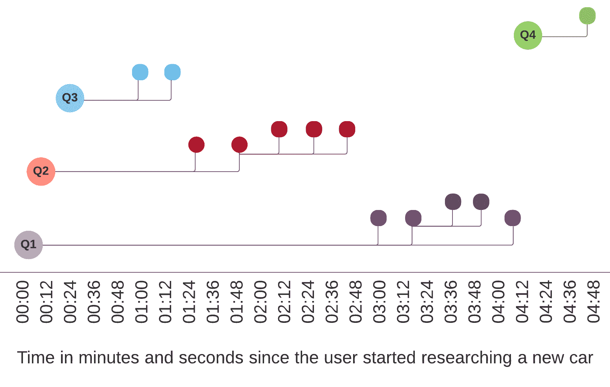

# 尼尔森诺曼集团:UX 研究、培训和咨询

> 原文：<http://www.nngroup.com/articles/multi-tab-page-parking/?utm_source=wanqu.co&utm_campaign=Wanqu+Daily&utm_medium=website>

人们如何使用现代浏览器中的标签？**在不同的标签页中同时打开多个页面**的能力可以用于**并行浏览，**用户可以在任务之间切换，并在该处理标签页中的任务时重新显示该标签页。例如，用户可能会在一个标签中全天打开脸书，并不时检查更新。

我们最近为报告[为年轻人设计](/reports/designing-for-young-adults/)进行的用户研究发现，年轻的成年用户参与了另一种与标签相关的行为，我们称之为**页面停放**:快速连续打开多个页面，以保存这些页面上的项目，并在稍后阶段重新访问它们。这种行为经常发生在购物、研究或阅读新闻时，但也可能发生在任何需要打开几个相似项目(每个项目都在单独的选项卡中)的任务中。稍后，在用户查看选项卡中的内容后，他们可能会划掉许多停放的项目并关闭相应的选项卡。

并行浏览和页面停放具有完全不同的特征:

|  | **并行浏览** | **页面停车** |
| **谁倾向于表现出这种行为** | 电力用户 | 年轻的成年用户("[千禧一代](https://www.nngroup.com/articles/millennials-digital-natives/)") |
| **标签页和用户任务的关系** | 每个选项卡中的不同任务 | 许多选项卡中的相同任务 |
| **标签页和网站的关系** | 主要是站点和选项卡之间的一对一映射 | 每个站点通常包含许多选项卡，每个选项卡包含站点中的一个项目。 |
| **标签之间的关系** | 每个选项卡通常独立于其他选项卡。 | 少数选项卡是“父”或中心页面(例如，丰田网站上的汽车型号列表)，其他选项卡是“子”页面，包含彼此相似但经常竞争的项目(例如，不同的汽车型号)。 |
| **打开了多少个新标签页** | 一次一个，当一个新的任务开始时 | 许多新标签同时打开，通常来自一个枢纽，如类别页面或搜索引擎结果页面 |
| **标签关闭前的生命周期** | 很长，可能一整天或跨越几天 | 通常很短，如项目被考虑然后被驳回 |
| **每次访问选项卡的持续时间** | 几分钟 | 从几秒钟(如果发现缺少某个项目)到更长时间的访问不等 |

当然，说翻页式停车是年轻人的特征并不意味着老年人不这样做。然而，我们在用户研究中观察到，千禧一代的页面停留比其他年龄段的多得多。当然，反过来说，许多千禧一代是超级用户，因此除了页面停放之外，也使用并行浏览。一些用户同时进行并行浏览和页面停放的事实并不能改变这是两种不同的行为，用于不同的目的，应该分开分析。

下面的图表显示了一个页面暂停的例子:它代表了一个年轻人在 11 分 20 秒内购买衣服时打开和关闭的标签数量。在第一分钟，她打开了许多标签，每个标签都有不同的时尚项目。接下来是 3 分钟观看这些选项，2 分钟通过关闭一些标签排除选项。最后，用户打开了几个带有额外选项的新标签，然后花了会话的剩余时间来考虑它们。快速**信息搜寻**(新标签的产生)和**信息消化**(当一些标签再次关闭时，考虑和整合)交替进行是一种典型的行为，通常与页面暂停有关。

*Growth in the number of browser tabs over time during one usability-testing task. The currently active tabs are shown in blue. Red represents tabs that have been closed by the user; those tabs were thus no longer present in the browser’s tab bar. In total, the study participant employed 12 different tabs for this task, but the maximum number that was open at any one time was 9.*

## 为什么千禧一代喜欢多标签页

页面停放是对“ [pogo sticking](/articles/pogo-sticking/) ”的一种反应，用户在一个中心枢纽和它链接的页面之间来回跳动。Pogo sticking 会破坏用户体验，经常出现在导航设计不佳的网站上。

一个年轻的成年用户说，*“我更喜欢相关信息在一个新窗口中打开，这样我就可以继续阅读，这样我就不会浪费我的时间，不得不一路返回。”*另一个用户说，*“我只是把它们*【一堆单独的产品】*放在标签里，这样我就能看到它看起来像什么了。”*“之后”这个词在这里很关键:用户喜欢在标签页中分页，因为这让他们能够**分开研究的两个阶段**:

1.  **搜寻**信息。在一个阶段中(例如，在上述示例中的时间戳 00:25 和 01:10 之间)，用户**扫描可用选项**的列表，并决定哪些选项可能值得进一步考虑。这些项目被放置在新标签中，但在此阶段不会被详细考虑。因此，当用户仍处于概览模式时，他或她的注意力不会因分析详细信息而转移。
2.  **消化**信息。稍后，用户转向**检查单个标签**。在消化阶段，搜索阶段保存的页面可能会被读取或立即拒绝，但无论是哪种情况，用户都可以一次只关注一页。用户也可以通过在两个标签之间快速来回切换来比较项目。

在 pogo sticking 中，用户被迫不断交替搜索和消化信息，而在 page parking 中，这些阶段可以分开，一次完成一个。这有什么好的？首先，因为用户不需要在收集和分别比较的两个[基本任务之间切换和保存上下文。(切换任务环境](/articles/the-3cs-of-critical-web-use-collect-compare-choose/)[增加了认知负荷](/articles/minimize-cognitive-load/)，因为用户必须从记忆中检索新任务的具体细节。)

第二，当页面被停放时，标签充当了**记忆助手**，让用户不必记住他们感兴趣的条目。(标签是外部记忆的一种形式，或者引用我们的同事 Don Norman 的话，“世界上的知识”而不是“头脑中的知识”——参见他的书[日常事物的设计](/books/design-everyday-things-revised/)。)将内存负担卸载到用户界面的能力通常有利于可用性，这将在我们的 [HCI 基础](/courses/hci/)课程中进一步讨论。

年轻的成年用户不耐烦了。页面停放的第三个好处是它**绕过了等待慢速页面**加载，因为加载发生在一个当前不可见的标签中。然而，这并不是[响应时间](/articles/website-response-times/)慢的借口，因为用户也需要能够直接导航到页面而不需要停下来。

下图显示了用户在 5 分钟内搜索购买信息时的标签打开行为。这个用户的行为有点不寻常:在 3 个新标签中快速连续地发出 3 个不同的查询(图表中的 Q1、Q2 和 Q3 ),然后首先直接进入第 3 个 rd SERP(搜索引擎结果页面——图表中的 Q3 ),直到会话后期才返回第一个查询(Q1)。(大多数用户[缺乏查询重构技能](/articles/incompetent-search-skills/)，但是这个用户从一开始就意识到任务需要多种查询策略。)

*Page-parking example from a product-research task: each circle indicates one new tab opened by the user. Bigger circles indicate tabs used for search engine queries (Q1–Q4). Note the parent–child relationship between many of the tabs, including “grandchildren,” as some of the destination pages (opened from the search-results page) caused the user to spawn even more tabs. Toward the end of the session, the user attempted one more Google search (Q4) in a new tab and only clicked on one of the hits. Even this hit was first parked in a new tab, following the user’s habitual behavior pattern. This last instance of page parking was unnecessary (and entailed extraneous clicks) since the user didn’t pursue any of the other entries from this search listing.*

## 页面停放的含义

我们过去常说，在网络上，你的竞争对手只需点击一下鼠标。这就是为什么除了一个令人敬畏的网站之外，任何东西都是失败者。有了页面停放，这个关于用户体验的商业影响的老论点又上升了一个档次:现在，你的几个竞争对手的网站*已经被打开*，并且停放在你的网站旁边的标签中。因此，页面停放强化了所有现存的[对 UX 网站的指导方针](/courses/web-ux-design-guidelines/):任何使用你网站的困难，客户都会关闭你的标签并转向竞争对手的标签。除了我们以前的建议之外，还要遵循以下 7 条支持页面停放的指导原则:

1.  首先，也是最重要的，允许页面暂停:**允许用户选择一个链接，并使用标准的浏览器控件在一个新的标签页**中打开它。许多网站严重违反了这条准则，将链接编码成 JavaScript 或其他奇怪的代码，只允许链接在当前标签页中打开。考虑到页面停放用户是对你的几个产品感兴趣的高度参与的客户，很难相信网站投资额外的编程工作只是为了对抗这些客户。
2.  设计一个好的 **favicon** 以便用户可以识别属于你网站的标签。(favicon 是“收藏夹图标”的缩写，是一个 16×16 像素的小图标，用于在标签页和*书签* / *收藏夹*菜单中识别网站。)当标签栏变得足够拥挤时，favicon 是唯一一个可以发出[信息气味](/articles/information-scent/)并提醒用户查看他们在你的网站上停留过的页面的视觉效果。遵循[图标可用性](/articles/icon-usability/)的指导方针，但是要确保小图标干净，比普通图标使用更少的细节。
3.  用携带信息的词语开始每一页的标题，以区别于其他页面。在最好的情况下，每个标签会显示[2-3 个单词](/articles/first-2-words-a-signal-for-scanning/)，但是当足够多的标签被打开后，每个标签只会显示几个字符。这些可能不足以让用户从打开的标签页中选择他们想要的页面。在我们对加拿大千禧一代的研究中，一名测试用户正在研究一项汽车购买计划，打开了 12 个标签，每个标签上都显示了以下文本(包括 2 个关于她也在寻找的其他东西的标签):这些标签中的哪一个可以让你轻松地记住你在那个标签中停放了什么？后来，同一个用户打开了 15 个标签，每个标签显示的文本更少，这使得记住内容更加困难。
    *   三星电子
    *   三星 S
    *   Honda.ca
    *   最佳燃料 ec
    *   2015 年最佳甲
    *   比较硅
    *   比较 Si
    *   Forbes.com
    *   El 的类型
    *   最佳汽车奖
    *   Forbes.com
    *   10 个最佳用途Which of these labels allow you to easily remember what you parked in that tab? Later, that same user had 15 tabs open, each showing even less text — making it even harder to remember the content.
4.  **使用** [**面包屑**](/articles/breadcrumb-navigation-useful/) **和** [**你在这里**](/articles/navigation-you-are-here/)**导航指示器来提醒人们一个页面如何与你网站的其余部分相关联。在停留一个页面和访问它之间可能会过几分钟，在这段时间里用户会忘记很多东西。还要提供[相关链接](/articles/related-content-pageviews/)以允许用户轻松访问附加页面(记住，用户可能也想停放那些相关页面)。**
***   在 [**网站** **分析**](/articles/analytics-user-experience/) 中，我们无法将一个页面的访问时长衡量为一个页面被打开的时间与用户离开该页面的时间之间的间隔。在这段时间的大部分时间里，页面很可能一直停留在一个隐藏的选项卡中，这不应该被算作是活跃的“访问”时间。*   相反，你可能想添加一个新的分析指标到**来衡量发生在你的站点上的页面滞留**的程度。越多的页面停放者，他们停放的页面越多，你的内容就越有吸引力。(尽管如果用户最终没有转化就离开了，那就有问题了:内容不应该仅仅是*看起来*足够吸引人，以至于在第一眼看完之后就停下来，它还应该是*提供的*，一旦用户稍后将全部注意力转向它。)*   最后，**不要通过在新标签页中自动打开链接来强制**页面停车给用户。打开一个新标签页应该始终是用户控制下的一个选项，并且只有当用户通过使用适当的浏览器命令请求它时才被激活。那些想要停放页面的用户非常清楚该怎么做，但是许多用户不想停放页面，而是想直接进入当前选项卡内的链接目的地。**

 **虽然页面停放是一种常见的行为，但并不普遍。对于千禧一代和老年用户来说，定期浏览仍然占网络使用的很大一部分。因此，继续支持常规的[导航和搜索](/articles/search-not-enough/)，以及*后退*按钮作为一种移动到先前看到的页面的方式是很重要的。支持页面停放的需求只是增加了 web 设计人员现有的职责。

(在我们的在线研讨会[千禧一代在线](https://www.nngroup.com/online-seminars/millennials-online/)中，更多关于千禧一代的特殊在线行为以及这些用户对网站的态度。全天课程[网页 UX 设计](https://www.nngroup.com/courses/web-page-design/)更多关于用户的网络使用行为模式。)** 