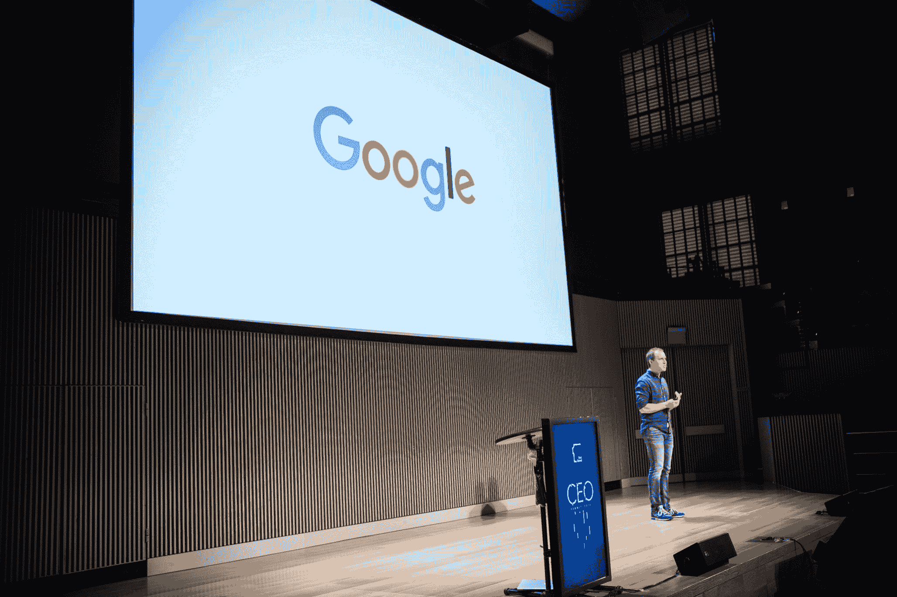

# 从谷歌地图|第一轮审核中吸取这些经验教训，挑战你的竞争对手

> 原文：<http://firstround.com/review/take-on-your-competition-with-these-lessons-from-google-maps/?utm_source=wanqu.co&utm_campaign=Wanqu+Daily&utm_medium=website>

布雷特·泰勒 对处于劣势并不陌生。从他的简历来看，这似乎不是真的:斯坦福大学计算机科学硕士；2003 年加入谷歌，帮助领导共同创建谷歌地图的团队；共同创立并担任 [FriendFeed](https://en.wikipedia.org/wiki/FriendFeed "null") 的首席执行官，该公司于 2009 年成功出售给脸书；出任脸书 CTO 至 2012 年；最后是联合创始人，目前是初创公司 **[Quip](https://quip.com/ "null")** 的首席执行官，该公司最近从 [Greylock](http://www.greylock.com/ "null") 和 [Benchmark](http://www.benchmark.com/ "null") 获得了 3000 万美元的融资。事实上，对大多数人来说，泰勒的职业生涯似乎是为世界上最大、最强大的一些科技公司工作——你可能会说，是一个“巨人”的职业生涯。

但听泰勒说，在他所有的产品开发经历中，更常见的线索是成为一个“大卫”——试图打倒一个非常成熟的竞争对手的小暴发户。他可能最终打造出了如今被认为极其成功且引领潮流的产品，但据泰勒称，几乎在所有情况下，每一款产品都是从一系列试图驱逐老牌竞争对手的失败实验开始的。“我认为我个人被驱使去‘修复’看似落后或过时的产品体验，这似乎是激烈竞争行业的副产品，”泰勒说。

在第一轮 CEO 峰会上，泰勒总结了他在竞争激烈的市场中制造许多产品以及成功应对根深蒂固的竞争对手的关键经验和策略。

从斯坦福毕业后，泰勒深信产品质量直接导致市场成功，他离开学校后在谷歌的第一份工作强化了这一观点。“当谷歌发布时，人们普遍对它持怀疑态度——当然，它是一个更好的搜索引擎，但有人会在乎吗？当时有成吨的其他搜索引擎。当搜索已经成为互联网上最受欢迎的门户网站，如雅虎和 Excite 时，人们为什么还要使用专用的搜索引擎呢？但毫无疑问，谷歌是一个好得多的产品，它确实赢了。”谷歌是一家建立在最佳产品胜出的前提之上的公司。对于像泰勒这样的年轻产品经理来说，这巩固了一个想法，即如果你能制造一个更好的捕鼠器，它总是会赢。

不幸的是，泰勒说，“我们大多数创办公司的人都发现事情没那么简单。事实上，我甚至可以说，爱默生的引用完全是误导——即使在更好的捕鼠器获胜的情况下，也很少仅仅是因为它更好。他开玩笑说，“事实上，捕鼠器是美国历史上发明频率最高的设备，已经有超过 4000 份专利申请和数千份被拒绝的申请。”

泰勒说，在他的职业生涯中，他已经多次不成功地走上这条道路——专注于制造一个更好的捕鼠器，而光靠这个几乎肯定会失败。但是，当他检查设计和制造所有失败产品的过程，以及最终成功的产品时，他发现了一个共同的模式。

除了极少数例外，心气赢不了仅仅是因为它更好。

根据 Taylor 的说法,“更好的捕鼠器”发展理论的最大问题是，它忽略了与你竞争的现有产品的独特优势。

# 1)现有企业拥有根深蒂固的分销渠道

你将面临的第一个问题是，在位者在他们的分销模式中总是有巨大的结构优势。泰勒开玩笑说，“当你是直接向消费者销售捕鼠器的傻瓜时，现任的 MegaCorp 有一千个分销渠道和合作伙伴。大多数顾客甚至不确定他们为捕鼠器付了多少钱，甚至不知道他们是否真的付了钱。”

“无论是我在谷歌地图工作时将雅虎黄页打造为世界上最受欢迎的门户网站，还是现在我在 Quip 工作时将谷歌文档与世界上最受欢迎的网络邮件提供商捆绑在一起，当你面对一个强大的现任者时，你不能低估你的起步有多落后，”泰勒说。“你经常在非常不平等的条件下竞争——你的竞争对手的商业模式可能会让你无法直接分销你的产品并真正获胜。"

# 2)习惯比你想象的要难改掉。

你将面临的第二个问题是，正如泰勒所说，“人们不像拉尔夫·沃尔多·爱默生那样关心更好的捕鼠器。”

在很多方面，你最安静、最坚定的竞争对手是冷漠。

为了说明这一点，泰勒解释了即使对于一个所有人都认为更好的产品来说，这也是多么复杂:“我不认为我说谷歌地图比 2005 年推出的 MapQuest 好 200 万倍是特别傲慢。然而，当我 2007 年离开谷歌时，谷歌的流量还没有超过 MapQuest。它花了三年多时间，尽管 MapQuest 在互联网石器时代被冻结了，谷歌地图在谷歌主页上有一个链接，这比大多数初创公司的分发量大得多。”

事实证明，MapQuest 是如此根深蒂固，它是一个动词，为广大人口。对于大多数人来说，惯性是“如果你只是在获取方向，而 MapQuest 没有让你迷路，为什么要换呢？”

# 仅仅与众不同是不够的。你的顾客必须关心。

初创公司在面对强势企业时面临的主要问题是差异化。差异化的困难之处不在于做出与众不同的东西，而在于让你的潜在客户在真正做出购买决定之前，意识到它的与众不同和更好。

事实证明，这比看起来要难多了。

“有一个经验法则，你必须是 10 倍，而不是 1 倍。但我认为实际上要比这复杂得多，”泰勒说。“你可能会好 10 倍，但你的客户可能甚至不理解你更好的重要性。你的客户可能实际上是在一个完全不同的轴上评判你的产品，他们甚至不会注意到你的不同。”

# 这三个问题的一个例子是:使用谷歌地图

谷歌地图是泰勒最喜欢的解决这三个问题的例子，因为它实际上是泰勒和他的谷歌团队为解决谷歌本地搜索问题所做的一系列尝试中的第三个产品。用他的话说，“前两个不是很好，没有人谈论它们，但它们在谷歌地图诞生的过程中发挥了重要作用。”

泰勒刚到谷歌时，他的老板玛丽莎·梅耶尔让他解决一个看似简单的想法:本地搜索。本地搜索不同于谷歌广受欢迎的网络搜索引擎。这不仅仅是一个搜索查询，而是一个搜索查询和一个位置。您想要回的东西是不同的——不只是想要一个网页列表，您可能想要一个餐馆的电话号码来预订，或者在您找到餐馆的位置后想要方向。

当时这个领域的主导产品是雅虎黄页。“黄页搜索引擎真的很烂，”泰勒说。“它们基本上是实际书籍的虚拟版本，因此它们没有任何内容，只有每个企业的名称、类别和电话号码。如果你搜索“棒球”，它不会返回任何结果，因为类别是“运动器材”只有当你记住了黄页的类别或点击了一个小时后，你的查询才有效。"

谷歌的见解是，网络上充斥着关于本地企业的内容，谷歌在挖掘网络数据方面非常出色。泰勒的团队决定围绕这个概念开发一个本地搜索产品。

**按位置搜索**

“谷歌推出的第一款产品基本上是我们在现有搜索技术基础上构建的最具增量的东西，试图证明这一概念。它叫做“按位置搜索”我们对整个网络搜索索引中提到的每一个地点都进行了地理编码。使用它，你可以输入一个查询和你的位置，然后我们会根据你的搜索查询返回这个位置周围的网页。"

一个宏大的理论是，谷歌将获得深埋在谷歌网络索引中的伟大的餐馆评论和论坛讨论，这是其他人没有的。“实际上，”泰勒说，“这可能是谷歌发布的最没用的产品。”

根据泰勒的说法，通过位置搜索，你可以搜索“旧金山的咖啡”，你会得到一堆关于咖啡的网页，但没有真正的咖啡店。更糟糕的是，如果你搜索“门洛帕克附近的咖啡”，你得到的只是太阳微系统公司的网页。Sun 公司的总部恰好在门洛帕克，由于 Sun 公司流行的 Java 编程语言，该公司的网页上充斥着咖啡双关语。

**谷歌本地**

根据泰勒的说法，Google Local 是“围绕这一核心优势——从互联网上获取本地内容——进行的第二次稍好的尝试，但被精心打造成了一个实际有用的产品。”

泰勒的团队将黄页数据的结构化数据库与谷歌广泛的网络索引结合起来，这样当你找到一家企业时，你就可以看到曾经提到过它的每一个网页，包括它的主页和一堆评论。“你甚至可以搜索细节，比如菜单上的一个项目，它会与餐馆相匹配，”泰勒解释道。

“我们的搜索质量比雅虎黄页至少高 10 倍。我们真的觉得我们做到了——我们做了一个更好的鼠标带。我们相信，如果我们从谷歌主页向谷歌本地网站发送大量流量，那么数字版的‘敲出一条通往我们家门口的路’将不可避免地发生。”

但是你可能已经猜到了，事情并不是那样发生的。

Google Local 更好，因为它允许你搜索任何东西——不仅仅是餐馆的名字，还有菜单上的细节，它会返回很好的结果。但是，尽管有这种强大的功能，从表面上看，它实际上看起来很像雅虎黄页。

“作为一名产品设计师，Google Local 确实对我形成了影响，因为我知道它更好——不仅仅是在微妙的方面，而是在非常有意义的方面——但人们没有发现它，”泰勒说。泰勒说，原因是人们并没有真正使用谷歌本地团队开发的新功能。“每个人都在做他们在雅虎黄页上做的同样的事情。他们会去谷歌，输入企业名称，得到电话号码，然后离开。他们本可以进行更精细的搜索，但很少有人真的这么做了。”

因为用户太拘泥于雅虎的习惯，他们不知道产品是否更好。

因为人们的行为没有改变，我们的竞争优势实际上并不重要。

对泰勒来说，按位置搜索，尤其是谷歌地图的两个前身谷歌本地(Google Local)，是一个完美的例子，说明了这样一个事实:面对习惯和预期明确的根深蒂固的现有产品，即使是更好的产品也可能失败。

“在根深蒂固的市场中，你不是决定一个产品做什么的人。在位者和竞争者实际上是在告诉顾客你的产品应该是什么。你试图与那个故事区分开来，而你的潜在用户通常不会理解或发现你的不同之处。”

# 那么，你怎么赢呢？

对泰勒来说，他从谷歌地图的最终成功以及创建 FriendFeed、脸书和 Quip 等产品中学到了两大教训:

熟悉可能是致命的弱点。

当 Google Local 还在苦苦挣扎的时候，两位名叫拉尔斯和 T2 的工程师制作了一个名为 Expedition 的原生 Windows 地图应用的演示。泰勒解释说，“他们用软件创建了我见过的最华丽的地图——一种我从未见过的身临其境的互动体验。我们在地图上覆盖了我们的本地搜索结果，我们都有一个‘哈哈’的时刻。”

通过将本地搜索结果放在地图上，它完全改变了你接近搜索体验的方式。“你的第一反应不是查找一个电话号码，而是探索一个社区。搜索的过程是多维的和可视化的——你可以看到在主街上排队的餐馆，而不是在一张桌子上看到一系列地址。当我们在谷歌上展示它，并让他们玩它时，人们立即放大他们的社区和家庭，并发现一些东西。”

在谷歌地图中，人们正在使用他们在谷歌本地忽略的所有功能。

泰勒说，“我们最初把对谷歌本地的熟悉程度视为一种优势，但事实证明这是一个不可克服的弱点。通过观察谷歌地图的早期内部用户，我学到的最大一课是，我们需要给人们提供一种不熟悉的体验，让他们改变自己的行为。”

要让“更好”变得重要，你必须让你的用户有点不舒服。

谷歌地图的强大之处不在于它是更好的本地搜索，而在于它完全不同。“当你使用产品时，你对体验的期望立刻改变了，”泰勒说。“地图界面围绕我们希望最终用户发现的优势(探索和广度)重新定义了产品类别。人们可以立即在谷歌地图上找到他们从未在谷歌本地搜索过的东西。我们让用户有点不舒服，但这样做的同时，我们重新设定了他们的期望，并由此产生了新的行为。”

新的界面鼓励了停滞不前的现有竞争对手训练用户不去尝试的那种探索。

“为了与黄页竞争，我们创建了一个地图。最疯狂的是，它成功了。”

底线是你必须建立一个镜头，让用户看到一个新的世界，而不是功能，以帮助他们看到一个旧的世界更好。

# 秘诀:用妙语接管微软 Office 年的历史

泰勒在和他的团队制作 Quip 的过程中遇到了许多相同的教训。“Quip 是下一代生产力套件，我们将采用 Microsoft Office。Office 是一个比雅虎黄页略强的竞争对手。但就像雅虎黄页尽管拥有市场份额，却是一次糟糕的体验一样，我们认为 Office 已经过时，应该被颠覆。”

泰勒和他的联合创始人凯文·吉布斯(Kevin Gibbs)在过去十年中，人们的工作方式已经发生了根本性的变化——人们不再打开微软的 Word，在虚拟的 8.5 x 11 的纸上写备忘录，团队正在从电子邮件转向更现代的交流方式，如聊天。

根据泰勒的说法，“工作变得更具协作性、流动性、社会性和非正式性。Quip 的体验实际上与其说是关于创建完美的内容，不如说是关于协作。团队在编辑和更新 Quip 文档和电子表格时，可以直接在里面交流，而不是编写一个产品，然后发送电子邮件附件来实际讨论它。”

因此，泰勒说，真正“理解”Quip 的客户拥有的文档与他们在上一代产品中拥有的文档完全不同:他们创建的不是备忘录和合同，而是项目管理的团队清单，跟踪招聘候选人和编辑日历的电子表格，以及充满周会记录的长达一年的文档。

但是，泰勒笑着说，“我们经常会遇到我在 Google Local 遇到的同样的陷阱。例如，当我们第一次开始尝试电子表格时，我们添加了所有这些通信和社交功能——因为这就是 Quip 的全部内容——但我们犯了一个错误，将它包装在一个看起来像 Excel 的包中。我们把它展示给几个朋友和家人看，他们没有合作，而是回答‘数据透视表在哪里？’"

泰勒和他的团队回到了设计阶段，试图以一种让 Quip 远离旧行为的方式重新构建产品。Quip 团队没有像其他产品一样将电子表格作为一种独立的文档，而是将它作为一个组件，可以嵌入到任何文档中——有点像一个非常强大的表格。

“突然之间，”泰勒说，“人们的反馈改变了——因为他们的期望变了。当他们打开 Quip 时，他们不是试图在 Excel 中重新创建他们的体验，而是创造新的体验。我们有一位成长工程师嵌入了截屏、分析和电子表格的组合来跟踪成长实验。”抱怨缺少数据透视表的同一个家庭成员称赞 Taylor 说，这些新表在跟踪某个活动的 RSVPs 方面是多么强大。

“我们将一个功能不足的电子表格放在一个超级强大的表格中，人们不仅立即理解了 Quip 与众不同的原因，还理解了它更好的原因。”

就像谷歌地图一样，通过给人们提供一种不熟悉的体验，让他们有点不舒服，他们的行为发生了变化，他们使用了 Quip 团队建立的所有差异化功能。

泰勒的经历改变了他的产品设计理念。“过去，我总是试图首先让产品变得熟悉，然后想出偏离的地方。现在，我试图从思考如何让一个产品尽可能地不舒服和不同开始，但仍然保持一条让人们与我一起踏上旅程的道路。”

“作为一名产品设计师，你希望你的产品在第一天给人的感觉是‘新’还是‘不同’,这两者之间总是存在矛盾。泰勒说:“发现这条界限总是直觉和实验的结合。“但如果你试图扰乱现任，我认为这是绝对必要的。”