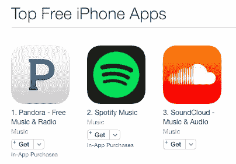

# 韧性- AVC

> 原文：<http://avc.com/2016/01/tenacity-2/?utm_source=wanqu.co&utm_campaign=Wanqu+Daily&utm_medium=website>

我最欣赏公司及其领导者的一点是坚韧不拔。我不是说坚持一个失败的想法太久。我看到很多创业者在种子期和首轮融资阶段都会犯这个错误。这对谁都没有好处。

我指的是建立一家公司的 5-10 年，或者 10-15 年。我说的是很久以前，当你发现产品市场合适的时候，很久以前，当你第一次筹集八位数资金的时候，很久以前，当你第一次收到收入支票的时候，甚至可能很久以前，当你第一次盈利的时候。

我参与过的每一家成功的公司都经历过事情不顺利的时期，重要的事情拖得太久(一个重组项目、一笔重要的商业交易、一个筹资过程)，怀疑开始蔓延。员工开始失去信心，媒体变得残酷(有时这是理所应当的)，你必须坚持到底。“您”是创始人、首席执行官和/或主要投资者和董事会成员。

大部分维系这种关系的责任都落在了创始人和/或首席执行官身上。在此期间，投资者和董事可以提供很多帮助，反过来，他们也会受到很大伤害。一个团结一致的创始人、首席执行官和董事会可以让这些艰难时期变得容易得多。一个错位的创始人、首席执行官和董事会可能是毁灭性的。

所以现在我要讲一些故事，让我的观点更加真实。

昨天，我们的投资组合公司 [SoundCloud](https://soundcloud.com) 宣布，他们最终与音乐产业最大的版权持有者环球音乐集团达成了一项许可协议。在 [TechCrunch 关于那则新闻的报道](http://techcrunch.com/2016/01/13/soundcloud-universal-music-interview/)中，[英格丽·伦登](https://twitter.com/ingridlunden)提到:

> *音云..2014 年 8 月，它在 SoundCloud 上推出了[，签署了第一份合作伙伴协议。仅在 2014 年 11 月](https://blog.soundcloud.com/2014/08/21/introducing-on-soundcloud/)它宣布了与华纳音乐的第一个大唱片协议。2015 年 6 月[与代表约 20，000 家独立唱片公司的梅林达成协议。](https://www.theguardian.com/technology/2015/jun/04/soundcloud-signs-licensing-deal-independent-labels)*

英格丽没有说的是，导致这些交易的与音乐行业的对话至少在一年前的 2013 年初就开始了。因此，三年多来，SoundCloud 一直在与音乐行业合作，以获得许可，允许他们做以前从未做过的事情。

SoundCloud 的首席执行官 Alex Ljung 在 TechCrunch 的文章中说:

> 如果你看看 SoundCloud，你会发现这是第一次有人尝试做这种规模的事情。我们在平台上有超过 1 亿首歌曲，每月播放超过 1000 万位艺术家的作品。我们真的在努力创造一个平台，包容各种各样的创造力，一些以前从未存在过的东西。这方面没有现成的许可解决方案。我们不得不与整个音乐产业合作，创造出前所未有的东西，这需要一点时间。

一点时间？也许很长时间会更准确。

在过去的三年里，围绕 SoundCloud 的叙述一直是，它陷入了困境，混音和其他衍生内容被撤下，唱片公司正迫使艺术家将他们的内容从服务中移除。所有这些都是真的，但真正的故事是，SoundCloud 正在经历一个艰难而复杂的过程，与一个长期以来一直以某种方式做事的现有行业合作，为音频内容开发一种新的商业模式。然而，在这段时间里，SoundCloud 的用户群和收听时间越来越长，在此期间，它成为了世界上最顶尖的音乐应用之一

在这段尚未完全结束的时间里，SoundCloud 的领导层、Alex、他的联合创始人 Eric 以及整个高级团队团结一致，保持业务向前发展，建立了一个强大的管理团队，并保持董事会的一致和知情。我相信他们会因为这次经历变得更加强大。

另一个故事是 [Return Path](https://returnpath.com/) ，我从 2000 年开始与这家公司合作。Return Path 的创始人兼首席执行官[马特·布隆伯格](https://twitter.com/mattblumberg)已经开始、建立、出售并重新建立了许多电子邮件服务，这些服务已经成为一个非常大的企业。Matt 的业务盈利了三四次，却选择孵化和建立几个新的业务，然后又回到亏损状态。他至少挺过了我们三次濒临死亡的经历，当时公司正处于困境，不清楚我们如何再撑一个月。每次他都有所成就，通常是在董事会和投资者的帮助下。

正是在回程中，我认识到了一个积极参与、协调一致的董事会的价值。Matt 很早就组建了一个真正的董事会，由具有运营经验的强大外部董事组成，他总是利用董事会来帮助他度过艰难时期。Matt 还在 Return Path 建立了强大的文化，该公司经常被认为是美国企业中最适合工作的地方之一。

对我来说，回归之路的教训是，如果你有一个相互信任的团队和一个同样积极参与并保持一致的董事会，你就能挺过艰难时期和濒临死亡的经历。如果没有这两样东西，我怀疑 Return Path 今天还会存在。

再比如 [Foursquare](https://foursquare.com) 。也许没有一家 USV 投资组合公司(除了 Twitter)因为“热门公司失宠”而受到更多的批评然而，今天坐在这里，Foursquare 已经建立了一个非常真实的业务，增长良好，有一个非常光明的未来。他们躲过了一次差点害死公司的行动(大约两年前的应用拆分决定至今仍受到每天的批评，当然也会在这个评论帖中受到批评)。他们的融资过程在媒体面前表现出了很少公司能够容忍的透明度。

通过这一切，创始人丹尼斯·克劳利和他的团队承受了打击，继续前进。他们建立了检测位置的[技术](http://www.techinsider.io/inside-foursquares-pilgrim-technology-2015-12)，这是最先进的。他们有一个[位置 API](https://developer.foursquare.com/overview/) ，我相信这是业内使用最多的位置 API。他们一直在改进和发展最好的本地化移动搜索体验和最好玩的本地社交体验。他们已经建立了一个真正的可持续发展的企业，并具有诱人的经济效益。

你可以对 Foursquare 说任何你想说的话，不要费心了，因为它肯定已经被说过了，而且不是很好，但它已经存活下来，并且正在蓬勃发展。很少有人明白这一点，但那些接近该公司的人明白。这是坚韧不拔的创始人和领导者及其公司的标志。

我差不多写完了，但是在我结束这篇长文章之前，我想说一些关于现在上市的 USV 投资组合公司的事情。我不能也不会具体谈论他们的业务，因为他们是上市公司，我不想去那里。我也在每一家银行都持有大量头寸。他们的股票价格无一例外都在下跌。然而，我相信他们中的每一个人，相信他们的领导能力，相信他们的前景。他们都由顽强的领导者和团队领导，我相信他们会低着头，执行并度过每个人都会遇到的消极和事后批评。今天，我比以往任何时候都更加钦佩这些公司。

建立和经营一家企业并不容易。我相信随着时间的推移，事情会变得更难，而不是更容易。这就是需要坚韧和相信你自己、你的团队和你的企业的地方。展现出这一点的领导人在我心中和脑海中有着特殊的位置。