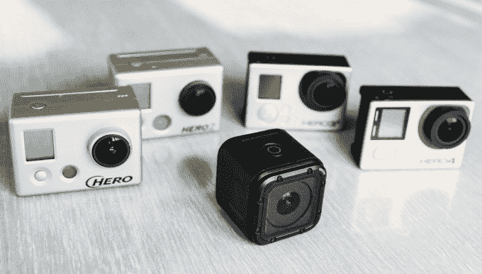
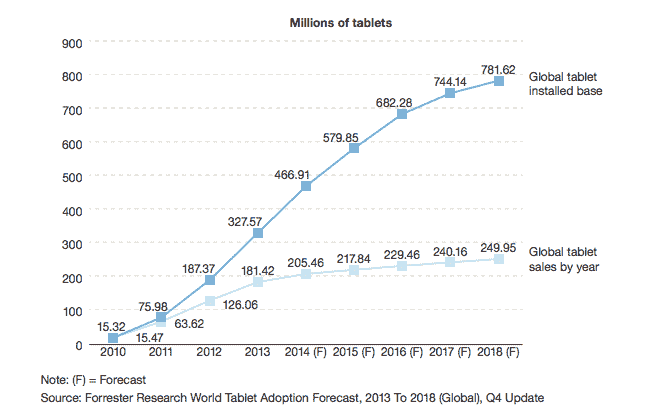

# 科技博客

> 原文：<http://techcrunch.com/2016/01/14/the-goproblem/?utm_source=wanqu.co&utm_campaign=Wanqu+Daily&utm_medium=website>

动作相机就像平板电脑。很多人都想要一个。但是极少数需要不断更新到最新型号。

我怀疑这就是为什么 [GoPro 的销售放缓](https://beta.techcrunch.com/2016/01/13/gopro-stock-drops-23-after-announcing-layoffs-and-disappointing-q4-guidence/)，它的销售减少[预测](http://investor.gopro.com/releasedetail.cfm?ReleaseID=950216)，它不得不在本周解雇 7%的员工。它正在达到市场饱和。许多可能购买 GoPro 的人已经有了一台，不需要再买一台。

他们的第一个可能已经被尘封了 11 个月。面对现实吧。我们并不都是极限运动冠军。我们偶尔去滑雪或冲浪或骑自行车。我们需要一些东西来捕捉这些经历。任何 GoPro 都可以。

我们的朋友会留下深刻的印象，即使照片和视频不是以最先进的分辨率拍摄的，我们也会重温这些记忆。即使电池电量不足，我们无法选择一整天的活动。即使它在我们的口袋里有点大。

一个动作摄像机能做我们其他设备做不到的事情。但是升级到今年的版本也没有更多的作用。这不是你的手机，你每天整天使用，每个人都可以看到。它不是一个状态对象。

这不是你的笔记本电脑，稍微好一点的配置可以让你的生活或工作不那么烦人。它不是一个基本的工具。旧的，二手的 GoPro 或者便宜的山寨货 T1 都可以。

动作相机就像平板电脑。有时在平板电脑上阅读或观看电影或玩游戏是件好事。但是我的旧 iPad 很好。买的时候买了最新的。但从那以后，我甚至从未考虑过再买一个。这一点，再加上不断增长的手机屏幕，导致[平板电脑的销量停滞不前](https://beta.techcrunch.com/2015/07/12/forrester-tablet-sales-have-plateaued-but-theres-a-future-in-business/)，我相信动作相机也是如此。

平板电脑销售平稳

当然，有肾上腺素上瘾者和冒险摄影师会想要最好的动作摄像机。GoPro 自己的无人机和虚拟现实设备可以释放新的功能，刺激销售。

但 GoPro 的股价目前下跌了 15%，过去一年下跌了约 77%。为了繁荣，公司需要做一些真正创新的事情。否则，人们没有什么理由购买最新的 GoPro。他们已经扔进抽屉的那本已经够好了。