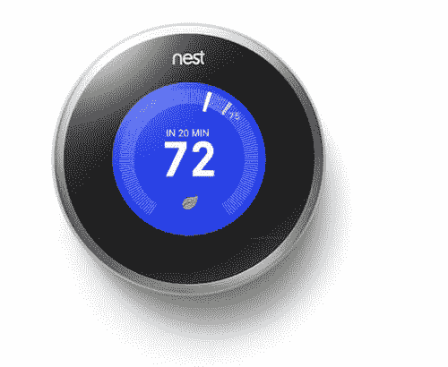
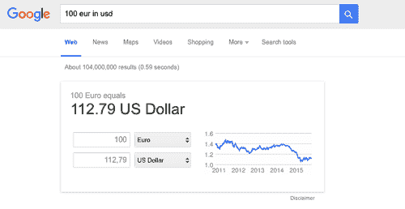
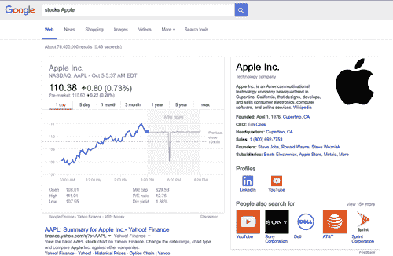
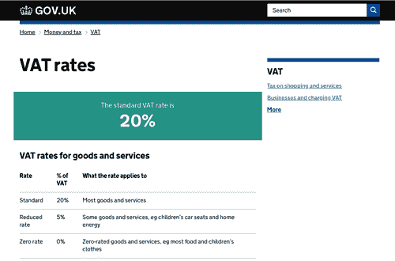
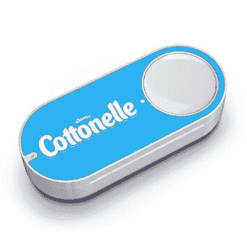
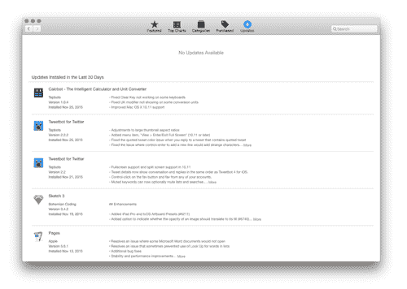
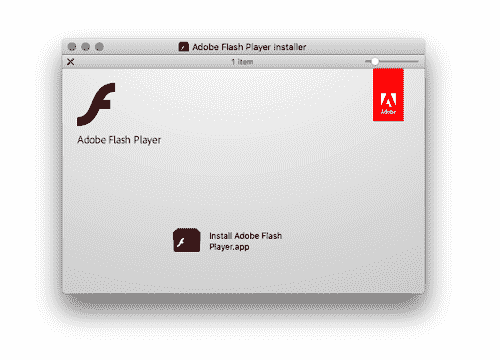
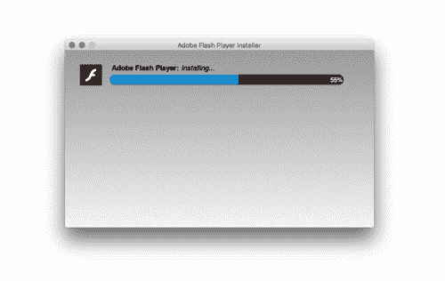
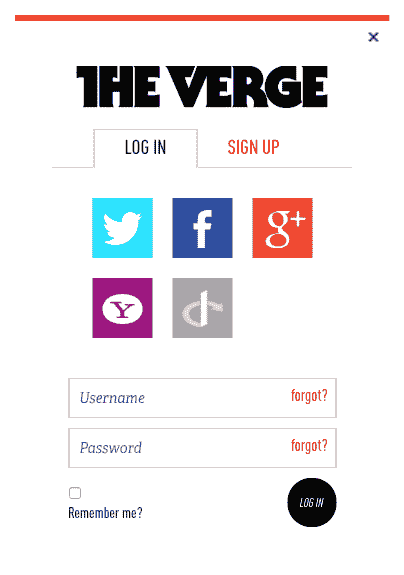

# 没人想用你的产品——粉碎杂志

> 原文：<https://www.smashingmagazine.com/2016/01/nobody-wants-use-your-product/?utm_source=wanqu.co&utm_campaign=Wanqu+Daily&utm_medium=website>

过于复杂和功能驱动的产品可能无法为用户提供他们需要或想要的东西。当设计师将他们的产品在用户生活中的足迹降到最低时，他们为数字产品提供了更好的实际用途。让我们来回顾一下那些通过更简单的流程带来简单解决方案的卓越产品和服务。

每天早上，设计师们醒来后都愉快地工作在他们的产品上，无论是数字产品还是实物产品，他们内心相信人们会想要使用他们的产品，并会为此而兴奋不已。

也许这是一个轻微的概括；然而，作为设计师，我们往往有一种自然的**欲望，希望我们从事的每个项目都尽可能做到最好**，有创新精神，最重要的是，有所作为。

> 天啊，我的产品会很棒的！它将充满特性、选项和设置。人们会每天使用它，并且喜欢使用它！
> 
> —设计师

这里有一个小小的启示。人们并不真正喜欢使用产品。用户操作界面、转动旋钮、拉动控制杆或点击按钮所花费的任何时间都是浪费时间。相反，人们更感兴趣的是最终结果，以及以最快、最少干扰和最有效的方式获得结果。这是两个根本不同的概念——使用和结果——这至少是区分好的产品设计和差的产品设计，或者在更小的范围内，区分好的功能和坏的功能。

我仍然发现今天的许多产品，无论是数字产品还是实体产品，都过于复杂和功能驱动。作为设计师，我们难道不应该通过让我们的产品更加无缝地融入用户的日常生活和日常事务，来尽可能地或尽可能地为用户消除复杂性吗？我觉得我们根本没有，更令人担忧的是，我们仍然没有从过去吸取教训。

## 网页设计的开端

如果我们回到 15 到 20 年前，网页设计就是视觉设计。年长的读者会回忆起先进工作室和其他类似的大片网站的日子。他们是华丽的，有着惊人的 Flash 动画和精心制作的图像和像素。但是，如果我们透过现代 UX 设计的过滤器来回顾今天的这些网站，我们可以肯定地说，当时的体验并不理想。

今天会有人愿意在进入网站前盯着装载机看五分钟吗？也许，如果他们拼命想买到音乐会的门票——否则，答案肯定是“不”。甚至还有装载机的预装器，因为装载机是如此复杂！这些网站本质上是为了被赞美而制作的；它们是艺术品，对用户的实际好处是次要的。

也许在早期，我们并不知道更多，因为我们人类很少从其他领域学习，并且我们不擅长将在一个领域学到的知识转化到另一个领域。没有关于网络的研究或最佳实践，但随着时间的推移，随着数字设计的发展(包括交互、视觉、界面和动作设计)，我们已经意识到用户在网站上花费的时间越少——尤其是工具或服务——越好。

在谷歌搜索的早期，谁会想到谷歌会希望将搜索过程缩短几毫秒，以便用户能够尽快离开谷歌。谷歌是第一批意识到，或者只是从当时的其他行业继承知识的数字公司之一，花在产品本身上的时间是浪费时间，而获得结果的最快途径是最好的设计方式。

## 简化结果

当你思考这个问题的时候，你是真的想加热你的食物，还是仅仅想让你的食物是热的？这就是为什么几乎每个现代厨房里都能找到微波炉；它尽可能地减少了加热食物过程中的工作量。当然，相当多的制造商仍然没有意识到这一点，并使他们的微波炉过于复杂，有太多的按钮和设置。

一个典型的制造商仍然认为用户站在他们的微波炉前，思考几分钟使用哪个精确的设置，然后按下一串按钮来执行他们精心制作的加热计划。实际上，一个人只需要两个设置:功率和时间。老实说，在很多情况下，人们需要的只是时间设置。通常的情况是，你把一盘食物扔进微波炉，设置好定时器，就这样。

[八月智能锁](https://august.com/products/august-smart-lock/)同路。奥古斯特意识到**用户不想手动锁闭和解锁他们的门**。用户实际上想要的是在他们不在家时锁上他们的房子，并在他们接近门口时自动解锁。(题外话:实际上，这并不是*所有*用户想要的。用户想要安全，这可以通过除了锁门之外的方法来解决，但是我们不要讨论这个。)

当我们谈到安全问题时，人们真的希望必须在手机中输入密码才能解锁吗，或者他们只是希望只有他们自己(和其他“白名单”上的人)可以访问他们的手机，而对其他人保持锁定状态吗？这就是为什么苹果引入触控 ID 是一件大事；它最终带来了一种可靠和用户友好的锁定手机的方法，同时消除了解锁手机的所有复杂性。使用触控 ID 感觉好像手机实际上根本没有锁定——只要你按下 home 键唤醒手机，手机就会解锁。

More after jump! Continue reading below ↓

## 伟大的设计决策

这种方法上的差异— **为功能而构建与为结果而构建** —可以在今天的许多产品中看到，包括数字产品和实体产品。一些产品之所以伟大的主要原因是它们**减轻了用户的负担**并帮助他们做决定。如果你从外面观察这些产品，你会认为它们的制造商不希望人们使用它们；仔细观察，人们确实在使用它们，但是是以一种无缝的方式，仍然收获着它们的所有好处。

### 嵌套恒温器

你可能对 Nest 恒温器很熟悉。它的伟大之处在于，它能够主动了解住在家中的人的行为习惯和模式——而且非常隐蔽，以至于用户完全意识不到这一点。迟早，**他们会忘记恒温器甚至在**附近，因为他们的家总是处于最佳温度。

[Nest](https://nest.com/ie/press/#product-images) Learning Thermostat

### Dropbox

我们都爱 Dropbox。但是我们真的“使用”它吗？Dropbox 很久以前就发现，人们真的不希望在多个设备之间同步文件，而是**希望从一个可访问的源**进行管理和同步。甚至在 Dropbox 出现之前，我们就可以自己完成所有的同步工作:将文件通过 FTP 传输到服务器，转到第二台电脑，从服务器下载文件，等等。但是为什么要花这么大力气来保持文件同步呢？大多数用户不希望这样；他们只是希望他们的文件保持同步。

### 谷歌的搜索表单

在谷歌搜索的早期，流程是这样的:点击搜索栏，开始输入，按回车键，然后才会显示搜索结果。此外，搜索结果的排序背后几乎没有任何逻辑，导致第一页上出现各种奇怪的建议。许多人会记得不得不翻到搜索结果的第二或第三页。喘息！

然而，只要技术和设计允许，谷歌就开始移除所有不必要的组件。如今，**光标会自动聚焦在输入栏**上，搜索结果会在输入第一个字符时立即显示，搜索结果由谷歌强大的机器大脑进行排序，最相关的结果会显示在最顶端。键盘快捷键也能快速激活链接。点击“Tab”会触发一个可以用键盘箭头控制的小箭头，当然，点击“Enter”会启动高亮显示的链接。

### 谷歌的搜索结果

谷歌搜索在搜索结果页面上提供了许多问题的答案。这已经是常识，它是一个优秀的计算器；随着时间的推移，它已经发展到提供更有用的数据和答案。

Google’s instant currency converter

例如，你可以找到公司地址、营业时间、汇率计算、股票信息等等。因此，除非需要更详细的分析或信息，否则通常不需要进入另一个页面。

Google’s stock information at a glance

### GOV.UK 信息页面

一个很好的政府网站的例子， [GOV.UK](https://www.gov.uk/) ，**在页面顶端**呈现每个主要项目的关键信息，使访问者不必在大段文字中寻找关键信息。该网站更进一步，将关键信息放在`description` meta 标签中，使其在搜索结果页面上立即可见。

Looking for VAT rates? GOV.UK has you covered. ([Large preview](//www.smashingmagazine.com/wp-content/uploads/2015/12/image06-opt.png))

### 亚马逊的破折号按钮

亚马逊也在用 [Dash](https://www.amazon.com/oc/dash-button) 创造奇迹。Dash 有一个简单而出色的设计，让用户不必直接与亚马逊网站互动。从亚马逊网站购买的按钮，与单一品牌产品一起硬编码。

在相当简单的设置过程中，通过手机蓝牙连接，用户指定要烘焙到按钮中的特定品牌的商品，并根据该特定商品的可用选项选择大小、味道、颜色等。一旦 Dash 设置完毕，**按下按钮自动执行一系列命令**，从而将产品交付给所有者。所有的魔法都发生在幕后。

[Dash button](https://www.amazon.com/oc/dash-button), a consumer’s dream!

此外，当亚马逊 Prime Air 的无人机送货服务最终投入使用时，订购的产品可能会在几分钟内送到目的地。

我知道你正在考虑这个问题:亚马逊 Sense 与亚马逊 Teleport 配对——房子里的一个探测器，它可以识别卫生纸何时用完，从而立即重新进货。人们不想开车去商店，走过过道，排队，与收银员互动，开车回来，然后红着脸跑去厕所。所有用户想要的是在他们的房子里随时存放卫生纸。

### App Store 更新

苹果意识到，大多数用户不愿意总是花力气去检查他们的应用程序是否是最新的。因此，现在**会自动推送更新**，而计算机处于睡眠模式或不使用，这意味着用户回来后会发现新版本已经安装并运行，他们只需付出很少或根本不需要付出努力。

Mac App Store

在这一点上，我可能是在打一匹死马，但与苹果形成鲜明对比的是，想想 Adobe 如何处理其 Flash 播放器的更新。每次更新时，Mac 用户都需要下载一个新的 DMG 文件，手动启动安装程序并重启浏览器。让用户工作是一个痛苦的过程。这年头要求随时自动安装最新版本过分吗？

Oh man, not again! A new Flash player?!

### 用户身份验证，如脸书连接

你可能知道我要说什么。如前所述，这是一个如此明显的路障。用户并不总是希望必须创建帐户；他们只是想进去浏览一个网站。没有人想经历输入电子邮件地址或者更糟的用户名的烦人过程(“对不起，用户名被占用了…对不起，用户名 2 也被占用了。”)，一个密码(“抱歉，您的密码需要包含一个大写字母、一个小写字母和一个数字。”)，他们的血型，他们母亲的娘家姓，然后还是要验证他们的邮箱。没人想用登记表。用户只是想在不干扰界面的情况下完成工作。

Multiple sign-in options on The Verge

## 减少和删除接口

尽可能多地从一个接口中移除是一个相当古老的概念。关于它的书已经被写了出来，T2 也发表了演讲，像 T4 的奥利佛·赖森斯坦这样的设计师被一遍又一遍的引用。像卢克·乌鲁布莱夫斯基这样的人认为我们可能已经把这种模式带得太远了，苹果手表的无界面方法以及新版本的智能手机操作系统都证明了这一点，这些操作系统迫使用户记住复杂的方式来通过各种手势导航界面。

是的，设计师有时会走得太远，为了美观和光滑而牺牲可用性。然而，当设计(如“事物如何工作”)做得恰当时，这种减少最终会使用户受益。

有些人似乎仍然没有真正理解这种减少和删除设计每个方面的概念。这让我们到了这样一个地步，制作人员(与其说是用户，不如说是在网络上工作的人)开始觉得[所有的网站都开始](https://thenextweb.com/opinion/2015/09/23/zzzzzz/) [看起来都一样](https://www.smashingmagazine.com/2015/07/hunt-for-the-webs-lost-soul/)。

**标题看起来一样**。这种外观之所以有效，是因为用户能够立即理解正在发生的事情:左边是 logo，右边是登录表单，或许还有搜索功能。它是标准化的，因为它引起的摩擦最少，必须“使用”网站的次数最少，并且它让用户得到他们需要的结果。

一个类型的所有网站都是一样的——所有的网店都是一样的，所有的博客都是一样的，所有的新闻网站，所有的作品集。用户认识到模式，这是一件好事，因为他们能够更快地完成任务。他们不必担心东西在哪里。他们只是摄取内容，而不是试图破译神秘的模式，不可读的字体或棘手的互动。

我们制作了相同的注册表格，因为它们有效:电子邮件地址、密码，然后点击按钮。或者，更简单的是，只需点击一个按钮，通过脸书、谷歌或 Twitter 登录。

**我们制作了同样的图像**,因为它有效:清晰的大照片，全屏放大细节。我们展示微笑的快乐的人，因为心理学告诉我们，人们与此相关。我们展示度假目的地的高质量照片，因为游客会被这些风景所吸引。他们转换得更好。

**我们已经用超可读文本**进行了大量的行动号召，因为用户不想寻找这些按钮；他们只想完成他们的任务。我们沉迷于排版，煞费苦心地设置字体大小和配对字体，唯一的目的就是减少阅读时间，最大化品牌的视觉冲击力。我们这样做是因为用户不想阅读；他们只是想体验内容。

## 未来会怎样？

我们知道过去是什么样子，现在是什么样子，那么设计师有什么打算呢？我认为界面会进一步减少，事情会自然发生，信息会自己浮出水面，就像 Nest 恒温器和 Google Now 一样。鲜奶会在最后一瓶喝完的时候送到你家门口。应用程序将自行更新，而不是必须手动更新。手机将一直神奇地充电，而不是必须手动充电。

地图会给出驾驶方向，自动绕过拥挤的交通。信息将根据用户的环境而变得可用。登记表不会纠缠人。希望密码将被完全移除，取而代之的是可靠的指纹读取或更好的东西。(另一个预测:苹果将把触控 ID 集成到笔记本电脑的触控板中。不是今年，不是明年，但不久的某个时候，苹果将最终拿到小屋后面的密码，让它脱离苦海。)

*   我们将设计流程，而不是屏幕。
*   我们将设计系统，而不是单个的部分。
*   我们将设计更少的“使用”，更多的获得结果。

## 你能做什么

### 知道你的产品令人讨厌

要明白**你的产品是一种必要的邪恶**。要意识到，对于用户来说，最好是你的产品根本不存在，但产品的结果却神奇地存在。

### 使用已知模式

只有在绝对必要的时候，并且只有当它真的让用户更容易达到他们的目标时，才扩展和修改已知的模式。重新发明热水，只是为了重新发明，毫无意义。(我知道这只是一种说法，但我们实际上*确实*需要重新发明轮子。如果我们不重新发明轮子，我们仍然会有石轮。热水不需要重新发明。)

### 不要爱上你的产品

很快就会有一天，你或你的竞争对手将会推出你的产品的**更好的版本，这种产品将在用户的生活中留下更小的足迹，提供更大的好处。**

### 向后工作

为了让用户看到结果，我们必须在技术上尽可能不增加复杂性。假设我们的任务是**重新设计通勤流程**。在我们核心原则的指导下，我们将从人们不想通勤这一前提出发；他们只想去他们该去的地方。

1.  反过来看，解决通勤时间和精力浪费的理想方法是心灵运输。因为传送目前有一些“小的”技术限制，我们需要为用户增加一些复杂性。
2.  先介绍一下一辆车的复杂程度。但是请注意，我们只介绍了容器本身——可以说是一个空壳——对用户来说没有任何其他复杂性。复杂性在我们这边，我们(设计师和工程师)必须**自动化汽车的运动**并创建一个订购汽车的解决方案，并告诉它将用户带到哪里。复杂性守恒定律指出，复杂性就像能量一样，不会被摧毁；它可以被移动和搬动。(与此同时，特斯拉已经更新了其汽车的自动驾驶功能。)
3.  不幸的是，在撰写本文时，全自动无人驾驶汽车仍未向普通公众提供。这些问题主要是法律问题，而非技术问题。因此，我们不得不**引入一个叫做“驱动程序”**的复杂性。注意，这里的驱动程序不是用户。驾驶的复杂性被委托给用户，解决方案负责订购汽车、传达目的地和处理所有其他物流，如支付。
4.  如果我们去除了允许其他人充当司机的框架(“出租车”框架)，那么我们就把驾驶的复杂性转移到了用户身上。这带来了巨大的复杂性，因为它要求用户拥有各种许可证和大量的知识。但至少在大部分情况下，汽车的维护会得到保证。
5.  引入最后一层复杂性，用户不仅要知道如何驾驶和操作汽车，还必须是一个知识渊博的机械师。此外，汽车本身并不是真正的用户友好型，需要不断的保养才能保持运行。你好，福特先生，很高兴见到你。

想办法消除这种复杂性。弄清楚如何移除你的产品或界面的所有部分，同时让用户走上想要的结果的道路。用巧妙编码的软件、自动化、传感器、数据处理、预测和更好的硬件取代那些邪恶的元素。如果某件事在技术上是不可能的，那就是创造新价值的绝佳机会！发明东西！

## 信息设计仍有发挥创造力的空间

到目前为止，我们一直在谈论基于任务的界面，但是信息设计呢？即使没有人想使用你的产品或网站，这并不意味着在信息设计中没有创造性的空间。我们仍然可以添加风格，只要它有助于整体体验。正如您将在以下示例中看到的，这转化为对信息的更好理解:

## 结论

我们有责任为用户消除复杂性，并尽量减少我们的产品在用户生活中的影响。用户花在操作你的产品上的任何时间都是浪费时间，时间是他们无法收回的资源。记住拉里·特斯勒的复杂性守恒定律，开始把用户的复杂性卸给你自己。

是的，这需要大量的工作，但这就是你如何将你的产品与竞争对手的区分开来。引导用户达到相同(或更好！)结果通过更少的步骤，更少的摩擦和更少的工作。

理论上，任何产品的最终目标都是**从用户的角度**完全消失。朝着这个目标努力，因为没有人想使用你的产品。

人们只是想要使用它的好处。

### 关于 Smashing 杂志的进一步阅读:

 (md, ml, jb, al, nl)