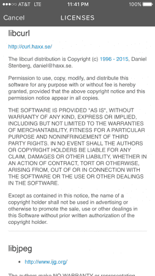
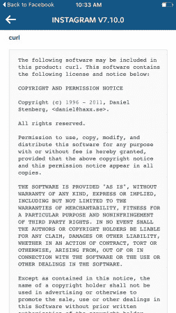

# "主题:紧急警告" | daniel.haxx.se

> 原文：<https://daniel.haxx.se/blog/2016/01/19/subject-urgent-warning/?utm_source=wanqu.co&utm_campaign=Wanqu+Daily&utm_medium=website>

去年 12 月，我收到一封来自这个人的绝望邮件。一位女士说她的 Instagram 被黑了，因为她在应用程序中发现了我的联系信息，所以她给我发了邮件并寻求帮助。我当然回复说我与她被黑无关，但我也与 Instagram 无关，除了他们使用我写的软件。

今天她回信了。很明显她不相信我之前说的是实话，现在她用更多我做错事的“证据”来反击。

*亲爱的丹尼尔，*

几个月前，我给你发了一封电子邮件，内容是关于我的“屏幕转储”，也就是截图，并请求你帮助恢复我的 Instagram 账户，因为它被黑客入侵了，我的照片被更改了，你的名字也被包含在代码中。你声称没有参与开发 Instagram 的第三方应用程序，也不能帮我挽救我的原始 Instagram 照片，尽管 Instagram 是我的摄影作品，我的职业是摄影师。

由于你不知道你的名字与 Instagram 相关的黑客代码相关，我想你可能想知道，如果你还不知道的话，你的名字也包括在 Spotify 的条款和条件中。我在使用我的 Spotify 时偶然发现了这些信息，我的 Spotify 也被黑客入侵了，希望你能帮助我破解 Spotify。此外，我还没有想出如何将黑客从我的 Instagram 上移除，所以如果你改变主意，想将我的 Instagram 恢复到原来的形式，并帮助我保护我的帐户免受未来隐私泄露的影响，我将非常感激。如你所知，更改我的密码并不能解决问题。请记住，脸书拥有 Instagram，这些都是大公司，你可能不想有证据表明**你是 Instagram 和 Spotify 黑客团伙**的一部分。此外，Spotify 是 Spotify 的主要合作伙伴，所以你可能熟悉所有这些非法开发的第三方应用程序的代码。如果您能帮助我立即修复这个错误，我将不胜感激。

*谢谢，*

[姓名编辑]

*附注:请查看随附的屏幕截图，其中包含您在 Spotify 中的联系信息(或者更有可能是由第三方非法开发的被黑客攻击的 Spotify)。*

[T2】](http://daniel.haxx.se/blog/wp-content/uploads/2016/01/IMG_7393.png)

这是她在之前的邮件中发给我的 Instagram 截图:

[T2】](http://daniel.haxx.se/blog/wp-content/uploads/2016/01/IMG_2156.jpg)

我试图用冷静清晰的合理逻辑和技术细节来回答她为什么会在那里看到我的名字。这显然失败了。我接下来要做什么？

