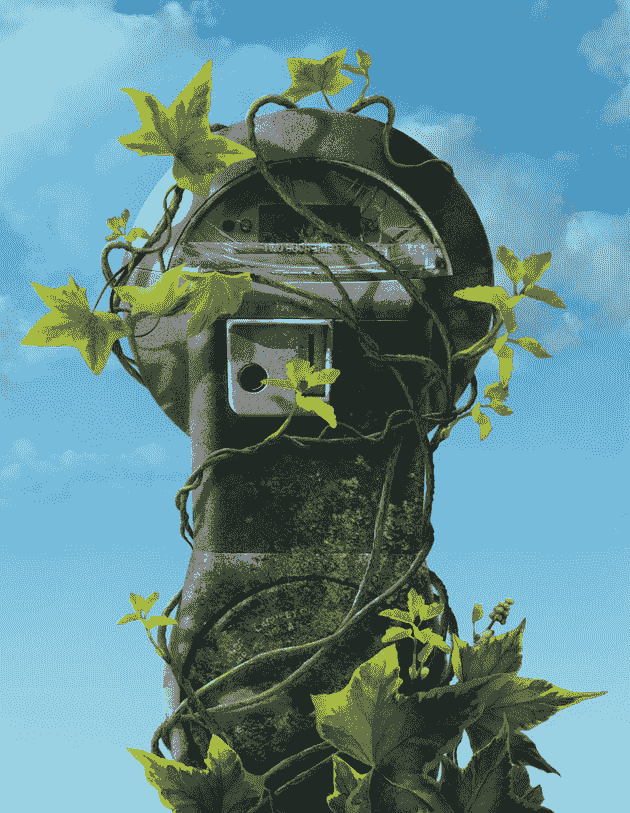
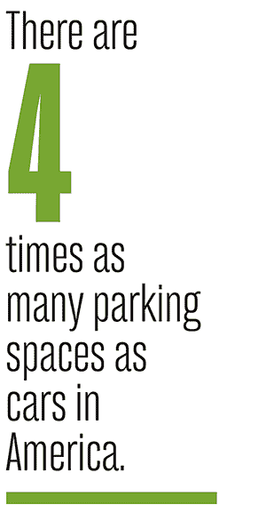
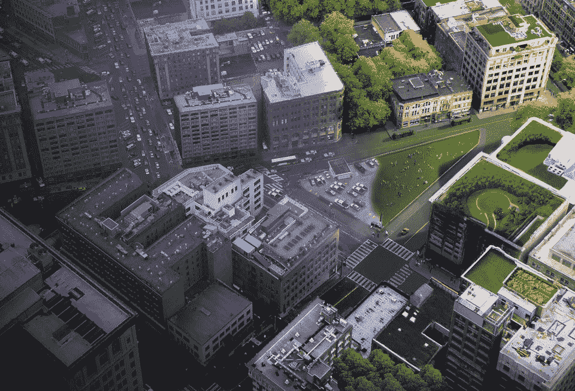
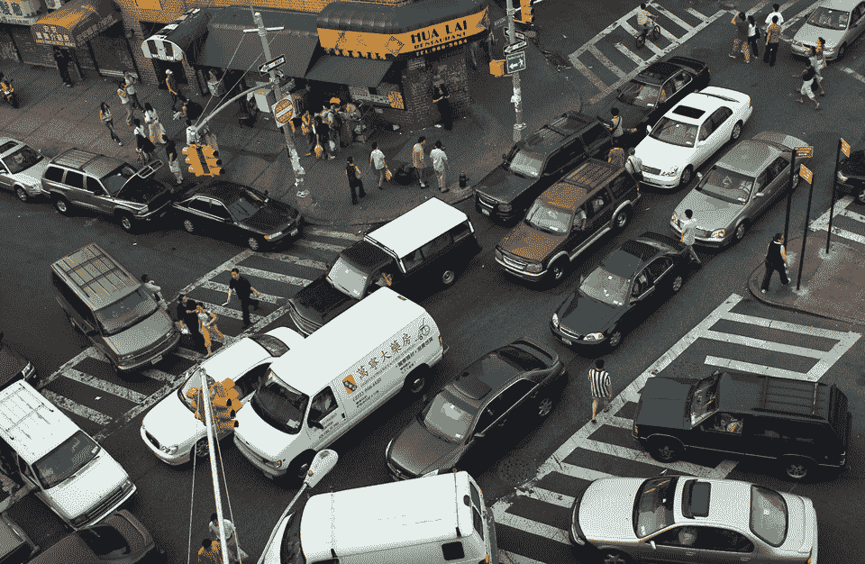
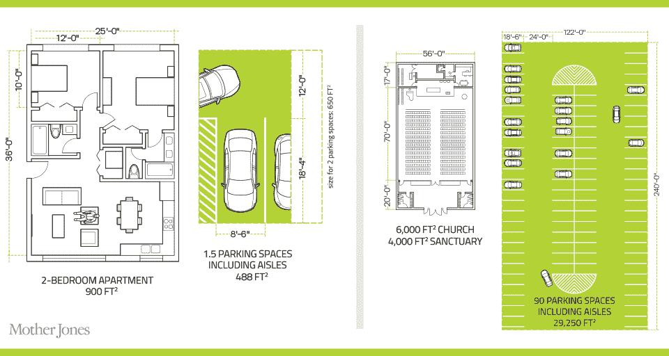
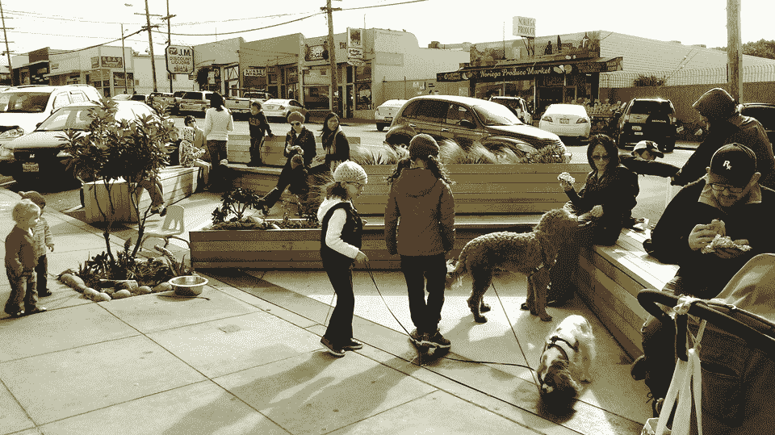
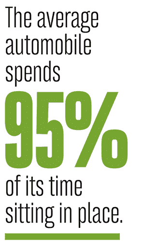

# 这里不准停车——琼斯妈妈

> 原文：<http://www.motherjones.com/environment/2016/01/future-parking-self-driving-cars?utm_source=wanqu.co&utm_campaign=Wanqu+Daily&utm_medium=website>

如果你开车去参观佛罗里达州奥兰多的迪士尼 Epcot 中心，你会到达美国最大的停车场之一。它可以容纳 12，000 辆汽车，占地超过 700 万平方英尺，大约有 122 个足球场那么大。如果你在谷歌地图上看这个地方，你会发现它几乎和 Epcot 中心一样大。迪士尼建造了一个 Epcot 来容纳游客。然后它又造了一个来装汽车。

迪士尼并不是唯一一家采用扩张性停车方式的公司。毕竟，停车是汽车大部分时间都在做的事情:普通汽车 95%的时间都在原地。人们买车是因为他们需要四处走动，但是他们真正四处走动的时间很少。因此，汽车停放在多个空间:车主需要一个离家近的停车位，但也需要靠近他或她可能去的其他地方的停车位——办公室、购物中心、Epcot。

加州大学伯克利分校 2011 年的一项研究发现，美国有近 10 亿个停车位。由于全国只有 2.53 亿辆乘用车和轻型卡车，这意味着我们的停车位大约是汽车的四倍。如果你把所有专用于停车的面积加起来，大约有 6500 平方英里，比康涅狄格州还要大。

社会批评家经常抱怨州际高速公路系统通过鼓励扩张而扭曲了美国。但是停车的转移产生了同样深远的影响。在美学层面上，它让城市变得丑陋不堪。从经济上来说，建造成本很高。视线研究所的一项研究发现，西雅图至少 15%的租金来自开发商建造停车场的成本。

<noscript>T3】</noscript>

左轮手枪

无论租户是否拥有汽车，这些成本都会转嫁到他们身上(除了房东收取的每车位费用)——西雅图的月租金平均上涨 246 美元，全国平均上涨 225 美元。

最糟糕的可能是停车造成的排放。研究发现，在任何地方，你看到的在市中心行驶的大约 30%到 60%的汽车只是在转圈，寻找一个开放的空间。(IBM [的一项调查](https://www-03.ibm.com/press/us/en/pressrelease/35515.wss)发现，在世界范围内，城市司机每次出行平均花费 *20 分钟*寻找停车位。当加州大学洛杉矶分校的城市规划教授唐纳德·舒普只调查了他的大学附近的一个小商业区——韦斯特伍德村——时，他发现，他称之为“巡游”停车每年要消耗 47000 加仑的汽油，并产生 730 吨二氧化碳。更重要的是，所有的沥青在夏天都可以锁住热量，提高城市的温度。从环境、美学和经济角度来看，停车都是一团糟。

如果你把所有专用于停车的土地加起来，大约有 6500 平方英里，比康涅狄格州还要大。

但是有史以来第一次，城市专家对停车感到兴奋——因为他们可以看到尽头。

他们说，我们正处于一个新时代的尖端，城市可以开始大幅减少它们提供的停车位数量。这种转变是由社会和技术变革的双重推动的。在社交方面，人们越来越多地选择住在市中心，在那里他们不需要——也不想——拥有一辆车。他们选择拼车或者使用公共交通。

从技术上来说，我们看到自动驾驶汽车的快速出现。谷歌的模型已经行驶了超过 100 万英里，几乎没有发生事故，专家预计，完全自动驾驶汽车最早将在十年后进入消费市场。事实上，汽车技术进步如此之快，以至于引发了合理的经济担忧。像优步和 Lyft 这样的公司已经因为将司机视为独立承包商而受到抨击，他们的权利和福利远低于员工(见“ [Road Warrior](http://www.motherjones.com/politics/2015/12/uber-lawsuit-drivers-class-action-shannon-liss-riordan) ”)。与一旦汽车能够自动驾驶将会发生的事情相比，这种破坏算不了什么；传统上由新移民和低学历工人占据的数以百万计的出租车、快递和长途卡车运输工作可能会在几年内消失。劳工活动人士和经济学家对这一前景感到担忧是可以理解的。

<noscript></noscript>

但在城市设计和环境层面，自动驾驶汽车可能会产生巨大的好处。毕竟，如果汽车能够自动驾驶，它们的车队就可以快速上下乘客，以机器人般的效率工作。凭借对潜在乘客位置的完美计算机化了解，他们可以搭载几个同路的人，从而在飞行中优化拼车。一项研究表明，一辆无人驾驶汽车可以取代 12 辆普通汽车。事实上，许多城市学家预测，机器人车队可能会变得如此可靠，以至于很多很多人会选择不拥有汽车，导致所需的停车数量大幅下降。

“停车一直是我们不能碰的神圣问题——现在我们可以碰它了,”DC 芝加哥和华盛顿州交通部门的负责人 Gabe Klein 说。他看到了巨大的潜力——所有铺满的空间突然被释放出来，用于建造房屋、学校、广场和游乐场，或者任何其他东西。"所有的停车都可以取消，然后会发生什么？"他问道。“你释放了巨大的价值。”

美国在 20 世纪 40 年代和 50 年代开始与停车结缘，当时汽车的使用激增。惊慌失措的城市意识到他们将很快耗尽路边空间，但他们不想阻止人们拥有汽车或建设足够的公共交通。因此，他们通过了最低停车要求:如果开发商想建造一座新的办公楼或公寓楼，就必须建造停车场。对于住宅，通常每户需要两个点。一般来说，城市会计算出一个地方可能需要的最高停车量，并要求开发商建造它。

早在 20 世纪 60 年代，加州大学洛杉矶分校的大喊就对停车的大规模增长感到震惊。在他看来，问题在于在大多数人的心目中，这些空间似乎是“免费的”当开发商被迫建造停车场时，无论是住宅、办公室还是餐馆，其成本都会被计入购买价格。当人们不付钱在路边停车时(在美国只有很小一部分路边停车点有收费表)，是城市付钱建造和维护这个停车点。这些成本被转嫁给消费者和纳税人，但由于它们从未被逐项列出，因此很容易被忽略。例如，在我住的布鲁克林区，房价高得离谱，但这个城市不收我停车的费用。当我把这些告诉 Shoup 时，他指出如果他们真的向我收费，我很可能永远也不会买我的车。当一个城市提供免费停车时，这在经济上也是不公平的，因为这是一种补贴，只提供给那些足够有钱拥有汽车的人。

"停车管理极其不当——从很多方面来看，这可能是我们最低效的资源利用方式。"

“停车管理非常糟糕——从很多方面来说，这可能是我们最低效的资源利用方式，”Shoup 告诉我。事实上，最低停车要求通常会迫使开发商建造比市场实际需求更多的停车场。视线[发现](http://www.sightline.org/research_item/who-pays-for-parking/)在大西雅图地区，37%的住宅区在晚上是空的——恰恰是你认为住宅停车位在*使用最多的时候。*

具有深刻讽刺意味的是，城市很少要求开发商建造足够多的经济适用房，但它们通过严格的法律来确保车辆能够得到充分的安置。“我们不会强迫(开发商)为人们建造合适数量的卧室！我们只是强迫他们为汽车建造适当数量的卧室，”停车咨询公司纳尔逊尼加德的负责人兼战略总监杰弗里·图姆林说。

公平地说，对政治家来说，如果停车位不足，人们会抓狂的历史由来已久。Shoup 在他 2005 年的书《免费停车的高昂成本》中写道:“思考停车似乎发生在爬行动物皮层，这是大脑中负责做出紧急战斗或逃跑选择的最原始部分，例如如何避免被吃掉。”。

<noscript>T3】</noscript>

左轮手枪

他指出，归根结底，停车是一个自我强化的问题。城市训练人们期望有大量免费的停车位，这鼓励他们开车去任何地方——这使得他们要求更多的停车位。几十年的不正当激励巩固了汽车作为人们出行主要方式的地位。根据人口普查局 2005 年的报告，整整 76.4%居住在同一个城市的美国工人独自开车去上班。只有 7.8%的人乘坐公共交通工具上下班。城市改革者们担心，停车似乎是一个棘手的问题。

至少，这是 10 年前的照片。但是后来我们和汽车的关系发生了奇怪的变化。

杰夫·肯沃西是澳大利亚科廷大学的可持续发展教授，几十年来，他一直在收集世界各地主要工业化城市人们如何出行的数据。他发现人们增加使用汽车的速度已经放缓。在 60 年代，汽车的使用增长了 42%。在 80 年代，增长率更低——只有 23%。然后从 1995 年到 2005 年，它只上升了 5%。在一些城市，汽车使用量实际上有所下降，包括伦敦(下降 1.2%)、亚特兰大(10.1%)和休斯顿(15.2%)。肯沃西说，许多城市正在达到“汽车使用高峰”，从这里开始一切都在走下坡路。

“汽车的主导地位，”他说，“在许多地方正在衰落。”

为什么？部分原因是油价，油价在 2000 年代初大幅上涨，此后在世界许多地方一直居高不下。(汽车保险也处于历史高位。)但肯沃西怀疑这也与一个被称为“[马尔凯蒂墙](https://en.wikipedia.org/wiki/Marchetti%27s_constant)”的概念有关。早在 1994 年，意大利物理学家 Cesare Marchetti 就观察到，纵观历史，追溯到古罗马，大多数人不喜欢通勤时间超过一个小时。如果你面临更长的通勤时间，你会碰壁，重新安排你的生活，找一份新的、更本地的工作，或者搬到离办公室更近的地方。在 20 世纪 90 年代和 21 世纪初，不仅公共交通的使用增加了，而且肯沃西发现世界各地的城市变得越来越密集，部分原因是千禧一代没有像他们在婴儿潮时期出生的父母那样搬到郊区，也因为老年人正在搬回城市中心，享受步行生活。作为一个社会，我们撞上了马切蒂墙，后退了。

诚然，这一趋势不一定是一成不变的。虽然美国人均汽车行驶里程数在 2005 年开始下降，但在 2014 年又开始上升。卡内基·梅隆大学的土木和环境工程师康斯坦丁·萨马拉斯说，油价下跌可能是大衰退和每加仑 4 美元的油价的结果。美国的汽油价格已经下降，“当价格便宜时，人们会更多地开车。”

千禧一代比他们的长辈更有可能说，他们试图积极减少驾驶，以避免造成环境破坏。

但许多专家认为，城市化趋势可能会加快，因为千禧一代是马切蒂一代——他们越来越反对汽车。经常发表能源和交通研究的智库前沿集团(Frontier Group)的研究发现，2001 年至 2009 年间，美国 16 岁至 34 岁人群的年均驾驶里程数下降了 23 %,降幅相当惊人。与此同时，千禧一代多骑了 24%的自行车，并更多地使用公共交通。事实上，他们比前几代人更不可能成为会开车的 T2 人:1983 年，全国 19 岁的人中有 87.3%有驾照。到 2010 年，只有 69.5%的人这么做了。虽然你可能会怀疑经济衰退在起作用，但即使是从事高薪工作的年轻人，驾车率也在下降。

当千禧一代接受调查时，他们比他们的长辈更有可能说，他们试图积极减少驾驶，以避免造成环境破坏。他们购买的汽车比他们的前辈少得多，这让汽车制造商感到担忧。丰田美国总裁吉姆·兰茨(Jim Lentz)在去年的一次演讲中表示，“我们不得不面对一个日益严峻的现实，即如今的年轻人似乎不像前几代人那样对汽车感兴趣了。”

然而，年轻人已经接受了一种移动趋势:像优步和 Lyft 这样的按需用车服务。

一年前，优步报告说，它的司机每天行驶 100 万次；去年夏天，该公司告诉潜在投资者，它的年增长率为 300%。市场研究公司环球网指数的一项调查发现，优步 70%的顾客年龄在 34 岁以下，其中 56%生活在城市。打车服务对城市戒除停车瘾有着重大意义。千禧一代正在学习，他们可以拥有一辆汽车，而不需要拥有或停放汽车。

此外，优步的拼车服务——优步拼车——增长尤其迅速，这种拼车服务为前往大致相同目的地的旅行者提供匹配服务。作为共乘的交换，票价比普通优步票价至少便宜 25%。该公司一年前在旧金山推出了这项服务，现在旧金山所有的优步拼车中已经有将近 50%是拼车。

这一事实甚至震惊了优步。“拼车的普及程度超出了任何人的预期。这是一个巨大的市场，”前奥巴马竞选经理、现任优步首席顾问和董事会成员的大卫·普劳夫在公司位于旧金山市中心的闪亮总部接受采访时说。“我不认为一开始在场的任何人会认为市场会有这么大。我的意思是，我们有很好的服务，但显然这与人们想要的生活方式密切相关。”

他说，优步现在正在推出一项旨在为日常通勤提供拼车服务的服务。“那么，我准备去上班了。我把咖啡杯放在水槽里。我打开应用程序。我拿起我的钥匙。他说，“三个街区外的人说，‘我也要走这条路。’”。

当然，拼车几十年来一直被吹捧为更有效地使用汽车的一种方式。但它从未起飞，因为它遭遇了一个信息问题:没有办法在飞行中协调乘坐，没有办法知道四个街区外的人是否正朝着与你相同的方向前进。自己开车更安全，对吗？这产生了一系列个人选择，这些选择从个人角度看似乎完全合理，但合在一起造成了巨大的环境和城市土地使用问题——我们许多人朝同一个方向去上班，而根据统计，每辆车只能载 1.13 人。

这个信息问题现在已经没有了。智能手机已经解决了。配备了 GPS 和移动数据，手机可能会随时破坏我们的注意力，侵蚀我们的隐私，但它在一项任务上表现得非常出色:即时协调。如果拼车的趋势持续加速，这将如何改变交通和停车？当一组麻省理工学院的科学家分析波士顿地区通勤模式的数据时，他们发现如果 50%的司机转向拼车，将减少 37%的交通拥堵，减少 19%的车辆数量。

停车顾问图姆林对时代精神的转变感到震惊。他今年 46 岁，他说:“我们这一代人是最后一代相信拥有自己的汽车会给我们带来自由、自主、社会地位和性的人。”对于今天的年轻人来说，手机是一种更有效的自主和社会地位的技术——而且，一个巧妙的转变是，你不能在开车的时候使用手机。他们是竞争对手的活动，手机是赢家。人们想拥有一辆汽车，但不觉得有必要拥有一辆，就像他们越来越多地采用流媒体服务代替黑胶唱片、CD 甚至 MP3 一样。

“这种汽车所有权和个人身份的融合，”图姆林总结道，“被永久打破了。”

当谷歌无人驾驶汽车第一次驶进一个繁忙的十字路口，敞篷车从我们身边飞驰而过时，我偷偷看了一眼方向盘。它自己在转动，就像一个幽灵在驾驶着这辆车。这是一个令人不安的景象，尽管与我同行的谷歌工程师现在已经相当厌倦了:这些汽车已经行驶了 120 万英里，只发生过很少几次事故。坐在驾驶座上的工程师说，计算机导航系统是一个非常谨慎的驾驶员。

谷歌的最新原型正在使用工具:一个可爱的蛋形小豆荚，大约和智能汽车一样大，只是它甚至没有方向盘。

“几乎就像一个第一个月左右开车的新人，”他补充道。这些汽车的感知能力也远远超过人类。另一名骑着猎枪的工程师拿着一台笔记本电脑，显示我们的汽车如何通过激光、雷达和摄像头视觉“看到”道路:屏幕看起来像是视频游戏的线框，黄色方框代表行人，红色方框代表骑自行车的人，紫色和绿色方框代表其他车辆。这辆车不仅能看到我们前面的东西，还能看到我们后面的远处。

“这就是计算机更有趣的地方，它们可以同时检测一百万件事情，而你的普通司机可能只专注于那一件事情，”工程师笑着说。好像是为了证明这一点，汽车突然慢了下来:它发现我们右边的一个女人正轻微地向我们的车道漂移。

十年前，自动驾驶汽车原型只能在相对整洁的沙漠中行驶 10 英里。现在，他们熟练地穿梭于硅谷、奥斯汀和匹兹堡的交通中。“进展的速度，”工程师惊叹道，“令人震惊。”他们让我在谷歌总部下车，我漫步走到一个屋顶停车场。在那里，谷歌的最新原型——太新了，记者都不允许乘坐它——正在四处走动:一个可爱的蛋形小吊舱，大约和智能汽车一样大，只是它甚至没有方向盘。

<noscript>T3】</noscript>

Gilles Peress/Magnum 照片

自动驾驶汽车将如何改变我们的出行方式？许多城市专家认为，这些蛋形汽车的未来不在私人手中。它在舰队部署中。当然，这是优步的信念；去年，它在匹兹堡建立了一个研究实验室，专门开发自己的无人驾驶汽车。首席执行官特拉维斯·卡兰尼克预测，在不太遥远的未来，你可以打电话叫一辆优步汽车，自动驾驶的机器人会拉起拉链带你离开。

与人类司机不同，机器人汽车不需要查找路线或最近乘客的位置，因此它们不会像人类一样浪费时间犹豫不决。机器人汽车也可以彼此靠得更近，在街道上装载更多的车辆。(计算机科学家皮特·斯通甚至发明了软件[让机器人汽车不再需要红绿灯；它们不会在十字路口停下来，而是简单地绕过另一个，以比现在汽车快近 10 倍的速度驶过街角。)](http://www.cs.utexas.edu/~pstone/Papers/bib2html-links/JAIR08-dresner.pdf)

更重要的是，他们永远不需要停车。在德克萨斯大学奥斯汀分校，运输工程教授 Kara Kockelman 对自动拼车的影响进行了建模，发现每辆车可以取代十几辆普通汽车。机器人可以整天开车，只停下来加油或维修；晚上，当需求减少时，他们可以把车开到市郊的一个偏僻的停车点。科科尔曼认为，结果是，如果你将整个城市转向自动驾驶汽车，它需要的停车位将比现在少 90%。这将是快速旅行:在科科尔曼的模型中，当人们打电话叫车时，通常大约 20 秒钟就会有一辆车出现。这将是有利可图的:当她估算出运行一个类似优步的机器人车队的成本时，她计算出购买和部署每辆车将花费 7 万美元，但每辆车每年将获得 19%的投资利润。即使一次只有一名乘客乘坐，乘坐费用也只有每英里 1 美元左右——只有今天典型的奥斯汀出租车费用的一半。

共享自动驾驶汽车运行的城市可能会大大降低环境足迹。

“你可以让车队变小，”她说，“还可以减少市中心的停车位。”街道仍然会很繁忙——甚至很拥挤——车辆呼啸而过。只是他们不需要停车。这将是几乎所有人类活动的出租车化。

共享自动驾驶汽车运行的城市可能会大大降低环境足迹。这部分是因为你将摆脱困扰城市交通的“盘旋”。但这也是因为高科技汽车将会是新的——而且，考虑到它们可能会在 10 年后大量出现，它们将会是电动的。伯克利实验室的科学家 Jeffrey Greenblatt 去年 7 月在《T2》自然杂志上发表的一份城市交通模型推断，如果汽车都是自动和电动的，排放量将会降低 90%。事实是，一队机器人汽车比个体车主更容易实现电动化。如果我拥有一辆电动汽车，我将不断面临“里程焦虑”的风险:担心当我远离充电站时，我的电池可能会没电。但是，机器人车队可以优化重新供电，只有当汽车有足够的电量到达旅行者的目的地时，才会派车去接旅行者，并在需要时让低电量汽车退出服务来充电。

“你可以想象一个不需要铺那么多路面的世界，”兰德公司的行为科学家詹姆斯·安德森说，他在 2014 年与人合著了一份关于自动驾驶汽车的报告。“如果他们自己驾驶，汽车可以精确地把自己放在四米宽的路面上，”把道路的其余部分留给其他目的或表面，也许是草地。"你可以想象出相当乌托邦式的、遥远的愿景。"

在大量自动驾驶汽车上路之前，我们不会知道什么是真正可能的。尽管谷歌、斯坦福和卡内基梅隆大学在机器人汽车方面取得了成功，但它们大多是在温和的气候下行驶。没有人知道如何解决积雪问题，这往往会困扰今天的计算机视觉系统。这可能是可以解决的，但确切的时间——或者政府何时会对自动驾驶汽车的安全性感到足够满意，从而批准其销售——谁也说不准。

“谁会是最后一个人类司机？”萨马拉斯问道。“可能会是我们的孙子。”

但你不需要完全自动驾驶的汽车来大幅减少停车。一些汽车已经可以自动平行泊车了。汽车制造商可能很快就会生产出你可以自己驾驶的汽车，但是一旦你到了停车场，你就可以自己去找停车位。由于停车后没有人需要进出，它们可以像俄罗斯方块积木一样紧密地排列在一起，将更多的车放进我们现有的停车场和车库。卡耐基梅隆大学的工程师萨马拉斯说，即使实现了无人驾驶这一小小的壮举，也有可能永远不再建造一片停车场。

一些城市思想家告诉我，从现在起 15 年后，自动驾驶汽车将消除我们目前 90%的需求。“如今美国城市的停车数量已经远远超出了他们的需求，”图姆林说。它会随着人类驾驶的消失而消失。

“谁会是最后一个人类司机？”萨马拉斯问道。“可能会是我们的孙子。”

如果一个城市突然需要减少 90%的停车位，它会是什么样子？

一些城市已经尝试回收道路空间。其中最大的一个项目是在 21 世纪初的韩国首尔，当时市政府拆除了覆盖清溪川的一条 3.5 英里长的高架公路，并将它改造成了一个公园。对这座城市的影响是立竿见影的:除了鼓励旅游业的激增，公园在夏季还让周围地区降温了 9 华氏度。

“现在他们有了这个令人难以置信的绿色走廊，有成千上万的人在使用它，”肯沃西说。每天有 120，000 辆车通过这个地区，项目的反对者声称所有这些车将会挤在旁边的街道上。但是汽车的使用减少了。我们通常认为交通就像液体；阻止它流向一条路，它就会流向附近的一条路。但实际上，肯沃西说，交通更像一种气体:“气体的压缩或膨胀取决于你给它多大的空间。”

<noscript>T3】</noscript>

**WASTED SPACE: A study by the Seattle-based Sightline Institute found that developers are required to build an average of 1.5 parking spaces for every two bedroom unit—more than half the size of the average apartment itself. Or consider that the average church in America seats 400\. A church that size is typically required to have a parking lot almost five times larger than the church itself.**

基于 Seth Goodman 的设计/

[Graphing Parking.](http://graphingparking.com)

克里斯·菲尔波特制图

纽约市也进行了类似的实验。前市长迈克·彭博关闭了时代广场的几个街区，把它们变成了交通便利的行人聚集地。最著名的填海区是曼哈顿的[高架线](http://www.nycgovparks.org/parks/the-high-line)，它曾经是一条破旧的高架铁路，现在是一个翠绿的公园，在 2014 年吸引了 620 万游客(其中 200 万是当地人)并举办现场活动。“这是一个公园，这是一个文化机构，这是一个广场，所有这些都放在一起，”罗伯特·哈蒙德说，他是修复项目的先锋，现在负责管理这个非营利组织。他怀疑公园的未来是这种“混合”空间，建立在回收的城市空间上。

当一个城市的土地突然被腾出用于新的用途时，这被称为“填充”我们对汽车的热爱带来的负面影响是，平均来说，我们已经将超过 31%的商业中心区铺上了柏油。但舒普告诉我，好的一面是巨大的潜力。如果我们不再需要储存汽车，景点和地段可以被改造成公园、学校、医院和住宅。更好的是，房地产正是你想要新开发的地方:市中心，天生适合步行。“我们制造的混乱的好处是，”Shoup 说，“我们有很多土地。”

以纽约市为例，第 60 街以下大约有 102000 个公共停车位，占地约 1840 万平方英尺，相当于中央公园的一半。

萨马拉斯说:“旧金山正在为新住宅疯狂，而曼哈顿一直在寻找空间，现在我们面前就有这样的空间。”。“这就是自动驾驶汽车能做到的。”

然而，在通往低停车未来的道路上有一些大的减速带。这是因为大多数这些乐观的预测都假设自动驾驶汽车可能会被拼车公司大量部署，这些公司会高效地使用它们，提供如此方便和便宜的服务，以至于我们都放弃了自己的私人车辆。

但是未来可能会走另一条路。建筑师兼美国停车历史学家 Shannon McDonald 最近对此有所了解。她飞到巴尔的摩去看望她的哥哥，哥哥开着他的新车来接她。它包括几个自动驾驶功能；他向她展示了汽车是如何不让他意外驶入高速公路上的邻车道的，当他到家时，汽车自动平行停放。这些功能可能会让无人驾驶汽车如此诱人，以至于每个人都想要一辆。

“如果它们都是私有的呢？麦克唐纳告诉我:“你有一辆无人驾驶汽车，但也许你不会分享它。”。如果她的哥哥和嫂子有一辆完全自动驾驶的汽车，也许他们会决定去纽约看戏剧。这是一个疯狂漫长的五小时车程，但谁在乎呢？他们可能会反击。她说，他们会“一路骑进去，一路睡回来”。如果你可以阅读、看电视、工作和收发电子邮件，或者在开车时补觉，通勤的痛苦就会消失。

在这个未来版本中，无人驾驶汽车可能会冲破马尔凯蒂墙。它们将释放出所谓的“诱导需求”——促使通勤距离变长，这在以前是不可想象的。或者我们可能会发现人们决定他们从来不需要停车，因为，嘿，汽车可以自己转圈。

麦克唐纳想象一个通勤者开着他的无人驾驶汽车去上班:“假设他到了办公室，他在前门下车。他让车去找最便宜的停车位。”也许它会开到远郊区，在一条小街上免费停车。“他说，‘好吧，今天就去玩吧！去兜兜风吧！五点钟回来接我。为什么不呢？这样更便宜！”“巡游的问题可能会演变成对现代生活的一种蒙蒂·皮多斯式的滑稽模仿:一条街道交通堵塞，但所有的汽车都是空的。用经济学术语来说，这被称为“反弹效应”:如果你让某件事突然变得更有效率，人们会做得更多。

城市和交通思想家对这些负面影响的严重程度存在分歧。许多人怀疑马切蒂墙会继续存在。“我们对这些争论无动于衷，”伯克利实验室的格林布拉特说。“因为说真的，大多数人不会一天坐几个小时的车。”其他人也同意这一观点，他们指出，一代人不再拥有私人汽车的趋势不太可能减弱。我采访过的大多数专家表示，政府应该制定政策，让基于车队的拼车比个人拥有汽车更有吸引力。这里的主要杠杆是“拥堵费”:一个城市可以——就像伦敦已经做的那样——要求司机支付额外的费用，除非他们乘坐共享汽车。几乎每一个和我交谈过的专家都提倡某种形式的拥挤收费来防止反弹效应。

如果城市将自动驾驶汽车完全交给私营部门，他们就会面临风险。

其他人指出，个人所有权可能会与车队所有权混淆。如果有人拥有一辆自动驾驶汽车，她可能会选择在办公室时开着它去为车队工作来赚钱。城市还可以为增加公共交通的拼车服务提供激励，将人们送到主要的地铁和铁路线上。(这已经是一种趋势:优步报告称，在一些城市，其三分之一的出行开始或结束于公共交通站。)

底线是，如果城市官员想确保这些技术造福市民生活，他们需要现在就开始谈论它们。“如果我们希望它是可持续的，城市必须参与这些服务，”汤姆·拉杜洛维奇说，他是一个非营利性交通组织“宜居城市”的执行董事。城市可以部署自己的补贴自动驾驶汽车车队——下一代公共交通工具——特别针对行动不便、服务不足和低收入地区，这些地区的居民往往缺乏乘车共享应用程序所需的信用卡。他们可以委托面包车，可以汇集更多的人比一辆汽车，提供一个很好的中间点之间的个人车辆所有权和公共汽车。

如果城市将自动驾驶汽车完全交给私营部门，他们就会面临风险。当公共交通的使用增加或减少时，城市立即知道，并能适应公众的需求。但是像 Lyft 和优步这样的公司是不透明的，很少发布关于他们使用的信息。这已经让旧金山很难规划未来:弄清楚在哪里发展公共交通取决于理解人们如何使用私营部门的方式出行。“我们没有数据来了解市场规模和它正在发生什么，”该市战略规划和政策主任蒂莫西·帕潘德里欧(Timothy Papandreou)说。

<noscript>T3】</noscript>

旧金山的一个小公园。旧金山规划部

正如 Radulovich 指出的，历史上有政府更深入地参与监管私人拼车的先例。毕竟，今天的公共交通开始是一个私人系统的大杂烩——这里有一条公交线路，那里有一辆电车——慢慢合并成一个大系统。“公共交通经历了这一切——它是由风险投资资助的，但后来它上市了。”这种反向私有化不太可能再次发生，但城市可以通过使用胡萝卜和大棒来确保该系统服务于公民需求:激励人们使用拼车，但要求拼车公司共享他们的数据。

加布·克莱恩认为，好的交易对金融城和私营部门都有好处。之前曾在 Zipcar 工作过的 Klein 在管理 DC 华盛顿州的交通系统时，制定了一项新政策:Zipcar 将被允许在一些城市路边免费停车。这是有争议的:把公共资源送给私人公司？但克莱恩认为，因为一辆 Zipcar 被许多人使用，比普通的单人汽车行驶得更频繁，所以每辆车都会让汽车离开道路。克莱恩还让 DC 对路边停车收取更高的费用，再次促使人们放弃拥有私家车。在接下来的几年里(拼车应用也在兴起)，DC 的汽车注册量减少了 6%，尽管人口增长了 3%。

显然，城市应该开始着手他们的无人驾驶未来计划。但是他们现在能做些什么来减少停车和驾驶的次数吗？

Shoup 建议各城市对停车实行类似优步臭名昭著的激增定价法:如果一个街区在一天中的特定时间停满了车，城市应该收取更高的费用，如果需求较低，应该收取更低的费用。Shoup 说，目标是给停车定价，这样在一个街区总会有一两个停车位开放。做到这一点，很快:一个城市可以摆脱循环，因为司机总是可以很快找到一个位置。排放量和交通流量会下降，而更高的咪表费用会鼓励使用公共交通。

Shoup 建议各城市对停车实行类似优步臭名昭著的激增定价。

动态定价真的有效吗？

2011 年，旧金山决定一探究竟。在市中心的几个地区，它在地下安装了新的高科技仪表和传感器，告诉城市从早上到中午，从中午到下午 3 点，从下午 3 点到晚上这些街区和城市停车场有多繁忙。每隔几个月，该市就会检查这些数据，并对每个街区或地段的每个时间段的价格进行上调或下调。在接下来的两年里，该市将每个街区或地段 37%的时间段的停车费用上调，而在另外 37%的时间段，价格下降。(其他的价格波动。)原来停车需求最热的时候是中午到下午 3 点之间

新的定价方案正是该市所希望的效果。以前一整天都堵得水泄不通的街区现在通常只有一个空位。总的来说，在试点地区驾驶每天减少了约 2400 英里，盘旋下降了 50%。这有助于减少 30%的温室气体排放。(相比之下，该市未参与试点研究的地区的排放量仅下降了 6%。)与此同时，司机们报告说，他们找到停车位的时间减少了 43%。这个项目甚至是有利可图的:该市在咪表上多收了 330 万美元，尽管由于停车罚单减少，它损失了 50 万美元。

<noscript></noscript>

当我在汤姆·马奎尔位于市中心的办公室里拜访他时，他是该市市政交通署可持续街道主任，他说:“看到环城路消失是最棒的发现之一。”。"盘旋伤害了每个人:空气质量、温室气体、碰撞，让街道变得不那么舒适."他也很乐意为 Shoup 反对免费停车的观点添油加醋。“如果有一个外卖，那就是这个理论是正确的:如果你提高价格，你的停车需求就会少一点。直到我们在几乎整个旧金山市中心加上其他七个街区的范围内做了一些事情，我认为这个理论才被证明是正确的。”

唉，到目前为止，很少有城市效仿旧金山。当一个城市开始收取停车费时，人们——尤其是商人——往往会大声抱怨。三年前，马里兰州的一个历史城镇埃利科特市在其主要街道安装了智能电表，结果却有如此多的商家抱怨说，该市很快就把它们拆掉了。

Shoup 认为城市需要有政治头脑来让市民参与进来。他说，一种方法是设计收费表，以提供超地方效益——将收费表产生的部分利润投入到装饰收费表所在的街道上。加利福尼亚州的文图拉县安装了通过 wifi 连接到城市的智能电表，然后使用这些电表向当地人广播免费 wifi。它立即受到欢迎。

但是阻止停车增长的主要政策是取消最低停车要求。以洛杉矶为例，该市曾迫使开发商为每套新住房建造两个停车位，这阻碍了市中心的再开发。1999 年，该市放宽了规定，在很短的时间内，开发商开始改造旧建筑，平均每个单元只提供 1.3 个停车位。买家不在乎:他们还是买了房子。正如 Shoup 所观察到的，市场愿意应对。建更少的停车场，人们会找到其他的出行方式。

从我最近对它的一瞥来看，一个停车更少的未来可能会非常美好。当我走过旧金山的教会区时，我看到了一个奇怪的景象:两个路边停车位被改造成了一个小型的公共“[停车场](http://sf.curbed.com/archives/2013/04/08/highlighting_a_few_of_the_many_parklets_along_busy_valencia_street.php)它由巨大弯曲的木头制成，看起来像一艘搁浅在路边的船。两个年轻人坐在长椅上开商务会议。街对面是另一个小公园，厚厚的沙漠植被——有些修剪得像三角龙——散落在一座私人住宅前。

旧金山的 parklet 计划成立于五年前，此后被从伦敦到艾奥瓦州埃姆斯的许多城市效仿，该计划允许业主或企业申请将他们的店面停车位改造成一个小小的广场。现在整个旧金山有许多小公园，包括瓦伦西亚街 20 街和 24 街之间特别迷人的 9 个小公园。当我游览这个地带时，它让我看到了一个城市可以发生多么显著的变化:想象一下，如果 90%的路边停车点都变成了公共公园带，充满了绿色植物、城市花园和休闲的人们。

奇怪的是，它们是和平的地方。沿着街道走几个街区，在另一个有雨水收集展览的公园里，我发现了 30 岁的妮可·胡伯曼(Nicole Hubman)，她正坐着看书，在街对面等着上瑜伽课。事实证明，Hubman 的生活是对我们与驾驶的关系已经发生的巨大变化的研究。她过去住在波士顿，每天通勤时间为一个半小时。她撞上了自己的马切蒂墙，这让她很痛苦。所以当她搬到旧金山时，她决定乘坐公共交通出行。

“我讨厌开车，”她说。“我对它过敏。”