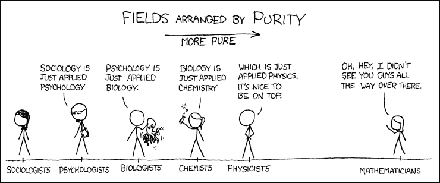

# 为什么大公司不断失败:堆栈谬误 TechCrunch

> 原文：<http://social.techcrunch.com/2016/01/18/why-big-companies-keep-failing-the-stack-fallacy/?utm_source=wanqu.co&utm_campaign=Wanqu+Daily&utm_medium=website>

安舒·夏尔马是一位连续创业者，也是

[Storm Ventures](http://www.stormventures.com/)

。

More posts by this contributor

堆栈谬误已经导致许多公司试图占领新的市场，并以惊人的失败告终。当你看到一家数据库公司认为应用程序很容易，或者一家虚拟机公司认为大数据很容易时，他们正遭受堆栈谬误。

堆栈谬误是一种错误的信念，认为在你的层之上构建层是微不足道的。

漫画致谢: [XKCD](https://xkcd.com/435/)

数学家通常认为我们可以用数学术语描述整个自然界。因此，所有的物理学只是应用数学。诸如此类。

## 堆栈谬误——“只是一个应用”

在商界，我们也有类似的错觉。数据库公司认为 SaaS 应用程序“只是一个数据库应用程序”——这给了他们错误的信心，认为他们可以在这个新市场轻松构建、竞争并获胜。

历史表明，亚马逊正在主导云 IaaS 市场，即使构建组件、低层技术的技术供应商难以竞争——VMware 离战胜 AWS 还差得远，尽管所有 AWS 都运行在虚拟机技术上，这是 VMware 的核心竞争力；尽管甲骨文认为 Salesforce 只是一个托管的数据库应用程序，但甲骨文在 CRM SaaS 一直无法击败 Salesforce。它甚至在他们的数据库上运行！

苹果继续成功地向下垂直整合——构建芯片、编程语言等。但又一次发现很难升级并开发那些简单的应用程序，比如照片分享应用程序和地图。

历史上这样的例子比比皆是。IBM 认为运行其 PC 硬件层的软件层没什么了不起，并愉快地让微软拥有操作系统市场。

在 20 世纪 90 年代，拉里·埃里森看到 SAP 通过销售过程自动化软件(ERP)赚了大笔钱——对他来说，ERP 只不过是一堆表格和工作流程——所以他花了数亿美元试图拥有这个市场，结果好坏参半。最终，甲骨文通过收购 PeopleSoft 和 Siebel 进入了应用程序市场。

## 为什么我们总是陷入堆栈谬误？

堆栈谬误是人类本性的结果——我们(过度)重视我们所知道的。实际上，假设你在一家大型数据库公司工作，首席执行官问:“我们能与英特尔或 SAP 竞争吗？”很少有人会想象他们能构建一个计算机芯片，仅仅因为他们能构建关系数据库软件，但是因为我们熟悉层的构建块，很容易相信你能构建 ERP 应用。毕竟，我们知道表格和工作流。

成功的瓶颈往往不是对工具的了解，而是缺乏对客户需求的理解。数据库工程师对供应链软件客户想要或需要什么几乎一无所知。他们可以为此雇佣员工，但这不是核心竞争力。

> 产品管理是一门知道要制造什么的艺术。

令人惊讶的是，在底层创新比在上层创新要容易得多。

这样做的原因是你自己就是下层的自然顾客。苹果知道自己想要从理想的未来微处理器中得到什么。它不具备构建它所必需的技能，但是客户的需求很好理解。技术技能是可以买到的，但是很难买到对市场需求的深刻理解。

因此，毫不奇怪，苹果生产半导体芯片比生产苹果地图更容易。

## 谷歌、脸书、WhatsApp

谷歌就是一个很好的例子。它拥有我们的电子邮件图表和我们的兴趣数据(搜索)，但发现很难在一个看起来“微不足道”的应用程序——社交网络——上取得成功。

事实上，这是对堆栈谬误的完美讽刺。你可以建造更高的东西。只是通常不清楚要建造什么。

产品管理是一门知道要制造什么的艺术。

堆栈谬误提供了关于为什么公司总是在显而易见的事情上失败的见解——这些事情离他们触手可及，他们肯定可以建立。答案可能是,*什么*比*如何重要 100 倍。*