# 特洛伊·亨特:已经 2016 年了，网站怎么还在搞砸这些用户体验？！

> 原文：<https://www.troyhunt.com/2016/01/its-2016-already-how-are-websites-still.html?utm_source=wanqu.co&utm_campaign=Wanqu+Daily&utm_medium=website>

新年才过了几天，我已经厌倦了。这是困扰我们所有人的基本的网站可用性 101 的东西，让我们的在线生活比它需要的更痛苦。这些实践中没有一个—*没有一个—*—“哦，多好啊，这个网站正在做那件事”。这些中的每一个都绝对将网络推向沮丧和被所有人咆哮的深渊。

在任何人反驳“哦，你可以安装这个奇怪的插件来重写页面或者改变行为”之前，不，这完全不是重点。它不仅不能解决一大堆问题，而且也不应该解决！不如我们都同意停止让网络变得不那么令人愉快，并且从一开始就不做这些事情？

请允许我冷静一下，告诉你今天的网络到底出了什么问题:

## 调查和其他垃圾——任何占据我屏幕的东西

这是不可原谅的:

[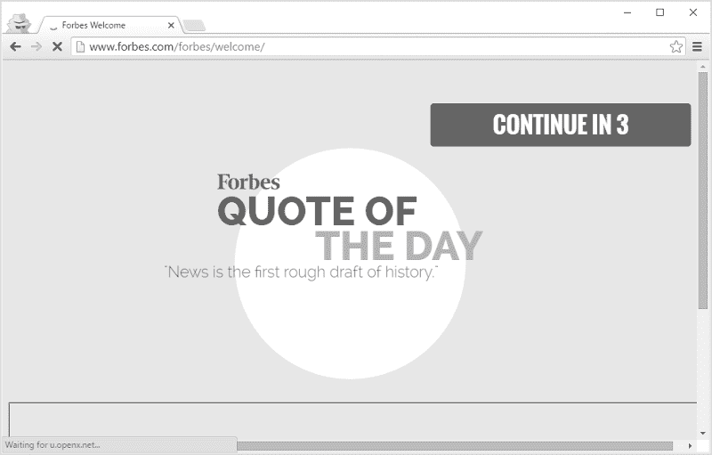T2】](https://www.forbes.com/sites/stevemorgan/2016/01/02/one-million-cybersecurity-job-openings-in-2016/)

所以我去了一个类似[的链接 http://www . Forbes . com/sites/Steve mor gan/2016/01/02/100 万-网络安全-2016 年的工作机会/](https://www.forbes.com/sites/stevemorgan/2016/01/02/one-million-cybersecurity-job-openings-in-2016/ "http://www.forbes.com/sites/stevemorgan/2016/01/02/one-million-cybersecurity-job-openings-in-2016/") 这显然是我想查看的具体网址，然后你们说“不，让我们转到你那里给你看一个当天的报价和一个广告……然后让你等着”。公牛。妈的。这完全是令人讨厌的，没有人*没有人*会看到这一点，然后思考他们因此变得有多好。

## 后退按钮——让它完成它的工作！

银行——你们尤其需要注意这里，因为你们已经把事情搞砸太久了。后退按钮带你到你刚才所在的页面，前进按钮带你回到你按后退按钮之前的位置。明白了吗？这种事情在按下“返回”之后就不存在了:

为什么我的会话结束了？另一个可能的原因是，用户点击了现存的最基本的浏览器导航项，而你们却对此不屑一顾。我知道你不希望交易重复，但要确保这种情况不会发生并不难。当有人使用这种最基本的可用性控件时，绝望地举起你的手，或者简单地完全破坏页面，这种方法是不可取的。修复你该死的网站！

## 多部分文章——你可以把它们都放在一页纸上

这种垃圾必须停止:

[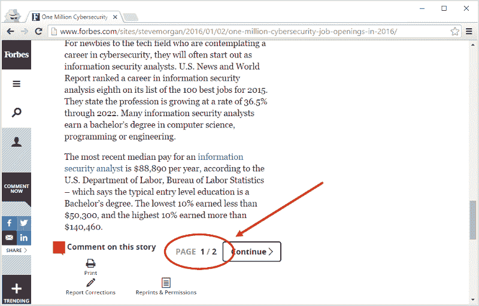T2】](https://www.forbes.com/sites/stevemorgan/2016/01/02/one-million-cybersecurity-job-openings-in-2016/)

这就是为什么我们有滚动——你读一点，当剩余的内容不适合屏幕时，你向下滚动，再多读一点。明白了吗？当然，你不能用那么多的广告轰炸我们，但是嘿，我们从一开始就不喜欢这样！

## 密码——让我拥有我想要的一切

当您阻塞一个字符时，我将假设一件事:您的输入净化和查询参数化很糟糕。你已经把它搞砸了，如果你不禁止这些字符，你根本不能相信应用程序不会被 SQL 注入。就像这些人一样:

更糟糕的是，我将假设您没有散列密码，而是以纯文本的形式存储它。还有什么其他合理的假设 web 应用程序在发送到数据库之前显然没有让它处于稳定状态！

## 全屏和 popover 广告-死于非命

我提到过当广告降低用户体验时，我们有多不喜欢它们吗？是啊，这也必须停止:

[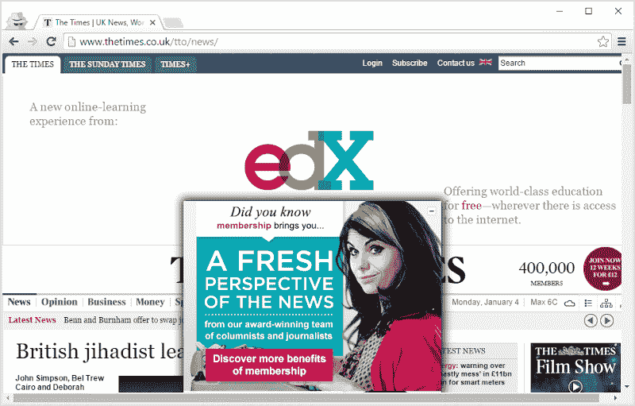T2】](http://www.thetimes.co.uk/tto/news/)

我是认真的，你在想什么？！你知道这有多令人恼火吗，尤其是当你甚至很难找到摆脱这一切的按钮的时候？这在手机上更糟糕，它是可用性反模式的化身。看看上面的屏幕——这里有一个全页宽的横幅广告，占据了半个屏幕，然后你说“嗯……需要更多的广告”,并在那里扔了一个 popover 广告。你的广告实际上部分掩盖了你的另一个广告！你们到底在想什么？！

## 延迟的 popover 广告——邪恶的化身

页面一加载，全屏广告就扑面而来，这已经够糟糕了，但是有机会开始阅读然后*再*看一整眼这样的广告就不太好了:

[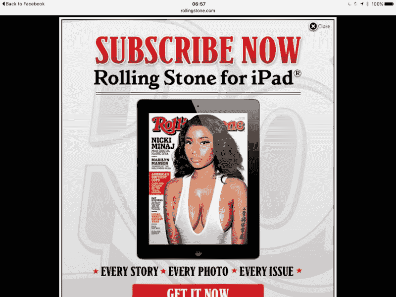T2】](https://www.rollingstone.com/politics/news/wtf-is-happening-in-the-oregon-militia-standoff-explained-20160103)

我不知道为什么我需要以这种方式被一个，嗯，“装备精良”的女孩击中，而我想做的只是了解这些俄勒冈州民兵的恶作剧是什么，但我们在这里。更糟糕的是，我有一个很小很小的“关闭”按钮，比我的手指还小，这是摆脱 iPad 上这个该死的东西的唯一方法。幸运的是，这种病毒确实感染了(这似乎是一个公平的词)苹果的平板电脑，你不会在 PC 上看到它，但你以前见过它，你和我一样讨厌它。

## 不可信的广告——禁止它们

看，我明白，网站需要赚钱，应该有一定程度的广告，我甚至在这里做。但是让我们去掉像这样荒谬的东西:

这些“推广链接”(忘了你自己吧，伙计们——它们是广告)已经很好地为我的位置量身定制了，所以让我们暂时停止相信(包括方向盘在汽车的错误一侧)，看看老朋友是如何在这里购买他的蓝宝的。[澳大利亚目前最便宜的 Aventador 是 65 万美元](http://www.carsales.com.au/cars/results?sortby=Price&offset=0&q=%28%28Make%3D%5BLamborghini%5D%26Model%3D%5BAventador%5D%29%26Service%3D%5BCarsales%5D%29&area=Stock&vertical=car&WT.z_srchsrcx=makemodel) ( [最贵的超过 100 万美元](http://www.carsales.com.au/nearnew/details/Lamborghini-Aventador-2015/OAG-AD-12183146/?Cr=0))，这意味着当你把租赁还款(或者机会成本，如果你掏钱的话)加上维护、折旧、保险和运营成本计算在内时，你的亏空将接近六位数。与此同时，一周“仅仅”3.5 万美元的总收入让你每年大约有 12 万美元的净收入，所以，让我们慷慨一点，在支付了愤怒的公牛之后，你还有 3 万美元可以活下去。除非你想永远住在你父母的房子里(这在广告里看起来不太好)，否则这是胡说八道，需要停止出现。

## 欧盟饼干警告——这简直是愚蠢至极

哦不——饼干！说真的，伙计们，这到底是怎么回事？

[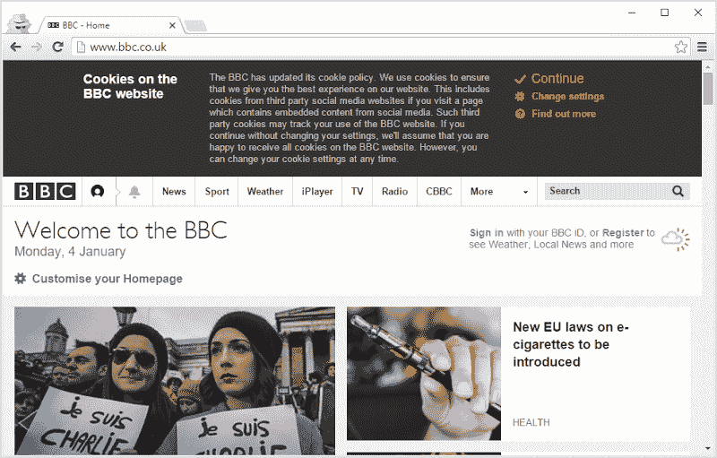T2】](https://www.bbc.co.uk)

没有 cookies，一大堆东西是无法工作的，或者需要在安全性方面做出其他妥协(例如，改为通过 URL 保持经过身份验证的状态)，那么为什么还要麻烦呢？是的，它们可以用来追踪，但你不需要 cookies 来追踪——去[检查你的浏览器指纹已经有多独特](https://amiunique.org/)。想知道访问网站的人和之前来过的人是不是同一个人？不需要饼干。你所做的一切都是让人们无视安全警告，这绝对没有实际好处。

## 滚动劫持——网站不是这样的！

这只是散发出一些设计师去“嘿，妈妈，看看我能做什么！”同时激怒其他人。不熟悉这个术语？试试[苹果的 Mac Pro 页面](https://www.apple.com/mac-pro/):

[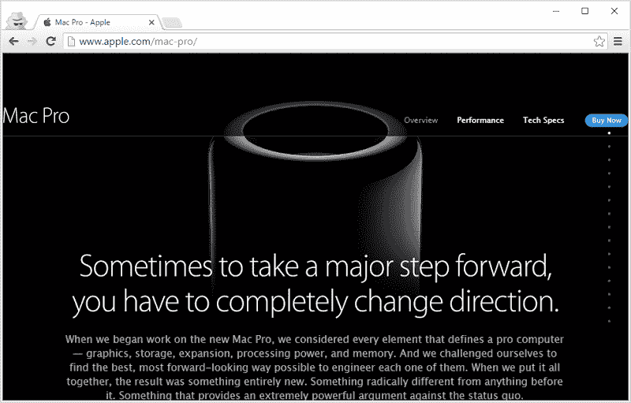T2】](https://www.apple.com/mac-pro/)

明白这是怎么回事了吗？你向下滚动，但页面不滚动，你只是得到不同的狗屎出现在页面上。通过对成千上万个网站的成千上万次访问，我们了解到你可以向下滚动访问“文件夹下”的内容，然后向上滚动回到你之前浏览的其他内容。像苹果这样的公司，以他们所有的智慧，采用了一种无处不在的用户交互方式，并且完全颠覆了这种方式，以至于它做了一些你从未预料到的事情。这是废话，应该停止！

## 诱饵标题——你有多绝望？！

我似乎受到了脸书朋友们这类垃圾的狂轰滥炸:

[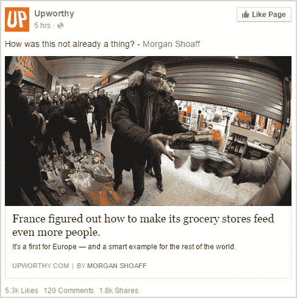T2】](https://www.upworthy.com/france-figured-out-how-to-make-its-grocery-stores-feed-even-more-people?c=ufb1)

嘿，这样如何——在标题或描述中告诉我法国实际上做了什么，然后我会决定我是否应该投入时间实际阅读这个故事，好吗？我的意思是，你可以说“现在有一项法案禁止他们扔掉食物”，我可以只拿走这一小段，继续生活。哦，那是不是意味着我不点击我每天面对的一堆垃圾，你就会错过一些广告收入？天啊，我们就是无法摆脱令人讨厌的广告对网络的破坏有多严重，是吗？！

## 自动播放–永远不要这样做！

当我去一个网站*阅读*一个故事时(那是你用眼睛而不是耳朵做的事情)，我不想这样:

[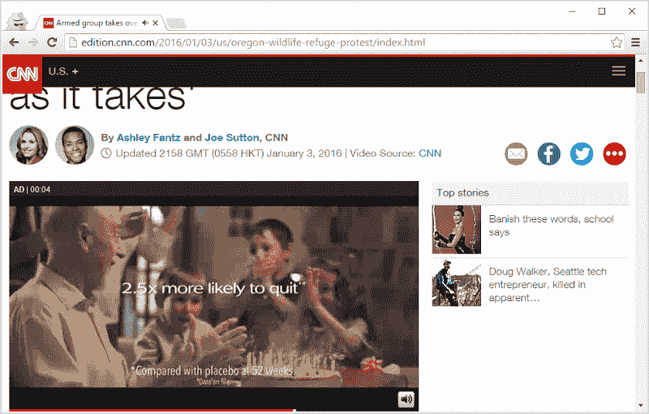T2】](https://edition.cnn.com/2016/01/03/us/oregon-wildlife-refuge-protest/index.html)

这是美国有线电视新闻网自动播放的广告，好像过去浮华、跳动的广告还不够糟糕，我们在这里也谈论音频。所以我刚刚去读了一个故事——可能是在一个我想保持安静的环境中(我不是唯一一个在床上读他们的 iPad 的人，对吧？！)——这些人说“不，我认为 Troy *真正想要的是听到戒烟的广告”。然后，他们还会自动播放一段关于这个故事的新闻视频，这只是稍微好一点，因为我再次来到*阅读*——这不是 YouTube——如果我想听一篇新闻文章，那么我总是可以在*可选的*视频中间按下一个大的“播放”按钮。*

## 付费墙–不！

偶尔你会看到某个地方分享的故事，标题看起来不错，所以你点击它。然后你得到这个:

[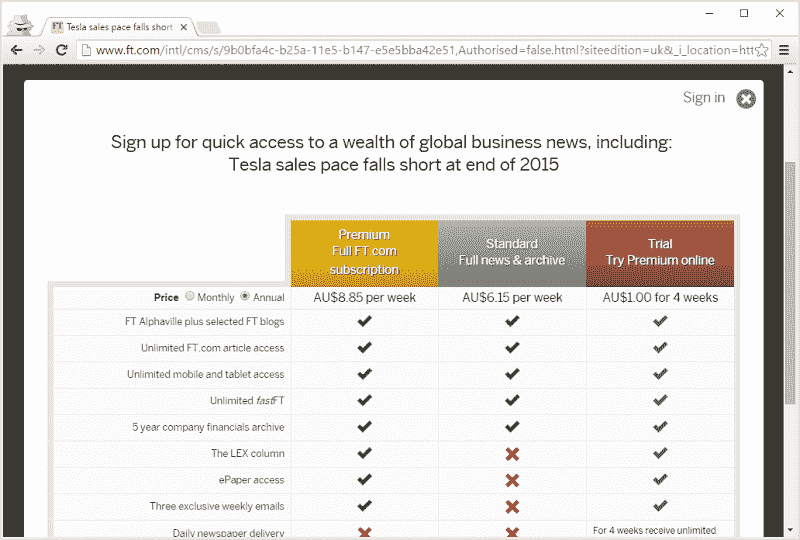T2】](https://www.ft.com/cms/s/0/9b0bfa4c-b25a-11e5-b147-e5e5bba42e51.html)

这种经历最糟糕的是，在一瞬间，你看到了真实的故事，然后它突然从你身边消失了。它在后台，已经被加载到浏览器中，但现在你已经被付费了。你试着用小十字*关闭模态，因为这正是小 UX 控件的目的*，现在你被重定向回主页，准备看另一个有趣的故事，并重复整个过程。谢谢各位，这真是太棒了。

## 手机应用——不，我不想要，我只是想看那个该死的网站！

你正在你的移动设备上阅读一篇网站上的文章，它在屏幕上呈现文本方面做得非常好，但是你面临着这样的问题:

[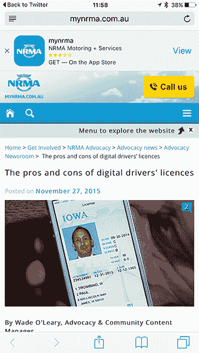T2】](m.mynrma.com.au/get-involved/advocacy/news/are-digital-licences-a-good-idea.htm)

提醒我为什么需要这个应用程序？它将如何让我更好地阅读这个故事？我知道它是如何使情况变得更糟的，因为它占用了我的一大块屏幕，没有明显的好处，而且这也是一部 iPhone 6 Plus，所以把它扔在一部更小的手机上，你要求别人四分之一的屏幕空间来做什么——推广一个三星评级的应用程序？！

## 移动网站——这不是我想分享的

当我在咆哮 NRMA 的网站时，看看当我从我的 iPhone 上分享那个链接时会发生什么:

你看到了吗？“m .”前缀是我在移动设备上加载网站时善意添加的，现在我不得不分享这个网址。每个在桌面上打开它的人现在都可以获得该网站的移动版本，这意味着我坐在我的电脑前，看着大约 80%浪费的空间和 1850 像素宽的按钮。*这就是为什么我们有响应式设计*–你检测设备的功能，然后以适当的方式显示内容，而不是将人们引导到另一个位置，然后让他们留在那里，即使在大屏幕上看起来像垃圾！

## 公司邮箱—*我将*决定我的公司邮箱是什么，而不是你

我很高兴使用 Hotmail，我有这个地址已经 20 年了，它为我提供了很好的服务。我用它来做生意，也用它来注册这样的网站:

[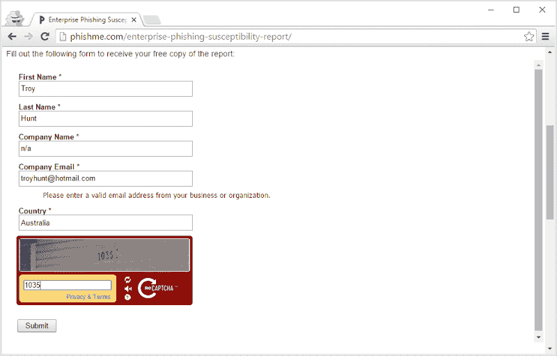T2】](http://phishme.com/enterprise-phishing-susceptibility-report/)

至少我用它来注册一些东西，除非我不能。你知道解决办法吗？你去抢一个 [Mailinator 的](https://mailinator.com/)备用域名(PhishMe 也会屏蔽@mailinator.com ),你注册一个类似于【NowYouCantEmailMe@spambooger.com】T2 的域名，这意味着你得到了你的报告，他们无法与你取得联系。伙计们，你们现在觉得怎么样？

## 阻止广告拦截者——你有多想激怒人们？！

我在这个博客上有广告。看到它们的人越多，我赚的钱就越多，所以我希望你能看到我的广告，但是我不会对它们做任何你在上面读到过的真正烦人的事情。然而，如果你真的必须运行广告拦截器(正是因为上面列出的那种狗屎)，那么我理解你从哪里来。请注意，不要来抱怨[你重写了我网站的部分内容，现在东西不能用了](https://www.troyhunt.com/2013/11/fixing-ghoulish-html-behaviour-after.html)，但我肯定不会让你过不去。

并非所有人都持这种观点:

[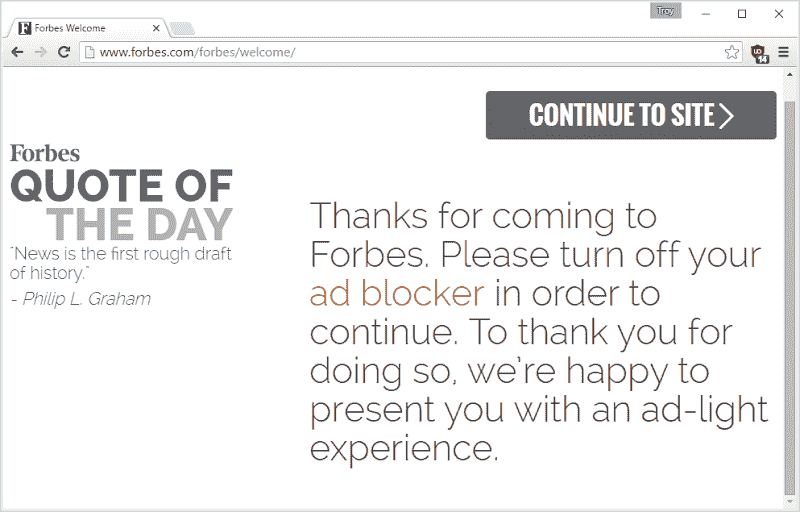T2】](https://www.forbes.com/forbes/welcome/)

整件事的讽刺之处在于——由于像《福布斯》这样的人在他们的广告中使用了令人讨厌的做法，人们运行广告拦截器。因为人们运行广告拦截器，福布斯和其他人通过拒绝或降低服务来升级斗争。他们不高兴，使用广告拦截器的人不高兴，我也不高兴，因为这迫使更多的人使用广告拦截器，我损失了收入！

《福布斯》上还有一件事，因为他们在这里占据了相当重要的位置:我今天早些时候问过这个问题:

《福布斯》杂志——只要看看回复，看看你是否发现了趋势。我以前给《福布斯》的一些文章投稿，也和那里一些真正顶尖的人一起工作过，但是不管是谁负责上面记录的东西，都需要仔细阅读。

我们能不能解决这个问题，然后在网上好好相处？

## 我错过了什么？

啊，感觉好多了！这些东西都快把我逼疯了，但我敢肯定不止这些——这些天你看到网站在做什么，让你想自己发泄一下？

