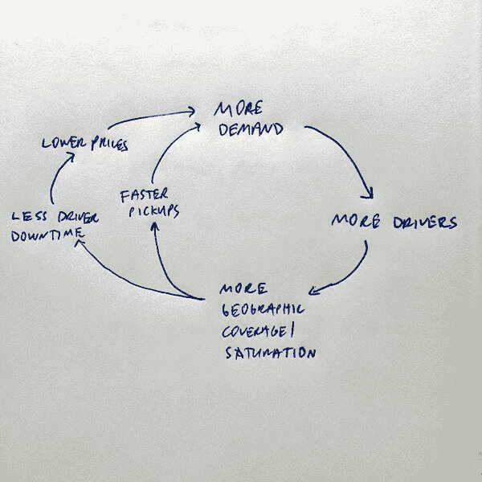
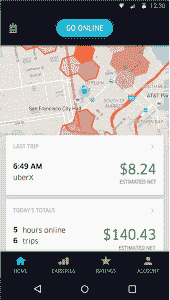
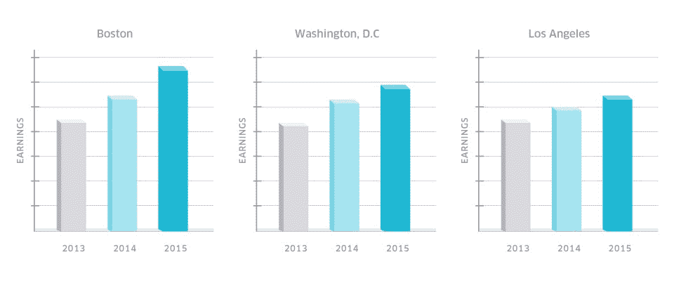

# 优步的良性循环。地理密度，超本地市场，以及为什么司机是安德鲁镇的关键

> 原文：<http://andrewchen.co/ubers-virtuous-cycle-5-important-reads-about-uber/?utm_source=wanqu.co&utm_campaign=Wanqu+Daily&utm_medium=website>

**优步的良性循环**
回到 2014 年，大卫·萨克斯(前 Paypal，Yammer，Zenefits) [发推文](https://twitter.com/DavidSacks/status/475073311383105536)上图解释了为什么优步的地理密度是新的网络效应。这是比尔·格利(基准资本和优步董事会成员)在他的文章[如何错过一英里:优步潜在市场规模的另一种观点](http://abovethecrowd.com/2014/07/11/how-to-miss-by-a-mile-an-alternative-look-at-ubers-potential-market-size/)中建立的一个有见地的图表。

比尔·格利将优步的网络效应总结为三大驱动力:

> 1.  **Pick-up times** . With the expansion of Uber in the market and the growth of demand and supply, the delivery time will be shortened. San Francisco residents have witnessed this scene for many years. Shorter pick-up time means higher reliability and more potential use cases. The more people use Uber, the shorter the pick-up time in each area.
> 2.  **Coverage density** . With the development of Uber in a city, the external geographical scope of supplier mobility continues to expand. Uber starts in San Francisco again. Today, there are reports from South San Jose to Napa. The more people use Uber, the greater the coverage.
> 3.  **Utilization rate** . With the development of Uber in any city, the utilization rate will increase. Basically, the time for drivers to pay for a ride per hour is on the rise. It's just a mathematical problem-more demand and more supply make it easier to solve the problem of economic travel salesman type. Then, Uber uses the improved utilization rate to reduce the rate, thus lowering the price, which will bring more use cases. The more people use Uber, the lower the overall price of consumers.

Ben Thompson 在他的文章[中用一个竞争的视角表达了不同的观点，这篇文章也是对 Gurley 文章的一个极大的赞美。](https://stratechery.com/2014/uber-fights/)

以上文章的指向超级有意思。从 UX 的经验来看，优步是“按一下按钮，汽车就来了”，但从商业的角度来看，它是近 70 个国家数百个超级本地市场的巨大集合。每个市场都是双边的，有乘客和司机，有自己的网络效应，由提货时间、覆盖密度和利用率驱动。

自从加入优步以来，理解以上几点是我最大的收获之一。深入探究这一视角会发现商业中的许多细微差别，而持续影响——尤其是驱动因素的重要性——是理解优步和一般按需公司的基础。

**【更多车手】**
如果我要简化我在优步的角色，那很简单——在上图中，就是想办法让**更多车手**。这是优步业务的基本要素之一，因为正如我之前提到的，该公司是数百个本地双边市场的集合。虽然大多数技术领域的人都非常了解如何让更多人安装优步骑手应用程序，但很难想象如何让更多司机使用优步平台。我知道我在开始在公司工作之前肯定对它了解不多！

优步的平台有 100 多万司机
所以让我们深入这个话题，我们先引用大卫·普劳夫的话来解释为什么优步的平台对司机如此重要，他是优步董事会成员，也是奥巴马 2008 年竞选的负责人。

在他的文章《优步和美国工人》中，他写道:

> 劳工统计局估计，有 2000 万美国人因为“非经济原因”被迫做兼职，比如照顾孩子或教育。47%的美国人表示，他们将难以应付一张意外的 400 美元账单，三分之一的人表示，他们将不得不借钱支付。

换句话说，美国有数千万人需要工作。优步平台上有很多司机——超过 100 万——我们希望得到更多。这是真正的规模，也是每天激励我的东西。Plouffe 在他的文章中继续用一些有趣的统计数据:

> 优步目前在全球平台上有 110 万活跃司机。在美国，有超过 400，000 名活跃司机每月至少出行四次。更多的人只旅行一两次来赚点外快。加起来:2015 年，司机已经赚了超过 35 亿美元。顺便说一下，只有大约 40%的司机在第一次出行一年后仍然活跃。

从上面你可以看出为什么司机的增长是优步成功的关键——你说服了很多以前从未开车的人去开车，很多人试了试就离开了。或者他们是兼职。

如果你想了解更多关于司机，他们的人口统计，增长率等。这是一篇长达 30 页的论文，名为[对美国司机伴侣劳动力市场的分析](http://andrewchen.co/wp-content/uploads/2016/01/Uber_Driver-Partners_Hall_Kreuger_2015.pdf)。伟大的阅读。

**激增定价和降低票价:保持市场平衡**
优步作为数百个双边本地市场的视角也有助于解释激增定价和降低票价等妥协的重要性。这些机制保持了市场的平衡，并有助于发展格利和萨克斯在优步认识到的网络效应。没有它们，市场的一方可能会超过另一方，导致螺旋式下降。因此，尽管双方对优步使用的所有市场平衡工具都不满意，但它最终是优步商业中的一个基础工具。

以激增定价为例。作为一个骑手，很容易讨厌它，而且有合法的情况下应该关闭它。但是从司机的角度考虑一下——这给了他们巨大的动力去上路，去城市中最需要他们的地方。事实上，surge 是在超本地的基础上完成的——只需查看司机/合作伙伴应用程序的截图，就可以感受到司机被引导到高需求点有多严格。

[T2】](http://andrewchen.co/wp-content/uploads/2016/01/surge.png)

上面每个彩色的六边形都是不同级别的浪涌。如果你想深入了解激增定价，这里有一个中等长度的案例研究:[优步激增定价的影响](http://andrewchen.co/wp-content/uploads/2016/01/effects_of_ubers_surge_pricing.pdf)。

(你可以在这里看到更多关于司机/合作伙伴应用[的信息，以及一篇关于其开发的](https://newsroom.uber.com/new-partner-app/)[连线文章](http://www.wired.com/2015/10/uberredesign/)。

价格飙升的另一面是降低票价，它提高了消费者的票价。优步最近降低了大约 100 个市场的票价。像价格飙升一样，这些降价是一种市场平衡机制，以增加需求并最终增加司机的收入。

这是通过上面 Sack 的图表中描述的方式完成的，其中“减少停机时间”箭头是关键。当司机不再坐着等待下一次出行时，他们的利用率会更高，从而增加他们的收入。如果你能让每趟的收益和每小时的收益走正确的路，你就能增加每小时的收益。

优步发布了一些方向图，显示这对司机来说是积极的，作为骑手降价和司机保证收入的一部分。这篇文章描述了一种通过降低票价来刺激需求的方法，并将其与担保相结合，同时让市场中的乘客一方明白这一点。好事接踵而至，比如优步一些最大市场的收益图表:

[T2】](http://andrewchen.co/wp-content/uploads/2016/01/uber_earnings.jpeg)

如你所见，收益数据向右上方移动。还不错。

**最后，一个有趣的视频**
最终，优步为骑手和驾驶员提供了一个重要的互动平台，遍布全球数百个超级本地市场。当你开始这样想的时候，尤其是从司机的角度，而不是从骑手的角度，你会开始对优步的业务有 10 倍的了解。

如果你想了解更多关于优步的职位，[这里有一个联系的链接](https://docs.google.com/a/uber.com/forms/d/1fQkcl8PMrbGgzx71q608GJKwBkMNcIMebQabkNqRnVw/viewform)或者只是看看[的招聘页面](https://www.uber.com/jobs?gh_src=yk7g8b)。

最后，我想给大家留下一个有趣的视频，乔纳森驾驶着优步和他的骑手们一起唱着玫瑰(链锯)。享受吧。

<iframe loading="lazy" src="https://www.youtube.com/embed/asXmVtWHnH0" frameborder="0" allowfullscreen="allowfullscreen">视频</iframe>

**PS. Get new updates/analysis on tech and startups**

我写一份高质量的每周时事通讯，报道硅谷发生的事情，关注创业、营销和移动领域。

在本网站链接的“内容”(包括帖子、播客、视频)中或在社交媒体和其他平台(统称为“内容分发渠道”)中发表的观点是我自己的，并不是 AH Capital Management、l . l . c .(“a16z”)或其各自附属公司的观点。AH 资本管理公司是一家在证券交易委员会注册的投资顾问公司。注册为投资顾问并不意味着任何特殊技能或培训。这些帖子不针对任何投资者或潜在投资者，也不构成出售或购买任何证券的要约，不得用于或依赖于评估任何投资的价值。

内容不应被解释为或以任何方式依赖于投资、法律、税务或其他建议。您应该向您自己的顾问咨询有关任何投资的法律、商业、税务和其他相关事宜。这些材料中表达的任何预测、估计、预测、目标、前景和/或观点可能会在不通知的情况下发生变化，并且可能与他人表达的观点不同或相反。此处提供的任何图表仅供参考，在做出任何投资决策时不应依赖。此处包含的某些信息来自第三方来源。虽然这些信息来自据信可靠的来源，但我并未独立核实这些信息，也未对这些信息的持久准确性或其在特定情况下的适当性做出任何陈述。该内容仅在所示日期有效。

在任何情况下，本网站或相关内容分销渠道上提供的任何帖子或其他信息都不应被解释为 a16z 人员发起、讨论或提及的任何集合投资工具中的任何证券或权益的购买或销售要约。也不应被理解为提供投资咨询服务的要约；投资 a16z 管理的集合投资工具的要约将单独提出，并且仅通过特定集合投资工具的保密要约文件提出，这些文件应完整阅读，并且仅提供给符合联邦证券法规定的特定资格的人。这些投资者被定义为合格投资者和合格购买者，通常被认为有能力评估潜在投资和财务事项的优点和风险。不能保证 a16z 的投资目标会实现或投资策略会成功。对 a16z 管理的投资工具的任何投资都包含很高的风险，包括损失全部投资金额的风险。提及、提及或描述的任何投资或投资组合公司并不代表 a16z 管理的所有投资工具，也不能保证这些投资将会盈利，也不能保证将来进行的其他投资会有类似的特征或结果。a16z 管理的基金所做的投资清单可在 https://a16z.com/investments/.获得。该清单不包括发行人未允许 a16z 公开披露的投资以及对公开交易的数字资产的未宣布投资。Andreessen Horowitz 投资、集合投资工具或投资策略的过去结果不一定代表未来结果。请参见[https://a16z.com/disclosures](https://a16z.com/disclosures)了解更多重要信息。