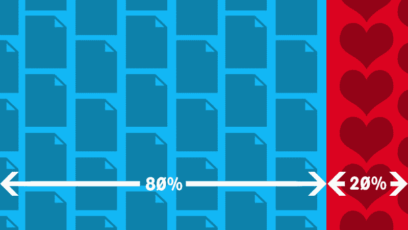

# 让 20%的时间发挥作用

> 原文：<http://begriffs.com/posts/2016-01-29-making-twenty-percent-time-work.html?utm_source=wanqu.co&utm_campaign=Wanqu+Daily&utm_medium=website>

在谷歌的带领下，许多公司为他们的员工设立了“20%时间”。这是每周的一天，员工可以在这一天从事他们自己选择的项目。这种实践让开发人员保持动力和敏锐，产生解决公司问题的工具，并且在最好的情况下创造了建立声望和帮助招聘的开源。

但是百分之二十的时间有一个问题:完成它需要训练。没有明确的方向，开源之日可能会陷入无组织的泥潭，浪费金钱，挫伤所有参与者的积极性。

我想分享一个我在开源日组织团队合作的技巧。它帮助每个人做他们喜欢的工作，同时将每个人协调成一个高效的机器。我注意到在应用它几个星期后有了显著的效果。我的同事从分散实验到定期制作工具，这些工具将在 Github 上流行。感觉很棒，最棒的是它是可复制的。

我们需要一些背景知识来理解这项技术。开源——事实上任何项目——需要各种贡献才能成功。一个欣欣向荣的项目不仅仅是一堆代码。正是维护者的包装、解释、拓展和同理心让一个好项目变得伟大。我将首先对贡献进行分类，然后解释如何将它们放入“贡献矩阵”来协调团队。

### 缩写(BASEDEF)

项目贡献有七种主要类型。为了便于记忆，我使用了缩写词 **BASEDEF** 。这个首字母缩略词将构成组织一个鼓舞人心的黑客日的核心。我们稍后会看到它是如何工作的，但首先让我们检查每个字母。

**B** 为**博客**。为一个项目做贡献的第一种方式是写博客。当你偶然发现别人(比如你的同事)写的一个项目时，你对它是如何工作的有了新的看法。你会看到一个清晰的项目概要，这使你成为撰写介绍性博客文章解释项目的最佳人选。您可以将它与其他项目进行比较，或者解释如何开始使用它。健康的项目需要很多人的观点。

下一个做出贡献的方法是**在你自己的项目中应用**这个项目。一个新工具最好的就是投入使用。例如，我的朋友写了一个 shellscript 测试框架。我决定用这个框架在我的系统上测试一些 shell 脚本。这样做暴露了他随后添加的缺失功能。

下一种贡献，**建议**既有用又简单。试着遵循项目文档，看看你是否能在不到五分钟的时间里取得小小的胜利。这被称为“五分钟测试”试完之后，告诉项目维护者进展如何，哪些地方令人困惑。建议改进。

现在我们进入编码领域。字母 **E** 代表**延长**。在这里，您可以添加一个新功能，可以是您自己的发明，也可以是受 Github 上现有功能请求的启发。这个就不多说了。如果项目没有 CHANGELOG，请考虑添加它。

**文件**。从编写一套独立的文档，到改进错误信息，再到设计教程，无所不包。这种类型的贡献与博客有些重叠，但更倾向于深入的技术写作。制作具体的例子有助于引导新用户更深入地参与项目。

接近列表末尾时，我们有**传福音**。这意味着给你的朋友发关于这个项目的电子邮件，或者把它提交给新闻聚合网站。但是，在公布项目之前，请与项目负责人核实；他们可能更喜欢在吸引新用户之前解决某些问题。但是不要忘记一句老话，如果你对你的项目没有一点尴尬，那么你已经等了太久才分享它。

最后一个主要贡献是**修复**。这包括修复特定的错误和改进项目开发的一般过程。后者包括添加一个测试套件，支持持续集成，或者使用静态代码分析器。针对拉请求运行的良好的自动化测试减轻了项目维护人员的负担。

### 该过程

现在我们有了一个贡献的词汇表。我们将在一张图中使用它，我称之为“贡献矩阵”它是这样工作的。

现在是周五早上，公司 20%时间的开始。有些人确切地知道他们想做什么，有些人不确定，也许不知道当前项目的可能性。首先，我们要求每个人在白板的左侧添加一个垂直的项目名称列表。这些是该小组可以开展的项目。人们列出自己喜欢的项目，这很好，事实上也很常见。这是包含四个项目的白板示例:

*   ACME Widget
*   私人建筑商
*   Testtron 3000
*   项目 X

当每个人都对没有遗漏相关项目感到满意时，在小组中四处走动，让每个人快速解释每个项目是什么，以便每个人都能跟上进度。现在，在白板顶部写一个水平列表，形成一个网格:

|  | B | A | S | E | D | E | F |
| --- | --- | --- | --- | --- | --- | --- | --- |
| ACME Widget |  |  |  |  |  |  |  |
| 私人建筑商 |  |  |  |  |  |  |  |
| Testtron 3000 |  |  |  |  |  |  |  |
| 项目 X |  |  |  |  |  |  |  |

请每个人在他们感兴趣的三个单元格中添加他们姓名的首字母。也许 JN 想写关于 Project X 的博客，或者 AB 想记录 Testtron 3000。网格将被首字母填充。

在这里，团队可以获得最有效的集中精力的方法的直接反馈。一些项目会比其他项目更受欢迎。他们的行中会有更多的列充满首字母。记住每个人都自愿做出三种可能的贡献。每个人现在从他们最初的三个任务中选择一个，这个任务尽可能地在最少的项目上巩固集体工作。

这种技术确保所有的项目都得到考虑，每个人都对他们的任务感到兴奋，并且团队在一个集中的项目列表上取得很大的进展。

如果你的公司有 20%的时间政策，我会鼓励你尝试这个技巧。这对于面对面的团队来说效果很好，但是你也可以通过 Google 电子表格与分散的团队合作。如果您还没有时间让员工为开放源代码做贡献，这种方法为试用日提供了一个很好的框架。申请内部项目来改进文档或偿还技术债务也很有用。