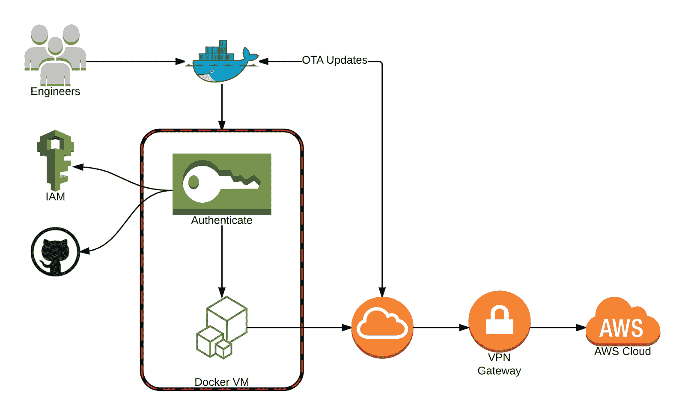
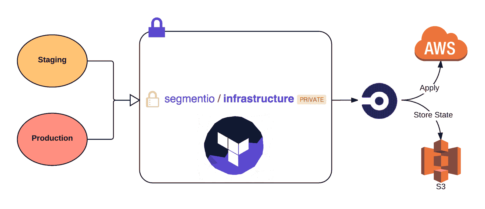
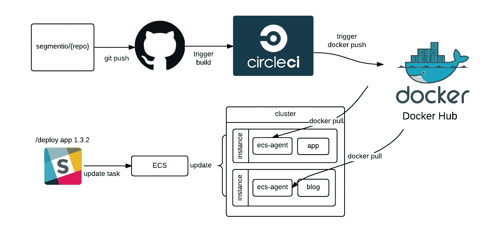

# 自动化我们的基础设施以支持工程师| Twilio Segment 博客

> 原文：<https://segment.com/blog/automating-our-infrastructure/?utm_source=wanqu.co&utm_campaign=Wanqu+Daily&utm_medium=website>

发展业务很难，而发展支持业务的工程团队无疑更难，但如果没有稳定的基础设施，要做到这两点基本上是不可能的。特别是对于高速发展的企业，每个工程师都必须被赋予高度的自主权来编写、测试和发布代码。

在过去的一年里，我们增加了大约 60 个新的[集成](https://segment.com/integrations)(超过 160 个)，为合作伙伴建立了一个[平台来编写他们自己的集成，发布了一个](https://segment.com/partners)[红移集成](https://segment.com/redshift)，并且有几个大的产品发布正在进行中。在这段时间里，我们在管理多种环境、部署代码和一般开发工作流方面遇到了许多发展难题。因为当我们的工程师把时间花在运送产品、构建工具和扩展服务上时，他们是最快乐和最有效率的，所以开发工作流及其支持基础设施的易用性和灵活性是至关重要的。

这就是我们对基础设施的许多方面进行自动化的原因。我们将在下面更详细地分享我们当前的设置，涵盖以下主要领域:

让我们开始吧！

## 同步开发环境

随着代码复杂性和工程团队的增长，在所有工程师之间保持开发环境的一致性会变得更加困难。

在我们当前的解决方案之前，我们的工程团队面临的一个大问题是保持所有开发环境同步。我们有一个带有一组 shell 脚本的 GitHub repo，所有新的工程师都执行这些脚本来将必要的工具和认证令牌安装到他们的本地机器上。这些脚本还会设置一个流浪者和一个虚拟机。

但是这个虚拟机是在每台计算机上本地构建的。如果您修改了虚拟机的状态，那么为了让它回到与其他工程师相同的虚拟机，您必须从头开始重新构建一切。当一个工程师更新虚拟机时，你必须告诉 Slack 上的每个人从我们的 GitHub 虚拟机报告和重建中提取更改。一个非常痛苦的过程，因为流浪可能会很慢。

对于正在快速发展的团队来说，这不是一个好的解决方案。

当我们第一次玩 [Docker](https://www.docker.com/) 的时候，我们喜欢在一个可复制的隔离环境中运行代码的能力。我们希望重用这些 Docker 原则和经验，在不断增长的工程团队中维护一致的开发环境。

我们编写了一堆工具来设置虚拟机，以便新工程师升级或从基本映像状态重置。当我们的工程师第一次设置虚拟机时，它会询问他们的 GitHub 凭证和 AWS 令牌，然后从 [Docker Hub](https://hub.docker.com/) 中的最新映像中提取并构建。

每次运行时，我们通过查询 Docker Hub API 来确保虚拟机是最新的。这个过程更新包、工具等。我们的工程师每天都在使用。这大约需要 5 秒钟，这是为了确保用户的一切正常运行。

此外，由于我们的工程师使用 MAC，我们从 [boot2docker](https://github.com/boot2docker/boot2docker) virtualbox 机器切换到[流浪者](https://www.vagrantup.com/)托管的 boot2docker 实例，以便我们可以利用 NFS 在主机和客户机之间共享卷。在本地开发期间，使用 NFS 提供了[巨大的性能增益](http://mitchellh.com/comparing-filesystem-performance-in-virtual-machines)。最后，NFS 允许我们的工程师在虚拟机外部做出的任何更改在虚拟机内部即时反映出来。

有了这个解决方案，我们大大减少了需要安装在主机上的依赖项的数量。现在唯一需要的东西是 Docker， [Docker Compose](https://docs.docker.com/compose/) ，Go，和一个`GOPATH` set。

## 镜像开发和生产环境

理想的情况是 dev 和 prod 环境运行相同的代码，但是它们是分开的，因此在 dev 上运行的代码永远不会影响生产环境中运行的代码。

之前，我们将 AWS 状态(由 [Terraform](https://terraform.io/) 生成)存储在 Terraform 文件旁边，但这并不是一个完美的系统。例如，如果两个人异步地计划和应用不同的变更，那么状态将会被修改，谁最后推动将会很难发现合并冲突。

我们以尽可能简单的方式实现了镜像转移和生产:将文件从一个文件夹复制到另一个文件夹。Terraform 使我们能够减少修改基础设施、部署新服务和进行改进所需的时间。

我们将 Terraform 与 CircleCI 集成在一起，编写了一个定制的构建流程，并确保在应用之前考虑了适当的安全性。

目前，我们在 GitHub 上有一个名为`infrastructure`的存储库，它包含一组 Terraform 脚本，这些脚本为我们的每个容器配置环境变量和设置。

当我们想改变我们的基础设施时，我们对 Terraform 脚本进行必要的修改，并在打开新的拉请求供基础设施团队的其他人审查之前运行它们。一旦 pull 请求被合并到 master，CircleCI 将启动部署过程:状态被提取，在本地修改，并再次存储在 S3 上。

## 当地发展

### 播种数据库

在本地开发时，用虚拟数据填充本地数据存储很重要，这样我们的应用看起来更真实。因此，植入数据库是设置开发环境的常见部分。

我们依靠 CircleCI、Docker 和[卷容器](https://docs.docker.com/engine/userguide/dockervolumes/)来提供对虚拟数据的轻松访问。卷容器是静态数据的可移植图像。我们决定使用卷容器，因为[数据模型](https://segment.com/blog/data-modeling/)和逻辑变得耦合更少，更容易维护。此外，以防这些数据在我们基础设施的其他地方(测试等)有用。，谁知道)。

当我们在开发中启动应用服务器时，会自动将种子数据加载到我们的本地开发环境中。例如，当在开发环境中启动`app`(我们的主应用程序)容器时，`app`的 docker-compose.yml 脚本将从 Docker Hub 中提取最新的`seed`映像，并将原始数据挂载到 VM 中。

Docker Hub 的`seed`图像是从 GitHub repo `seed`中创建的，这只是一个 JSON 文件的集合，作为我们导入到数据库中的原始对象。为了更新种子数据，我们在 repo 上设置了 CircleCI，以便任何对 master 的发布都将构建(从 Docker Hub 获取我们的 mongodb 和 redis 容器)并向 Docker Hub 发布一个新的`seed`映像，我们可以在应用程序中使用它。

### 启动微服务

由于 Segment 的数据密集型特性，我们的应用已经依赖于几个[微服务](https://segment.com/blog/goodbye-microservices/) (db service、redis、nsq 等)。为了让我们的工程师在应用程序上工作，我们需要有一个简单的方法在本地创建这些服务。

同样，Docker 使这个工作流程变得非常简单。

类似于我们如何使用`seed`卷容器在本地将数据装载到虚拟机中，我们对微服务也是如此。我们使用 docker compose 文件从 Docker Hub 获取图像，以在本地创建、设置地址和别名，并最终降低复杂性，只需一个终端命令即可启动并运行一切。

## 部署到生产

如果你写代码，但是从来没有把它发布到产品中，这真的发生过吗？😃

将代码部署到产品中是开发工作流不可或缺的一部分。在 Segment，我们优先考虑将代码交付到产品中的简单性和灵活性，因为这鼓励我们的工程师快速行动并富有成效。我们还围绕错误保护、回滚和监控构建状态创建了适当的工具。

我们使用 Docker、 [ECS](https://aws.amazon.com/ecs/) 、CircleCI 和 Terraform 来尽可能多地自动化持续部署流程。

每当代码被推入或合并到其`master`分支时，CircleCI 脚本就会构建容器并将其推入 Docker Hub。

然后，我们有一个单独的`build`服务，它更新 ECS 中的任务定义，这是为 POST 请求触发的服务预设的(这让我们可以通过一个 [Slack](https://slack.com/) [斜杠命令](https://slack.zendesk.com/hc/en-us/articles/201259356-Using-slash-commands)进行部署)。

通过这种设置，我们可以为任何服务定义一次配置，使我们的工程师能够非常轻松地创建和部署新的微服务。正如 [Calvin](https://www.twitter.com/calvinfo) 在之前的帖子中提到的，[“用 Docker、ECS 和 Terraform 重建我们的基础设施”](https://segment.com/blog/rebuilding-our-infrastructure/):

> <footer class="quoteSectionstyled__Author-sc-1pq1i1l-4 FasqC">— We no longer have a complex set of provisioning scripts or AMIs—we just hand the production cluster an image, and it runs. There’s no more stateful instances, and we’re guaranteed to run the same exact code on both staging and prod.</footer>

部署的自动化和易用性不仅对我们的工程师产生了积极影响。我们的成功和营销团队可以在少数回购中更新 markdown 文件，当合并到 master 时，启动自动部署流程，以便在几分钟内进行更改。

## 快速成长和移动

因为我们选择投入精力重新思考和自动化我们的开发工作流程及其支持基础设施，我们的工程团队行动更快，更有信心。我们花更多的时间做我们喜欢的高杠杆工作——运送产品和构建内部工具——而花更少的时间。

也就是说，这绝不是我们基础设施自动化的最终迭代。我们不断尝试新工具，测试新想法，看看我们还能找到什么样的效率。

这对我们来说是一个巨大的学习过程，我们希望听到社区中的其他人对他们的开发工作流做了什么。如果你最终实现了这样的东西(或者已经实现了)，请[告诉我们](https://www.twitter.com/segment)！我们很想听听你都做了些什么，对于其他有类似问题的人来说，哪些是有效的，哪些是无效的。