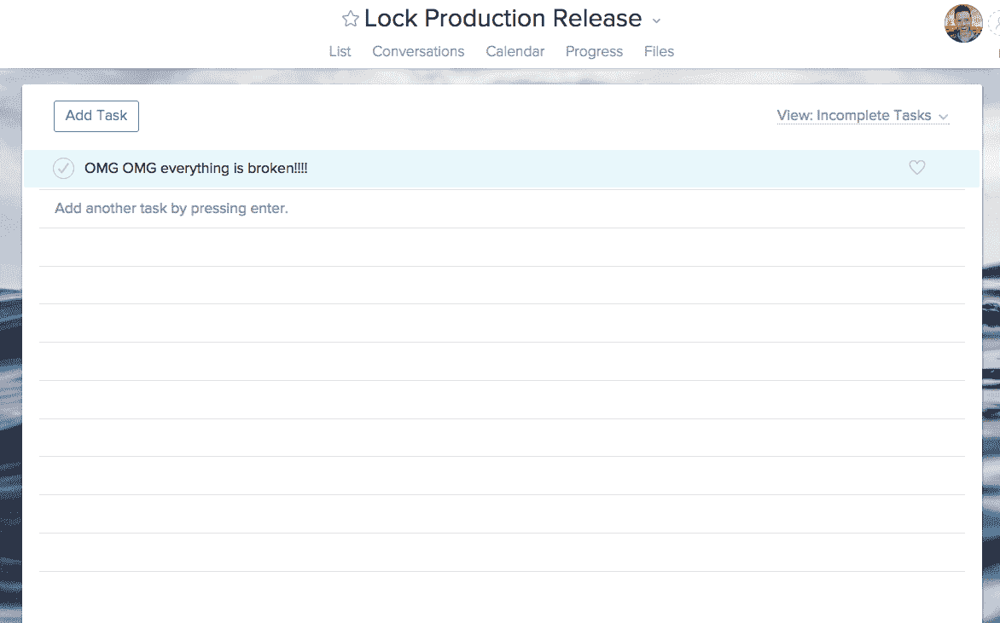

# 我们如何在基础设施中使用 Asana——Asana 博客

> 原文：<https://blog.asana.com/2016/02/using-asana-in-our-infrastructure/?utm_source=wanqu.co&utm_campaign=Wanqu+Daily&utm_medium=website>

在 Asana，我们大量喂食自己的产品。我们像大多数客户一样使用它，从任务、对话和项目开始到结束跟踪我们的所有工作，但我们也有一些意想不到的用途，如存放我们的内部图书馆，建议新产品机会，以及收集队友最喜欢的报价。使用今年晚些时候推出的[跟踪任何东西](https://vimeo.com/141968362)功能的内部测试版，以及我们的 [Wufoo 集成](https://asana.com/apps/wufoo)，我们还能够利用 Asana 作为申请人跟踪器、客户反馈工具和缺陷跟踪系统。它还集成了我们自己的警报框架，帮助我们[跟踪生产问题](https://blog.asana.com/2014/08/use-asana-track-production-issues-can/)。

除了跟踪一切，Asana 还是我们生产基础设施的重要组成部分。这是一个存储、查看和修改关于我们的部署过程的高级状态的便利地方。

### 部署脚本和体式

我们的部署脚本使用公开可用的 [python 客户端](https://github.com/Asana/python-asana)来与 Asana 中的项目和任务进行交互，并从本质上将这些项目转化为一个非常易于构建的 UI，用于我们的部署基础设施。因为它们是体式整体的一部分，所以与简单的网络界面相比，它开辟了一些非常有趣的可能性。

在 Asana，我们目前在两个主要集群上运行该应用程序:prod 和 beta。prod 集群每天向其推送两次代码，为我们的用户提供外部应用。我们在内部使用 beta 集群，每 15 分钟推送一次代码，在每次产品推送之前“冻结”90 分钟。这允许我们捕捉任何通过测试的错误或崩溃。

推送由我们的大型“堡垒”服务器上的 cron 作业运行，它构建代码并将其同步到集群中的所有其他机器。我们使用四个 Asana 项目来控制和观察这些脚本: *Lock Beta Release* 、 *Lock Production Release* 、 *Beta Push Tasks* 和 *Prod Push Tasks* 。

*Beta/Prod 推送任务*是 Asana 项目，存储我们所有推送的输出和成功。当推送开始时，脚本创建一个任务；当推送成功完成时，任务被标记为完成。当然，我们也将这些信息存储在机器日志中，但是因为我们一直都打开着 Asana，所以当我们遇到构建或部署问题时，这非常方便。

### 锁定项目

更有趣和互动的是我们如何使用*锁定 Beta/生产发布*项目。这些项目是人为或机器生成的锁，我们可以用它来停止推送。当我们的推送脚本运行时，它将做的第一件事是使用 API 检查其各自的*锁*项目，并且仅在项目为空时运行。

这特别方便，因为锁，作为体式任务，可以“分配”给人们，所以我们知道谁负责哪个锁，以及他们为什么把它放进去。我们使用任务的注释部分来讨论任务何时可以“完成”以及锁何时可以被移除。

这也很好地集成了我们自己开发的错误报告系统，我们称之为 Airpedal(向 Airbrake 致敬)。Airpedal 为严重碰撞生成一个 Asana 任务。工程师可以告诉 Airpedal 给定的错误是在哪个提交中解决的；Airpedal 将忽略任何进一步出现的错误，直到部署了带修复的提交，并且当修复达到 beta 时 *完成相应的 Asana 任务。*

如果错误任务也被添加到 *Lock Production Release* 项目中，那么只有当修复错误的提交成为推送的一部分时，我们才会推送至生产。

### 为什么我们喜欢这个

我们拥有与基础设施上的实际控制相关联的所有 Asana 功能(关注者、评论、项目)，这使得跟踪和操作我们的推送状态与我们使用该产品的任何其他过程一样高效。

脚本与 Asana 任务交互的想法是一个强大的模式，从为我们的编码挑战分配评分员这样简单和小的事情，到管理我们的整个部署基础设施。我们一直在尝试寻找产品的新方法来提高我们自己的效率。我们希望它能激励我们的用户也这样做。

如果你在 Asana API 中使用你自己的脚本，我们很乐意听到它们！