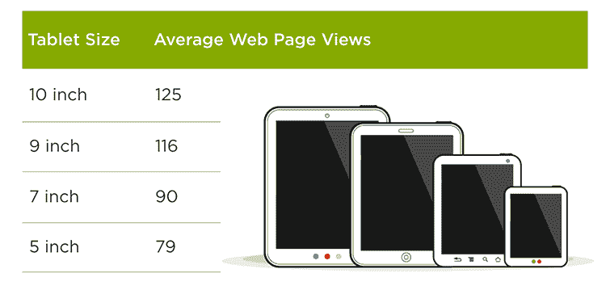
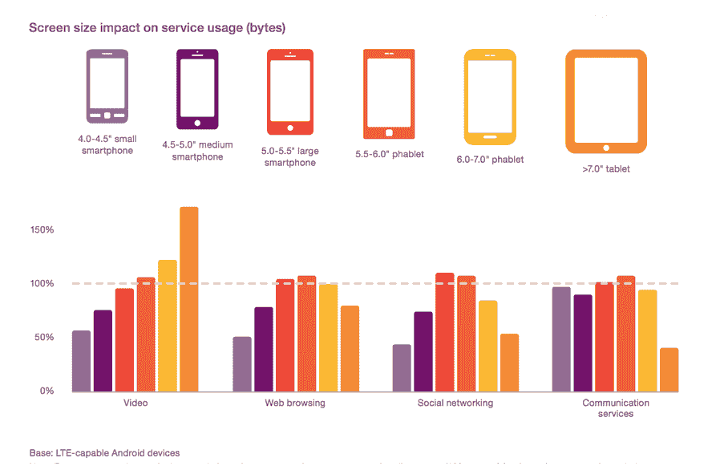
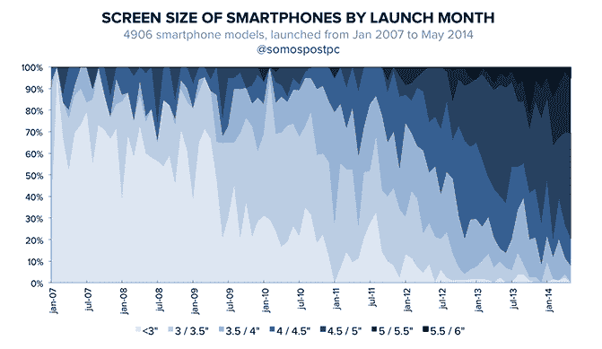
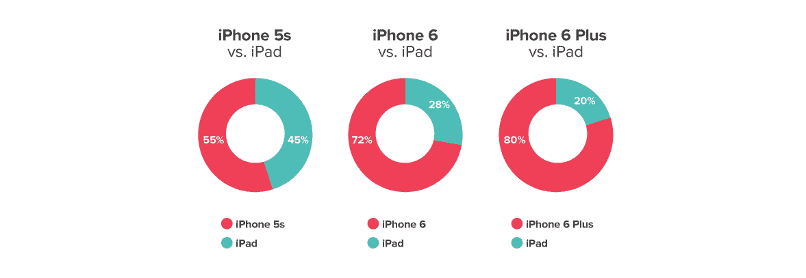
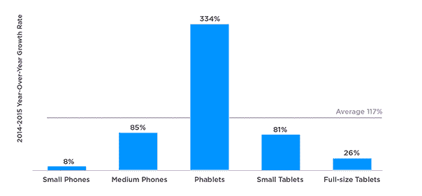

# LukeW |随着手机屏幕尺寸的增加...活动也是如此

> 原文：<http://www.lukew.com/ff/entry.asp?1956>

智能手机一直伴随着我们，并且(因此)一直在使用。但是我们花在手机屏幕上的时间不仅仅随着便携性而增加，还随着屏幕尺寸而增加。

近四年前，[对各种平板电脑上的网页浏览器页面浏览量的分析](http://www.lukew.com/ff/entry.asp?1549)显示，随着屏幕尺寸的减小，人们对网络的使用从 10 英寸平板电脑上的平均 125 次页面浏览量下降到 5 英寸平板电脑上的平均 79 次页面浏览量。

T3】

事实证明反过来也是正确的。随着屏幕尺寸的增加，人们在设备上的活动也会增加...在某种程度上。看看 [Android 数据使用](http://www.ericsson.com/mobility-report)，更大的屏幕意味着更多的网页浏览、社交网络和交流，直到大约 6”。

T3】

这种活动增加的一个原因可能是更大的智能手机[现在是标准](https://medium.com/@somospostpc/a-comprehensive-look-at-smartphone-screen-size-statistics-and-trends-e61d77001ebe#.2k93e2uuy)。普通智能手机从 3 英寸到 4 英寸需要 5 年时间，但到了 2014 年底，只需要 2 年时间就可以达到 5 英寸。

T3】

另一个原因可能是更大的手机会占用平板电脑等其他设备的时间。阅读应用 Pocket [发现，使用 4.7 英寸手机的用户](https://getpocket.com/blog/2014/11/the-screen-size-debate-how-the-iphone-6-plus-impacts-where-we-read-watch/)在工作日用平板电脑阅读的时间减少了 19%，周末减少了 27%。那些拥有 5.5 英寸手机的人在工作日使用平板电脑的时间减少了 31%，周末减少了 36%。

然而，仅仅是屏幕尺寸也会导致使用的增加。Pocket 发现，使用 4.7 英寸手机的人打开的文章和视频比使用 4 英寸屏幕的人多 33%，使用 5.5 英寸屏幕的人打开的项目比使用较小的手机多 65%。

T3】

来自 Flurry 的更近期[数据讲述了同样的故事。花在 5 英寸到 6.9 英寸手机上的时间增长了 334%，而花在 3.5 英寸到 4.9 英寸手机上的时间仅增长了 85%。](http://flurrymobile.tumblr.com/post/136677391508/stateofmobile2015)

T3】

换句话说:你的便携式屏幕越大，你使用它的次数就越多。

