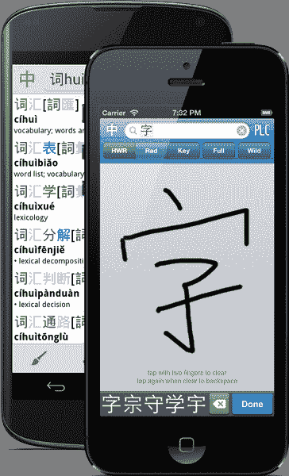
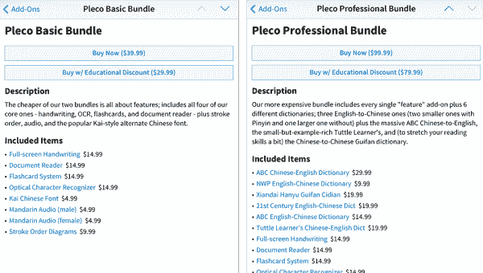
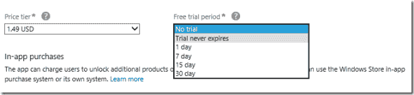

# Pleco:建立一个企业，而不是一个应用程序——本·汤普森的战略

> 原文：<https://stratechery.com/2014/pleco-building-business-just-app/?utm_source=wanqu.co&utm_campaign=Wanqu+Daily&utm_medium=website>

过去的一周并不是独立开发者对 app store 焦虑的第一次爆发，但感觉是最激烈的一次。金·卡戴珊(Kim Kardashian):好莱坞(Hollywood)今年有望赚 2 亿美元的消息引发了这场热潮，这一消息与布伦特·西蒙斯(Brent Simmons)在 T2 的观察形成了鲜明对比，他认为似乎没有多少独立的 iOS 开发者(我认为他的帖子引发了这场讨论；西蒙斯的[博客](http://inessential.com/)包含了随后所有帖子的综合报道。

我想，高潮或者低谷是贾里德·辛克莱[透露他出色的 iOS RSS 阅读器](http://blog.jaredsinclair.com/post/93118460565/a-candid-look-at-unreads-first-year)[未读](https://itunes.apple.com/us/app/unread-an-rss-reader/id754143884?mt=8)的销量:

> 《iPhone 未读》在应用商店的总销售额为 3.2 万美元。《iPad 未读》已经赚了 100 美元 10K .在减去 40%的个税和每月 350 美元的医疗保险费(乘以 12 个月)后，这两个应用程序的实际总销售额为 21000 美元，即每月 1750 美元。
> 
> 考虑到过去一年我在这些应用上投入的巨大努力，这是一个令人沮丧的数字。我尽量不去想如果我为另一家公司工作，以我的技能和资格，我能挣多少薪水。这也是一个确凿的证据，表明预付应用程序销售不是在应用程序商店赚钱的可持续方式。

首先，Unread 是我自己使用的一个很棒的应用程序，Sinclair 是一个非常有趣和具有煽动性的博客作者，他写了一些关于设计，特别是关于 iOS 7 的[强](http://blog.jaredsinclair.com/post/65778971101/form-follows-function-is-more-complicated-than-ios-7) [篇](http://blog.jaredsinclair.com/post/70498658794/solving-the-app-store-discovery-problem-with-app)。我也很高兴能见到他本人，把他当成朋友，并钦佩他愿意分享自己的财务状况，即使财务状况没有他希望的那么好。

也就是说。

辛克莱的结果不是任何事情的“确凿证据”。他们是一个奇闻。只要我们从单个数据点中得出重大结论，我认为看看光谱另一端的人可能是有用的。所以我打电话给我的另一个朋友，迈克·洛夫。

[T2】](http://plecosoft.com/)

爱使 [Pleco](http://plecosoft.com/) ，app store 上首屈一指的中文词典( [iOS](https://itunes.apple.com/us/app/pleco-chinese-dictionary/id341922306?mt=8) ， [Android](https://play.google.com/store/apps/details?id=com.pleco.chinesesystem&hl=en) )。Pleco 绝不是一款新的 app 事实上，它最初是为 Palm 开发的(我实际上在 2003 年为了使用 Pleco 的明确目的买了一个 Palm)。这是爱情的起源:

> 我是中国的交换生，2001 年在 Palm 上推出了这款应用。标志性的功能是手写识别(*获得摩托罗拉*的许可)，这在当时是无人能及的。(其他中文词典的)问题是，Palm 没有内置中文字体，事实上它没有 Unicode 支持(或其他中文文本编码)……你只能通过黑客手段让中文在上面工作。所以在一个地方拥有所有这些，不需要额外的设置，不需要购买三个不同的 30 美元应用程序的许可证来让它工作，这是它的关键部分。
> 
> 除了手写和中文支持之外，我们还有另外一件事，那就是我们独家授权了《袖珍牛津汉语词典》……[其他人都在用] [CEDICT](http://en.wikipedia.org/wiki/CEDICT) 它没有经过彻底编辑，没有词类或例句。

对我来说，Love 的方法最突出的一点是，从第一天起，他的与众不同之处就不是基于设计、易用性或其他我们通常在开发人员中推崇的属性。更确切地说，他关注的是许可等明显不那么吸引人的事情。当然，许可对于一个字典应用程序来说尤其重要，但更广泛的观点是，Love 的可持续差异化是*而不是*关于他自己的代码。可持续的差异化从来都不是。

> 几乎是在苹果公司宣布应用商店的时候，我就决定开发 iOS 应用程序了……但是我正在对 Palm 和 Windows Mobile 进行雄心勃勃的更新，所以我们来得太晚了，而且在 iOS 上已经有了一堆其他的词典(在 2009 年 12 月，Pleco for iOS 发布的时候)。

Love 指出，虽然 Pleco 来得很晚——商店里有多个中文词典应用程序——但他们很幸运，苹果刚刚开始允许免费应用程序提供应用内购买。因此，尽管 Pleco 一直是 Palm 上的付费下载，但 Love 立即利用了这一新的商业模式:

> 我们在 iOS 中的最初计划是有一些免费的 lite 应用程序，一些稍微好一点的付费应用程序，具有最少的功能，然后你可以购买其他东西作为附加组件。然后在 2009 年 10 月，苹果宣布他们取消了免费应用程序内购买的禁令，所以我们立即重组了整个系统，让应用程序内购买免费。

洛夫认为，他从第一天开始就考虑新的商业模式，这一事实让他比商店里已经存在的字典更具竞争优势，但我认为他低估了自己；毕竟，五年过去了，直到现在大多数独立开发者才开始意识到，免费的应用内购买是唯一可行的盈利模式。换句话说，Love 让自己与众不同，他不仅学习 API 和框架，还学习商业模式。更多来自爱:

> 不像其他人，我们的免费应用程序不仅有 CC-CEDICT ( *前面提到的 CEDICT* 的演变)，我们实际上许可了另一个汉英词典，我们称之为 PLC 词典，并在我们的免费应用程序中提供它，我们认为它与所有 CC-CEDICT 应用程序相比是一个很好的区别，因为它有例句和其他他们没有的好东西。

这一点让我大吃一惊。Love 投入了真金白银来区分他的免费应用程序(Love 仍然拥有强大的手写引擎，但 iOS 的内置手写功能虽然非常差，但已经削弱了这一优势)。洛夫相信，在他免费获胜后，他可以用他过多的付费附加软件来弥补差异，这些附加软件目前不仅包括额外的字典——其中一些是独家的——还包括笔画顺序图、不同字体、文档阅读器等模块，一年后还包括光学字符识别(OCR)。

在这一点上，我问他价格。关于在 Palm 上开发，有一点需要注意，那就是价格高得多是常态。Palm 上的 Pleco 有三种不同的捆绑包，价格从 60 美元到 120 美元不等，这取决于你对字典的选择。这在 iOS 上肯定是不可能的，是吗？

> 我们推出的基础套装价格为 50 美元，专业套装价格为 100 美元，完整套装价格为 150 美元。实际上非常接近棕榈价格。

但是价格肯定下降了，对吗？

> 我们实际上主要收取相同的价格。我们的最低套装是 40 美元，但现在不包括额外的字典，只有功能。有些人不喜欢我们在基本捆绑包中提供的字典，所以我们觉得更灵活的做法是有一个更便宜的捆绑包，没有任何字典，假设人们可以购买任何他们想搭配的字典。尽管价格变化有所帮助——我们现在实际上从基本捆绑包中获得了比 50 美元时更多的收益。降低成本实际上给我们带来了一些好处。

Pleco’s bundles. Individual features and dictionaries are also sold separately.

爱情的高价并没有影响销售:

*   Pleco 的客户数量是 Palm/Windows Mobile 上 Pleco 的 100 倍左右(由于免费)
*   这些免费用户的转换率约为 5%，这意味着乐福的付费用户比以前多了约 5 倍(Palm/Windows Mobile 没有免费版)
*   每位客户的净收入减少了三分之一，主要是因为出版商意识到 Pleco 正在削减他们的图书销售，因此收取了更高的版税

Pleco 也有一个 Android 版本，其收入约为 iOS 版本的三分之一，尽管 Love 指出这占据了他三分之一以上的时间。我问他值不值得:

> 作为品牌扩张，是的。我们的销售数字来自这样一个事实，当一个典型的学生开始他们的中文课或交换项目时，你会得到一张小单子，单子上写着“这里有一些你应该得到的有用的中国东西”，Pleco 是其中之一，这非常有价值，确保 Pleco 是那里唯一的应用程序，你不需要为 Android 推荐其他应用程序，这很有价值。

我认为这是至关重要的一点:爱*拥有*他的利基，他愿意做任何必要的事情来确保这种情况。

* * *

在上面引用的那篇文章的后续文章中，辛克莱写道:

> 我在 2014 年天真地制造并销售了一款 RSS 阅读器，这与我文章的核心无关。任何一款精致的应用——任何类别，任何数量的营销或推广——都是彩票。增加营销预算可能会增加潜在的损失，就像增加潜在的销售额一样。每个壁龛是一个苹果或一个橘子。这完全是一场赌博。 [1](#fn1-1054 "In a follow-up conversation, Sinclair expounded on this, saying, “The scale of the App Store might lead a newcomer to believe that even a small niche is capable of generating satisfying revenues for a solo developer.” To me this seems to be saying the same thing, but judge for yourself")

爱是证明这绝对不是真的。他已经找到了一个利基市场——汉语学习——多年来，他一直努力成为这个领域的应用程序。大部分时间都没有花在开发或设计上。相反，它被用来理解和倾听客户(这导致了前面提到的捆绑包变化)，与行动缓慢的出版商进行商业交易，仔细考虑定价和应用程序商店的展示，投资免费和付费的差异化产品，以及在一个 Android 应用程序上花费大量时间，这个应用程序不能直接赚钱，但标志着他在他的领域中的领导者。

毫无疑问，Love 也有他的转折点，尤其是他以有利的许可条款开始，但我会问每一个在 app store 中哀叹自己命运的独立开发者:

*   你是否服务于一个有明确需求的利基市场，一个愿意付费的受众群体，并且这个受众群体的规模足以支撑你的应用？
*   你有没有开发出比外观和感觉更具体的可持续差异化？
*   你有没有一个经过深思熟虑的盈利模式，让你从你服务的每一个客户身上赚取有意义的金额？如果你的应用真正与众不同*，那么你需要向客户收取相应的费用*
*   你是否在非开发职能上投入了同样多的精力，比如建立合作关系、许可、推广等。？
*   你做过安卓 app 吗？

所有这些对任何开发者来说都是赌注，不管是不是独立的，尽管我个人很喜欢辛克莱，但我从他的经历中吸取的教训不是 app store 坏了，而是他建立了一个糟糕的业务(特别是在他选择的市场上)。如果做我列出的所有事情听起来没有吸引力，或者不现实，如果你想做的只是开发和制造一些漂亮的东西，那么你需要找一份能给你报酬的工作。做一名独立歌手首先是要成为一名商人，而我所钦佩的是爱就是这样。他的开发技能是手段，不是目的。

明确地说，苹果可以做得更多，让各种规模的开发者更容易。尤其是两个会产生很大的不同:

*   **Trials:** One of the big advantages Love has in his space is that it is possible for him to offer a highly useful (and differentiated) free app along with a whole slew of paid add-ons. There are other categories, though, where to remove features would render the app useless. These sorts of apps need app-store supported time-limited trials along the lines of the Windows Store:

    

    The Windows Store lets developers set up time-limited trials of up to 30 days with the click of a button.

    

    这将很快明确在给定的细分市场中哪些应用程序是最好的，因为客户可以尝试所有的应用程序，开发者可以相应地收费。从长远来看，不同的利基市场最终会以不同的价格推出不同的应用，价格是质量的象征(当然，客户可以通过试用来验证)

*   **付费升级:**任何可持续业务的关键，无论是餐馆、航空公司还是应用程序开发商，都是随着时间的推移从你最好的客户身上赚钱。像 Evernote 这样有服务成分的应用，或者像 Pleco 这样有越来越多的应用内购买的应用，都成功地做到了这一点。不过，还有其他类型的应用程序，它们本身就是完整的体验。目前，开发者没有动力投入时间来改进他们的应用程序，因为最有可能欣赏这些改进的人——当前的客户——无法支付。的确，你可以完全发布一个独立的应用程序，但这样你就无法访问原始应用程序的数据，而且你也没有办法与你当前的客户沟通，让他们知道为什么他们应该更新。

苹果真的应该关心:iOS 生态系统是 iPhone 最大的差异之一，也绝对是苹果保持其令人印象深刻的利润率的原因之一。但独立开发者也需要意识到，iOS 应用商店的准入门槛极低，拥有庞大的消费者群体，这要求他们首先是商人。

爱情回忆:

> 我真怀念棕榈的日子。问题是，它更多的是为像我这样的人编写应用程序。我认为很多抱怨 app store 现状的人现在意识到它不再是那样工作了——但在 iOS 应用商店的早期，它是这样工作的。Palm 上的人只是想让你添加一些很酷的东西。他们想要更多的功能，他们对和我一样的东西感到兴奋。

这就是临界点:开发者都想为自己写一个 app，也就是说每个人都有。这就是为什么像 RSS 阅读器这样的东西赚不到钱。但是，有很多人有真正有趣和特殊的需求——比如学习中文——只是在等待一个人，他不仅能发展，还能做市场研究，建立商业模式，做所有的*乱七八糟的*事情，这是真正的差异化和可持续发展的业务的基础。 [2](#fn2-1054 "Note: For this article I also interviewed Elia Freedman, another former Palm developer who has built the <a href="https://itunes.apple.com/us/app/powerone-finance-pro-calculator/id339084742?mt=8">best financial calculator</a> on the app store (no, really – look at the reviews). My thanks to him for this time, and definitely check out both his apps (he has a <a href="https://itunes.apple.com/us/artist/infinity-softworks/id305450215">whole suite</a> of calculators), as well as his very thoughtful blog (where he <a href="http://eliainsider.com/2014/07/30/why-trial-apps-wont-save-mobile-indie-developers/">disagrees with me</a> about trials) ")

### *相关*