# 理解 MVP(最小可行产品)——以及为什么我更喜欢早期可测试/可用/可爱——克里斯普的博客

> 原文：<http://blog.crisp.se/2016/01/25/henrikkniberg/making-sense-of-mvp?utm_source=wanqu.co&utm_campaign=Wanqu+Daily&utm_medium=website>

([法文翻译](http://frank.taillandier.me/2016/01/28/comprendre-le-mvp/)，[西班牙文翻译](http://www.gazafatonarioit.com/2020/09/entiende-el-mvp-producto-minimo-viable.html)，[日文翻译](https://www.ankr.design/designtips/making-sense-of-mvp))

几年前，我画了这幅图，并开始在各种关于敏捷和精益开发的演示中使用它:

[T4】](https://blog.crisp.se/wp-content/uploads/2016/01/mvp.png)

从那时起，这幅画就像病毒一样传播开来！随处可见，出现在文章和演示中，甚至出现在一本书里(Jeff Patton 的“[用户故事映射](http://www.amazon.com/User-Story-Mapping-Discover-Product/dp/1491904909)”——顺便说一下，这是一本很好的读物)。许多人告诉我这幅图真正抓住了迭代&增量开发、精益启动、MVP(最小可行产品)等等的本质。然而，有些人误解了它，这是很自然的，当你把一张照片脱离了它的原始背景。有人批评它把事情过于简单化，这是事实。图片是一个比喻。它不是关于实际的汽车开发，而是关于产品开发，用汽车作为比喻。

无论如何，有了这些议论，我想是时候解释一下背后的想法了。

## 第一个例子——不像这样

第一行说明了一个关于迭代的、增量的产品开发的常见误解。

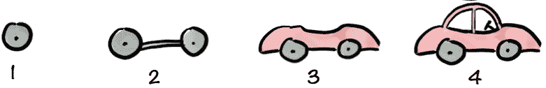T2】

许多项目失败得很惨，因为他们做了大爆炸交付(构建东西直到 100%完成，并在最后交付)。因此，我已经记不清我见过多少失败的项目了(向下滚动查看一些例子)。然而，当敏捷作为一种替代方案出现时，人们有时会回避交付未完成产品的想法——谁想要汽车的一半呢？。想象一下:

“先生，这是我们的第一次迭代，一个前轮胎。你怎么看？”

T2】

客户会问“你到底为什么要给我送轮胎？我订了一辆车！我该拿这个怎么办？”

(顺便说一下，我在这里使用术语“客户”作为通用术语来表示产品经理、产品所有者和早期采用者用户等人员)。

随着每次交付，产品越来越接近完成，但客户仍然很生气，因为他不能实际使用产品。它仍然只是一辆不完整的汽车。

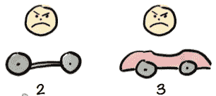T2】

最后，当产品完成后，客户会说“谢谢！终于！你为什么不一开始就送这个，跳过其他所有没用的送？”。

T2】

在本例中，他对最终产品很满意，因为这是他订购的产品。事实上，这通常不是真的。已经过了很长时间没有任何实际的用户测试，所以产品很可能充满了基于对人们需求的不正确假设的设计缺陷。所以结尾的笑脸很理想化。

不管怎样，第一行代表“低劣化的敏捷”。从技术上来说，它可能是增量的和迭代的交付，但是缺乏实际的反馈循环使得它非常危险——并且肯定不是敏捷的。

因此有了“不像这样”的标题。

## 第二个例子——像这样！

现在是第二排。

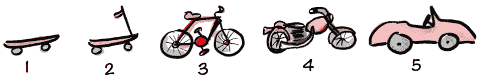T2】

这里我们采取一种非常不同的方法。我们从相同的上下文开始–客户订购了一辆汽车。但这一次我们不只是造一辆车。相反，我们**关注客户希望满足的潜在需求**。原来他的潜在需求是“我需要更快地从一个地方到达另一个地方”，而汽车只是一个可能的解决方案。请记住，汽车只是一个比喻，认为任何一种定制产品的发展情况。

因此，团队交付他们能想到的最小的东西，让客户测试东西并给我们反馈。有些人可能称它为 MVP(最小可行产品)，但是我更喜欢称它为最早可测试的产品(更多的在下面)。

T2】

随便你怎么称呼它(基于这个比喻，有些人甚至称他们的第一次发布为产品的“滑板版”…。).

客户不太可能对此感到满意。这与他订购的汽车相去甚远。不过没关系！这里有一个难题—**在这一点上，我们并没有试图让客户满意**。我们可能会让一些早期采用者高兴(或者痛苦中的[实用主义者](http://ericsink.com/Act_Your_Age.html))，但是我们**此时的主要目标只是为了*学习*** 。理想情况下，团队提前向客户解释清楚，这样他就不会太失望。

然而，与第一个场景中的前轮相反，滑板实际上是一种有用的产品，可以帮助客户从一个地方到达另一个地方。虽然不太好，但总比没有好一点。所以我们告诉客户“别担心，项目还没有完成，这只是许多迭代的第一步。**我们的目标仍然是制造一辆汽车，但与此同时，请尝试一下并给我们反馈**。从大处着眼，但以功能可行的小增量交付。

> 我们可能会学到一些真正令人惊讶的东西。假设顾客说他讨厌滑板，我们问为什么，他说“我讨厌这个颜色”。我们就像“呃…颜色？就这些？”。顾客说“是的，要蓝色的！除此之外，都还好！”。你省了一大笔钱，而不是造汽车！不太可能，但是谁知道呢？

关键问题是"**我们开始学习最便宜最快的方法是什么？**“我们能不能比滑板更早交付东西？公共汽车票怎么样？

T2】

这有助于解决客户的问题吗？也许是，也许不是，但我们肯定会从真正的用户那里学到一些东西。精益创业提供了一个很好的模型，它基于列出你对用户的真实假设，然后系统地验证或否定它们。

你不需要在所有用户身上测试产品，也不需要构建一个产品来测试某个东西。即使只在一个用户身上测试一个原型，你也不会一无所获。

但是好吧，回到滑板的例子。

在办公室里玩了一圈后，客户说“好的，有点意思，它确实让我更快地到达咖啡机旁。但是不稳定。我太容易掉下来”。

所以下一次迭代我们试图解决这个问题，或者至少了解更多。

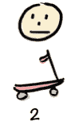T2】

客户现在可以在办公室走动而不会摔倒！

开心吗？不完全是，他还是有点想要那辆车。但与此同时，他确实在使用这个产品，并给我们反馈。他最大的抱怨是，很难行驶更长的距离，比如在建筑物之间，因为轮子很小，而且没有刹车。所以，下一个版本的产品会变形为类似自行车的东西。

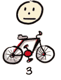T2】

现在，顾客可以在校园里四处逛逛。Yiihaaa！

我们在这个过程中学到了一些东西:顾客喜欢新鲜空气吹在脸上的感觉。客户在校园里，交通主要是在建筑物之间穿梭。

自行车可能会成为比汽车更好的产品。事实上，在测试这款产品时，我们可能会发现道路对于汽车来说太窄了。我们为客户节省了大量的时间和金钱，并在更短的时间内为他提供了更好的产品！

> 现在你可能在想“但是我们不应该已经知道了吗？通过对客户背景和需求的预先分析？”说得好。但是在我见过的大多数真实的产品开发场景中，**无论你做了多少前期分析，当你把第一个真正的版本放到一个真正的用户**手中时，你仍然会感到惊讶，并且你的许多假设都被证明是错误的。
> 
> *所以**是的，做一些前期分析，在开始开发之前尽可能多地发现。但是不要在这上面花太多时间，也不要太相信分析**——开始原型制作和发布，这才是真正的学习发生的时候。*

无论如何，回到故事。也许顾客想要更多。有时他需要去另一个城市旅行，骑自行车太慢了，还会出汗。所以下一次迭代我们添加一个引擎。

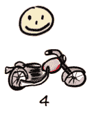T2】

这个模型特别适合软件，因为软件是软的。你可以随时“改造”产品，而不是每次都必须重新构建硬件。然而，即使在硬件项目中，交付原型来观察和学习客户如何使用你的产品也有很大的好处。只是迭代往往会更长一点(几个月而不是几周)。甚至像丰田和特斯拉这样的实际汽车公司在开发新的汽车模型之前也做了大量的原型制作(草图、3d 模型、[全尺寸粘土模型](http://www.toyota-global.com/showroom/toyota_design/voice_of_design/03.html)等)。

那现在怎么办？同样，也许顾客对摩托车很满意。我们可以提前结束这个项目。大多数产品都充斥着没人使用的复杂性和功能。迭代方法实际上是一种交付更少的方法，或者说**找到最简单、最便宜的方法来解决客户的问题**。把和牛逼的距离减到最小。很有禅意。

或者，客户可以选择继续，对要求进行修改或不进行修改。事实上，我们最终可能会拥有与最初设想完全相同的汽车。然而，更有可能的是，我们在这个过程中获得了至关重要的洞察力，并最终获得了一些略有不同的东西。像这样:

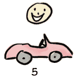T2】

客户喜出望外！为什么？因为我们一路上了解到他喜欢新鲜空气吹在脸上，所以我们最后买了一辆敞篷车。他最终还是得到了一辆车——但比最初计划的更好！

所以让我们退一步。

## 你的滑板是什么？

最上面的场景(交付前轮胎)很糟糕，因为我们一直在交付客户根本用不到的东西。如果你知道你在做什么——你的产品复杂性和风险都很小，也许你以前已经做了几百次了——那就去做吧。建造东西，完成后交付。

然而，我所见过的大多数产品开发工作都过于复杂和冒险，大爆炸式的方法经常导致巨大的昂贵的失败。所以关键问题是**你的滑板是什么？**

在产品开发中，你应该做的第一件事(在描述了你试图为谁解决什么问题之后)是确定你的滑板等价物。**把滑板想象成你可以放在真实用户手中的最小的东西，并得到真实的反馈**。或者用“公共汽车票”，如果这个比喻更好的话。

这将为您提供至关重要的反馈循环，并为您和客户提供对项目的控制——您可以学习并做出改变，而不是仅仅遵循计划并希望得到最好的结果。

让我们看一些现实生活中的例子。

## 示例 1: Spotify 音乐播放器

> “Spotify 拥有超过 7500 万用户，很难想起没有它的日子。但是有。我们都在塔吉特百货公司的过道里搜寻新唱片的时候。在我们生命中的一段时间里，我们都成了 Napster 上的小偷。iTunes 迫使我们以 2 美元/首的价格购买歌曲的时代。然后是 Spotify。”–[科技危机](http://techcrunch.com/gallery/a-brief-history-of-spotify/)

Spotify 现在是一个非常时髦的产品。但事情并不是这样开始的。我很幸运很早就参与了这个奇妙的旅程(现在仍然如此)。

T2】

作为 2006 年的一家初创公司，Spotify 是建立在一些关键假设之上的——人们乐于流媒体播放(而不是拥有)音乐，唱片公司和艺术家愿意让人们合法地这样做，快速稳定的流媒体播放在技术上是可行的。请记住，这是在 2006 年，当时音乐流(像 Real Player 一样)是一种非常可怕的体验，盗版音乐几乎是常态。挑战的技术部分是:“当你点击播放按钮时，有没有可能制作一个即时播放音乐的客户端？有没有可能去掉那个讨厌的‘缓冲’进度条？”

从小处着手并不意味着你不能往大处想。这是他们脑海中的早期草图之一:

T2】

但是，开发人员并没有花费数年时间来构建整个产品，然后找出假设是否成立，而是坐下来匆匆制作了一个技术原型，将他们笔记本电脑上的任何翻录音乐放入其中，并开始进行疯狂的实验，以找到快速稳定播放的方法。驱动指标是“从我按下播放键到我听到音乐需要多少毫秒？”。它应该立即播放，并继续播放流畅，没有任何口吃！

> “我们花了大量的时间专注于延迟，但没人在意，因为我们一心想要让你觉得世界上所有的音乐都在你的硬盘上。纠结于小细节有时会造成很大的不同。这就是我认为的对最小可行产品概念的最大误解。那就是 MVP 里的 V。”-丹尼尔·埃克，联合创始人兼首席执行官

一旦他们有了像样的东西，他们就开始对自己、家人和朋友进行测试。

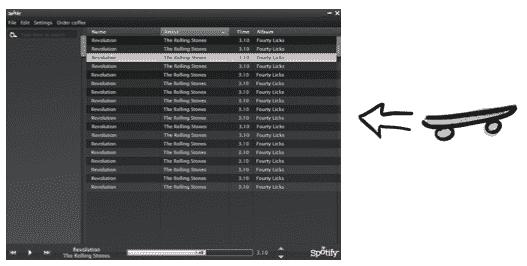T2】

最初的版本无法向更广泛的受众发布，它完全未经打磨，除了能够找到并播放几首硬编码的歌曲外，基本上没有任何功能，也没有法律协议或经济模式。那是他们的滑板。

但是他们无耻地将滑板交给真正的用户——朋友和家人——他们很快就得到了他们需要的答案。是的，技术上是可能的。是的，人们绝对喜欢这个产品(或者更像是，这个产品会变成什么样)！**假设被验证**！这个运行的原型帮助说服了唱片公司和投资者，剩下的就是历史了。

## 例子 2:《我的世界》

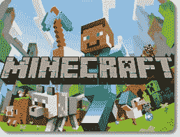T2】

《《我的世界》》是游戏开发史上最成功的游戏之一，尤其是考虑到开发成本的话。《我的世界》也是最极端的“早发布、多发布”心态的例子之一。第一次公开发布是由[的一个家伙](https://en.wikipedia.org/wiki/Markus_Persson)在[编码](http://minecraft.gamepedia.com/Version_history)仅仅 6 天后完成的！在第一个版本中，你不能做太多事情——这基本上是一个丑陋的块状 3d 景观，你可以挖掘石块并把它们放在其他地方建造简陋的结构。

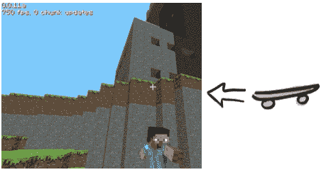T2】

那是滑板。

尽管用户非常投入(大多数开发者和用户的交流都是通过 Twitter 进行的，非常有趣)。早期用户中有我和我的四个孩子。第一年发行了一百多张唱片。游戏开发就是寻找乐趣(我合作过的一些游戏公司使用术语“乐趣的定义”而不是“完成的定义”)，最好的方法是让真实的人实际玩游戏——在这种情况下，成千上万的真实的人实际上已经付费尝试了早期版本，因此有个人动机来帮助改进游戏。

渐渐地，围绕这个游戏形成了一个小的开发团队(实际上主要是 2 个家伙)，这个游戏在全世界都红极一时。我不认为我在任何地方遇到过不玩《我的世界》的孩子。去年这款游戏(嗯，围绕这款游戏成立的[公司](https://mojang.com/))以 25 亿美元的价格卖给了微软。相当神奇。

## 例子 3:大型政府项目

大约在 2010 年，瑞典警方启动了一项重大举措，让警察花更多的时间在现场，而不是在 PUST 警察局(Polisens Utrednings STö)。这是一个令人着迷的项目，我作为教练参与其中，并写了一本书，讲述了我们所做的和我们所学到的([Lean from the trench](https://pragprog.com/book/hklean/lean-from-the-trenches))。

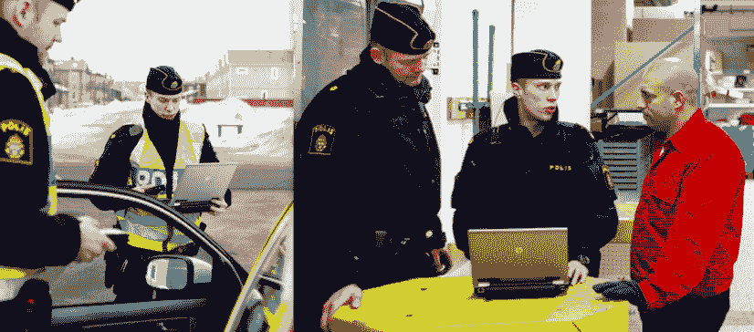T2】

这个想法是将笔记本电脑放在汽车里，并定制软件，让警察能够实时访问他们需要的系统，例如在审讯嫌疑人时(这是平板电脑出现之前的时代)。

他们过去曾试图建立类似的系统，但悲惨地失败了，主要是因为大爆炸思维。他们告诉我，他们以前的一个尝试从开始到第一次发布花了 7 年时间。七年！当然，那时一切都变了，这个项目彻底失败了。所以这次他们想用不同的方式。

这个 60 人的项目(后来被称为“PUST Java”)出乎意料地成功，尤其是作为一个大型政府项目(它甚至在 CIO 奖“[年度项目](http://cio.event.idg.se/event/awards2011/)”中获得第二名)。一个主要的成功因素是他们**没有试图一次建造整个东西**——他们把大象分成两个维度:

*   按地区。我们不需要一次发布到整个瑞典，我们可以从一个地区开始发布。
*   按犯罪类型。我们最初不需要支持所有犯罪类型，我们可以从支持 1-2 种犯罪类型开始。

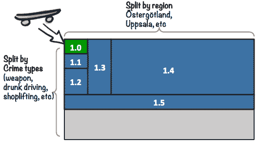T2】

第一个版本，1.0，是他们的滑板。

这是一个小型系统，仅支持几种犯罪类型，并在 stergtland(瑞典的一个地区)的一些警察身上进行了实地测试。其他犯罪类型必须用老方法处理——开车去警察局做文书工作。他们知道自己是试验品，产品还远未完成。但是他们很乐意测试，因为他们知道另一种选择。他们已经看到了缺乏早期用户反馈的过程会产生什么样的蹩脚系统，现在他们**终于有机会在系统构建过程中影响它**！

他们的反馈严厉而诚实。我们的许多假设都飞出了窗外，一个大的困境是如何处理所有精心制作的用例规格说明，这些规格说明随着真实用户反馈的到来变得越来越不相关(这是一个有瀑布历史和做大量前期分析习惯的组织)。

总之，长话短说，**早期的反馈被引入到产品改进中**,渐渐地，随着 stergtland 的那些警察开始喜欢这个产品，我们可以添加更多的犯罪类型，并将其推广到更多的地区。到了大发布(1.4)的时候，随着全国范围的推广和 12000 名警察的培训，我们并不那么担心。**我们做了如此多的发布，如此多的用户测试，以至于在全国发布的那天晚上我们睡得很好。**

不幸的是，胜利是短暂的。一个后续项目(PUST·西贝)[搞砸了](https://blog.crisp.se/2014/02/21/henrikkniberg/pust-lardomar)又回到了瀑布式思维，可能是由于旧习惯。2 年的分析和测试，没有任何发布或用户测试，随后一次向所有 12，000 名警察大规模发布该产品的“下一代”。这绝对是一场灾难，经过半年的大出血，他们关闭了整个事情。开发成本约为 2000 万欧元，但内部研究估计瑞典社会的成本(因为警察被可怕的系统所阻碍)约为[10 亿欧元](http://www.blaljus.nu/nyhetsartikel/kostnaden-pust-siebel-10-miljarder)！

相当昂贵的学习方式！

## 例子 4:乐高

我目前在[乐高](http://www.lego.com)工作，我对他们年复一年不断推出新的热门产品的能力感到惊讶。我听说了很多关于他们如何做到这一点的有趣故事，共同的主题是原型和早期用户测试！我经常在办公室看到一群孩子，设计师与当地幼儿园、学校和家庭合作，实地测试最新的产品创意。

这里有一个最近的例子——[Nexo Knights](http://www.lego.com/nexoknights/)(2016 年 1 月发布):

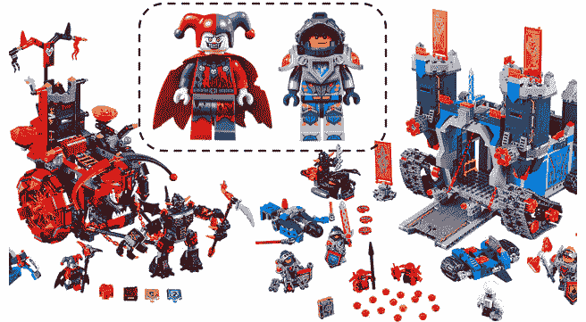T2】

当他们第一次开始探索这个概念时，他们做了纸上原型，并带给小孩子。孩子们的第一反应是“嘿，谁是坏人？我看不出谁好谁坏！”。哎呀。因此，设计师们不断迭代和测试，直到他们找到一个适合孩子们的设计。我敢打赌，就连你也能在上图中看出谁是善谁是恶…

我不确定滑板在这个故事中的确切位置，但你会明白—**来自真实用户的早期反馈**！不要只是设计产品和建造整个东西。想象一下，如果他们根据最初的设计设想制造产品，并在向世界各地的商店运送数千盒产品后*才知道问题所在！*

乐高也有来之不易的失败。一个例子是[乐高宇宙](https://en.wikipedia.org/wiki/Lego_Universe)，一个大型多人在线乐高世界。听起来很有趣，是吧？问题是，他们过于雄心勃勃，最终试图在向世界发布之前将整个事情做得尽善尽美。

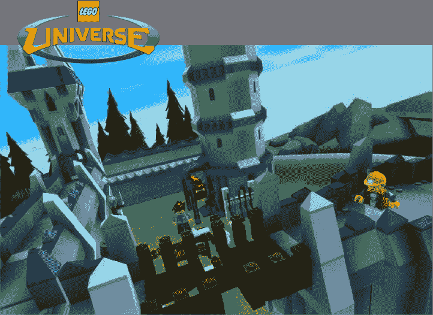T2】

大约有 [250 人工作了 4-5 年](http://250%20people%20worked%20for%204-5%20years)(因为完美主义导致的持续的范围蔓延)，当发布最终到来时，反响……不冷不热。完成的游戏很漂亮，但没有预期的好玩，所以产品在 2 年后就关闭了。

没有滑板！

为什么不呢？因为滑板并不酷(至少如果你想要一辆车的话)，而乐高的文化就是提供令人敬畏的体验！如果你在丹麦比隆的乐高总部工作，你每天都会路过这幅巨大的壁画:

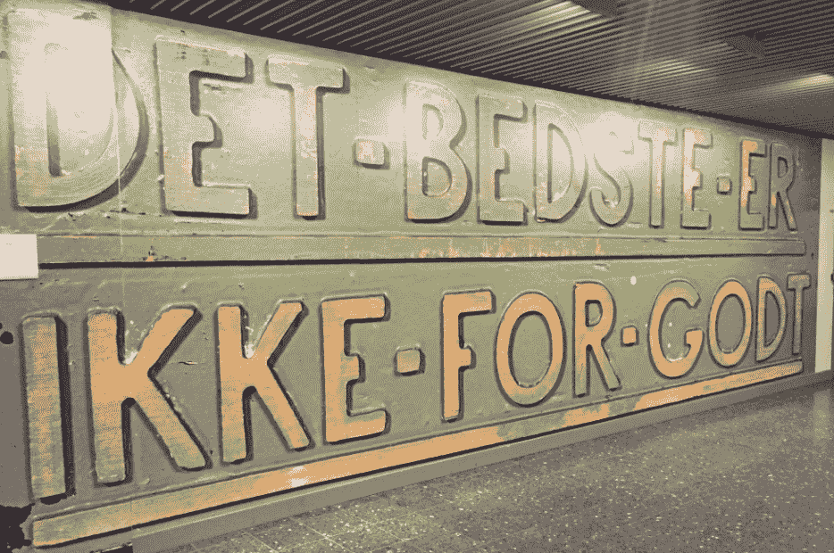T2】

大致翻译过来就是“只有最好的才够好”。自公司 80 多年前成立以来，这一直是乐高的指导原则，并帮助他们成为世界上最成功的公司之一。但在这种情况下，这个原则被误用了。****对完美的追求延迟了重要的反馈**，这意味着对用户喜欢什么和不喜欢什么的错误假设。与《我的世界》完全相反。**

 **有趣的是，乐高宇宙团队实际上在大量使用 Scrum 和迭代——就像《我的世界》的人一样。但这些信息只是内部发布的。所以很有可能出现了滑板、自行车等等，但这些产品从未到达真正的用户手中。这不是 Scrum 应该被使用的方式。

这是一次代价高昂的失败，但乐高从中吸取了教训，他们在早期测试和用户反馈方面不断进步。

## 对“MVP”的改进

这(深呼吸……)让我想到了 MVP 的话题——最小可行产品。

潜在的想法是伟大的，但这个术语本身引起了许多困惑和焦虑。我遇到过许多客户，他们会说“我绝对不想要 MVP 交付，那是我得到的最后一次交付！”团队经常交付所谓的最小可行产品，然后很快被带到下一个项目，留给客户一个有缺陷的、未完成的产品。对于一些客户来说，MVP = MRC(最小可释放垃圾)。

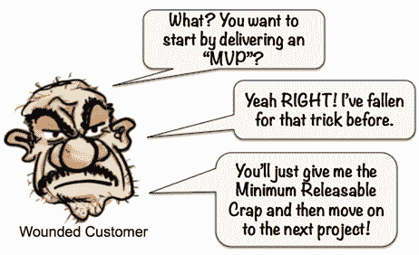T2】

我知道，我知道，这归结于糟糕的管理，而不是 MVP 这个词，但是……这个词会引起误解。“最低”和“可行”对不同的人意味着不同的东西，这就产生了问题。

所以这里有一个选择。

首先，把“最小”这个词换成“早”。发布 MVP 背后的整个想法是获得早期反馈——通过交付最小的产品而不是完整的产品，我们可以更早地获得反馈。

**很少有顾客想要“最少”，但大多数顾客想要“早”**！这是我们的第一个变化:

最小= >最早

接下来，去掉“可行”这个词，因为它太模糊了。**你的“可行”就是我的“可怕”**。有些人认为可行意味着“我可以测试并从中获得反馈的东西”，其他人认为它意味着“客户实际上可以使用的东西”。所以让我们更明确地把它分成三个不同的部分:

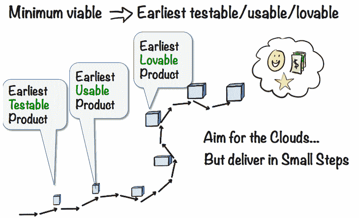T2】

**最早的可测试产品**是滑板或公共汽车票——**第一次发布，客户可以用**做一些事情。可能无法解决他们的问题，但至少会产生某种反馈。我们非常明确地表示，学习是此次发布的主要目的，任何实际的客户价值都将是额外的收获。

   

最早可用的产品也许是自行车。早期采用者会实际使用的第一个版本**，心甘情愿的**。这还远远没有完成，而且可能不太受欢迎。但这确实让你的客户比以前处于更有利的位置。

T2】

**最早可爱的产品**也许是摩托车。第一次发布的**,顾客会喜欢，会告诉他们的朋友，并愿意为之付费。**仍有很多需要改进的地方，我们最终可能会拥有一辆敞篷车、一架飞机或其他东西。但是我们已经到了拥有真正适销对路的产品的时候了。

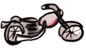T2】

> *我考虑增加一个更早的步骤“**最早可反馈的产品**”，这基本上是你用来从客户那里获得第一次反馈的纸质原型或等效物。但是四个步骤似乎太多了，而且反馈这个词…..呃。但尽管如此，这也是重要的一步。有些人会把纸上原型称为最早的可测试产品，但我想这取决于你如何定义可测试性。查看[马丁的 MVP 指南](https://www.crisp.se/mvpguide)了解更多——他有很多关于如何以最小的投入获得早期反馈的超级具体的例子。*

当然，人们仍然会误解最早的可测试/可用/可爱，但这至少比模糊的最小可行产品更明确了一步。

## 外卖点

好了，该结束了。从没想过会这么久，谢谢你留下来！关键要点:

*   **避免复杂创新产品开发的大爆炸**。迭代地、增量地做。你已经知道了。但是你真的这么做了吗？
*   **从确定你的滑板**开始——最早可测试的产品。瞄准云，但吞下你的骄傲，从交付滑板开始。
*   **避免使用 MVP** 这个术语。更明确地说明你实际上在说什么。最早可测试的/可用的/可爱的只是一个例子，使用对你的利益相关者来说最不容易混淆的术语..

记住——滑板/汽车图只是一个比喻。不要太较真:o)

PS——这是一个有趣的故事，讲的是我和我的孩子如何利用这些原则赢得了一场机器人相扑比赛

感谢 Mary Poppendieck、Jeff Patton、Alistair 考克伯恩、Anders Haugeto、Sophia、来自 Crisp、Spotify 和 Lego 的同事，以及所有提供了大量有用反馈的人。**