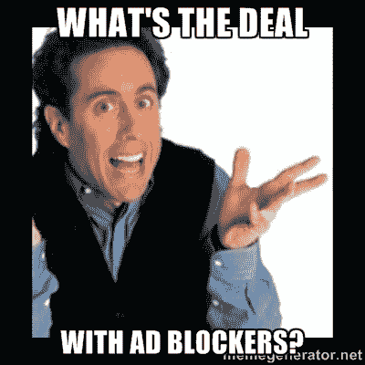
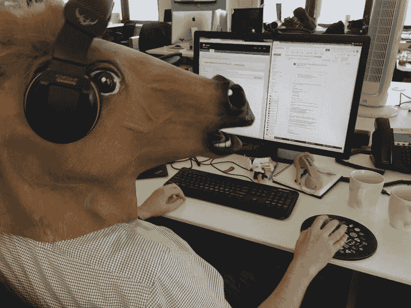
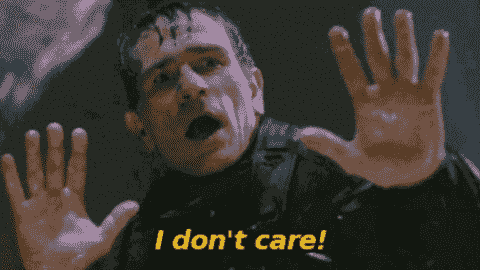
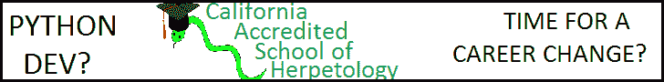

# 为什么栈溢出不关心广告拦截器-栈溢出博客

> 原文：<https://blog.stackoverflow.com/2016/02/why-stack-overflow-doesnt-care-about-ad-blockers/?utm_source=wanqu.co&utm_campaign=Wanqu+Daily&utm_medium=website>

嗨！我是史蒂夫·费尔德曼，Stack Overflow 的高级广告运营经理。我一生都对广告着迷。甚至在我还是个孩子的时候，我就想知道一家公司在广告中用一个词代替另一个词是想告诉我什么。随着时间的推移，我形成了一种强烈的(阅读:主观的)观点，认为什么让一个广告“好”，什么让一个广告“坏”。我花了很多年时间——事实上，直到加入 Stack Overflow 的广告销售团队——才最终发现，最好的广告的共同点是*相关性*。保持相关性是**我们**如何设法避免出版商今天面临的最大问题之一:广告屏蔽。

# 广告拦截器的*交易*是什么？

在这一点上，很明显广告屏蔽是一件大事。最近的一项研究表明，仅在 2015 年，广告行业就将因广告拦截器而损失超过 220 亿美元。那是一大笔钱。随着广告拦截工具的活跃用户达到近 2 亿，各公司正在争相“修复”广告拦截问题。但是不仅仅是工具栏上的小小的停止标志发出了警报。当苹果宣布 iOS9 将允许使用广告拦截器时，他们引起了恐慌，因为许多人认为移动广告是该行业的一项重要收入。

首先，广告业反对广告拦截，提出了一些建议，比如开发向使用广告拦截器的用户投放特定广告的方法。然后，当他们宣布 iOS 9 将允许广告拦截器时，他们考虑去追苹果。后来，他们开始要求用户关闭广告拦截器，以示诚信。对于一些 T3 来说，这并不顺利[。最后，他们](http://www.engadget.com/2016/01/08/you-say-advertising-i-say-block-that-malware/)[阻止了 Ad Block Plus 参加一个行业活动](http://arstechnica.co.uk/business/2016/01/adblock-plus-blocked-from-attending-online-ad-industrys-big-annual-conference/)。通过这一切，我们这些在 Stack Overflow 的人叹了口气，耸了耸肩。显然，业内许多人不明白这一点。出版商无法通过将广告——尤其是低质量的广告——强加给人们来取胜。但是业内的一些人确实明白这一点。eyeo(Adblock Plus 背后的公司)在他们的“[可接受的广告宣言](https://acceptableads.org/)中概述了一些如何改善数字广告的强有力的想法——更不用说 [iAB 的 L.E.A.N 广告计划](http://www.iab.com/news/lean/)。虽然对这两种解决方案都有批评，但积极的一面是，强大的组织最终开始着手解决这个问题。Reddit 在他们的广告中积极主动地与公众接触。Quartz 正在尝试新的有趣的方式来吸引用户，对此褒贬不一。我将自吹自擂，说栈溢出很久以前就开始通过我们元站点上的众多渠道为[栈溢出](http://meta.stackoverflow.com/questions/tagged/advertising)和[栈交换](http://meta.stackexchange.com/questions/tagged/advertising)做这些事情。

# 堆栈溢出时的广告

展示广告团队从 2012 年的两个人发展到今天的九个人。在这段时间里，SO 上的流量增加了两倍，销售额也随之增长。我们团队中吸引新员工的一个因素是我们与用户的独特关系以及销售人员面临的挑战。我们很久以前就和 Stack Overflow 用户达成协议，我们不会让他们接受低质量的广告。想想那些卖机票、减肥保健品的衣着暴露的女人，或者那些古怪的挥舞着充气手臂、挥舞着地铁的男人。但是真的:任何没有对堆栈溢出的观众明确说出*的东西都是不允许的。我们也不接受像动画广告、可扩展广告或视频这样的富媒体，这是当今大多数出版商的标准。这一严格的政策意味着我们把钱留在桌面上，但我们的团队希望保护 Stack Overflow 免受这些广告的影响，因为它们有疏远已建立的信任的风险。*

我们团队的销售人员和营销经理比其他公司做得更多。他们从始至终更多地参与到一场运动中。从向新客户解释声誉如何运作，到与广告运营部门合作，建议转向像[tag:swift]这样的新的流行标签，因为它正在吸引许多新用户。这似乎与广告拦截辩论无关，但事实并非如此。它鼓励启迪和提高人们的意识，否则他们将很少或没有，这反过来又培养尊重和欣赏。对于我们团队的新成员来说，这比简单地说“堆栈溢出很重要，原因有 x、y 和 z”要好得多。随着时间的推移，他们逐渐了解了什么是 ide 和 SDK，这是值得关注的。这种知识的获得实际上意味着我们的团队关心保持广告对堆栈溢出有用和相关。

# 我们不在乎！

事实是:我们不关心我们的用户是否在堆栈溢出上使用广告拦截器。更准确地说:我们希望他们不会，但我们理解有些人就是不喜欢广告。我们的信念是，如果有人不喜欢他们，他们不会点击他们，任何给他们的印象只会惹恼他们——此外，给不会点击他们的人提供广告会损害竞选活动的表现。对相关性和性能的关注出现在 QA 过程的早期。无论是我们的销售人员解释广告必须有边框，还是我们的活动经理检查登录页面以确保他们充分告知，*我们是彻底的*。

QA 过程的一个重要部分是确保不仅仅是创意，而且是广告客户与我们的受众相关。我们网站上出现的每一个广告都经过运营团队的审核。我们检查广告和登录页面上的文案和内容。在这个问答过程中，我们反复问自己的问题很简单:这与用户相关吗？用挑衅性的图片“和你的主机问题说再见”不是我们想要的，我相信我们的用户也不希望这样。这个繁重的 QA 的目的是确保我们的用户从堆栈溢出的体验中获得最大的收益。内容*很有帮助——为什么广告不能一样呢？

这则广告试图与主题相关，但却以失败告终。也是假的。抱歉，未来的爬虫学家。

# 重视用户体验的价值

用户体验一直是我们关注的焦点。事实上，其他人认为将用户体验放在收入之前是出版商的长期增长之路。正如《华盛顿邮报》首席收入办公室所说的那样，[“…产品体验必须和内容一样好。”](http://niemanreports.org/articles/to-fight-ad-blocking-build-better-ads/)我们的方法与这一信念相一致，因为我们将广告限制在特定区域，我们允许用户否决或关闭他们不喜欢的广告。*这允许用户控制他们的体验。QA、管理内容和广告客户以及考虑用户体验是防止广告拦截器阻碍我们发展的成功工具。

由于我们不知道的原因，最近将侧边栏的尺寸从非标准的完全虚构的 220×250 调整为行业标准的 300×250，在发布前经过了彻底的研究。问题归结为:我们希望增加侧边栏的大小，但希望确保内容不会受到任何损害。 [Bret](http://meta.stackexchange.com/users/231173/bret-copeland) 和广告服务器团队深入调查了 Stack Exchange 网络中每个用户的屏幕尺寸，并得出结论:只有大约 [2%的用户会受到这一变化的影响](http://meta.stackexchange.com/a/272617/178809)。因此，我们坚信，我们新增加的规模对所有参与者来说都是净收益。

Stack Overflow 的使命是为开发者创造一个更美好的世界，这一直是展示广告团队的核心宗旨。我们团队中的每一个人都考虑到了在大多数主要功能中对用户的影响。这种致力于保持内容相关性和对用户有益的态度，使得可怕的广告屏蔽问题对我们来说不那么严重或可怕。我们希望广告让我们的用户受益，成为一种资源，而不是眼中钉。我们希望 Stack Overflow 上的广告对我们的用户和广告商来说比其他任何地方都好。我为我们到目前为止所取得的成就感到骄傲，我也很期待下一步会发生什么。

*销售支持团队的特殊道具，因为他们管理这些功能，但职业销售团队除外。这个 QA 过程过去是通过展示广告方面的运营团队来完成的，但对于两个人的团队来说，这变得太难处理了。销售支持现在由七名优秀的支持专家组成。