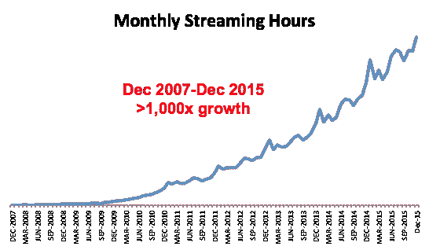

# 完成网飞云迁移-关于网飞

> 原文：<https://media.netflix.com/en/company-blog/completing-the-netflix-cloud-migration?utm_source=wanqu.co&utm_campaign=Wanqu+Daily&utm_medium=website>

我们在网飞的云之旅始于 2008 年 8 月，当时我们经历了一次严重的数据库损坏，有三天无法向我们的会员发送 DVD。那时我们意识到，我们必须摆脱垂直扩展的单点故障，如我们数据中心的关系数据库，转向云中高度可靠、水平可扩展的分布式系统。我们选择亚马逊网络服务(AWS)作为我们的云提供商，因为它为我们提供了最大的规模和最广泛的服务和功能。我们的大部分系统，包括所有面向客户的服务，在 2015 年之前已经迁移到了云。从那以后，我们一直在花时间为我们的计费基础设施以及我们客户和员工数据管理的各个方面寻找一种安全耐用的云途径。我们很高兴地宣布，在 2016 年 1 月初，经过七年的辛勤努力，我们终于完成了云迁移，并关闭了我们的流媒体服务使用的最后剩余的数据中心位！

转向云计算给网飞带来了许多好处。我们的流媒体会员数量是 2008 年的八倍，他们的参与度也更高，整体观看量在八年内增长了三个数量级:

网飞产品本身一直在快速发展，加入了许多新的资源密集型功能，并依赖于不断增长的数据量。如果没有我们自己的数据中心，支持如此快速的增长将会极其困难；我们根本无法以足够快的速度安装服务器。云的弹性允许我们在几分钟内添加数千个虚拟服务器和数 Pb 的存储，使这种扩展成为可能。2016 年 1 月 6 日，网飞将其服务扩展到 130 多个新国家，成为真正的全球互联网电视网络。利用遍布全球的多个 AWS 云区域，我们能够动态地转移和扩展我们的全球基础设施容量，为网飞会员创造更好、更愉快的流媒体体验，无论他们身在何处。

我们依赖云来满足我们所有的可扩展计算和存储需求——我们的业务逻辑、分布式数据库和大数据处理/分析、推荐、代码转换以及构成网飞应用程序的数百种其他功能。视频通过网飞开放连接传送，这是我们的内容传送网络，在全球分发，以有效地将我们的比特传送到成员的设备。

云还让我们显著提高了服务可用性。我们的数据中心出现了多次中断，尽管我们在云中遇到了一些不可避免的 [<u>粗糙补丁</u>](http://techblog.netflix.com/2012/12/a-closer-look-at-christmas-eve-outage.html) ，特别是在云迁移的早期，我们看到我们的整体可用性稳步增长，接近我们期望的服务正常运行时间 [<u>四个九</u>](https://en.wikipedia.org/wiki/High_availability#Percentage_calculation) 的目标。在任何大规模的分布式系统中，失败都是不可避免的，包括基于云的系统。然而，云允许人们从根本上不可靠但 [<u>冗余的</u>](http://techblog.netflix.com/2013/12/active-active-for-multi-regional.html) 组件中构建高度可靠的服务。通过在我们的架构中纳入冗余和适度降级的原则，并使用 [<u>猿猴部队</u>](http://techblog.netflix.com/2011/07/netflix-simian-army.html) 进行常规生产演习，有可能在云基础设施和我们自己的系统中经受住故障，而不会影响成员体验。

降低成本并不是我们决定转向云计算的主要原因。然而，我们的每流启动云成本最终只是数据中心成本的一小部分，这是一个受欢迎的附带好处。由于云的弹性，这是可能的，使我们能够不断优化实例类型组合，并几乎即时地增长和收缩我们的足迹，而无需维护大容量的缓冲区。我们还可以受益于规模经济，这只有在大型云生态系统中才有可能。

考虑到云的明显优势，为什么我们花了整整七年才完成迁移？事实是，迁移到云是一项艰巨的工作，在此过程中，我们不得不做出许多艰难的选择。可以说，迁移到云的最简单方法是将所有系统原封不动地从数据中心转移到 AWS 中。但是这样做的结果是，数据中心的所有问题和限制都会随之而来。相反，我们选择了云原生方法，重建了我们几乎所有的技术，并从根本上改变了我们运营公司的方式。在架构上，我们从一个单一的应用程序迁移到数百个微服务，并使用 NoSQL 数据库对我们的数据模型进行反规范化。预算审批、集中发布协调和数周硬件配置周期让位于持续交付，工程团队在松散耦合的 DevOps 环境中使用自助服务工具做出独立决策，有助于加速创新。必须建立许多新系统，学习新技能。将网飞转变为一家云原生公司需要时间和努力，但这让我们能够更好地继续发展，成为一家全球电视网络。

网飞流媒体技术在过去的几年里取得了长足的进步，终于不受我们之前面临的限制的约束，这感觉棒极了。由于云对我们许多业内人士来说还是相当陌生的，因此有许多问题需要回答和解决。通过诸如 [<u>、网飞开源</u>](https://netflix.github.io/) 等举措，我们希望继续与优秀的技术人才合作，共同应对所有这些挑战。

尤里·伊兹莱夫斯基、斯蒂芬·弗劳维奇和鲁斯兰·梅森堡