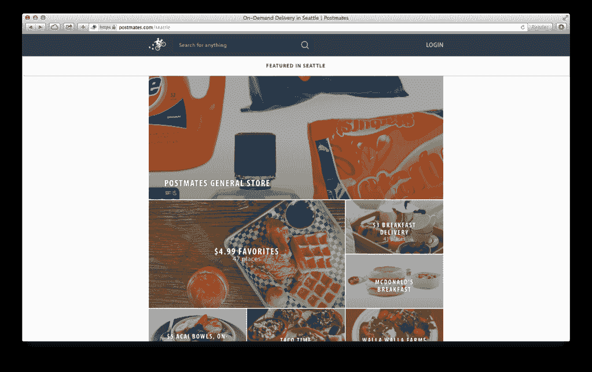
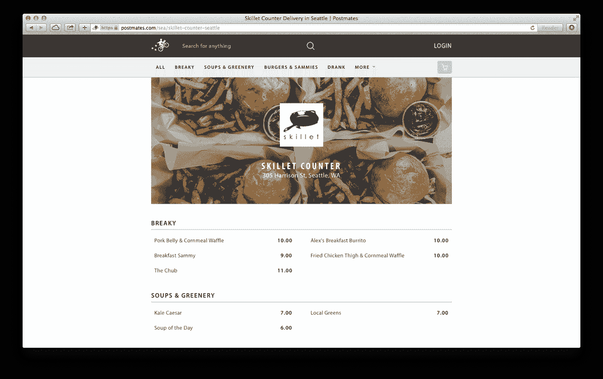
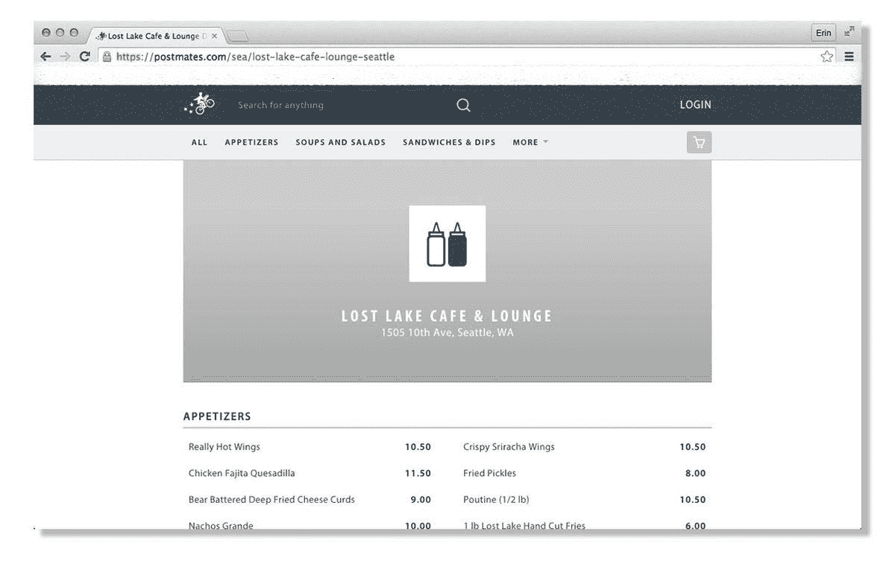

# Postmates 问题:为什么一些餐馆被迫对抗外卖应用程序

> 原文：<https://www.eater.com/2015/7/31/9074491/postmates-delivery-problems?utm_source=wanqu.co&utm_campaign=Wanqu+Daily&utm_medium=website>

在这个超级便利的 iPhone 时代，餐馆外卖正在复兴。 [Taco Bell](http://www.eater.com/2015/7/8/8911295/taco-bell-delivery-los-angeles-san-francisco-dallas) 、 [Dunkin' Donuts](http://www.eater.com/2015/6/8/8745523/dunkin-donuts-is-testing-home-delivery) 以及更多的公司都有了自己的司机，在每一个转弯处，似乎都有[另一种服务在街上漫游](http://www.eater.com/2015/3/18/8227077/food-delivery-apps-san-francisco-tech) : GrubHub、Seamless、Bite Squad、Eat 24。在这些食品快递公司中，总部位于旧金山的四年前的 post mates 因其众多账户中的 Starbucks 和 Chipotle 而赢得了媒体的特别关注，而就在上个月 T10 它又报告了 8000 万美元的融资，使其总估值达到近 5 亿美元。

Postmates 在送货服务中是独一无二的，因为在它运营的 70 多个美国城市中，它实际上可以将几乎任何东西(不仅仅是食物)从商店或餐馆送到客户的门口。2011 年，Postmates 的联合创始人兼首席执行官 Bastian Lehmann [告诉 CBNC](http://www.cnbc.com/2015/04/29/death-to-amazon-postmates-boost-to-small-business.html) 他受到了这个问题的启发，“如果你能把城市当成一个仓库会怎么样？”...这项任务的很大一部分是给城市里的零售商更好的武器来对抗亚马逊(全国范围内的货物运输)，因为你知道吗？他们一直被欺负。”

听起来像是一个高尚的开始，除了一个警告:邮局局长**不需要得到餐馆的许可**，他们会把食物送到餐馆。“底线是，我们不希望(在某些餐馆)有外卖，如果有，我们会自己做，”西雅图餐馆老板大卫·梅因尔特说，他是 Lost Lake Cafe、5 Point Cafe 和 Big Mario 的老板。“我们不喜欢 Postmates 代表我们业务的方式，也不相信他们的员工能正确处理我们的食物。”Postmates 没有征求许可，而是通过本地搜索和发现服务应用 Foursquare 将消费者与餐馆列表联系起来，接受订单，然后将他们叫到餐馆，并派快递员去取。可以理解的是，餐馆对这种安排持谨慎态度，西雅图和旧金山的一些餐馆开始直言不讳——包括对律师。

<picture class="c-picture" data-cid="site/picture_element-1668357590_1687_62456" data-cdata="{&quot;asset_id&quot;:3924506,&quot;ratio&quot;:&quot;*&quot;}"><source srcset="https://cdn.vox-cdn.com/thumbor/CTNGWmNFBS4cppqQwjuAW59k3Mk=/0x0:1023x644/320x0/filters:focal(0x0:1023x644):format(webp):no_upscale()/cdn.vox-cdn.com/uploads/chorus_asset/file/3924506/postmates-feature1.0.png 320w, https://cdn.vox-cdn.com/thumbor/-jYx-UwcwzzRH-NBD1EmjeR9IiM=/0x0:1023x644/520x0/filters:focal(0x0:1023x644):format(webp):no_upscale()/cdn.vox-cdn.com/uploads/chorus_asset/file/3924506/postmates-feature1.0.png 520w, https://cdn.vox-cdn.com/thumbor/fA7qvSiXqY3Yhoqqv8yaMz-13J8=/0x0:1023x644/720x0/filters:focal(0x0:1023x644):format(webp):no_upscale()/cdn.vox-cdn.com/uploads/chorus_asset/file/3924506/postmates-feature1.0.png 720w, https://cdn.vox-cdn.com/thumbor/adjxI_cDqqHbS0aagVBwdChhaY0=/0x0:1023x644/920x0/filters:focal(0x0:1023x644):format(webp):no_upscale()/cdn.vox-cdn.com/uploads/chorus_asset/file/3924506/postmates-feature1.0.png 920w, https://cdn.vox-cdn.com/thumbor/mhRVQiGTxxvTZ7lP3RjPkKQ5jMI=/0x0:1023x644/1120x0/filters:focal(0x0:1023x644):format(webp):no_upscale()/cdn.vox-cdn.com/uploads/chorus_asset/file/3924506/postmates-feature1.0.png 1120w, https://cdn.vox-cdn.com/thumbor/f5_O4BnfIFmhEr_1y7gIBwYt5Ic=/0x0:1023x644/1320x0/filters:focal(0x0:1023x644):format(webp):no_upscale()/cdn.vox-cdn.com/uploads/chorus_asset/file/3924506/postmates-feature1.0.png 1320w, https://cdn.vox-cdn.com/thumbor/dLQwz3SCTEcxv5ZsefaJgqVJI5M=/0x0:1023x644/1520x0/filters:focal(0x0:1023x644):format(webp):no_upscale()/cdn.vox-cdn.com/uploads/chorus_asset/file/3924506/postmates-feature1.0.png 1520w, https://cdn.vox-cdn.com/thumbor/yCyT6kBU6ZMVh4r2vR4f5KnjRoE=/0x0:1023x644/1720x0/filters:focal(0x0:1023x644):format(webp):no_upscale()/cdn.vox-cdn.com/uploads/chorus_asset/file/3924506/postmates-feature1.0.png 1720w, https://cdn.vox-cdn.com/thumbor/NFCvjbFFwP1WrZ91yHESbnbMRd0=/0x0:1023x644/1920x0/filters:focal(0x0:1023x644):format(webp):no_upscale()/cdn.vox-cdn.com/uploads/chorus_asset/file/3924506/postmates-feature1.0.png 1920w" sizes="(min-width: 1221px) 846px, (min-width: 880px) calc(100vw - 334px), 100vw" type="image/webp"></picture>

Postmates 在西雅图的“特色”餐馆页面。

Postmates 的工作方式是这样的:“每个商家都以匿名的身份在平台上开始他们的旅程，”Postmates 的业务发展总监 Anand Dass 说。“最初，这是一场顾客与邮局主管之间的对话，顾客希望从那家餐馆获得食物，而邮局主管有资源和时间代表顾客去取食物。”在 Foursquare 链接系统中，消费者可以搜索某个餐馆，也可以在系统中输入地址。根据 Dass 的说法，一旦一个地址进入系统，它就进入了。因此，一旦餐馆出现在应用程序上，Postmates 就无权删除它们——即使有，Dass 说，顾客也可以重新添加。

然后，Postmates 会询问在该应用上很受欢迎的餐厅是否愿意加入其商户计划。当一家餐馆加入该计划时，无论是在 Postmates 接洽或询问合作关系后，Postmates 都会与企业主合作，调整他们在应用程序上的存在，并在城市的“特色”登录页面下展示这些菜单。Postmates 帮助餐厅选择最适合旅行的菜单项，并帮助建立快递员收取和交付订单的方式。然后，Postmates 将合作伙伴的送货成本削减到 4.99 美元(否则从 7 美元到 20 美元不等)，并从销售额中抽取佣金(10%到 20%，取决于各种因素)。

如果没有合同，这些其他品牌不会与餐馆合作，Postmates 的很大一部分业务就是这样做的。

这种商业计划与 Eat 24、BiteSquad、GrubHub 及其所有品牌(包括无缝)的运作方式是一致的:他们首先与餐馆建立合作关系，讨论如何最有效地营销它们，然后从服务销售额中抽取佣金。不同之处在于，其他品牌不会在没有合同的情况下与餐厅合作，而 Postmates 的很大一部分业务就是通过这种方式完成的。

梅因尔特说他第一次注意到邮戳是在去年秋天，当时一位顾客抱怨从 Lost Lake 收到了一份“错误且冰冷”的送货订单。“我很担心，因为我们选择不在那里送货，因为随着时间的推移，我们的一些食品在集装箱里保存不好，”梅因尔特说。“我们还故意在忙的时候不点外卖。我们的业务围绕坐下来，全方位服务(餐饮)和酒吧，我们不希望厨房被外卖订单淹没。”

因此，Lost Lake 打电话给 Postmates，要求将其从应用程序中删除。是的，梅因尔特认为这个问题已经结束了。然而，今年 5 月，他收到了另一份关于送货订单的投诉，并意识到 Lost Lake 又回到了邮局。他再次打电话给该公司，但这次被告知(他强调说得很委婉)不可能取消这家餐厅的设计，因为它是与 Foursquare 相关联的设计。在西雅图，Niko 的 Gyros、Tango 和 Local 360 也对服务不满意，要求取消 Postmates，但没有成功。

<picture class="c-picture" data-cid="site/picture_element-1668357590_3274_62457" data-cdata="{&quot;asset_id&quot;:3924494,&quot;ratio&quot;:&quot;*&quot;}"><source srcset="https://cdn.vox-cdn.com/thumbor/ZA5pshpRMUUH-Zcs4Xy2ypofba8=/0x0:1524x959/320x0/filters:focal(0x0:1524x959):format(webp):no_upscale()/cdn.vox-cdn.com/uploads/chorus_asset/file/3924494/postmates-screen.0.png 320w, https://cdn.vox-cdn.com/thumbor/D2Iw0a4ZuOCFaJ8jT5XCxBysV2k=/0x0:1524x959/520x0/filters:focal(0x0:1524x959):format(webp):no_upscale()/cdn.vox-cdn.com/uploads/chorus_asset/file/3924494/postmates-screen.0.png 520w, https://cdn.vox-cdn.com/thumbor/DlHoB79F2u0cIKnUkBYGmv7MMTQ=/0x0:1524x959/720x0/filters:focal(0x0:1524x959):format(webp):no_upscale()/cdn.vox-cdn.com/uploads/chorus_asset/file/3924494/postmates-screen.0.png 720w, https://cdn.vox-cdn.com/thumbor/I4zFl2tPL9R6ZJj7XZiuvE8Y1cg=/0x0:1524x959/920x0/filters:focal(0x0:1524x959):format(webp):no_upscale()/cdn.vox-cdn.com/uploads/chorus_asset/file/3924494/postmates-screen.0.png 920w, https://cdn.vox-cdn.com/thumbor/ZNQXG0V4M6sfUH1rz4O1ieOKhs8=/0x0:1524x959/1120x0/filters:focal(0x0:1524x959):format(webp):no_upscale()/cdn.vox-cdn.com/uploads/chorus_asset/file/3924494/postmates-screen.0.png 1120w, https://cdn.vox-cdn.com/thumbor/KTbRI7MP4G94bOOAHfpyAIMa0DI=/0x0:1524x959/1320x0/filters:focal(0x0:1524x959):format(webp):no_upscale()/cdn.vox-cdn.com/uploads/chorus_asset/file/3924494/postmates-screen.0.png 1320w, https://cdn.vox-cdn.com/thumbor/wD7JnTUVkG82SaWf3S_edoE8usU=/0x0:1524x959/1520x0/filters:focal(0x0:1524x959):format(webp):no_upscale()/cdn.vox-cdn.com/uploads/chorus_asset/file/3924494/postmates-screen.0.png 1520w, https://cdn.vox-cdn.com/thumbor/AOmEs5k1KJ5H2NltOTI2YP44CTo=/0x0:1524x959/1720x0/filters:focal(0x0:1524x959):format(webp):no_upscale()/cdn.vox-cdn.com/uploads/chorus_asset/file/3924494/postmates-screen.0.png 1720w, https://cdn.vox-cdn.com/thumbor/9O917IDiI03Q225DYZPBdV-tWBo=/0x0:1524x959/1920x0/filters:focal(0x0:1524x959):format(webp):no_upscale()/cdn.vox-cdn.com/uploads/chorus_asset/file/3924494/postmates-screen.0.png 1920w" sizes="(min-width: 1221px) 846px, (min-width: 880px) calc(100vw - 334px), 100vw" type="image/webp"></picture>

特色餐厅的菜单。

对梅因尔特来说，不仅仅是邮局主管未经他的允许就投递邮件；而是他觉得他们**歪曲了他的品牌**。梅因尔特说[邮局为他所有餐馆张贴的菜单](https://go.redirectingat.com?id=66960X1516589&xs=1&url=https%3A%2F%2Fpostmates.com%2Fsea%2Flost-lake-cafe-lounge-seattle&referrer=eater.com&sref=https%3A%2F%2Fwww.eater.com%2F2015%2F7%2F31%2F9074491%2Fpostmates-delivery-problems)是不正确的，要么是价格错误，要么是餐馆不再提供的项目。当梅因尔特询问 Postmates 从哪里获得菜单时，商家支持代表告诉他“从公共来源”在线。

Dass 证实了这一点，并解释说 Postmates 会尽可能地从餐馆网站上下载菜单。当菜单出现问题时，他邀请所有商家致电 Postmates 的[商家支持热线](http://1.800.882.6106%20x4)，并表示该公司会尽快纠正问题。Dass 明确表示，该热线适用于其应用程序上的所有商家，无论他们是否是商家计划的合作伙伴。然而，“我们是一家初创公司，我们是一家小公司，我们正在尽可能快地发展，所以我们必须优先考虑我们的资源，”达斯说。“在运营上，我们开始优先考虑(合作伙伴)，而不是平台上的任何其他人。”(梅因尔特说，尽管他几乎两个月前就和邮局主管谈过，他的菜单仍然不正确。)

通过 Postmates 的商业计划，Chipotle 现在是一个合作伙伴，但这种关系并不总是那么友好。2011 年，Chipotle 向当时的新公司发送了一封停止信；Postmates 不予理会，继续运送连锁店的食物。“随着时间的推移，他们逐渐接受了这个想法——首先，有一家非常执着的初创企业，由一位非常固执、执着的德国创始人和一位同样固执的美国联合创始人经营，”莱曼[4 月份告诉 CBNC](http://www.cnbc.com/2015/04/29/death-to-amazon-postmates-boost-to-small-business.html)。“最重要的是，我们向他们展示了我们可以提供他们想要的质量。”

在加入 Postmates 的商业计划时，Chipotle 显然改变了态度(该公司没有就原因发表评论)，但**并不都渴望与**合作。在旧金山的 Delarosa，一名餐厅代表说，虽然他不反对餐厅外卖这一概念，但他希望有一种方法可以退出 Postmates 系统，因为餐厅是为店内用餐而设的。据该代表称，Delarosa 最近通过 Postmates 收到的外卖订单数量大幅增加，可能会挤满门口，使等待时间看起来比实际时间长，并给餐厅的主人带来额外的压力。

西雅图探戈餐厅的德拉罗萨和特拉维斯·罗森塔尔面临的另一个挑战是，当外卖订单通过邮局打电话进来时，餐厅**失去了在需要的地方指导客人**的机会，例如指出某个披萨上没有奶酪，并解释每份的大小和服务风格(例如，旨在共享家庭风格的项目)。

罗森塔尔说:“我个人在电话上接受了 Postmates 的外卖订单。“订购的人...对于牛排的温度问题，我感到很惊讶，于是我点了半熟的。我告诉他，我不会履行订单，因为我们之前已经告诉[Postmates]让我们离开他们的网站。他说那不是他的部门，但他会告诉他的上级。然后我挂了电话。30 分钟后，街上来了一个人，也点了同样的外卖...无论如何，无论是谁下的订单，在他们点了一个多小时后才收到他们的食物，可能收到的产品数量与他们预期的不同，而且牛排的烹饪温度可能不对。”当收到的订单确实是错的、冷的、湿的或有其他问题时，客人的投诉通常会打电话到餐厅或在 Yelp 或其他在线网站上登记。

<picture class="c-picture" data-cid="site/picture_element-1668357590_7284_62458" data-cdata="{&quot;asset_id&quot;:3924524,&quot;ratio&quot;:&quot;*&quot;}"><source srcset="https://cdn.vox-cdn.com/thumbor/o5AA_IUjD9g3CCmChSQq8jIR5Is=/0x0:1200x768/320x0/filters:focal(0x0:1200x768):format(webp):no_upscale()/cdn.vox-cdn.com/uploads/chorus_asset/file/3924524/postmates-3.0-erase.0.jpg 320w, https://cdn.vox-cdn.com/thumbor/F6FxOAmtLvCFa7dgNIoW1MhE_ak=/0x0:1200x768/520x0/filters:focal(0x0:1200x768):format(webp):no_upscale()/cdn.vox-cdn.com/uploads/chorus_asset/file/3924524/postmates-3.0-erase.0.jpg 520w, https://cdn.vox-cdn.com/thumbor/M3MX1mnsTSue6Nj55fTQ_PnjzSI=/0x0:1200x768/720x0/filters:focal(0x0:1200x768):format(webp):no_upscale()/cdn.vox-cdn.com/uploads/chorus_asset/file/3924524/postmates-3.0-erase.0.jpg 720w, https://cdn.vox-cdn.com/thumbor/_NSiHBgnorW0EPOyCActeST39cY=/0x0:1200x768/920x0/filters:focal(0x0:1200x768):format(webp):no_upscale()/cdn.vox-cdn.com/uploads/chorus_asset/file/3924524/postmates-3.0-erase.0.jpg 920w, https://cdn.vox-cdn.com/thumbor/I2aBCCfE1lXA8k62aX8hRyUGtME=/0x0:1200x768/1120x0/filters:focal(0x0:1200x768):format(webp):no_upscale()/cdn.vox-cdn.com/uploads/chorus_asset/file/3924524/postmates-3.0-erase.0.jpg 1120w, https://cdn.vox-cdn.com/thumbor/jTj3hbwtKGhkEPNEChQ5szrM8Mc=/0x0:1200x768/1320x0/filters:focal(0x0:1200x768):format(webp):no_upscale()/cdn.vox-cdn.com/uploads/chorus_asset/file/3924524/postmates-3.0-erase.0.jpg 1320w, https://cdn.vox-cdn.com/thumbor/lxHd7NmTOvCYD7XUYFC9QB1bX4Q=/0x0:1200x768/1520x0/filters:focal(0x0:1200x768):format(webp):no_upscale()/cdn.vox-cdn.com/uploads/chorus_asset/file/3924524/postmates-3.0-erase.0.jpg 1520w, https://cdn.vox-cdn.com/thumbor/00Up3atujKx_OSDFuB1ClSWLVzU=/0x0:1200x768/1720x0/filters:focal(0x0:1200x768):format(webp):no_upscale()/cdn.vox-cdn.com/uploads/chorus_asset/file/3924524/postmates-3.0-erase.0.jpg 1720w, https://cdn.vox-cdn.com/thumbor/1ynzdKh3TeGKGveWwGOv9aV9wUM=/0x0:1200x768/1920x0/filters:focal(0x0:1200x768):format(webp):no_upscale()/cdn.vox-cdn.com/uploads/chorus_asset/file/3924524/postmates-3.0-erase.0.jpg 1920w" sizes="(min-width: 1221px) 846px, (min-width: 880px) calc(100vw - 334px), 100vw" type="image/webp"></picture>

失落湖的菜单，梅因尔特说是不准确的。

最后一个问题，尤其是西雅图的餐馆老板，是 Postmates 的送货司机队伍。在梅因尔特的大马里奥披萨店，餐厅雇佣自己的司机，并给餐厅的后勤人员小费。显然，邮局的司机会保留所有东西。“员工讨厌他们，”梅因尔特说。此外，当华盛顿的餐馆雇佣送货司机时，他们被要求携带食品处理员许可证(这在加州是违法的)。 邮局和事实证明，大多数快递公司， **不要求其司机携带许可证** ，尽管司机不允许打开食物。然而，GrubHub、Seamless 和 BiteSquad 在开始送货之前都与餐厅建立了合作关系，并声称他们的送货司机都理解这项政策。

“邮件使我们失去了质量控制，并潜在地危及我们的客户。”

“有人食物中毒怎么办？”梅因尔特问道。“谁负责？Postmates 剥夺了我们的质量控制，并可能危及我们的客户。”(梅因尔特在 Lost Lake 的总经理有一天通过 Postmates 订购来测试这个系统。他声称食物是和一只狗一起送到后座的。)Postmates 在其网站上的条款规定，如果交付的食品有问题，它不承担责任。根据 FDA 健康沟通专家大卫·斯蒂格曼的说法，“Postmates 不是食品法典中定义的食品机构，所以**它不在 FDA 的管辖范围内**。”

虽然 Dass 说他不管理 Postmates 的这方面业务，但他并不知道有顾客生病。他说，如果真的发生了什么事，Postmates 会逐案处理，并“尽一切可能让顾客满意。”

那么，所有这一切让那些想摆脱邮局的餐馆老板们怎么办呢？梅因尔特说，邮政快递员过去打电话时会表明自己的身份，但一旦他开始拒绝他们的订单，他们现在通常不会提到邮政。梅因尔特通过该公司使用的一种普通信用卡来识别他们，当他们在提货时出示信用卡时，拒绝向代表出售订单。这仍然是他的策略，但这对他的餐厅(员工在食物准备上投入时间和金钱)和从未得到食物的顾客来说都是双输。如果打电话的人确实提到了 Postmates，梅因尔特的员工会接受订单，但不会将其输入他们的系统，当司机出现时，他们会告诉他们不会与他们做生意。

梅因尔特的最新举措是聘请律师 Kari Milone，他担心“Postmates 非法使用[梅因尔特]联邦保护的商标和版权材料，造成了我们公司和他们公司之间赞助、认可和从属关系的虚假感觉，”Milone 说我们打算**利用一切法律补救措施**幸运的是，联邦商标和版权法提供了法定补救措施。"

在脸书上看到的 Postmates 对商业伙伴的促销。照片:脸书

梅因尔特也给政客们写信，敦促他们为 T2 的全州标准立法，禁止第三方未经餐馆同意转售餐馆的食物。他已经与华盛顿餐馆协会取得联系，寻求支持。他们无法对本文发表评论，但在 4 月份，当 Niko 的 Gyros 首次得知 Postmates 非法运送食物时，WRA 首席执行官 Anthony Anton [告诉 Geekwire](http://www.geekwire.com/2015/seattle-restaurant-challenges-postmates-over-unauthorized-delivery-service/) 这种情况类似于“身份盗窃”“一家餐厅的声誉对他们的成功至关重要，”他说。“当他们与一家公司合作时，他们有选择的权利，尤其是当他们利用你的品牌为自己谋利时。”

“我们是代表顾客的接送服务；我们不是代表餐厅的送餐服务。”

值得称赞的是，该公司清楚自己的主要兴趣不在餐馆。“我们是代表客户的**接送服务；我们不是代表餐厅的送货服务。“这有很大的区别，”达斯说。尽管如此，他证实邮局的司机们都受过训练，当他们打电话时会表明自己的身份。**

毫无疑问，送货上门将会继续存在，但问题是，餐馆是否应该选择通过邮局送货上门？波斯特马斯不这么认为。“如果他们不想做外卖，他们应该通过他们的互联网存在(以及店内)传达这一信息，那么顾客就不会去搜索它，”达斯说。不出所料，他觉得更好的选择是“与邮局主管这样的服务合作来策划菜单”,提供准备迅速、交付良好的项目。

Postmates 在过去四年的快速成功令人印象深刻，当然也有商人很高兴与该公司合作。但对于那些说不的人来说，没有选择退出的途径似乎很难看。“我以前的菜单和餐馆仍然列在邮戳上，”罗森塔尔说。"我**不确定此时还能做什么**"