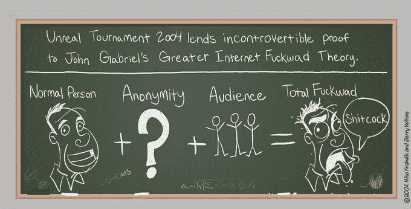

# 更大的互联网 Fuckwad 理论|知道你的热图

> 原文：<http://knowyourmeme.com/memes/greater-internet-fuckwad-theory?utm_source=wanqu.co&utm_campaign=Wanqu+Daily&utm_medium=website>

## 关于

更大的网络混蛋理论是一个假设，声称正常的、适应良好的人在匿名和被控制的网络观众面前可能会表现出心理变态或反社会的行为。

## 起源

2004 年 3 月 19 日，[网络漫画](/memes/cultures/webcomics)网站 [Penny Arcade](/memes/subcultures/penny-arcade) 发布了一幅名为“绿色黑板(和其他异常现象)”的漫画，其中描绘了一幅绿色黑板，等式为“正常人+匿名+观众=总 Fuckwad”，参考了 2004 年第一人称射击游戏*虚幻锦标赛*中看到的行为。

#### 先驱

在匿名使用公民波段无线电中也观察到了类似的行为模式，这是一种短距离无线电通信设备，被卡车司机广泛用于寻找库存充足的加油站和共享交通信息。1978 年 2 月 20 日,《纽约客》杂志的一篇访谈节目主持人约翰尼·卡森的简介文章提到，由于缺乏责任感，CB 电台的谈话可能包括令人不安的大量种族主义和手淫幻想。

## 传播

几个月后，也就是 2004 年 6 月，心理学家约翰·苏勒尔发表了一篇名为“在线去抑制效应”的文章，文章提出，面对面交流中的社会限制在互联网上交流时会变得宽松。在文章中，苏勒尔将“良性去抑制”描述为秘密情绪、恐惧和愿望的表达，而“毒性去抑制”则是由于明白自己的行为不会导致任何有意义的后果而产生的恶意行为。

2004 年 10 月 6 日，用户 v1cious 提交了第一个[城市字典](/memes/sites/urban-dictionary)对“更大的互联网 Fuckwad 理论”的定义，其中包括了最初的 Penny Arcade 漫画中的等式。2005 年 12 月 6 日，Ars Technica 论坛成员 Me@Home 发布了一个主题为“找到这个 Penny Arcade 漫画！”，它要求其他论坛成员帮助识别原始的礼物漫画。2006 年 6 月 3 日， [Redditor](/memes/sites/reddit) DavidSJ 将漫画提交到/r/reddit.com subreddit，在存档前收到了 160 多张投票。12 月 27 日，网络漫画 [Xkcd](/memes/subcultures/xkcd) 在 [YouTube](/memes/sites/youtube) 评论中发表了一篇名为《YouTube》的漫画，作为缺乏智能或民间对话的评论(如下图)。12 月 30 日，演员[威尔·惠顿](/memes/wheatons-law)发表了一篇关于 [xkcd](/memes/sites/xkcd) 漫画的博文，并指出其与《便士街机》漫画的相似之处。

2007 年 7 月 29 日，Xkcd 论坛成员 william 认为, [4chan](/memes/sites/4chan) 的[图像板](/memes/subcultures/imageboard)社区证明了匿名会导致在线交流中的不良行为。

[![A man is least himself 1S when he talks in his aeLogion. We do not forge Wo are Logion. We do not forget. We do not ymous. We are Legon. We do not forget. We do Wo are Logion We do not forget We do not forgive. E own person e are Loglon. We do not forget We do not forgive. Expect us We are A are Leglon. We do not forget We do not forgive. Expect us.We are A ion. We do not forget. Wo do not forgive, Expect us We are Anonymous. We We are ot forget. We do not forglve. Expect uaWe are Anonymous. We are Le forglve. Expect us We are pect nonymous We not forgive. Expect us.Wo are Anonymous, We are Legion. We do an t us.We are A We do not forget We d We do not o We do net forger We do not forget. We do hot fr no1%, yet, we do not forgive E We xpect us.Vw gion. Wo o not fomet We do not forgive Give him a mask and he will pect us.We are agion We do not forget We et Wo don ot forgive. Expect us.We are Anonymous. We are Legio Angnymous. We are Lg Wa do not aet forgive. Expoct usWe are Anonymous. We are Leglon, We do notf not forgive. Expect us.Wo are Anonymous. We are Legion. We do not for not forgive. Expect us Wo aroA Expect us.We are Wo are Legion. We do not forget. We do not We are Loglon, We do not forget We do not forgive. E We do not forget. We do not forgive, Expect s We are Leglon. We do not forget We do not We are Legion. we do not forget. We do not forgve. Expeet us We a ive. Expect us We ar t us.We YELL AT BLACK PEOPLE -m a ON THE INTERNET We do not for do not forget n re Legion. We ed ove. Expect us We are Anonymous We do xpect us We s We are Anon We are Hot text font](img/99cf40b29c264ebf05412f534e91f510.png "Give him a mask and he will yell at black people on the internet")](/photos/558445)

2008 年 4 月 2 日，[游戏](/memes/cultures/gaming)博客 Gamasutra 发表了一篇题为“修正网络游戏白痴:一种心理学方法”的文章，其中游戏设计师比尔·富尔顿在概述他在[微软](/memes/subcultures/microsoft)2007 年游戏 *Shadowrun* 中与[悲伤者](/memes/griefing)的经历时提到了这一理论。2009 年 10 月 31 日，互联网幽默网站 [Cracked](/memes/sites/cracked) 发表了一篇名为《厌女症》的帖子，将礼物列为为什么网上出现厌女症的一个原因。2010 年 8 月 8 日，一个关于“礼物”的[电视比喻](/memes/sites/tv-tropes)页面被创建，将该理论列为“隐形混蛋”比喻的一个例子。2011 年 3 月 9 日，新闻网站 Slate 发表了一篇题为“巨魔，展示你自己”的文章，该文章反对使用匿名评论系统。

 

#### 惠顿定律

[**惠顿法则**](/memes/wheatons-law) 是一条互联网公理，它说的是“不要做一个混蛋”这个公理是由美国演员兼作家理查德·威廉·惠顿三世(  *[《星际迷航》](/memes/subcultures/star-trek) : TNG* )在 2007 年 8 月 Penny Arcade Expo (PAX)的主题演讲中提出的。惠顿演讲的核心信息之一是体育精神在网络游戏中的重要性，这最终被浓缩成一句话“不要做个混蛋”

## 搜索兴趣

## 外部参考

