# 丹·格罗弗|更多中国移动用户界面趋势

> 原文：<http://dangrover.com/blog/2016/01/31/more-chinese-mobile-ui-trends.html?utm_source=wanqu.co&utm_campaign=Wanqu+Daily&utm_medium=website>

T2】

**TRANSLATIONS:** [中文 (36 氪)](http://36kr.com/p/5043571.html)

|

[中文 (虎嗅)](http://www.huxiu.com/article/144180/1.html)

2014 年底，[我写了我在中国应用程序 UI 设计中注意到的趋势](http://dangrover.com/blog/2014/12/01/chinese-mobile-app-ui-trends.html)。这是一个令人惊讶的成功，在接下来的一周内收到了数十万的独特浏览量，[多个](http://www.ui.cn/detail/33849.html) [翻译](http://dangrover.com/blog/2014/12/01/chinese-mobile-app-ui-trends.html)成中文以及[俄文](https://vc.ru/p/china-ux)和[韩文](https://ringsterz.wordpress.com/2014/12/09/chinese-mobile-app-ui-trends/)。

我不知道为什么会触动你的神经。对于我在旧金山的伙伴们来说，他们认为我是疯了才会到这里来，也许有趣的是，看到中国的软件制造商远不仅仅是被迫向生活在防火墙后的不知情的公众兜售苍白无味的仿冒品。相反，这是一个充满活力、欣欣向荣的景象，充满了才华横溢的人，他们的工作反映了一系列不同的想法、优先事项和感受。

对其他人来说，也许另一个角度是试图使用一个社会的软件作为了解其价值观和文化的窗口——很少有其他国家的国内软件产量足以实现这一点。

至于中国博客圈里翻译、转发和分析它的人数之多，我想其吸引力在于，以前从未有外人真正把这里的应用程序设计看得如此与众不同。

今年是 2016 年，猴年，是时候开始新的一期了。在这里，我将从我写上一篇文章时没有注意到的一些关于应用程序设计的花絮开始，然后转移到自那以后移动世界的一些新发展。

#### 我以前没有注意到的事情

##### 用户排名

长期以来，这是我年轻时 PhpBB 风格论坛的一个特色，但一旦“社交网络”在中期适当起飞，它就被迅速取消了，用户排名在中国应用程序中非常常见。在社交应用中，它们是等级( <cite>děngjí</cite> ，grade)而在电子商务应用中，它们是积分积分( <cite>jīfēn</cite> ，分)。它们被标注在一个人的个人资料名称旁边，作为一系列徽章，或者作为一个人头像的特殊边框。通常，在高级应用程序中注册“VIP”会员会在你的名字旁边添加一个特殊的图标。

T4】

我听说 QQ 是第一个这样做的，他们的排名系统是基于连接时间。人们曾经让他们的台式电脑运行以增加时间，直到增加了每日上限。

我不怎么用 QQ，但我的个人资料上的勋章比一件北约将军的制服还多。微博说我是 9 级；也许到了 10 岁，我终于可以施展“魔法导弹”了

##### “子弹幕”

起源于日本的许多中国视频网站和应用程序都有一个按钮，以字幕风格在视频上混乱地滚动显示用户的评论。这叫做弹幕( <cite>dàn mù</cite> )。

[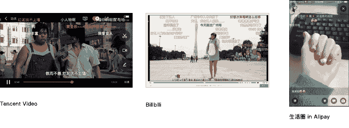](/img/content/chineseapps-2/BulletCurtain@2x.png) 

##### 有些图标我只在这里见过

我之前提到过，很多应用程序都提供主题选项。我当时没有注意到，大多数人都选择了同一个奇怪的图标来代表这个:一件 t 恤。我想这是有意义的，它就像你的用户界面的新的时髦的线程。一些人反对这种趋势，转而使用画笔图标。

[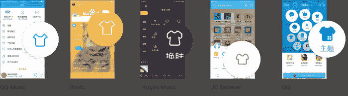](/img/content/chineseapps-2/ThemeTshirts@2x.png)T4】

另一个搞笑的是“快乐购物袋”，用于购物功能。许多应用程序都有某种形式的商店——无论是出售装备的慢跑应用程序，出售耳机的音乐应用程序，向你出售 JD.com 精选产品的微信和 QQ，还是试图向你出售更多小米产品的小米产品。

[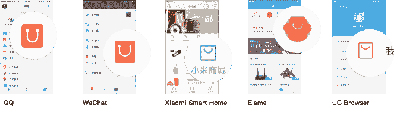](/img/content/chineseapps-2/GrinningBags@2x.png) 

##### 键盘和返回按钮

iOS SDK 允许开发者选择键盘右下角的按钮做什么。是插入换行符的灰色“返回”按钮，还是带有类似“搜索”、“转到”或“发送”等操作的亮蓝色按钮？

不用看，如果你在设计一个消息应用，你会选择哪个？允许用户为列表和多段字母插入换行符很重要吗(在这种情况下，您需要在 UI 中键盘之外的某个地方添加一个自定义的“发送”按钮)，或者您只是在键盘上弹出一个蓝色的发送按钮？后者似乎明显获胜。在你的*手机*上输入短信时，你*真的*需要换行吗？而且用户在有意发送消息的时候不会不小心加了一个换行符吗？

不要！不对！事实证明，当你把它作为发送按钮时，很容易在输入空格时不小心按到它，然后发送一条不完整的消息或一条自动补全单词不正确的消息。事实上，如此简单，以至于 iOS 系统消息应用程序和所有西方生产的聊天应用程序都一致选择在键盘外定制一个“发送”按钮。

这里的用户没有这个问题，因为在输入中文时不太使用空格键，即使在句子之间也是如此(中文标点符号更突出，并且有内置空格)。此外，您的手指经常伸到键盘上方来访问拼音结果，他们有更好的东西来使用屏幕空间。因此，在这里，在每个聊天应用程序中，选择仍然是明确的——只要把它放在键盘上！

[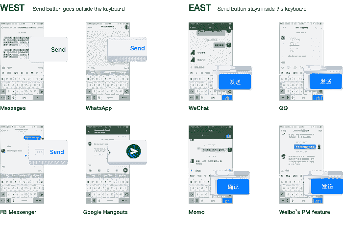](/img/content/chineseapps-2/KeyboardButtons@2x.png) 

##### 第三方浏览器

许多人选择不在智能手机上使用股票浏览器，而是选择第三方浏览器，如[UC 浏览器](http://www.ucweb.com/ucbrowser/)、 [QQ 浏览器](http://browser.qq.com/)或奇虎 [360 浏览器](http://mse.360.cn/)。事实上，[根据 QuestMobile](http://www.pcpop.com/doc/pic/003783175.html) 的数据，QQ 浏览器是 Android 上第五大最受欢迎的应用，而 iOS 用户更喜欢 UC，它是那里第十二大最受欢迎的应用。

这些浏览器比系统浏览器拥有更多的功能。它们具有节省带宽和加速功能，广告拦截，主题化，“夜间模式”，扫描/创建二维码，下载页面和视频供离线使用，当然还有与中文搜索，新闻和社交媒体网站的紧密集成。许多浏览器也为电子书提供了不错的用户界面，可以离线使用。

虽然百度自己的浏览器从未起飞，但其广泛安装的主应用程序(主要是一种快速进入搜索引擎和门户的方法)作为第三方浏览器保持了自己的地位，并在浏览网页时包括许多上述功能，更不用说他们许多其他产品的迷你版本(外卖订购、云文件存储、新闻、钱包)。当人们的冲动是导航到一个已知的网站时，他们通常会选择百度而不是系统浏览器。

[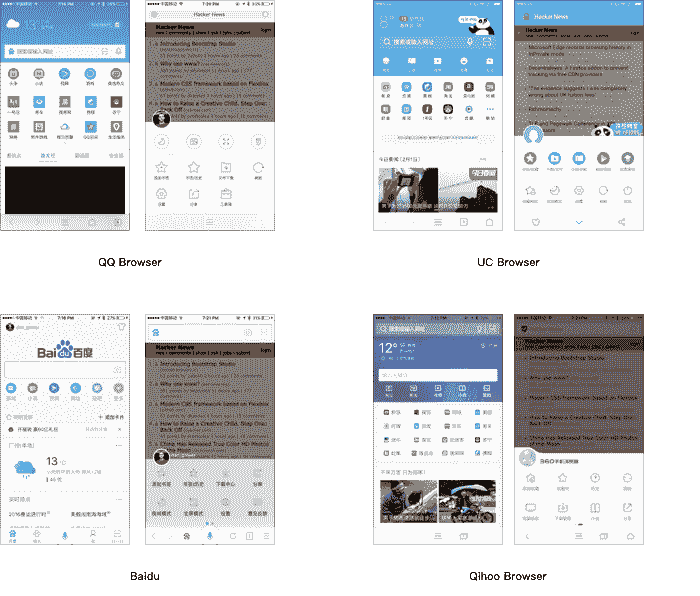](/img/content/chineseapps-2/Browsers@2x.png) 

#### 2015 年发生的事情

##### 数据使用计数+ WIFI 认证变得更加简单

这里的人们意识到使用他们的移动数据计划。事实上，[根据这份报告](http://mobile.163.com/15/0713/15/AUDO7QCU0011179O.html)，这里的月平均数据计划使用量为 210MB(相比之下，美国为 1GB。)

由腾讯和[百度](http://shouji.baidu.com/appsearch?from=as)提供的流行的“电话管理器”实用程序[包括监控和记录你的数据使用的功能(流量，<cite>。许多普通应用程序也提供聪明的方法来降低数据占用量，无论是新闻应用程序和浏览器中的“无图片模式”，特殊的数据计划，还是采用特殊的压缩。</cite>](http://m.qq.com/?ADTAG=media.innerenter.gj.top)

[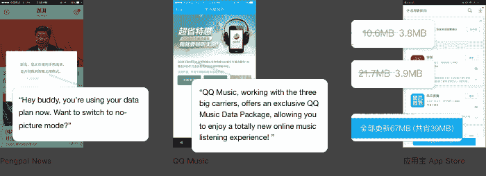](/img/content/chineseapps-2/DataUsage@2x.png)T4】

我之前也提到过，大多数媒体应用程序都允许下载内容进行离线观看。因此，如果我想在下一趟回家的航班上狂看《纸牌屋》，我可以用爱奇艺，但不能用网飞。

因为人们不想浪费数据，当 WiFi 可用时，他们会迅速切换到它。所有的餐馆(除了最低端的)都向顾客提供免费 wifi。

因此，有[流行的应用](http://www.wifi.com/)可以解锁不同的热点网络，或者共享密码保护的热点的密码。他们甚至帮你猜(提示:一般是 88888888)。小米明智地把中国用户对 WiFi 的依赖变成了卖点。他们的操作系统的 WiFi 连接用户界面包括徽章，告诉你哪些热点是已知的好热点，免费热点，以及通过二维码与朋友分享密码保护网络的凭证。他们甚至与一些热点达成协议，为拥有他们硬件的人提供免费 WiFi。

[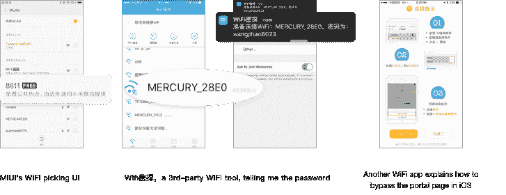](/img/content/chineseapps-2/WifiApps@2x.png)T4】

商场和咖啡店等公共场所的开放热点会向用户呈现一个强制门户页面——您知道，当您访问的第一个页面被重定向到其他站点时。在中国，这些网关页面几乎总是要求输入你的电话号码，解决一个验证码，最后输入他们通过短信发给你的验证码。这是因为法律要求用户向所有应用程序、ISP 和热点提供某种“真实身份”。因此，一个经过验证的手机号码(现在[需要交出一个人的国民身份证](http://yn.yunnan.cn/html/2015-08/31/content_3889029.htm)才能得到)是最方便的方法。我想是这样的，如果史塔西来到你的星巴克，他们可以看到谁在访问哪些猫的视频。对于热点提供商来说，这也让他们能够控制人们随意占用他们的带宽。

这些页面已经够不方便了，但是当与 iOS 上的默认行为结合起来时，就特别令人恼火。当通过强制网络门户连接到热点时，iOS 会自动显示一个带有迷你浏览器的页面，允许您完成访问所需的任何操作。切换到“信息”应用程序查看他们发送给你的验证码会取消表单，断开连接并要求你返回设置，重新连接，最后输入代码。最后，在验证之后，表单的“Done”按钮只能通过一个导航事件来启用，Javascript 驱动的门户页面无法触发该事件。中国数以亿计的 iPhone 用户每天都在忍受这种情况，他们只想要他们那该死的 WiFi。

今年，一个更好的解决方案被发明出来并被广泛采用。现在微信为热点的强制门户页面提供了一个[认证 API](https://wifi.weixin.qq.com/)([支付宝也有一个](https://wifi.alipay.com/wifi/index.htm))。在餐馆，顾客甚至可以通过扫描二维码完全绕过门户网站页面，使他们的手机自动连接和认证。

作为一个典型的使用案例，下面是我附近一家韩国烧烤店所有桌子上贴的贴纸:

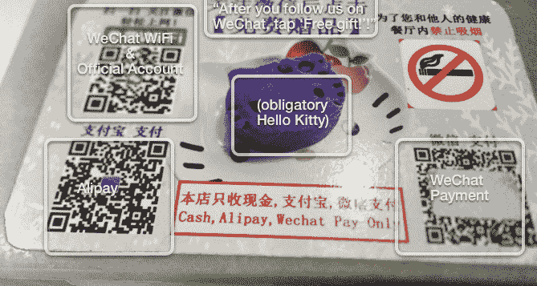

采用这种身份验证方法(而不是普通的带密码的路由器)让商家有机会推广他们的官方帐户，这是一种更丰富、流量更大、垃圾信息更少的方式，可以向用户提供折扣和新闻。这也具有在代码的扫描距离内限制顾客物理接触的优点。

大多数像这样设置的热点都只有微信，尽管麦当劳让你选择微信、支付宝或老式的短信方式。

[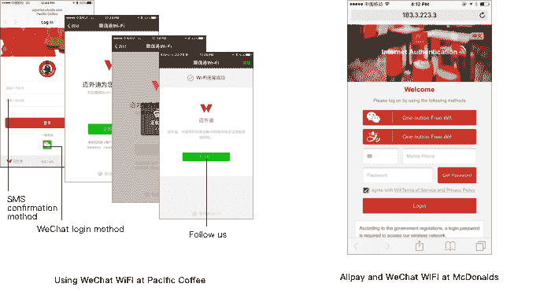](/img/content/chineseapps-2/WeChatWifiProcess@2x.png) 

##### 验证码带来的乐趣

这里很多东西都是用验证码保护的，通常是普通的乱码，但有时它们是不同的。偶尔会要求您输入汉字或笔画。

官方火车票预订网站 12306.cn(就当它是火车的 Healthcare.gov)上的一个照片验证码[以其荒谬的基于照片的挑战难倒了许多用户](http://business.sohu.com/20151207/n430131139.shtml)，并成为 Photoshop memes 的主题。

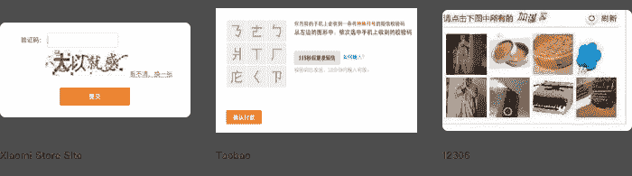
T3】

##### 外卖大战

餐馆搜索应用的鼻祖是大众点评网，占据了类似 Yelp 的位置。然而，似乎每个应用程序，无论其表面目的如何，都添加了某种“附近的商家”功能:QQ、百度地图、陌陌、支付宝，甚至滴滴打车。有些人对这个功能有自己的看法，有些人贴着其他应用的标签。无论哪种方式，他们都决定以完全相同的方式展示他们的类别，即两排彩色的圆形圆盘，上面有图标。

[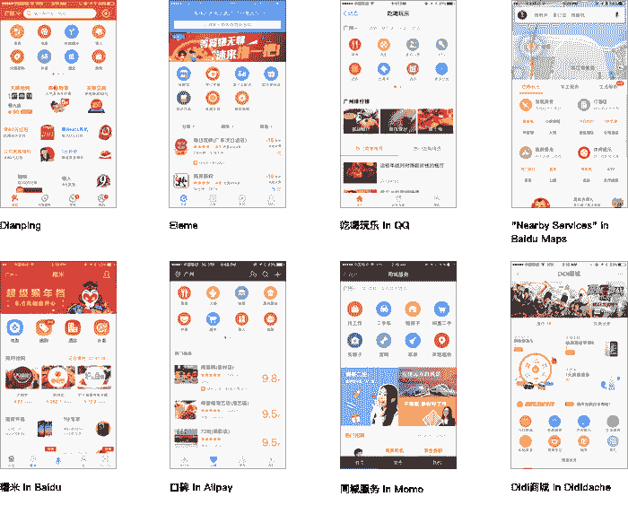](/img/content/chineseapps-2/TakeoutWars@2x.png) 

给用户一个快速找到附近 grub 的方法后的下一步是什么？让点外卖变得简单！

除了饿了么、美团和大众点评，阿里巴巴和百度也在大力推广自己的外卖订单。当我走在街上时，我不断收到通过不同应用程序订购外卖的优惠券。一些餐厅已经将菜单输入到应用程序的原生用户界面，而必胜客似乎可以通过 webview 使用自己的用户界面在每个点餐应用程序中工作。

我最喜欢百度，因为它有一个傻傻的“状态”视图，显示你订单的更新。我经常用它从我最喜欢的<cite>马拉郭襄</cite>火锅店点餐，或者从当地的山寨肯德基点餐(与真正的肯德基不同，这里仍然有墨西哥鸡肉卷)。

我的同事喜欢使用一种叫做[的服务连咖啡](http://www.lyancoffee.com/)，可通过微信获得，它会派一个人去最近的星巴克为你买咖啡。当我去星巴克的时候，我经常被排在那个人后面，他在手机屏幕上一口气点了 30 份咖啡，然后刷他的会员卡来获得积分。

如果点餐还不够，这些应用程序还提供其他各种服务。只需轻轻一按，你就可以召唤[一名女仆](http://www.ayibang.com)、[一名厨师](http://www.chushi007.com/)，或者[为你的冷藏箱](https://itunes.apple.com/us/app/song-shui-gong-waterboy/id1020894738?mt=8)准备大瓶水。当我看到有人批评硅谷的初创公司缺乏解决受庇护的 20 多岁年轻人的问题的雄心时，我笑了，因为中国在这方面完全胜过我们。

##### 支付宝无耻克隆微信

在这里，当你用手机支付时(在网站上或在现实生活中)，你可以选择两个主要的竞争“钱包”:支付宝或微信的钱包功能。

严格围绕金融和商业功能构建的支付宝，往往似乎是最直接的联系方式，如果你在便利店买东西或付钱给为你做石膏板的人。但当涉及到“社交”交易时，如偿还朋友的东西和在节假日发送现金的节日红包，微信是明确的选择。既然已经有了，为什么还要用别的？

今年，这两款应用都试图弥合各自用例之间的鸿沟，以提高其在线支付的份额。微信增加了一种快捷的方式，可以通过正面屏幕上的二维码发送和接收资金，而不必首先将对方添加为朋友(或在便利店场景中输入钱包)。

支付宝尝试了一些更有雄心的举措。他们复制了许多微信的聊天功能，把它们贴在一个新的突出的“朋友”标签上。这并不是说他们决定从微信中获得灵感，让他们的产品更加社会化——他们实际上是复制了它。这种相似是不可思议的，大多数屏幕都是一模一样的。结果是一个令人挠头的尝试，让人们使用数字钱包应用程序与朋友聊天，以免他们使用聊天应用程序进行在线支付。

有趣的是，在这种大规模复制中，他们加入了对微信新闻源的独特理解，这里称为“生活圈"( <cite>shēnghuó quān</cite> ，生活……圈子？).除了朋友的帖子，你还可以观看周围人不间断的全屏视频片段，这种感觉奇怪地引人注目。我第一次打开它，看到我周围所有其他公司办公室的内部以及那里的人们正在做什么，这很有趣。从那以后，兴趣消退了，再也没有人在上面贴出任何东西。

##### 每个人都开始销售金融产品

腾讯一直在为其金融产品市场的重新推出投放大量广告，理财通(<cite>lǐcáI tūng</cite>)。它在微信钱包屏幕的第一排图标上，甚至在电影票和出租车上面。

一个周末，我就是逃不掉。在我观看每一个在线视频之前，以及在我乘坐的每辆出租车后座的屏幕上，我都会看到它的广告。为了不让人误解，在周末的广告大战之后，周一，这些女孩站在我的办公室前，非常乐意地向我们展示如何使用以下功能买入一只基金:

T2】

事实上，许多应用程序通过其钱包功能提供一键购买金融产品，支付宝和几乎任何银行的官方应用程序也是如此。就连小米都出货一款“小米金融“每个设备上都有应用。只需在许多应用程序的主屏幕上轻点几下，就可以投资一只看似收益率高达 4%(不久前还高达 8%)的基金。我到处都能看到这些产品的广告，它们总是华而不实、卡通化，而不是像在《华尔街日报》上做广告的基金那样试图显得乏味和值得信赖。

[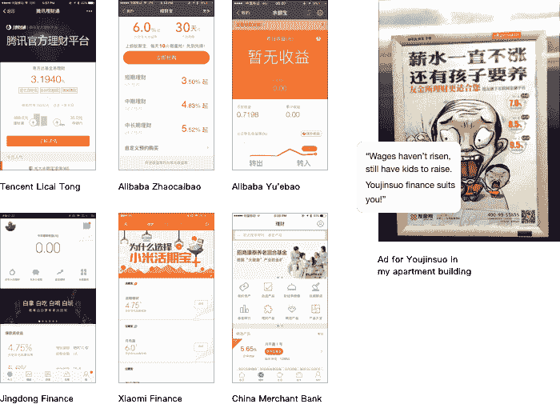](/img/content/chineseapps-2/FinancialProducts@2x.png) 

##### 蝇蛆病

今年，微软中国发布了一款人工智能聊天机器人小冰(Xiǎo běng)一直流行的。她可以通过网络、独立的应用程序、微信、Cortana 以及小米自己很少使用的消息应用程序中的专用按钮来访问。向她抛出恼人的问题，看她如何回应，这很有趣。有些人甚至信任她。她是 Siri，ELIZA 和 Cleverbot 的私生子。

一些应用程序添加了自己的机器人。百度 app 有一个叫度秘(杜密，来自秘书，意思是秘书)，这里被描述为一个雌雄同体的机器人，可能是《瓦力》中伊娃的表亲。它也可以作为独立应用程序使用，可以回答自然语言搜索查询，找到你附近的东西，并讲笑话。它通过文本到语音的方式大声说出所有的回答。每次你打开它，它都会和你打招呼，而不是仅仅等待一个查询。虽然你可以像在普通聊天中一样打字和说话，但他们在底部也有一个栏来展示功能和对杜密所说的可能的回应/跟进。

淘宝 app 里面是阿里小蜜，(阿里小蜜，mi 这里的意思是蜂蜜)，以卡通蜜蜂为代表。您可以在主屏幕上安装快捷方式来直接访问它。它可以回答你订单的物流问题，预订旅行，并在网站上为你找到东西。它不会讲笑话。

尽管机器人很流行，但我不确定是否有证据表明真正的用户更喜欢以这种方式与应用程序互动。

 

##### IOS 应用商店继续丢失冰球

今年，一种名为 [Xcode Ghost](http://www.macrumors.com/2015/09/20/xcodeghost-chinese-malware-faq/) 的恶意软件感染了许多通过苹果检查并被发布在 App Store 上的中国流行应用。它通过一个被感染的 Xcode 版本做到了这一点，该版本被修改为在其编译的每个二进制文件中插入恶意软件。被感染的 Xcode 已经通过他们的 Dropbox 克隆版百度潘芸分发。

当然，大多数开发者从这类地方下载 Xcode 的原因是官方网站*真的很慢*。苹果公司对此的回应是转储一些位于这里的 cdn 的更新，但并没有太大的改善。

由于几个原因，App Store 也很差。更重要的是，无论你登录美国商店还是中国商店，它都很慢。不知何故，从点击“搜索”标签栏图标到搜索栏实际出现并变得可用大约需要 5 秒钟，这似乎不应该受网络限制。不仅是通过输入关键词进行搜索的人越来越少，微信的官方账户也已经不再需要许多类别的应用程序。当人们安装第三方应用程序时，通常是通过二维码，这是 app store 或操作系统层面不支持的。

我在上一篇文章中提到过，开发者通过在自己的应用程序中进行大量的交叉推广，或者实际上制作自己独立的 iOS 应用程序商店，使用 OTA 证书来允许安装未经审查的第三方应用程序，从而规避了 iOS 上的应用程序商店。

在最近的 iOS 更新中，苹果让用户实际授权这些第三方应用程序变得更加复杂。但由于官方应用商店太差，这种规避行为一直没有被挫败。我看到很多应用程序的链接，上面有如何以这种方式安装的说明(比如我的合作空间的[)。](http://www.yi-gather.com/)

事实上，就在几天前，我走在街上，有人递给我一张传单，告诉我如何进入设置并信任这个证书，这样我就可以玩鱼游戏并赢得精彩的奖品。什么会出错？

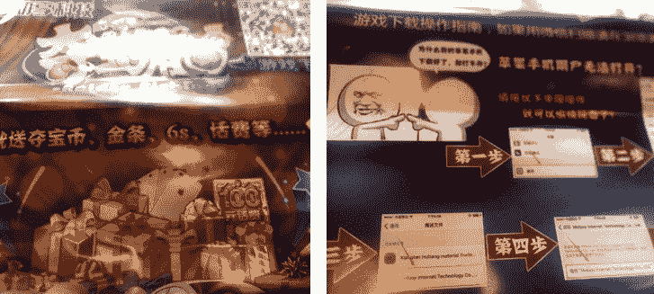
T3】

##### 微信终于打败了 QQ &移动边缘产品

在[腾讯上一季度报表](http://tencent.com/en-us/content/ir/news/2015/attachments/20151110.pdf)中，微信月活跃用户达到 6.5 亿，超过 QQ 6.39 亿的移动月活跃用户。他们的用户总数仍然超过我们，MAU 并不总是最有用的指标，但这个拐点比任何人预测的都要早。

虽然微信一直是媒体的宠儿，但它实际上有 QQ 的强大竞争。当它作为一个仅支持移动通讯的应用程序推出时，它与生硬、仍以桌面为中心的 QQ 形成了鲜明的对比。QQ 团队迅速加倍努力，成功完成了该应用程序的几项整体重新设计，以提高其在移动设备上的参与度。

这一动态引人注目有两个原因。一是你通常会认为年轻用户会压倒性地喜欢更新的产品。但是，一家公司能够通过在同一类别中创造两种相互竞争、被广泛使用的产品来成功地颠覆自己，这也是不寻常的。

正如我的同事在一次谈话中提到的[，仍然有数亿人不使用微信。这主要是年轻用户和那些在该国更偏远地区的用户。然后，当然还有那些根本不用互联网，或者只在台式机上用的。在一个 13 亿人口的国家里，只有](http://blog.wechat.com/2015/11/03/new-data-revealed-what-is-the-wechat-lifestyle/)[6 . 49 亿互联网用户](http://www.techweb.com.cn/world/2015-02-04/2121983.shtml)，而且实际比例在不同地区之间相差很大。

T3】

我最近去了中国寒冷的东北地区的一个三线城市，加入了一个团队，团队成员负责这两款应用。我们在那里指导一些焦点小组，在那里我们与人们谈论他们如何使用他们的手机，以及四处走动和吃大量的饺子。有人告诉我，在这里有些地方，你可以把手机拿到村里的应用程序商店，然后让一个人帮你安装。但是去这种地方对我们来说更有趣，因为它们实际上并不那么落后或遥远，但仍然与家乡有很大的不同。

##### 古怪的移动未来

回想我离开旧金山搬到这里的时候，我自己的观点已经改变了。我担心海湾地区可能是我唯一能开心或者做体面工作的地方。除了我对墨西哥卷饼的强烈渴望，它最终成为了一个伟大的举动。没错，硅谷仍然在一些事情上做得很好，没有竞争。今天，中国还没有制造出其他行业正在使用的操作系统、框架、编程语言或开放标准。

然而，当我想到这一点时，*硅谷的大部分也不是这样。[正如其他人所咆哮的那样](http://zedshaw.com/archive/why-i-algpl/)，国内的大部分资金和宣传都流向了制作完全相同类型的消费者应用程序的人，他们将技术结合在一起赚钱。生产出完全相同的应用程序，人们在世界的这一边做得很好。*

当我第一次搬出去并在这里看了一眼移动设计来写最后一篇文章时，沉浸其中并窃笑“哈，这些应用程序中的一些确实是*怪异*”是很有趣的。看到技术如何独立发展以满足当地的需求是很有趣的。

但接下来会变得更奇怪。虽然中国是一个有趣的例子，但印度和非洲大部分地区仍远远落后。全球互联网渗透率仍然很低。随着越来越多的人在这些地方上网，他们使用的应用程序和操作系统可能与我们现在使用的完全不同。他们将期待技术来解决与我们相同的问题，但很少会有相同的假设。

我等不及要看接下来会发生什么了！

##### 承认

感谢[迈克尔·贝尔弗拉格](https://twitter.com/mikez)、[杰夫·劳伊](http://jeffd.org/)和马特阅读了这篇文章的草稿！

