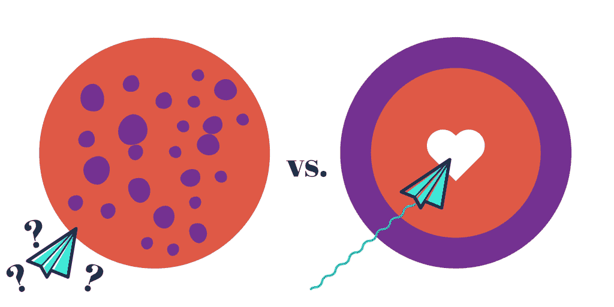
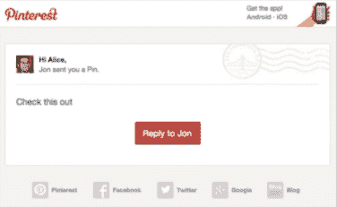
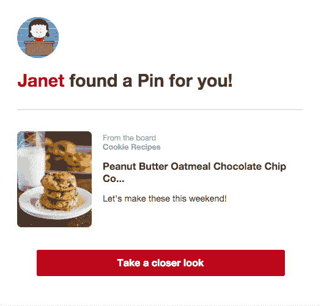

# 衡量信任，而不是名单-客户. io

> 原文：<https://customer.io/blog/scale-trust.html?utm_source=wanqu.co&utm_campaign=Wanqu+Daily&utm_medium=website>

不要再纠结于邮件列表的大小了。这会让你从质量增长的实际工作中分心——建立受众、发展客户和培养关系。

当你被名单的增长所消耗时，你的工作仅仅是关于滚滚而来的数字，包括搜寻和获取更多的电子邮件地址。伟大的电子邮件营销不是如此简单或肤浅。

这并不是无视企业必须赚钱的事实。但是，当涉及到如何发送电子邮件时，还有更深层次的价值受到威胁。正如 Litmus 公司的营销副总裁贾丝汀·乔丹告诉我们的:

> 电子邮件是营销人员与受众联系的最终方式。通常情况下，营销人员只是将它视为一个高投资回报率的渠道。
> 
> 这种观点让我们走上了一条不良行为的道路，我们把电子邮件看得像这样*只有*有能力为我们的公司赚钱。这通常表现为向人们强行推销、打折和交易。

每封电子邮件都不是一笔买卖，尽管你的收件箱可能会显示并非如此。让我们看看把你的注意力从列表转移到那些电子邮件地址后面的人意味着什么。

## 对你有利的成功几率

对邮件列表大小的痴迷是漏斗顶端固定的一个症状，它依赖于通过一群人来挤出尽可能多的客户。以下是 MailChimp 首席执行官本·切斯特纳特对这一过程的描述:

> 这个想法是，你需要大量的网站访客，然后他们中的一些人会成为潜在客户，然后在你做了一些事情之后(通常的建议是用营销自动化轰炸潜在客户)，他们会变得宽容并付给你钱，从而成为“客户”

正如来自 Wistia 的 Ezra Fisher 所观察到的，这种名单研磨意味着“一个没有走上成为客户之路的领导是一种干扰”。然后，在花费了你所有的注意力和努力去引诱之后，那些你费尽心机才得到的人往往被抛弃，任其自生自灭，或者被不相关的信息轰炸。结果是一个不断填补漏洞的永无止境的任务，而不是与观众、客户和粉丝建立势头。

如果你[翻转漏斗](http://tinyletter.com/ben/letters/why-i-hate-funnels)来关注客户，或者超越漏斗思维，像 Wistia 一样，关注受众，会怎么样？这些方法可以让你的电子邮件更加有效和强大。

当你不得不在一大群不断翻转的不分青红皂白的人群中大声疾呼以引起注意时，信息不会产生共鸣。当谈到电子邮件时，在肥皂箱上大喊大叫的方法对个人层面的联系毫无意义。

<noscript>T3】</noscript>

相反，随着时间的推移，你成功的可能性会随着特殊性和相关性——一种个性化的方法——而变得更高。当你努力培养和维系听众时，你的信息会传达给那些真正愿意倾听的人。

建立在持续和相关沟通基础上的战略也将每封电子邮件从一次孤注一掷的销售机会转变为一块积木。正如[加里·维纳查克观察到的](https://www.garyvaynerchuk.com/email-marketing-is-not-dead-heres-why/),**电子邮件都是关于兑现承诺的。**“无论你只是拥有一份简单的时事通讯，还是拥有一种产品的大公司，获得一个电子邮件地址只是一个开始。

## 显而易见的选择并不总是胜利

电子邮件营销不仅仅是订阅和注册，而是兑现承诺并坚持到底。Pinterest 的营销和增长团队直接发现，当你全神贯注于通常的打开和点击时，这种长期思维是如何变得暗淡的。

例如，他们的“发送 pin”通知(当有人想与您共享 pin 时发送)可能是一条简单的消息，让您点击查看 Pin 是什么。Pinterest 的点击量和流量将会增加，这听起来很棒，看起来也有增长。“如果我们只看电子邮件点击率，这是一个显而易见的选择:让人们来到 Pinterest 并看到信息，”营销人员安妮·卡特里娜·李解释道。

<noscript></noscript>

*[Pinterest 的旧分享一个 Pin 通知](https://medium.com/art-marketing/lean-on-me-df6a152f649d#.ivpaolux2)*

Annie 澄清了什么是明显的什么是不正确的:“我们没有考虑的是，我们增加了一个额外的点击来查看他们感兴趣的内容，这会让 Pinners 多么恼火。”当他们查看实际发生的情况时，他们发现这些邮件提高了收件人 1-2%的参与度。

该团队最终决定在电子邮件中同时显示消息和 pin。李解释了其中的数学原理:

> 我们选择了我们的长期收益(与 Pinners 建立信任)与短期收益(从这封特定的电子邮件中获得更多的 Pinterest 点击)，因为我们总能找到从其他增长黑客那里获得更多点击的方法，但一旦信任消失，就很难大规模地建立信任。

<noscript></noscript>

*Pinterest 新分享一个 Pin 通知*

一旦你不再把电子邮件看作是每次你想挤出更多钱、更多点击、更多点击、更多流量时按下的按钮，你的目标就会变得更清晰、更有意义，你的电子邮件也会变得更有帮助、更有价值。

## 选择你的战斗，扩大信任

你的工作是扩大信任度，这似乎是一项矛盾的任务。这是安妮·卡特里娜·李对这场冲突的再次报道:

> 我听说过很多关于成长型团队利用新想法实现“曲棍球棒”式增长，但在此过程中失去品牌资产的恐怖故事。在 Pinterest，我们既重视我们的增长率(我们的增长速度)，也重视我们的品牌声誉(人们对我们的认知和感受)。这些目标往往相互矛盾，随着时间的推移，我们已经学会了如何明智地选择战斗。

在市场营销中，当你平衡你的业务重点(“我们的增长率”)和你服务的客户(“他们对我们的看法和感受”)时，这场战斗似乎是持续的。扩大信任的原则非常有帮助，它引导你考虑你是否以及如何为你的客户提供价值。

扩大信任需要能够提供积极的体验，并在很多很多人身上建立信心。幸运的是，这是电子邮件作为渠道的最佳时机。作为网络和移动业务的电子邮件营销人员，你需要做两件事来扩大信任度，但我发现这两件事经常被忽视:

*   **行为数据**:现代电子邮件营销利用[实时行为数据](https://customer.io/blog/drip-email-marketing-best-practice.html)进行细分，超越简单的人口统计数据，以大规模自动化和交付[高度相关的个性化体验](https://customer.io/blog/behavioral-email-personalization.html)。像 [Customer.io](http://customer.io) 这样的工具给予营销人员比以往更多的访问和控制来利用这些数据。
*   深思熟虑的策略:如果人类不知道如何将自动化和数据结合在一起，它们就什么都不是。当你通过翻转漏斗和观众焦点朝着长期目标努力时，“仅仅发送另一封电子邮件”不能成为你的首要行动。现在，花时间追踪邮件的打开和点击，或者寻找最佳的发送时间或主题，并不总是有意义的。任何人都可以发送电子邮件；真正理解为什么以及如何发送电子邮件是关键。

* * *

这并不是说你不应该关心扩大你的联系和受众，而是对列表增长的持续关注导致了对“好的电子邮件营销”的低估。

电子邮件营销有如此多的挑战性、趣味性、回报性和价值，以至于把这种艰苦的工作简化为一些虚荣的指标，如点击量、流量和列表大小，这是一种耻辱。

每封电子邮件都是一个机会，可以与真实的人联系，改善他们的体验并提供价值，进行对话，并对他们如何理解和看待你的品牌产生有意义的影响。这很难衡量，但从长远来看更重要。

你如何使用电子邮件来衡量信任？请在评论中与我们分享！