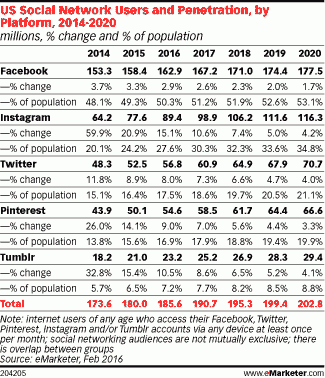

# Instagram 广告:太多？-在我的 Om 上

> 原文：<http://om.co/2016/02/13/instagram-ads-too-much/?utm_source=wanqu.co&utm_campaign=Wanqu+Daily&utm_medium=website>

不可否认，我对 Instagram 很痴迷。我看 app 的次数和喝水一样多，很多。作为一个想要成为摄影师的人，这是灵感的来源:我喜欢观察完美策划的人、事和地方的生活。我忽略了一个残酷的现实:完美几乎总是只不过是感知。事实上，Instagram 是唯一一个在我的 iPhone 社交媒体大清洗中幸存下来的社交应用；脸书、Snapchat 和 Twitter 都消失了。(我主要通过我的 iPad Pro 使用脸书和 Twitter，这是我这些天的首选电脑，也是我笔记本电脑的替代品。)

不过，在过去的几天里，我一直在思考，是不是也该把 Instagram 从我的主屏幕上移除了。为什么？因为它在我的 feed 中植入了太多的广告——不只是任何广告，而是可怕的广告。视频广告。对我来说毫无意义的广告。与网络上愚蠢的“随我去”横幅相比，与我的订阅源和我的相关性更低的广告。

所有这些都来自一家公司，这家公司比其他任何公司都拥有更多的关于我喜欢什么、喜欢谁的数据，甚至关于我关注和喜欢的品牌的细节。这家服务公司的母公司脸书拥有比美国国家安全局更多的社交和个人数据。然而，它无法为我的 Instagram feed 找到合适的广告。

如果这还不够，还有一种瘟疫[的赞助商程序](http://om.co/2015/07/11/sponsorgram/)——广告商直接向 Instagrammer 付费的个人帖子。正如我之前写的，“在一个社交网络上，我主动关注人们的创造力，人们期待真实，每次有明显的转移，我都会感到失望。”

* * *

Instagram 开始感觉不那么真实，反而更像一个巨大的营销平台，社交网络的原子——人——是最后一个考虑体验和其他决定的因素。最新的广告攻势与联合创始人凯文·斯特罗姆在该公司推出最初的广告实验时承诺的无缝和高质量的原生广告体验相去甚远。他甚至说他正在亲自审查广告。看起来不是这样的，这项服务的长期用户也注意到了这一点。

“周日早上的预测:Instagram 最终会因为赞助帖子(又名‘insta gram 广告’)而自杀，”[伦敦摄影师丹·鲁宾(Dan Rubin)在推特上写道](https://twitter.com/danrubin/status/693752297059422208)，他是这项服务的最早倡导者之一。结果呢？服务的体验正在慢慢地被支付。

* * *

我想可能只有我一个人，因为我经常使用这项服务，所以我看到的广告更多了。所以我在 Twitter 上询问人们 Instagram 是否展示了太多的广告，704 名受访者中有 68%的人说**是的**。当[我问](https://twitter.com/om/status/696082466717609985)广告质量是否大幅下降时，412 张投票中有 68%的人说是。现在，我知道这些民意调查不是很科学，充满了认知偏见，但它们给了人们对 Instagram 广告的看法一个方向性的想法。事情很可能会变得更糟。

为什么？与 Instagram 合作的在线机构 Brand Networks 的一项研究指出，在 2015 年下半年，insta gram 提供了 16 亿次展示，每 1000 次展示的平均成本在 5 美元到 6 美元之间。不太好，但也不坏，尽管为了让 Instagram 对脸书的收入产生有意义的影响，它需要做数十亿次展示，甚至达到 10 亿美元。鉴于海外市场缺乏广告，我怀疑美国的 Instagram 用户将首当其冲承受这一广告激增的冲击。

根据 eMarketer 的数据，Instagram 今年将拥有 8940 万美国用户，占总人口的 27.6%。这使得它领先于 Twitter(5680 万)，落后于其母公司脸书(1.629 亿美国互联网用户)。

<noscript>T3】</noscript>

* * *

一些华尔街分析师认为，2016 年，Instagram 的营收将在 10 亿至 20 亿美元之间，而研究公司 eMarketer 估计，到 2017 年，Instagram 的营收将约为 28 亿美元。Instagram 推出了“立即下载”、“立即购物”等这种面向行动的广告形式，但尚不清楚广告商是否看到了任何实际效果。广告的质量不能激发太多的信心。

<noscript></noscript>

视频广告到处火热，显然大家都想把它们放到自己的平台上。当然，Instagram 将参与视频广告的疯狂。它刚刚宣布了 60 秒的视频广告。虽然这些将在一段时间内创造一笔财富，但我想知道它们将如何影响整体的增长和参与。

社交媒体分析公司 loco wise[指出](http://locowise.com/blog/instagram-growth-and-engagement-2015-year-in-review)在 2015 年期间，“Instagram 上的关注者增长下降了 88.21%。从 4 月份的 1.95%的高点跌至 12 月份的 0.23%的低点”，而敬业度则从“4 月份的 2.8%敬业度高点跌至 12 月份的 1.08%敬业度低点。”公平地说，Instagram 比其竞争对手做得更好。例如，2015 年 12 月，在 Instagram 上，“平均每个帖子吸引了 1.08%的关注者，”Locowise 指出。在 Twitter 上，所有关注者的平均帖子参与度为 0.1%，而在脸书，0.37%的页面赞参与了帖子。

Instagram 在 2015 年 9 月达到了 4 亿账户，今年夏天晚些时候将达到 5 亿账户。我想知道这其中有多少是来自于基本上是在刮桶底的东西。我看到越来越多的虚假账户，越来越多的垃圾邮件，越来越多近乎虚假的内容。

* * *

我不反对在任何媒体上做广告，包括 Instagram。我知道它必须赚钱，就像脸书、Snapchat 和 Twitter 需要赚钱一样。这些公司不是非营利组织。我明白了。但我所痛惜的是那些分散了整体体验的糟糕广告。伟大的广告其实很有趣。我的意思是，超级碗最好的部分是广告，以及在推特和脸书上谈论它们。但是糟糕的广告就是糟糕。他们分散注意力，让人失望。互联网上的许多广告又蠢又无聊，因为我们使用服务而惩罚我们。

这是历史在重演。脸书对社交广告相当狂热，但不得不后退一步，因为广告公司不想在新的广告概念上工作。相反，它想要一个重新制作的横幅广告版本，根据用户信息进行更好的定位。横幅广告为视频广告腾出了空间，因为它们提供了更高的 CPM——这对脸书的底线和代理商都有好处，他们可以继续获得分成。

由于僵化和缺乏想象力的广告机构，Instagram 广告实验正在经历同样的循环。Instagram 上发生的事情是每个社交平台周期性事件的一部分:它最终只会成为一个广告和大众营销的平台。如果有什么不同的话，Locowise 的参与度数据显示，Instagram 有更多的空间将广告塞进我们的照片流。它会的。

作为一家公司，Instagram 有一套不同的优先事项，即他们的最终客户现在是广告/营销社区和广告商。你不必看得太远就能看出他们在产品决策中强调是谁。举个例子，他们非常有用的 API 现在被简化为做三件非常简单的事情——打印 Instagram，营销相关的小说，并允许你在互联网上的其他地方使用你的 Instagram 个人资料照片作为你的个人资料照片。他们最近推出了多个账户之间的切换——个人账户和品牌账户——这是重心从普通人转移的又一个例子。视频观看——也是为营销人员而不是普通用户开发的。

如果你注意的话，你可以在一英里之外看到它。Hootsuite 首席执行官 Ryan Holmes 在一篇博客文章中指出，引入广告 API 是公司及其未来的重大转变。霍姆斯写道:“如果电视网能找到让用户和广告商都满意的方法，它很可能在未来几年解决一个价值数十亿美元的广告之谜。”这些决定将使他们在很长一段时间内从广告商那里获得收入，尤其是品牌收入。现在他们太大而不能倒，但是给它四年，整个生态系统开始衰退。

* * *

如果我听起来很失望，那是因为在 2013 年，当 Instagram 首次尝试广告时，我对该公司可能催生一个面向移动的品牌广告新时代感到兴奋。我希望它将开创一个创造性的新时代。我在我的文章[“insta gram 广告和品牌广告的未来”中也写了这么多](http://gigaom.com/2013/10/28/instagram-ads-and-the-future-of-brand-advertising/)在未来的两年零三个月里，Instagram 似乎不会实现这个想法。

相反，我们所拥有的是脸书的一个分裂，它最终被告知去做它一直想做的事情:支撑脸书的底线。