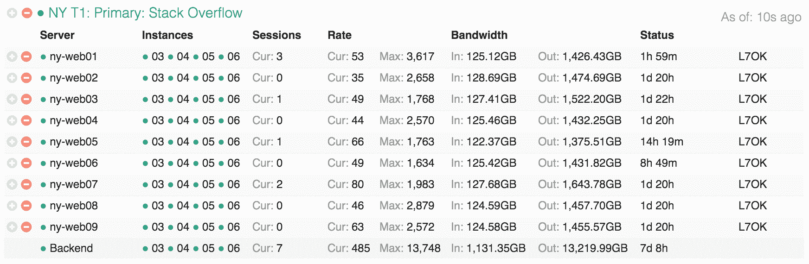
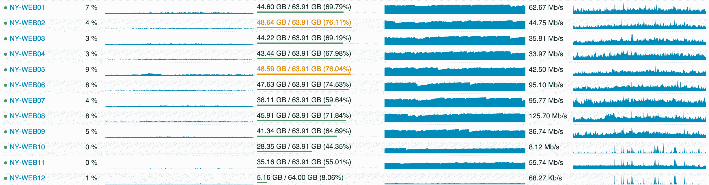
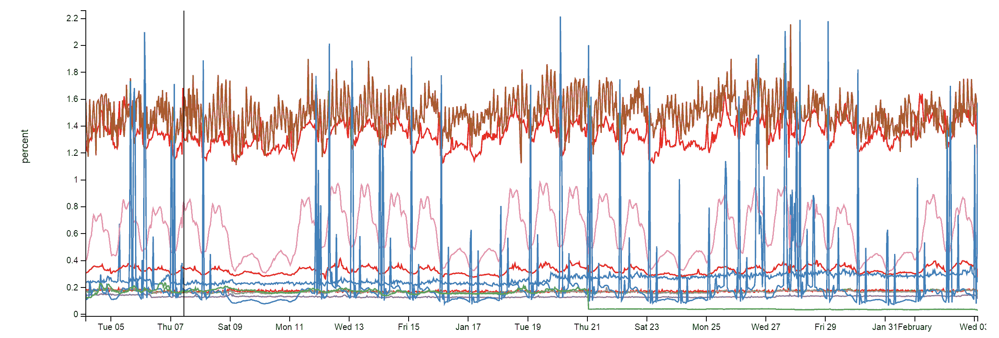
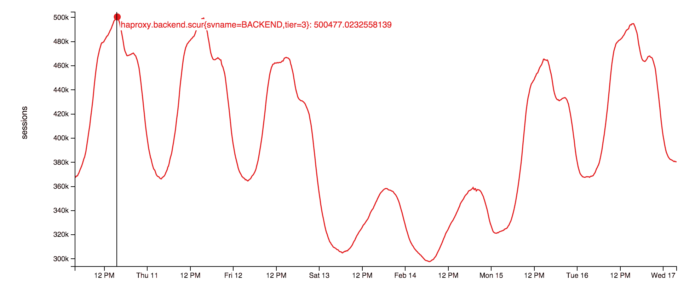
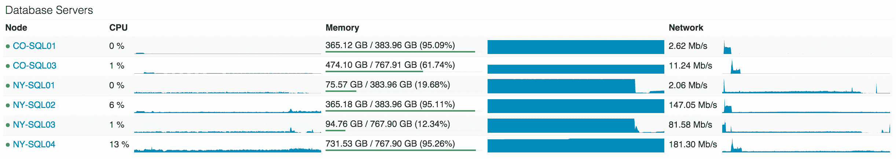

# Nick Craver -堆栈溢出:架构- 2016 版

> 原文：<https://nickcraver.com/blog/2016/02/17/stack-overflow-the-architecture-2016-edition/?utm_source=wanqu.co&utm_campaign=Wanqu+Daily&utm_medium=website>

> 这是关于栈溢出架构的[系列文章](/blog/2016/02/03/stack-overflow-a-technical-deconstruction/)的第一篇。欢迎光临。上一篇(#0): [栈溢出:一种技术解构](/blog/2016/02/03/stack-overflow-a-technical-deconstruction/)下一篇(#2): [栈溢出:硬件- 2016 版](/blog/2016/03/29/stack-overflow-the-hardware-2016-edition/)

为了了解所有这些东西“做什么”，让我从栈溢出时平均每天的更新开始。因此，您可以与 2013 年 11 月的[之前的数据进行比较，这是 2016 年 2 月 9 日的一天的统计数据，与 2013 年 11 月 12 日相比有所不同:](/blog/2013/11/22/what-it-takes-to-run-stack-overflow/)

*   **209420973**(+61336090)HTTP 请求到我们的负载均衡器
*   **66，294，789** (+30，199，477) 其中有页面负载
*   **发送了 1240266346053**(+406273363426)字节(1.24 TB)的 HTTP 流量
*   **569，449，470，023** (+282，874，825，991) 总接收字节(569 GB)
*   **3084303599266**(+1958311041954)总发送字节(3.08 TB)
*   **504816843**(+170244740)SQL 查询(仅来自 HTTP 请求)
*   **5831683114**(+5418818063)Redis 点击数
*   **17158874**(2013 年未跟踪)弹性搜索
*   **3，661，134** (+57，716) 标记引擎请求
*   **607073066**(+48848481)运行 SQL 查询花费了毫秒(168 小时)
*   10，396，073 (-88，950，843) 花费在 Redis 点击数上的毫秒(2.8 小时)
*   **147，018，571** (+14，634，512) 标记引擎请求花费了毫秒(40.8 小时)
*   **1609944301**(-1118232744)在 spent 加工花费 ms (447 小时)
*   **22.71**(-5.29)49，180，275 个问题页面渲染的平均毫秒数(ASP.Net 为 19.12 毫秒)
*   **11.80**(-53.2)6，370，076 次主页渲染的平均毫秒数(ASP.Net 为 8.81 毫秒)

你可能想知道与 2013 年(757 小时)相比，ASP.Net 处理时间的大幅减少，尽管每天增加了 6100 万个请求。这是由于 2015 年初[的硬件升级](http://blog.serverfault.com/2015/03/05/how-we-upgrade-a-live-data-center/)以及应用本身的大量性能调整。请不要忘记:[表演还是一个特色](https://blog.codinghorror.com/performance-is-a-feature/)。如果你对更多的硬件细节感兴趣，而不是我将要提供的，恐怕不行。下一篇文章将会是一个附录，里面有运行这些网站的所有服务器的详细硬件规格(当它上线时，我会更新一个链接)。

那么在过去的两年里发生了什么变化呢？除了更换一些服务器和网络设备，没什么。以下是目前运行这些网站的顶级硬件列表(注明自 2013 年以来的不同之处):

*   4 台 Microsoft SQL 服务器(其中两台的新硬件)
*   11 台 IIS Web 服务器(新硬件)
*   2 个 [Redis](https://redis.io/) 服务器(新硬件)
*   3 个标记引擎服务器(3 个中的 2 个的新硬件)
*   3 个 [Elasticsearch](https://www.elastic.co/) 服务器(相同)
*   4 个 [HAProxy](https://www.haproxy.org/) 负载平衡器(增加 2 个以支持 CloudFlare)
*   2 个网络(每个网络一个 [Nexus 5596 核心](https://www.cisco.com/c/en/us/products/collateral/switches/nexus-5000-series-switches/data_sheet_c78-618603.html) + [2232TM 光纤扩展器](https://www.cisco.com/c/en/us/products/switches/nexus-2232tm-10ge-fabric-extender/index.html)，到处升级到 10Gbps)
*   2 个 Fortinet [800C](https://www.fortinet.com/products/firewalls/firewall/fortigate-mid-range.html) 防火墙(取代思科 5525-X ASAs)
*   2 台思科 [ASR-1001](https://www.cisco.com/c/en/us/products/routers/asr-1001-router/index.html) 路由器(取代了思科 3945 路由器)
*   2 台思科 [ASR-1001-x](https://www.cisco.com/c/en/us/products/routers/asr-1001-x-router/index.html) 路由器(新！)

我们 ***需要什么*** 来运行栈溢出？[自 2013 年](/blog/2013/11/22/what-it-takes-to-run-stack-overflow/#core-hardware)以来没有太大变化，但由于上面提到的优化和新硬件，我们只需要 ***一台网络服务器。我们已经成功地在无意中测试了几次。明确一点:我是说它有效。我不是说这是个好主意。每次都很有趣。***

现在我们已经有了一些关于规模概念的基线数字，让我们看看如何制作这些精美的网页。由于很少有系统是完全孤立存在的(我们的系统也不例外)，如果没有一个关于这些部分如何融入整体的更大的图景，架构决策通常是没有意义的。这就是我们的目标，覆盖全局。许多[后续的文章](https://trello.com/b/0zgQjktX/blog-post-queue-for-stack-overflow-topics)将深入探讨特定的领域。这将是一个逻辑概述，仅重点介绍硬件；下一篇文章将会有硬件的细节。

为了让在座的各位了解目前的硬件状况，这里有几张我在 2015 年 2 月升级期间拍摄的机架 A(它有一个匹配的姐妹机架 B)的照片:

…如果你对这种事情感兴趣，[这里是那一周的全部 256 张图片专辑](https://imgur.com/a/X1HoY)(你他妈的说对了，这个数字是故意的)。现在，让我们深入布局。以下是主要系统的逻辑概述:

### 基本规则

以下是一些全球通用的规则，因此我不必在每次设置时都重复这些规则:

*   一切都是多余的。
*   所有服务器和网络设备都至少有 2 个 10Gbps 连接。
*   所有服务器都有 2 个电源，通过 2 个 UPS 装置的 2 个电源供电，由 2 个发电机和 2 个公用电源供电。
*   所有服务器在机架 A 和 b 之间都有一个冗余伙伴。
*   所有的服务器和服务都通过另一个数据中心(科罗拉多州)实现了双重冗余，尽管我这里主要指的是纽约。
*   一切都是多余的。

### 互联网

首先，你必须找到我们——那就是 [DNS](https://en.wikipedia.org/wiki/Domain_Name_System) 。找到我们需要很快，所以我们把这个外包给了 [CloudFlare](https://www.cloudflare.com/) (目前)，因为他们的 DNS 服务器离世界上几乎每个人都很近。我们通过一个 API 更新我们的 DNS 记录，他们来“托管”DNS。但是因为我们是有根深蒂固的信任问题的混蛋，我们仍然有我们自己的 DNS 服务器。如果世界末日发生了(可能是由 GPL、[、Punyon](https://twitter.com/JasonPunyon) 或缓存引起的)，而人们仍然想通过编程来转移注意力，我们会让他们兴奋起来。

在你找到我们的秘密藏身处后，HTTP 流量来自我们四个 ISP(纽约的 Level 3、Zayo、Cogent 和 Lightower)中的一个，流经我们四个边缘路由器中的一个。我们使用 [BGP](https://en.wikipedia.org/wiki/Border_Gateway_Protocol) (相当标准)与我们的 ISP 对等，以便控制流量，并为流量最有效地到达我们提供几种途径。这些 [ASR-1001](https://www.cisco.com/c/en/us/products/routers/asr-1001-router/index.html) 和 [ASR-1001-X](https://www.cisco.com/c/en/us/products/routers/asr-1001-x-router/index.html) 路由器成两对，每对以主动/主动方式服务 2 个 ISPs 所以我们在这里是冗余的。虽然它们都在同一个物理 10Gbps 网络上，但外部流量位于独立的外部[VLANs](https://en.wikipedia.org/wiki/Virtual_LAN)中，负载平衡器也连接到这些 VLAN。在流经路由器之后，您将走向负载均衡器。

我想这可能是一个很好的时机来提及我们在两个数据中心之间有一个 10Gbps [MPLS](https://en.wikipedia.org/wiki/Multiprotocol_Label_Switching) ，但它并不直接参与为站点提供服务。在需要突发数据的情况下，我们使用它来进行数据复制和快速恢复。“但是尼克，那不是多余的！”好吧，你在技术上是正确的([最好的一种正确](https://www.youtube.com/watch?v=hou0lU8WMgo))，这是表面上的单点失败。但是等等！我们通过我们的 ISP 维护另外 2 条故障转移 [OSPF](https://en.wikipedia.org/wiki/Open_Shortest_Path_First) 路由(MPLS 是第一，这些是第二和第三的开销)。前面提到的每一组都连接到科罗拉多的相应组，在故障转移的情况下，它们在它们之间进行流量负载平衡。我们可以让两个集合都连接到两个集合，并有 4 条路径，但是，好吧，无论如何。继续前进。

### 负载平衡器(HAProxy)

负载均衡器在 [CentOS 7](https://www.centos.org/) 上运行 [HAProxy](https://www.haproxy.org/) 1.5.15，这是我们喜欢的 Linux 版本。TLS (SSL)流量也在 HAProxy 中终止。我们将很快在 HAProxy 1.7 中寻找对 [HTTP/2](https://en.wikipedia.org/wiki/HTTP/2) 的支持。

与所有其他具有双 10Gbps LACP 网络链路的服务器不同，每个负载平衡器都有两对 10Gbps:一对用于外部网络，一对用于 DMZ。这些机器运行 64GB 或更多的内存，以更有效地处理 SSL 协商。当我们可以在内存中缓存更多的 TLS 会话以供重用时，对同一个客户端的后续连接进行重新计算的工作量就会减少。这意味着我们可以更快、更便宜地恢复会话。鉴于 RAM 在价格上相当便宜，这是一个容易的选择。

负载平衡器本身是一个非常简单的设置。我们监听各种 IP 上的不同站点(主要是为了证书问题和 DNS 管理),并主要根据主机头路由到各种后端。我们在这里做的唯一值得注意的事情是速率限制和一些报头捕获(从我们的 web 层发送)到 [HAProxy 系统日志消息](https://cbonte.github.io/haproxy-dconv/configuration-1.5.html#3.1-log)中，因此我们可以记录每个请求的性能指标。我们稍后也会[报道那个](https://trello.com/c/1Oc9cC6u/11-monitoring)。

### Web 层(IIS 8.5、ASP.Net MVC 5 . 2 . 3 和。Net 4.6.1)

负载平衡器向 9 台服务器(我们称之为“主服务器”(01-09)和 2 台“开发/元服务器”(10-11，我们的暂存环境)提供流量。主服务器运行诸如栈溢出、职业和所有栈交换站点之类的东西，除了在最后 2 个服务器上运行的[meta.stackoverflow.com](https://meta.stackoverflow.com/)和[meta.stackexchange.com](https://meta.stackexchange.com/)。主要的 Q &应用程序本身是多租户的。这意味着单个应用服务于所有 Q & A 站点的请求。换句话说:我们可以在单个服务器上的单个应用程序池中运行整个网络。其他应用程序，如 Careers、API v2、Mobile API 等。是分开的。以下是 IIS 中主层和开发层的样子:

下面是堆栈溢出在 web 层的分布情况，如 [Opserver](https://github.com/Opserver/Opserver) (我们的内部监控仪表板)所示:

[<picture><source type="image/webp" srcset="/blog/content/SO-Architecture-Opserver-HAProxy.webp"><source type="image/png" srcset="/blog/content/SO-Architecture-Opserver-HAProxy.png"></picture>T6】](/blog/content/SO-Architecture-Opserver-HAProxy.png)

…从利用率的角度来看，这些 web 服务器是这样的:

[<picture><source type="image/webp" srcset="/blog/content/SO-Architecture-Opserver-WebTier.webp"><source type="image/png" srcset="/blog/content/SO-Architecture-Opserver-WebTier.png"></picture>T6】](/blog/content/SO-Architecture-Opserver-WebTier.png)

我将在以后的文章中解释为什么我们会过度配置，但重点是:滚动构建、扩展空间和冗余。

### 服务层(IIS，ASP.Net MVC 5 . 2 . 3，。Net 4.6.1，以及 HTTP。SYS)

在这些 web 服务器后面是非常相似的“服务层”它还在 Windows 2012R2 上运行 IIS 8.5。这一层运行内部服务来支持生产 web 层和其他内部系统。这里的两个大玩家是“Stack Server ”,它运行标签引擎并基于`http.sys`(不在 IIS 后面)和 Providence API(基于 IIS)。有趣的事实:我必须在这两个进程中的每一个上设置亲缘关系，以便在不同的套接字上着陆，因为当以 2 分钟的时间间隔刷新问题列表时，堆栈服务器会加速 L2 和 L3 缓存。

这些服务盒承担了标记引擎和后端 API 的繁重工作，我们需要冗余，但不是 9x 冗余。例如，从数据库(目前是 2 分钟)加载每`n`分钟改变一次的所有文章及其标签并不便宜。我们不想在 web 层进行 9 次加载；3 次就够了，给了我们足够的安全性。我们还在硬件端对这些机器进行了不同的配置，以便针对标签引擎和弹性索引作业(也在这里运行)的不同计算负载特性进行更好的优化。“标签引擎”本身是一个相对复杂的话题，将会有一个[的专贴](https://trello.com/c/DqklJDSF/29-tag-engine)。基本要点是:当你访问`/questions/tagged/java`时，你正在点击标签引擎来查看哪些问题匹配。它将*我们的所有*标签匹配到`/search`之外，所以[新增了](https://meta.stackoverflow.com/questions/308875/new-navigation-release-candidate)等导航。都在使用这项服务获取数据。

### 缓存和 Pub/Sub(重定向)

我们在这里用 [Redis](https://Redis.io/) 做一些事情，它非常可靠。尽管每月进行约 1600 亿次运算，但每个实例的 CPU 占用率都低于 2%。通常低得多:

[<picture><source type="image/webp" srcset="/blog/content/SO-Architecture-Redis-Utilization.webp"><source type="image/png" srcset="/blog/content/SO-Architecture-Redis-Utilization.png"></picture>T6】](/blog/content/SO-Architecture-Redis-Utilization.png)

我们有一个带有 Redis 的 L1/L2 高速缓存系统。“L1”是 web 服务器上的 HTTP 缓存或任何正在运行的应用程序。“L2”正退回到 Redis 并取出值。我们的值通过 Marc Gravell 的 [protobuf-dot-net](https://github.com/mgravell/protobuf-net) 以 [Protobuf 格式](https://developers.google.com/protocol-buffers/)存储。对于一个客户，我们使用的是 [StackExchange。redis](https://github.com/StackExchange/StackExchange.Redis)—内部编写，开源。当一个 web 服务器在 L1 和 L2 都出现缓存缺失时，它会从数据源(数据库查询、API 调用等)获取值。)并将结果放入本地缓存和 Redis 中。下一个需要该值的服务器可能会错过 L1，但会在 L2/Redis 中找到该值，从而节省了数据库查询或 API 调用。

我们还运行许多问答网站，所以每个网站都有自己的 L1/L2 缓存:在 L1 通过关键字前缀，在 L2/Redis 通过数据库 ID。我们将在未来的文章中对此进行更深入的探讨。

除了运行所有站点实例的两个主要 Redis 服务器(主/从)，我们还有一个机器学习实例从属于另外两个专用服务器(由于内存原因)。这用于在主页上推荐问题，更好地匹配工作等。这是一个叫做普罗维登斯的平台，由凯文·蒙特罗斯报道。

主要的 Redis 服务器有 256GB 的内存(大约 90GB 在使用中)，Providence 服务器有 384GB 的内存(大约 125GB 在使用中)。

Redis 不仅仅用于缓存，它还有一个发布和订阅机制，其中一台服务器可以发布一条消息，所有其他订阅者都可以接收它——包括 Redis 从属服务器上的下游客户端。当一个 web 服务器为了一致性而删除时，我们使用这种机制来清除其他服务器上的 L1 缓存，但是还有另一个很好的用途:websockets。

### web sockets(https://github.com/StackExchange/NetGain)

我们使用 websockets 向用户推送实时更新，例如顶栏中的通知、投票计数、[新导航](https://meta.stackoverflow.com/questions/308875/new-navigation-release-candidate)计数、新答案和评论，以及其他一些内容。

套接字服务器本身使用运行在 web 层上的原始套接字。它是我们开源库之上的一个非常瘦的应用: [`StackExchange.NetGain`](https://github.com/StackExchange/NetGain) 。在高峰期，我们有大约 500，000 个**并发** websocket 连接打开。那是很多浏览器。有趣的事实:其中一些浏览器已经开放超过 18 个月了。我们不确定原因。应该有人去看看那些开发者是否还活着。本周的并发 websocket 模式如下:

[<picture><source type="image/webp" srcset="/blog/content/SO-Architecture-Bosun-Websockets.webp"><source type="image/png" srcset="/blog/content/SO-Architecture-Bosun-Websockets.png"></picture>T6】](/blog/content/SO-Architecture-Bosun-Websockets.png)

为什么选择 websockets？在我们的规模下，它们比投票有效得多。通过这种方式，我们可以用更少的资源推送更多的数据，同时对用户来说更加即时。但是它们并不是没有问题——负载均衡器上短暂的端口和文件句柄耗尽是有趣的问题[,我们将在后面讨论](https://trello.com/c/7nv66g78/58-websockets)。

### Search (Elasticsearch)

剧透:这里没什么好激动的。web 层使用非常瘦的高性能客户端，相对于[的 Elasticsearch](https://www.elastic.co/products/elasticsearch) 1.4 进行非常普通的搜索。不像大多数东西，我们没有开源的计划，因为它只暴露了我们使用的 API 的一个很小的子集。我坚信发布它会给开发者带来困惑，弊大于利。我们对`/search`使用 elastic，计算相关问题，以及提问时的建议。

每个弹性集群(每个数据中心有一个)有 3 个节点，每个站点都有自己的索引。职业有额外的几个指数。是什么让我们的设置在弹性世界中有点不标准:我们的 3 个服务器集群比平均水平稍强，每个集群都有 SSD 存储、192GB 的 RAM 和双 10Gbps 网络。

相同的应用程序域(是的，我们搞砸了。Net Core here…)在 Stack Server 中托管标签引擎，也不断地索引 Elasticsearch 中的项目。我们在这里做一些简单的技巧，比如 SQL Server (数据源)中的 [`ROWVERSION`与 Elastic 中的“最后一个位置”文档进行比较。因为它的行为类似于一个序列，所以我们可以简单地获取和索引自上一次传递以来发生变化的任何项目。](https://msdn.microsoft.com/en-us/library/ms182776.aspx)

我们使用 Elasticsearch 而不是 SQL 全文搜索的主要原因是可伸缩性和更好的资金分配。SQL CPUs 相对来说很贵，而 Elastic 很便宜，并且有更多的特性。为什么不是 [Solr](https://lucene.apache.org/solr/) ？我们希望在整个网络中进行搜索(一次搜索多个索引)，而这在决策时是不受支持的。我们还没有升级到 2.x 的原因是[“类型”的一个重大变化](https://github.com/elastic/elasticsearch/issues/8870)意味着我们需要重新索引所有要升级的东西。我只是没有足够的时间来进行必要的更改和迁移计划。

### 数据库(SQL Server)

我们使用 SQL Server 作为我们的[单一事实来源](https://en.wikipedia.org/wiki/Single_source_of_truth)。Elastic 和 Redis 中的所有数据都来自 SQL Server。我们使用 [AlwaysOn 可用性组](https://msdn.microsoft.com/en-us/library/hh510230.aspx)运行 2 个 SQL Server 集群。这些集群中的每一个在纽约都有一个主服务器(承担几乎所有的负载)和一个副本服务器。此外，他们在科罗拉多州有一个副本(我们的灾难恢复数据中心)。所有副本都是异步的。

第一个集群是一组戴尔 R720xd 服务器，每台服务器都有 384GB 内存、4TB PCIe 固态硬盘空间和 2 个 12 内核。它托管堆栈溢出、站点(不好的名字，我稍后会解释)、PRIZM 和移动数据库。

第二个群集是一组戴尔 R730xd 服务器，每台服务器都有 768GB 内存、6TB PCIe SSD 空间和 2 个 8 核。这个集群运行*所有其他的*。那个列表包括[的天赋](https://talent.stackoverflow.com)、[的开放 ID](https://openid.stackexchange.com/) 、[的聊天](https://chat.stackoverflow.com/)、[的异常日志](https://github.com/NickCraver/StackExchange.Exceptional)，以及每隔一个站点的 Q &(例如[的超级用户](https://superuser.com/)、[的服务器故障](https://serverfault.com/)等。).

我们希望将数据库层的 CPU 利用率保持在非常低的水平，但由于我们正在解决的一些计划缓存问题，目前它实际上有点高。目前，NY-SQL02 和 04 是主服务器，01 和 03 是副本服务器，我们今天刚刚在一些 SSD 升级过程中重新启动了它们。这是过去 24 小时的情况:

[<picture><source type="image/webp" srcset="/blog/content/SO-Architecture-Opserver-DBTier.webp"><source type="image/png" srcset="/blog/content/SO-Architecture-Opserver-DBTier.png"></picture>T6】](/blog/content/SO-Architecture-Opserver-DBTier.png)

我们对 SQL 的使用非常简单。简单就是快速。尽管有些查询可能很疯狂，但我们与 SQL 本身的交互是相当普通的。我们有一些遗产 [Linq2Sql](https://msdn.microsoft.com/en-us/library/bb425822.aspx) ，但是所有新的开发都使用 [Dapper](https://github.com/StackExchange/dapper-dot-net) ，我们的开源微表单使用 [POCOs](https://en.wikipedia.org/wiki/Plain_Old_CLR_Object) 。让我换一种说法:堆栈溢出在数据库中只有一个存储过程，我打算将最后一个痕迹移到代码中。

### 图书馆

好吧，让我们换个话题，做一些能更直接帮助你的事情。我已经在上面提到了其中的一些，但是我将在这里提供许多开源软件的列表。我们维护的供全世界使用的. Net 库。我们开源它们，因为它们没有核心商业价值，但是可以帮助开发者。我希望这些今天对你有用:

*   [衣冠楚楚](https://github.com/StackExchange/dapper-dot-net)(。Net Core) -用于 ADO.Net 的高性能微表单
*   [栈交换。Redis](https://github.com/StackExchange/StackExchange.Redis) 高性能 Redis 客户端
*   我们在每个页面上运行的轻量级分析器(也支持 Ruby、Go 和 Node)
*   [异常](https://github.com/NickCraver/StackExchange.Exceptional)-SQL、JSON、MySQL 等的错误记录器。
*   [Jil](https://github.com/kevin-montrose/Jil) -高性能 JSON(反)串行化器
*   一个. Net CIL 生成助手(当 C#不够快时用)
*   [NetGain](https://github.com/StackExchange/NetGain) -高性能 websocket 服务器
*   Opserver -监控仪表板直接轮询大多数系统，并从猎户座、孙波或 WMI 获取信息。
*   [孙波](https://bosun.org/) -后端监控系统，用 Go 写的

接下来是运行我们代码的详细的当前硬件列表。在那之后，我们沿着列表往下走。敬请关注。

