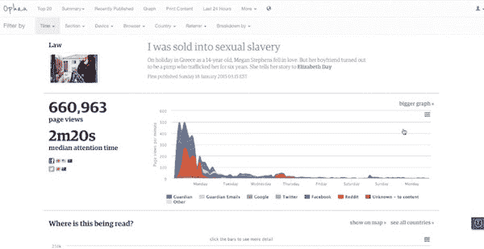
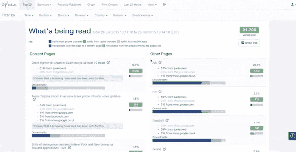
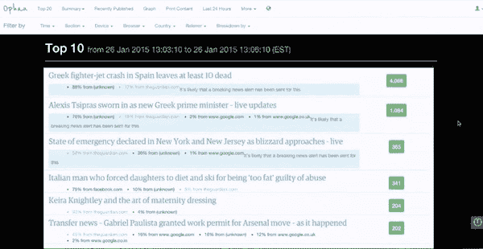
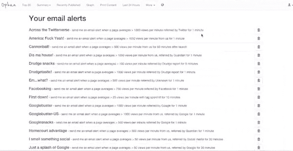
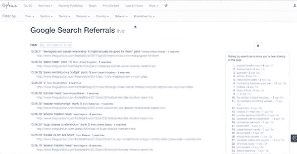

# 不断调整:卫报如何继续发展其内部分析系统|尼曼新闻实验室

> 原文：<http://www.niemanlab.org/2015/01/constantly-tweaking-how-the-guardian-continues-to-develop-its-in-house-analytics-system/?utm_source=wanqu.co&utm_campaign=Wanqu+Daily&utm_medium=website>

一年多前，现为《卫报》美国版主编的凯瑟琳·维纳(Katharine Viner)向该报的开发者提出了一个问题:为什么《卫报》的内部分析工具 Ophan 不能在移动设备上使用？

《卫报》的开发人员很快就开发出了 Ophan 的移动版本，Viner 已经将移动分析工具整合到了她的日常工作中。

本周早些时候，Viner 告诉我，“当我醒来的时候，我会先检查 Ophan，然后检查 Twitter，电子邮件和个人物品。”“很多事情随时都在发生变化，而且很难预测。事情做得好，是我们无法预测的，事情做得不好，是我们认为会做得好的，除非你知道发生了什么，否则你就没有真正进入状态，所以在我的手机上有它意味着我可以在等火车的时候看，这意味着我可以一直看。”

Viner 不是唯一一个迷恋 Ophan 的人。按照设计，《卫报》在美国、英国和澳大利亚的编辑部有 900 多人可以访问这些分析数据。这个想法是，员工可以利用这些信息来改善他们的故事表现，并提供他们认为与读者相关的额外信息。

例如，几周前,《卫报》注意到 2013 年 2 月关于前海豹突击队狙击手克里斯·凯尔之死的报道流量激增。由于根据凯尔的生活改编的新电影《美国狙击手》的上映，这篇文章重新引起了人们的兴趣。为了利用这一流量，《卫报》重新推广了近两年前的文章。(尽管一些推特用户感到困惑，为什么这个故事被推得好像是新的一样。)

《卫报》希望员工使用 Ophan 对报道进行哪怕是最轻微的修改，或者定位流量来源。比方说，有人注意到 Reddit 上某个故事的流量增加，或者用户在某个故事上逗留的时间比平时长，那么工作人员可以调整标题以利用这个社交平台，或者添加新的故事链接，为这些用户提供更多信息，增加对卫报内容的接触。

《卫报》美国版助理编辑玛丽·汉密尔顿说:“每个人都可以看到他们得到的结果。”。“制作过程中有很多人参与，所以如果他们修改了标题，或者添加了链接，或者在前面添加了一些内容，他们现在就可以实时看到结果。他们可以测试直觉，看看会发生什么，而不是纯粹凭直觉飞行。”

为了让人们使用这个工具,《卫报》需要让它易于使用和理解。该公司的开发人员建立了书签小程序，让用户粘贴一个链接，并被带到该页面的 Ophan 信息，这向用户显示了一个实时的卫报页面目前的表现。汉密尔顿说，该工具只分析一周的内容，主要关注关注时间和页面浏览量，因为“这是每个人都可以理解的事情”。

这种方法在一些传统新闻机构中并不罕见。NPR 去年开发了自己的

[internal analytics tool](http://www.niemanlab.org/2014/04/building-an-analytics-culture-in-a-newsroom-how-npr-is-trying-to-expand-its-digital-thinking/)

和《卫报》一样，让所有员工更好地理解围绕他们故事的数据。

其他新闻机构强调增加分析的使用。在其

[innovation report](http://http://www.niemanlab.org/2014/05/the-leaked-new-york-times-innovation-report-is-one-of-the-key-documents-of-this-media-age/)

去年春天,《纽约时报》呼吁编辑部和 R&D、产品、技术、分析和设计等“读者体验”部门之间进行更好的合作和交流。

然而，正是这些类型的关系使得卫报能够继续发展 Ophan，因为它是由卫报的架构负责人 Graham Tackley 于 2011 年在一个黑客日首次创建的。受众参与和开发团队不断讨论该工具的改进。每当编辑人员第一次开始使用 Ophan 时，他们通常会建议添加新功能，就像 Viner 要求网站的移动视图一样。

“我们只是有一个一致和真正开放的过程，编辑的反馈定期反馈，”汉密尔顿说。“开发总是非常敏捷的，所以我们总是朝着尽可能小的东西前进，然后迭代它，而不是等待它变得漂亮和完美。”

当 Ophan 首次推出时，它只有 3 分钟的流量，但多年来《卫报》增加了更多的功能，因此编辑可以检查任何内容，从一篇文章，到一个版面，或整个《卫报》网站。《卫报》的观众发展编辑伊恩·萨利赫解释说，Ophan 最近增加了一项功能，当遇到特定的交通状况时，它会给员工发电子邮件，并展示了他自己的电子邮件提醒。

在他长长的警报列表中，Saleh 将收到一封电子邮件，当卫报美国网站上的页面通过 Drudge Report 的推荐在至少一分钟内每分钟超过 1000 次浏览时，或者当一个未知网站的页面在一分钟或更长时间内每分钟至少 500 次浏览时。

Saleh 说，这是一个简化数据的好方法，可以确保编辑和记者看到对他们来说重要和相关的信息。

“我们知道新闻编辑室的每个人都有很多事情要做，我们知道我们可以开发出世界上最神奇的工具，但如果记者或编辑不花 20 或 30 分钟在仪表板上或成为专家就无法访问 Ophan 中的信息，我们知道每天都有很多事情要做，”他说。

Ophan 的另一个实验性功能是一个实时更新的自动收报机，显示谷歌搜索词给卫报内容带来了什么。由于谷歌的设置方式，《卫报》只收到 10%到 20%的搜索词，但即使如此，汉密尔顿说这些信息还是很有启发性的。

“这是一种非常有趣的使谷歌流量人性化的方式，”她说。“当我们看到新闻编辑室中必须发生的一些文化变化，以适应这种数据时，让人们明白，你无法真正看到的大量谷歌流量中的每一个人，实际上只是一个人在键入一些东西并点击了《卫报》。”

《卫报》伦敦办公室的照片

[iamadonut](https://flic.kr/p/7HyQyq)

在知识共享许可下使用。