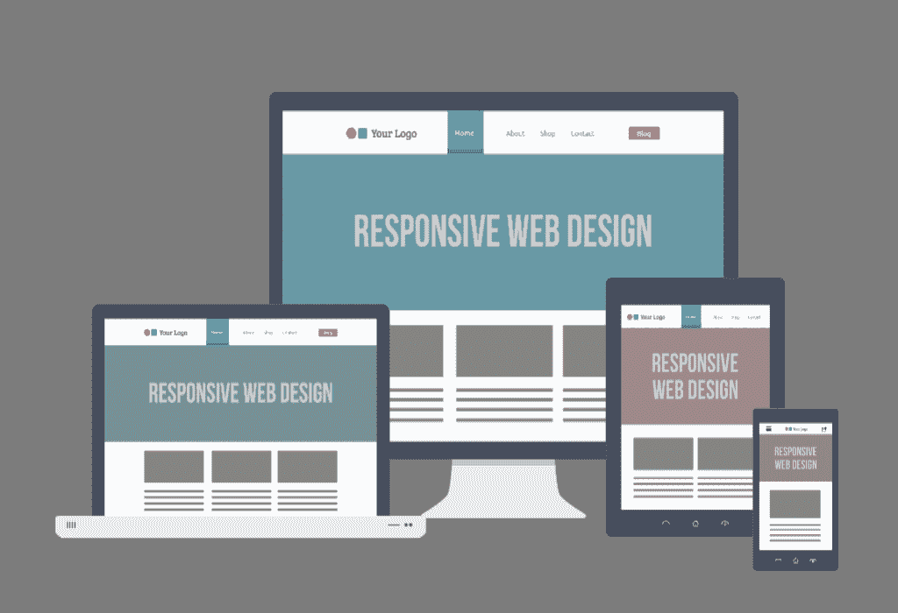

# Hack is it On |网上成功的网页设计

> 原文：<https://www.hackisition.com/how-i-would-growth-hack-a-barbershop/?utm_source=wanqu.co&utm_campaign=Wanqu+Daily&utm_medium=website>

组织一个博客很容易。你只需要有一个域名，一个在线主机，然后你必须在你的服务器上设置你的设置。这听起来像是在这段时间里要教很多新的东西，尤其是如果你碰巧对博客世界还很陌生的话，但是不要担心，这实际上是一个简单的过程，而且更好的是，只需要几分钟就可以完成。去网上的网站管理员社区，有很多人非常乐意帮助你。

使用项目符号和编号便于浏览 2。我的网站会进行 SEO 优化吗？2012 年 3 月的新特点上述做法的一个例子:5。由于贵公司的内部政治，内部设计师可能会提供延迟服务，而外部代理不受任何政治影响，与相关客户公司的内部保险政策无关。

## 四)清晰的沟通和实施。

网站开发主要指的是为互联网创建一个网站的全部活动，包括互联网内容开发、网页设计、网络服务器、消费者和服务器方面的脚本编制、社区配置和电子商务开发。互联网开发小组由多个网络建设者组成，而网络改进是许多部门合作的结果。

1.留白——你需要避免互联网网页上过多的内容和图片。必须给予呼吸空间，使页面看起来更整洁和用户愉快。动画照片和图形使网页看起来杂乱不堪。此外，使用较少和适当的文本内容，使您的网页看起来信息丰富，引人入胜。

## 选择菲律宾人已经是一个全包了。

你想创建自己的个人网站，而不用向任何人支付一分钱吗？如果你不是一个精通技术的人，你可能不确定从哪里开始。但是如果你有合适的数据，这可能会很容易。这篇文章为你提供了五个简单的步骤来获得你的个人域名，这是第一步，在你开始建立你的个人网站之前就开始做是很重要的。

不要期望第一天就有大量的现金滚滚而来，但是随着时间的推移，你可能会开发出可以变成一件大事的商品。给自己多一些获得现金的选择。这也是一种让你看看新想法的方式，看看它们是否可行。刚刚开始的小规模创业可能会帮助你更多地学习如何建立一个真正的企业。

## 结论

每个人都知道 HTML5 的特性和 CSS3 惊人的能力，但是这就足够了吗？就像在维恩图中一样，这些域可能在某些特征上重叠，但大部分保持完全不同。除了角色之外，他们还应该了解彼此的能力。