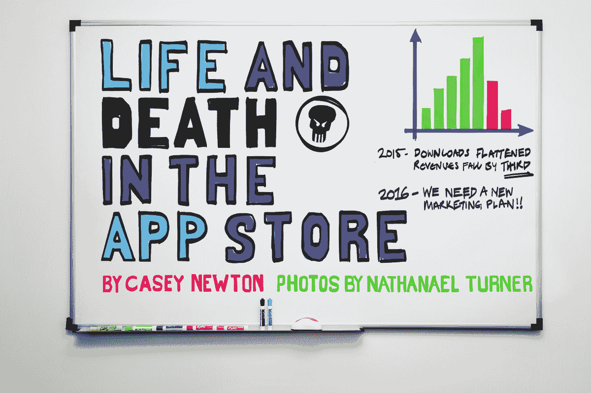
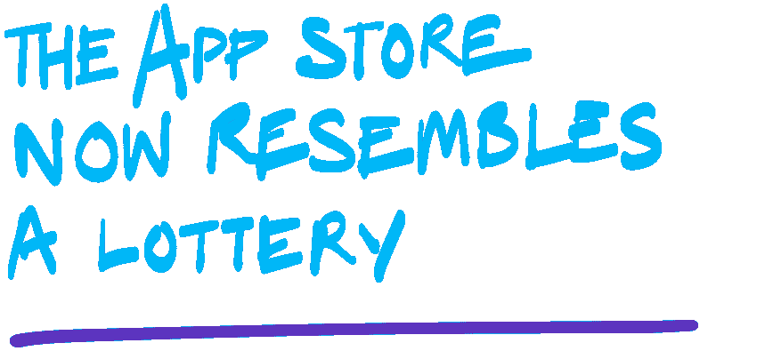
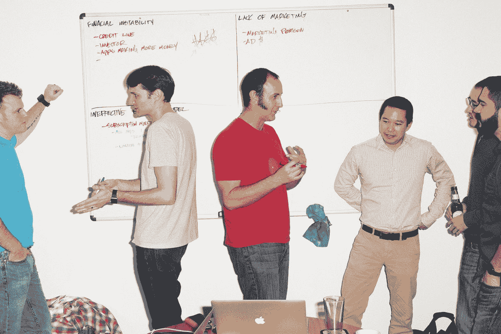

# App Store 的生死存亡——The Verge

> 原文：<https://www.theverge.com/2016/3/2/11140928/app-store-economy-apple-android-pixite-bankruptcy?utm_source=wanqu.co&utm_campaign=Wanqu+Daily&utm_medium=website>

<picture class="c-picture" data-cid="site/picture_element-1668357619_5907_156841" data-cdata="{&quot;asset_id&quot;:6132351,&quot;ratio&quot;:&quot;*&quot;}"><source srcset="https://cdn.vox-cdn.com/thumbor/IHsnVAWvLYBTJznCPv_Qo0UZ3co=/0x0:5760x3840/320x0/filters:focal(0x0:5760x3840):format(webp):no_upscale()/cdn.vox-cdn.com/uploads/chorus_asset/file/6132351/jbareham_160301_0963_0001_FIN_03.0.png 320w, https://cdn.vox-cdn.com/thumbor/Wjx8xsII-dHmYCNi8SV2K9mRg5A=/0x0:5760x3840/520x0/filters:focal(0x0:5760x3840):format(webp):no_upscale()/cdn.vox-cdn.com/uploads/chorus_asset/file/6132351/jbareham_160301_0963_0001_FIN_03.0.png 520w, https://cdn.vox-cdn.com/thumbor/AMKIZGauduXQoKt1FLfE3_Pvzsc=/0x0:5760x3840/720x0/filters:focal(0x0:5760x3840):format(webp):no_upscale()/cdn.vox-cdn.com/uploads/chorus_asset/file/6132351/jbareham_160301_0963_0001_FIN_03.0.png 720w, https://cdn.vox-cdn.com/thumbor/M65AH_u7iZlHQD5wQ36no8tjKdM=/0x0:5760x3840/920x0/filters:focal(0x0:5760x3840):format(webp):no_upscale()/cdn.vox-cdn.com/uploads/chorus_asset/file/6132351/jbareham_160301_0963_0001_FIN_03.0.png 920w, https://cdn.vox-cdn.com/thumbor/LTlYO26Ox3DjNZYF6NGD-tueLyg=/0x0:5760x3840/1120x0/filters:focal(0x0:5760x3840):format(webp):no_upscale()/cdn.vox-cdn.com/uploads/chorus_asset/file/6132351/jbareham_160301_0963_0001_FIN_03.0.png 1120w, https://cdn.vox-cdn.com/thumbor/Ot8hSug8Kkskh581NVq_by8ZZZk=/0x0:5760x3840/1320x0/filters:focal(0x0:5760x3840):format(webp):no_upscale()/cdn.vox-cdn.com/uploads/chorus_asset/file/6132351/jbareham_160301_0963_0001_FIN_03.0.png 1320w, https://cdn.vox-cdn.com/thumbor/sf02kRBC5_MTaqFff7p-d8Kf2Q0=/0x0:5760x3840/1520x0/filters:focal(0x0:5760x3840):format(webp):no_upscale()/cdn.vox-cdn.com/uploads/chorus_asset/file/6132351/jbareham_160301_0963_0001_FIN_03.0.png 1520w, https://cdn.vox-cdn.com/thumbor/j7RCppOWpivpS7vIi92nWqUjBnY=/0x0:5760x3840/1720x0/filters:focal(0x0:5760x3840):format(webp):no_upscale()/cdn.vox-cdn.com/uploads/chorus_asset/file/6132351/jbareham_160301_0963_0001_FIN_03.0.png 1720w, https://cdn.vox-cdn.com/thumbor/7Uh17bN5S2cSGnxxisQw8DqGFyc=/0x0:5760x3840/1920x0/filters:focal(0x0:5760x3840):format(webp):no_upscale()/cdn.vox-cdn.com/uploads/chorus_asset/file/6132351/jbareham_160301_0963_0001_FIN_03.0.png 1920w" sizes="(min-width: 1221px) 846px, (min-width: 880px) calc(100vw - 334px), 100vw" type="image/webp">  </picture> 

**去年年初，**应用开发者 [Pixite](http://pixiteapps.com/) 在棕榈泉外一个由旧西部电影布景改造而成的地方举行了公司务虚会。他们花了几天时间，一边在阳光下吃烧烤、喝威士忌，一边梦想着未来。但 2015 年并不是一个好年景，到上个月，该公司的梦想已经缩小到生存。今年的务虚会在该公司位于圣地亚哥的办公室举行，几个房间位于一家发廊的上方。打印机坏了，所以议程通过电子邮件分发。

“很抱歉这被称为静修，我们还在办公室里，”该公司的联合创始人之一尤金·金子(Eugene Kaneko)在为期一天的会议开始时说。该公司的六名员工对着他们的笔记本电脑皱眉，谷歌文档中的数字显示数字在稳步下降。“如果钱多一点，我们就在沙漠里了。不幸的是——事实并非如此。”

自 2009 年 Kaneko 与 Scott Sykora 一起创立该公司以来，Pixite 已经发布了 8 款致力于照片编辑和设计的应用程序。每一款都被苹果评为最佳新应用；照片编辑器 Tangent 和设计工具组装获得了苹果公司的年终奖。2013 年至 2014 年间，Pixite 应用的下载量从 395，472 次跃升至 310 万次，年收入翻了一番，达到 943，000 美元。Pixite 随着其现金流的增长而增长，在探索将其应用程序连接在一起的方法并发展忠实的客户群时，员工从 2 人扩大到 6 人。

然后底部掉了出来。去年下载量持平，Pixite 的收入下降了三分之一，至 62.9 万美元。突然，一家需要每天赚 2000 美元才能收支平衡的公司发现自己只能赚 1000 美元甚至更少。Pixite 没有可依赖的风险资本储备；除了来自卡内基梅隆大学校友企业家基金的 50，000 美元种子投资外，Pixite 还自筹资金。

去年 12 月，金子突然给我发了封电子邮件。他当时并不知道，但我是该公司应用程序的粉丝:Fragment 是我最喜欢的艺术工具之一，它将棱镜效果应用于照片。“作为一家独立的自举应用公司，我们正在挣扎，”Kaneko 写道。"如果情况没有好转，我们将需要在接下来的几个月里裁掉一半的员工。"他邀请我去圣地亚哥近距离观察这场斗争。Kaneko 会打开 Pixite 的书，分享我要求的每一条数据，而在两天的时间里，他的团队把自己锁在一个房间里，试图绘制一条前进的道路。Pixite 要么搞清楚，要么死掉。

<picture class="c-picture" data-cid="site/picture_element-1668357619_3888_156843" data-cdata="{&quot;asset_id&quot;:6128979,&quot;ratio&quot;:&quot;*&quot;}"><source srcset="https://cdn.vox-cdn.com/thumbor/Bhf3FxX_b-skswg90HGhnHeGbww=/0x0:2500x1667/320x0/filters:focal(0x0:2500x1667):format(webp):no_upscale()/cdn.vox-cdn.com/uploads/chorus_asset/file/6128979/_NJT6056.0.jpg 320w, https://cdn.vox-cdn.com/thumbor/xObREPJYi_QwKWl6gFQx8sK7taM=/0x0:2500x1667/520x0/filters:focal(0x0:2500x1667):format(webp):no_upscale()/cdn.vox-cdn.com/uploads/chorus_asset/file/6128979/_NJT6056.0.jpg 520w, https://cdn.vox-cdn.com/thumbor/uTQOptcxYaDRr8tZPiaiY9Rb80I=/0x0:2500x1667/720x0/filters:focal(0x0:2500x1667):format(webp):no_upscale()/cdn.vox-cdn.com/uploads/chorus_asset/file/6128979/_NJT6056.0.jpg 720w, https://cdn.vox-cdn.com/thumbor/tjKneGVSPWO0ZtQMs2Owsjc4eqI=/0x0:2500x1667/920x0/filters:focal(0x0:2500x1667):format(webp):no_upscale()/cdn.vox-cdn.com/uploads/chorus_asset/file/6128979/_NJT6056.0.jpg 920w, https://cdn.vox-cdn.com/thumbor/3CSOP80m-VbrDmL9SDPByO9-JMU=/0x0:2500x1667/1120x0/filters:focal(0x0:2500x1667):format(webp):no_upscale()/cdn.vox-cdn.com/uploads/chorus_asset/file/6128979/_NJT6056.0.jpg 1120w, https://cdn.vox-cdn.com/thumbor/fJsUuKTyD34oTnvG8ndrRcmjUiY=/0x0:2500x1667/1320x0/filters:focal(0x0:2500x1667):format(webp):no_upscale()/cdn.vox-cdn.com/uploads/chorus_asset/file/6128979/_NJT6056.0.jpg 1320w, https://cdn.vox-cdn.com/thumbor/pGa49emz4OY7QmsaA3ZpCbNRSUM=/0x0:2500x1667/1520x0/filters:focal(0x0:2500x1667):format(webp):no_upscale()/cdn.vox-cdn.com/uploads/chorus_asset/file/6128979/_NJT6056.0.jpg 1520w, https://cdn.vox-cdn.com/thumbor/FKsoAQD-UgoWS-BRoKPRLgP3ELw=/0x0:2500x1667/1720x0/filters:focal(0x0:2500x1667):format(webp):no_upscale()/cdn.vox-cdn.com/uploads/chorus_asset/file/6128979/_NJT6056.0.jpg 1720w, https://cdn.vox-cdn.com/thumbor/G4E-VBnI1z-sCtbP9SWyGooKIlM=/0x0:2500x1667/1920x0/filters:focal(0x0:2500x1667):format(webp):no_upscale()/cdn.vox-cdn.com/uploads/chorus_asset/file/6128979/_NJT6056.0.jpg 1920w" sizes="(min-width: 1221px) 846px, (min-width: 880px) calc(100vw - 334px), 100vw" type="image/webp">  </picture> 

**上个月，苹果宣布自 App Store 开业以来已向开发者支付了 400 亿美元，称该商店负责“创造和支持”190 万个美国就业岗位。超过五十万的 iOS 开发者已经开发了应用程序；该公司的全球开发者大会如此受欢迎，以至于门票不得不通过抽奖来分发。“[苹果]成就了我们的公司，”赛科拉说。“如果苹果不存在，我们根本就不会有公司。”应用程序市场正在增长:根据市场研究公司 App Annie 的数据，到 2020 年，iOS、Android 和较小平台之间的应用程序每年可以产生 1010 亿美元的收入[。](http://blog.appannie.com/app-annie-releases-inaugural-mobile-app-forecast/)**

但是 App Store 的中产阶级很少，而且还在萎缩。容易赚到的钱也没了。

有一段时间，Pixite 是应用经济促成商业的光辉典范。像成千上万的其他开发人员一样，Pixite 的创始人把一个副业项目变成了一个成熟的职业。但该公司最近的财务问题表明，该行业朝着整合和公司化方向发生了一系列强有力的转变。

对于除了少数开发者之外的所有人来说，App Store 本身现在就像一个彩票:对于每一个像 *Candy Crush* 这样的突破性成功，数百甚至数千个应用程序都默默无闻。应用经济的某些部分仍然充满活力——甚至利润高得离谱。大型社交网络、优步等点播服务以及网飞和 Spotify 等订阅业务的应用需求仍然很高。然后是游戏:根据 App Annie 的数据，去年，85%的应用收入来自游戏。《T2》《部落冲突》《T3》票房最高的开发商 Supercell 报告 2014 年收入为 17 亿美元。(它在营销上花了 4.4 亿美元。)

<aside class="float-left">

<picture class="c-picture" data-cid="site/picture_element-1668357619_3287_156844" data-cdata="{&quot;asset_id&quot;:6129727,&quot;ratio&quot;:&quot;*&quot;}"><source srcset="https://cdn.vox-cdn.com/thumbor/TJ8agz3nAje3UhyHdA6WPCfBguw=/0x0:868x395/320x0/filters:focal(0x0:868x395):format(webp):no_upscale()/cdn.vox-cdn.com/uploads/chorus_asset/file/6129727/vrg_pixite_0963_pullquote_06_cr__1_.0.png 320w, https://cdn.vox-cdn.com/thumbor/lbAaZBbPa6I-vruDhpr3cVZsEXA=/0x0:868x395/520x0/filters:focal(0x0:868x395):format(webp):no_upscale()/cdn.vox-cdn.com/uploads/chorus_asset/file/6129727/vrg_pixite_0963_pullquote_06_cr__1_.0.png 520w, https://cdn.vox-cdn.com/thumbor/-XqZ82-YXRAjwvXqVZjtHsuRNWE=/0x0:868x395/720x0/filters:focal(0x0:868x395):format(webp):no_upscale()/cdn.vox-cdn.com/uploads/chorus_asset/file/6129727/vrg_pixite_0963_pullquote_06_cr__1_.0.png 720w, https://cdn.vox-cdn.com/thumbor/nxk25HypcOJY5v5rmoHxWMdRarU=/0x0:868x395/920x0/filters:focal(0x0:868x395):format(webp):no_upscale()/cdn.vox-cdn.com/uploads/chorus_asset/file/6129727/vrg_pixite_0963_pullquote_06_cr__1_.0.png 920w, https://cdn.vox-cdn.com/thumbor/NQ9uya1IPIwbX357XGhmzxaKrPI=/0x0:868x395/1120x0/filters:focal(0x0:868x395):format(webp):no_upscale()/cdn.vox-cdn.com/uploads/chorus_asset/file/6129727/vrg_pixite_0963_pullquote_06_cr__1_.0.png 1120w, https://cdn.vox-cdn.com/thumbor/PJoUtTBlPYyTsEEpSiLZaMfSGkE=/0x0:868x395/1320x0/filters:focal(0x0:868x395):format(webp):no_upscale()/cdn.vox-cdn.com/uploads/chorus_asset/file/6129727/vrg_pixite_0963_pullquote_06_cr__1_.0.png 1320w, https://cdn.vox-cdn.com/thumbor/cZLyOKDbZTm2q4oT3lWiIeoyCgs=/0x0:868x395/1520x0/filters:focal(0x0:868x395):format(webp):no_upscale()/cdn.vox-cdn.com/uploads/chorus_asset/file/6129727/vrg_pixite_0963_pullquote_06_cr__1_.0.png 1520w, https://cdn.vox-cdn.com/thumbor/tm7z1fHI6RWgBn1T7lpdkGQKT7U=/0x0:868x395/1720x0/filters:focal(0x0:868x395):format(webp):no_upscale()/cdn.vox-cdn.com/uploads/chorus_asset/file/6129727/vrg_pixite_0963_pullquote_06_cr__1_.0.png 1720w, https://cdn.vox-cdn.com/thumbor/LPPb647T3EBvioP3p8Xnhfw8y_g=/0x0:868x395/1920x0/filters:focal(0x0:868x395):format(webp):no_upscale()/cdn.vox-cdn.com/uploads/chorus_asset/file/6129727/vrg_pixite_0963_pullquote_06_cr__1_.0.png 1920w" sizes="(min-width: 1221px) 846px, (min-width: 880px) calc(100vw - 334px), 100vw" type="image/webp">  </picture> 

</aside>

但对于这些应用开发者中的一大部分人来说——尤其是那些没有风险资本和复杂营销策略的人——以一两美元出售应用的原始应用商店模式看起来已经过时了。2011 年，63%的应用是付费下载，平均售价为 3.64 美元。到去年，只有 27%的下载是付费的，[的平均价格已经下降到 1.27 美元。如今，从 App Store 中获利通常需要结合应用内购买、订阅和广告。](http://www.ibtimes.co.uk/apple-app-store-growing-by-over-1000-apps-per-day-1504801)

与此同时，消费者开始感到疲劳。现在 App Store 中有超过 150 万个应用程序(Android 用户有 160 万个可供选择)，但到 2014 年，大多数美国人每月[下载零个应用程序](http://qz.com/253618/most-smartphone-users-download-zero-apps-per-month/)。事实证明，人们根本不使用他们*下载的大多数应用程序。根据 ComScore 的数据，普通人在移动设备上花费 80%的时间，只使用三个应用程序。*

利润丰厚的新软件平台很少出现——但一旦出现，消费者就会争相用实用程序、生产力工具和游戏来填满它们。然而，淘金热只持续了这么长时间。红点风险投资公司的风险投资家 Ryan Sarver 说:“过了一段时间，应用程序的饱和就赶上了用户的增长。”。“人们不再搜索——他们已经有了他们需要的应用程序。”

消费者对应用程序的厌倦是硅谷的精明投资者去年开始转向消息应用程序和机器人的一个关键原因，许多观察家认为这可能代表互联网的下一个阶段。没有人能可信地说 App Store 正在消亡。但是消费软件的机会范围已经大大缩小了——只有“几条泳道”, VenRock VC 的大卫·帕克曼告诉我。

因此，随着 Pixite 的现场和场外活动开始，Kaneko 带来了令人沮丧的消息。“我们的现金储备很少，”他说。“2015 年初，我们以 30 万美元起步。现在我们银行里只有 10 万美元。”

Sykora 在他的笔记本电脑上查看 Pixite 应用销售的一系列图表。每张图表都讲述着同样的故事。“所有的应用都在慢慢漂移，”Sykora 说。“下去，下去，下去。”

<picture class="c-picture" data-cid="site/picture_element-1668357619_1453_156845" data-cdata="{&quot;asset_id&quot;:6129003,&quot;ratio&quot;:&quot;*&quot;}"><source srcset="https://cdn.vox-cdn.com/thumbor/idGCB_w9NUor-vFSxAZFCWO_I08=/0x0:2500x1668/320x0/filters:focal(0x0:2500x1668):format(webp):no_upscale()/cdn.vox-cdn.com/uploads/chorus_asset/file/6129003/_NJT6141.0.jpg 320w, https://cdn.vox-cdn.com/thumbor/XCSYoBTZaPU8FD4ifIMcP6sEv_U=/0x0:2500x1668/520x0/filters:focal(0x0:2500x1668):format(webp):no_upscale()/cdn.vox-cdn.com/uploads/chorus_asset/file/6129003/_NJT6141.0.jpg 520w, https://cdn.vox-cdn.com/thumbor/s8Tpg43wnvaFXmca8Xm0yW90cNc=/0x0:2500x1668/720x0/filters:focal(0x0:2500x1668):format(webp):no_upscale()/cdn.vox-cdn.com/uploads/chorus_asset/file/6129003/_NJT6141.0.jpg 720w, https://cdn.vox-cdn.com/thumbor/PqTJSUX034-gf4ml5ZghjA8xSFY=/0x0:2500x1668/920x0/filters:focal(0x0:2500x1668):format(webp):no_upscale()/cdn.vox-cdn.com/uploads/chorus_asset/file/6129003/_NJT6141.0.jpg 920w, https://cdn.vox-cdn.com/thumbor/Rca2gbiMiBJ0y0YqjO3oVGChnrs=/0x0:2500x1668/1120x0/filters:focal(0x0:2500x1668):format(webp):no_upscale()/cdn.vox-cdn.com/uploads/chorus_asset/file/6129003/_NJT6141.0.jpg 1120w, https://cdn.vox-cdn.com/thumbor/H4p-L9a1NBcPKVZ_uLx6ITsoOdA=/0x0:2500x1668/1320x0/filters:focal(0x0:2500x1668):format(webp):no_upscale()/cdn.vox-cdn.com/uploads/chorus_asset/file/6129003/_NJT6141.0.jpg 1320w, https://cdn.vox-cdn.com/thumbor/GWVbOmzmaATB04HIw8GNpvHVLkY=/0x0:2500x1668/1520x0/filters:focal(0x0:2500x1668):format(webp):no_upscale()/cdn.vox-cdn.com/uploads/chorus_asset/file/6129003/_NJT6141.0.jpg 1520w, https://cdn.vox-cdn.com/thumbor/FVseuU4w56hQrRcCftkgqM9yiYk=/0x0:2500x1668/1720x0/filters:focal(0x0:2500x1668):format(webp):no_upscale()/cdn.vox-cdn.com/uploads/chorus_asset/file/6129003/_NJT6141.0.jpg 1720w, https://cdn.vox-cdn.com/thumbor/tKPbzIuJGQLKXLdII3oC-ClY5sQ=/0x0:2500x1668/1920x0/filters:focal(0x0:2500x1668):format(webp):no_upscale()/cdn.vox-cdn.com/uploads/chorus_asset/file/6129003/_NJT6141.0.jpg 1920w" sizes="(min-width: 1221px) 846px, (min-width: 880px) calc(100vw - 334px), 100vw" type="image/webp">  </picture> 

37 岁的 Kaneko 和 34 岁的 Sykora 都在圣地亚哥长大，后来去了北加州学习工程。金子个子矮，散发神经能量；Sykora 身材高挑，传达出一种安静的沉稳。回到圣地亚哥后，两人在从事自由网页设计工作时相遇。一个客户雇佣 Kaneko 为 DJ 建立一个网站来销售他们的节拍，Sykora 同意帮助他建立这个网站。从那以后，他们一直在一起工作。

2008 年 App Store 开业的时候，很多互联网公司都持观望态度。谷歌、脸书、亚马逊和潘多拉都发布了基础应用，但这给独立开发留下了很大空间。据后来被谷歌收购的 AdMob 称，iPhone 用户渴望通过手机获得新的体验，每月下载超过 10 个应用程序。他们也愿意付钱:到 2009 年 7 月，他们每月总共花费 2 亿美元。

在其存在的前 12 个月，App Store 增加了 65，000 个应用程序。许多是游戏，这种趋势一直延续到今天。但是[古怪的独立应用占据了本年度下载量最大软件的首发名单](http://techcrunch.com/2008/12/02/apple-announces-top-10-iphone-app-downloads-of-2008/):最畅销的是一个虚拟的锦鲤池；该列表还包括一个模拟喝啤酒的应用程序。基本的实用工具也有一个蓬勃发展的市场:最畅销的包括水平仪、拼写检查器和录音机。

2009 年 10 月，Kaneko 感觉到了一个机会，建议他和 Sykora 开发一个应用程序来浏览网上存储的图片。谷歌旗下的 Picasa 是那个时代最受欢迎的网络浏览客户端之一，它没有原生的 iPhone 应用程序，其移动网络应用程序也很慢。几个月后，Kaneko 和 Sykora 使用 Picasa 的公共 API 为 Picasa 开发了一个 iPhone 应用程序，并以 Web Albums 的名称在 App Store 中销售。

iPhone 出众的相机催生了一代智能手机摄影师，由于 iPhone 允许开发者使用其相机，摄影很快成为了一个受欢迎的应用商店类别。这些照片应用程序中的许多都提供了最终成为 iOS 原生功能的工具:用于裁剪、添加闪光和 HDR 效果的实用程序，以及通过蓝牙共享照片。另一组实用程序专注于在网络上分享你的照片:例如，在 Flickr 上上传和查看照片。

<aside class="float-left">

<picture class="c-picture" data-cid="site/picture_element-1668357620_1001_156847" data-cdata="{&quot;asset_id&quot;:6130547,&quot;ratio&quot;:&quot;*&quot;}"><source srcset="https://cdn.vox-cdn.com/thumbor/GdtxSKPzXjrTiWlYUNSNkRUydbQ=/0x0:781x341/320x0/filters:focal(0x0:781x341):format(webp):no_upscale()/cdn.vox-cdn.com/uploads/chorus_asset/file/6130547/vrg_pixite_0963_pullquote_01_cr.0.png 320w, https://cdn.vox-cdn.com/thumbor/IDQAEBklpjsB6RnSXfyuUctNZo0=/0x0:781x341/520x0/filters:focal(0x0:781x341):format(webp):no_upscale()/cdn.vox-cdn.com/uploads/chorus_asset/file/6130547/vrg_pixite_0963_pullquote_01_cr.0.png 520w, https://cdn.vox-cdn.com/thumbor/M-cfzkwoPOPbZUxcID70dg73xPo=/0x0:781x341/720x0/filters:focal(0x0:781x341):format(webp):no_upscale()/cdn.vox-cdn.com/uploads/chorus_asset/file/6130547/vrg_pixite_0963_pullquote_01_cr.0.png 720w, https://cdn.vox-cdn.com/thumbor/Q5KgAE0FOzMAE9NNEZxEZpBuj-Y=/0x0:781x341/920x0/filters:focal(0x0:781x341):format(webp):no_upscale()/cdn.vox-cdn.com/uploads/chorus_asset/file/6130547/vrg_pixite_0963_pullquote_01_cr.0.png 920w, https://cdn.vox-cdn.com/thumbor/fBAfVFsQIHVX7YUUUD8az8i-_ao=/0x0:781x341/1120x0/filters:focal(0x0:781x341):format(webp):no_upscale()/cdn.vox-cdn.com/uploads/chorus_asset/file/6130547/vrg_pixite_0963_pullquote_01_cr.0.png 1120w, https://cdn.vox-cdn.com/thumbor/u9bGOFHXQ9xDxJqtfauha8SwpOI=/0x0:781x341/1320x0/filters:focal(0x0:781x341):format(webp):no_upscale()/cdn.vox-cdn.com/uploads/chorus_asset/file/6130547/vrg_pixite_0963_pullquote_01_cr.0.png 1320w, https://cdn.vox-cdn.com/thumbor/BpyJ0ej7lL58BX6gPcLRhdQwvao=/0x0:781x341/1520x0/filters:focal(0x0:781x341):format(webp):no_upscale()/cdn.vox-cdn.com/uploads/chorus_asset/file/6130547/vrg_pixite_0963_pullquote_01_cr.0.png 1520w, https://cdn.vox-cdn.com/thumbor/etudq2EI_239XwnZfzBLw-eJPLI=/0x0:781x341/1720x0/filters:focal(0x0:781x341):format(webp):no_upscale()/cdn.vox-cdn.com/uploads/chorus_asset/file/6130547/vrg_pixite_0963_pullquote_01_cr.0.png 1720w, https://cdn.vox-cdn.com/thumbor/G9ziebTcGlh1Xt2m4VOtXnxkn1g=/0x0:781x341/1920x0/filters:focal(0x0:781x341):format(webp):no_upscale()/cdn.vox-cdn.com/uploads/chorus_asset/file/6130547/vrg_pixite_0963_pullquote_01_cr.0.png 1920w" sizes="(min-width: 1221px) 846px, (min-width: 880px) calc(100vw - 334px), 100vw" type="image/webp">  </picture> 

</aside>

正是在这最后一群人中，Kaneko 和 Sykora 看到了他们的机会——而且这个机会比他们想象的要大。两人希望他们 99 美分的应用程序可以在他们从事其他项目时每天带来几美元。相反，在 App Store 的第一个全年，网络相册带来了 13 万美元的收入。“一开始是:‘太棒了！“这是我收入中相当可观的一部分，我应该在这上面花更多的时间，”Sykora 说。“然后就像是:‘我可能不应该接受每一份自由职业。’然后:“我不应该从事任何自由职业。”然后我开始摆脱客户。那是一系列令人敬畏的转变。"

网络相册是一个简单的工具，但利润惊人。原来，Picasa 的网络应用程序只允许用户查看相册中的前 100 张照片；网络相册没有这样的限制。开发人员只寻求制作一个功能性的客户端；他们不小心造了一个更好的。在几乎没有竞争的情况下，网络相册成为 Picasa 应用商店搜索的第一结果——这对销售是一个无价的推动。一个简单的想法，执行得很好，但没什么天赋，现在养活了两个家庭。

<picture class="c-picture" data-cid="site/picture_element-1668357620_59_156848" data-cdata="{&quot;asset_id&quot;:6129311,&quot;ratio&quot;:&quot;*&quot;}"><source srcset="https://cdn.vox-cdn.com/thumbor/9t69NThusf6IGDVDQTkNNihi7dM=/0x0:2552x1687/320x0/filters:focal(0x0:2552x1687):format(webp):no_upscale()/cdn.vox-cdn.com/uploads/chorus_asset/file/6129311/vrg_pixite_0963_group.0.png 320w, https://cdn.vox-cdn.com/thumbor/f513f4nWZmiEoFi8SXUjlrWVm8s=/0x0:2552x1687/520x0/filters:focal(0x0:2552x1687):format(webp):no_upscale()/cdn.vox-cdn.com/uploads/chorus_asset/file/6129311/vrg_pixite_0963_group.0.png 520w, https://cdn.vox-cdn.com/thumbor/H5xsVCNOzGnfWgKctSyOli-_jsQ=/0x0:2552x1687/720x0/filters:focal(0x0:2552x1687):format(webp):no_upscale()/cdn.vox-cdn.com/uploads/chorus_asset/file/6129311/vrg_pixite_0963_group.0.png 720w, https://cdn.vox-cdn.com/thumbor/7jHLpY3SFGD11kqQ1L-IN5CuNbs=/0x0:2552x1687/920x0/filters:focal(0x0:2552x1687):format(webp):no_upscale()/cdn.vox-cdn.com/uploads/chorus_asset/file/6129311/vrg_pixite_0963_group.0.png 920w, https://cdn.vox-cdn.com/thumbor/XzJQQmbzVe8mxaFhFHiGH7ET58A=/0x0:2552x1687/1120x0/filters:focal(0x0:2552x1687):format(webp):no_upscale()/cdn.vox-cdn.com/uploads/chorus_asset/file/6129311/vrg_pixite_0963_group.0.png 1120w, https://cdn.vox-cdn.com/thumbor/PTtBjId5FSDi1KeAuhFOyLBJlbA=/0x0:2552x1687/1320x0/filters:focal(0x0:2552x1687):format(webp):no_upscale()/cdn.vox-cdn.com/uploads/chorus_asset/file/6129311/vrg_pixite_0963_group.0.png 1320w, https://cdn.vox-cdn.com/thumbor/fueSgjpO43HZK8mTQ7o4N1ZGjuc=/0x0:2552x1687/1520x0/filters:focal(0x0:2552x1687):format(webp):no_upscale()/cdn.vox-cdn.com/uploads/chorus_asset/file/6129311/vrg_pixite_0963_group.0.png 1520w, https://cdn.vox-cdn.com/thumbor/nW8BV6e-jQXWBp84iRKHbDm19rs=/0x0:2552x1687/1720x0/filters:focal(0x0:2552x1687):format(webp):no_upscale()/cdn.vox-cdn.com/uploads/chorus_asset/file/6129311/vrg_pixite_0963_group.0.png 1720w, https://cdn.vox-cdn.com/thumbor/jtxSSIPyInUBx7lAkzHw6lPB-f0=/0x0:2552x1687/1920x0/filters:focal(0x0:2552x1687):format(webp):no_upscale()/cdn.vox-cdn.com/uploads/chorus_asset/file/6129311/vrg_pixite_0963_group.0.png 1920w" sizes="(min-width: 1221px) 846px, (min-width: 880px) calc(100vw - 334px), 100vw" type="image/webp">  </picture> 

从左至右:创意总监本·格雷特(Ben Guerrette)；尤金·金子，产品经理；首席开发人员 Scott Sykora

它不能持续。他们知道这不会长久。毫无疑问，谷歌有一个工程师团队正在研究其*自己的*版本的网络相册，一夜之间抹去他们的销售额？(事实上，谷歌照片要到 2015 年年中才会出现。)“我们会被炸出水面，我们会死的，”金子回忆当时的想法。这将 Pixite 置于一个奇怪的位置。“通常情况下，在一项业务中，你会把钱投回给你的主要赚钱机器，”Sykora 说。“我们当时的情况是，‘我们需要停止在这件事上投入时间，强迫自己离开，想想下一步该怎么做。’”Kaneko 和 Sykora 合并了 pix ite——“pixel”和“excite”的组合——并着手寻找答案。

<aside class="float-left">

<picture class="c-picture" data-cid="site/picture_element-1668357620_9489_156849" data-cdata="{&quot;asset_id&quot;:6130561,&quot;ratio&quot;:&quot;*&quot;}"><source srcset="https://cdn.vox-cdn.com/thumbor/rzKD1_XAnfBlZ5syZsZxh_pHR9g=/0x0:800x315/320x0/filters:focal(0x0:800x315):format(webp):no_upscale()/cdn.vox-cdn.com/uploads/chorus_asset/file/6130561/vrg_pixite_0963_pullquote_08_cr.0.png 320w, https://cdn.vox-cdn.com/thumbor/_1_oxPS11sXrB0GhrTwMlHRkaB4=/0x0:800x315/520x0/filters:focal(0x0:800x315):format(webp):no_upscale()/cdn.vox-cdn.com/uploads/chorus_asset/file/6130561/vrg_pixite_0963_pullquote_08_cr.0.png 520w, https://cdn.vox-cdn.com/thumbor/RNsCFKy6lVy45kln686xnQVGw6k=/0x0:800x315/720x0/filters:focal(0x0:800x315):format(webp):no_upscale()/cdn.vox-cdn.com/uploads/chorus_asset/file/6130561/vrg_pixite_0963_pullquote_08_cr.0.png 720w, https://cdn.vox-cdn.com/thumbor/8kJhChUp5UDkKTMx8deUkB449pE=/0x0:800x315/920x0/filters:focal(0x0:800x315):format(webp):no_upscale()/cdn.vox-cdn.com/uploads/chorus_asset/file/6130561/vrg_pixite_0963_pullquote_08_cr.0.png 920w, https://cdn.vox-cdn.com/thumbor/9i8VFr0LN6PFIJPus2SLmh9YKgo=/0x0:800x315/1120x0/filters:focal(0x0:800x315):format(webp):no_upscale()/cdn.vox-cdn.com/uploads/chorus_asset/file/6130561/vrg_pixite_0963_pullquote_08_cr.0.png 1120w, https://cdn.vox-cdn.com/thumbor/u7HWGXXt0yh6cJVFoRWbfkUxzmw=/0x0:800x315/1320x0/filters:focal(0x0:800x315):format(webp):no_upscale()/cdn.vox-cdn.com/uploads/chorus_asset/file/6130561/vrg_pixite_0963_pullquote_08_cr.0.png 1320w, https://cdn.vox-cdn.com/thumbor/wmRTWJQZjnoAQaTCjjOOUvH9qGo=/0x0:800x315/1520x0/filters:focal(0x0:800x315):format(webp):no_upscale()/cdn.vox-cdn.com/uploads/chorus_asset/file/6130561/vrg_pixite_0963_pullquote_08_cr.0.png 1520w, https://cdn.vox-cdn.com/thumbor/iZENHJijtwz_1OLA0IagTPYRyTg=/0x0:800x315/1720x0/filters:focal(0x0:800x315):format(webp):no_upscale()/cdn.vox-cdn.com/uploads/chorus_asset/file/6130561/vrg_pixite_0963_pullquote_08_cr.0.png 1720w, https://cdn.vox-cdn.com/thumbor/Vq-yuyRtdIBCEttIwuHsyuaNRsU=/0x0:800x315/1920x0/filters:focal(0x0:800x315):format(webp):no_upscale()/cdn.vox-cdn.com/uploads/chorus_asset/file/6130561/vrg_pixite_0963_pullquote_08_cr.0.png 1920w" sizes="(min-width: 1221px) 846px, (min-width: 880px) calc(100vw - 334px), 100vw" type="image/webp">  </picture> 

</aside>

他们在圣地亚哥的一个合作空间里找到了它，以本·格雷特的形式。Guerrette 是一名自学成才的设计师、开发人员和数字艺术家，他构建了一种创造性的工具来定义 Pixite。Deco Sketch 可以让你绘制简单的形状并制作动画，尽管它从未赚到多少钱，但它帮助 Guerrette 在 Instagram 上与不断增长的 iPhone 摄影师和编辑社区建立了联系。到 2013 年，Guerrette 在 3rdSpace 工作，这是一家圣地亚哥的合作“创意俱乐部”, Pixite 在那里开设了店铺。

在推出网络相册后，Pixite 试图通过制作一系列类似的照片工具来重复其最初的成功。2010 年至 2012 年期间，当科技界仍在追赶原生应用的想法时，Pixite 为脸书、Flickr 和 Dropbox 开发并销售了各种乏味的照片查看和上传工具。(出于乐观，2011 年 Pixite 还开发了一个应用程序，可以将你在脸书的照片传输到当时新兴的社交网络 Google+。)

对于 App Store 来说，这是一个疯狂扩张的时代——以及巨大的文化影响。2010 年，App Store 增加到 225，000 个应用程序，正如美国方言协会将“App”命名为年度词汇一样。Supercell 那年在赫尔辛基成立；两年后，[它的游戏每天产生 240 万美元的收入。优步的推出，催生了一个新的按需服务类别。第二年，商店庆祝了它的](http://www.forbes.com/sites/karstenstrauss/2013/04/18/the-2-4-million-per-day-company-supercell/#698a7c7a7ba9)[第 100 亿次下载](http://www.apple.com/pr/library/2011/07/07Apples-App-Store-Downloads-Top-15-Billion.html)。风险投资家对应用经济的兴趣也随之而来。凯鹏华盈(Kleiner Perkins Caufield Byers)是硅谷最负盛名的风险投资公司之一，2011 年，它在应用程序方面的投资增加了两倍，达到 3 亿美元。其中一项投资是成立三年的游戏公司 Ngmoco，该公司当年以 4 亿美元的价格卖给了日本的 DeNA。

<aside class="float-right">

<picture class="c-picture" data-cid="site/picture_element-1668357620_4661_156850" data-cdata="{&quot;asset_id&quot;:6129667,&quot;ratio&quot;:&quot;*&quot;}"><source srcset="https://cdn.vox-cdn.com/thumbor/kW7ONpYYsnz30L9UefdtcSgX_Zc=/0x0:712x257/320x0/filters:focal(0x0:712x257):format(webp):no_upscale()/cdn.vox-cdn.com/uploads/chorus_asset/file/6129667/vrg_pixite_0963_pullquote_04_cr.0.png 320w, https://cdn.vox-cdn.com/thumbor/mKmJoPSXxQpbOhctlylkzW4jhsY=/0x0:712x257/520x0/filters:focal(0x0:712x257):format(webp):no_upscale()/cdn.vox-cdn.com/uploads/chorus_asset/file/6129667/vrg_pixite_0963_pullquote_04_cr.0.png 520w, https://cdn.vox-cdn.com/thumbor/v2jWyr3CCJY-D6LYBdV-QaDaW90=/0x0:712x257/720x0/filters:focal(0x0:712x257):format(webp):no_upscale()/cdn.vox-cdn.com/uploads/chorus_asset/file/6129667/vrg_pixite_0963_pullquote_04_cr.0.png 720w, https://cdn.vox-cdn.com/thumbor/3gE7siUMRNvzOHga7ZOjPAMY7F4=/0x0:712x257/920x0/filters:focal(0x0:712x257):format(webp):no_upscale()/cdn.vox-cdn.com/uploads/chorus_asset/file/6129667/vrg_pixite_0963_pullquote_04_cr.0.png 920w, https://cdn.vox-cdn.com/thumbor/P7ci_QZUx8Qluk9vM-7BdItUPJo=/0x0:712x257/1120x0/filters:focal(0x0:712x257):format(webp):no_upscale()/cdn.vox-cdn.com/uploads/chorus_asset/file/6129667/vrg_pixite_0963_pullquote_04_cr.0.png 1120w, https://cdn.vox-cdn.com/thumbor/tVXx1oCrnLHfzFDC9pHe-B214Rw=/0x0:712x257/1320x0/filters:focal(0x0:712x257):format(webp):no_upscale()/cdn.vox-cdn.com/uploads/chorus_asset/file/6129667/vrg_pixite_0963_pullquote_04_cr.0.png 1320w, https://cdn.vox-cdn.com/thumbor/77QZeLkjwrkArX7O2MRqN6g7OZU=/0x0:712x257/1520x0/filters:focal(0x0:712x257):format(webp):no_upscale()/cdn.vox-cdn.com/uploads/chorus_asset/file/6129667/vrg_pixite_0963_pullquote_04_cr.0.png 1520w, https://cdn.vox-cdn.com/thumbor/QN34xeLFR7kyz80wa-G2BI75nK4=/0x0:712x257/1720x0/filters:focal(0x0:712x257):format(webp):no_upscale()/cdn.vox-cdn.com/uploads/chorus_asset/file/6129667/vrg_pixite_0963_pullquote_04_cr.0.png 1720w, https://cdn.vox-cdn.com/thumbor/YA6y7ypocbtVaX6YzaeVgvdJxVM=/0x0:712x257/1920x0/filters:focal(0x0:712x257):format(webp):no_upscale()/cdn.vox-cdn.com/uploads/chorus_asset/file/6129667/vrg_pixite_0963_pullquote_04_cr.0.png 1920w" sizes="(min-width: 1221px) 846px, (min-width: 880px) calc(100vw - 334px), 100vw" type="image/webp">  </picture> 

</aside>

Pixite 的野心更小。网络相册仍然是该公司的主要业务，但收入正在增长:从 2010 年的 130，086 美元增长到两年后的 368，000 美元。在 3rdSpace，该公司的成功没有被忽视。“我当时想，这些家伙是真材实料，”格雷特回忆道。“他们靠做应用赚钱！”

Guerrette 向 Kaneko 和 Sykora 推荐了一款应用程序，这款应用程序不仅能查看和上传照片，还能创造性地操纵它们。大约在那个时候，一个由 iPhone 摄影师组成的小众社区开始在他们的照片上叠加简单的黑白几何设计，让照片在 Instagram 上流行起来。但这很难做到:你必须从 Dropbox 下载图片到你的手机上，然后使用另一个应用程序将它们叠加在你的图片上。Guerrette 提出了一个应用程序，其中包括作为过滤器的设计，让你直接操作并发布到 Instagram。Guerrette 提议开发的应用程序 Tangent 在三个月后完成。

这款应用出现在 App Store 中——这是所有开发者梦寐以求的极有价值的免费推广。这本书卖了 130 万册。两个更有创意的应用程序紧随其后。2013 年底，苹果将 Tangent 评为年度最佳应用之一。该公司售出了近 40 万台，收入为 461，605 美元。

收入讲述了一个令人惊讶的成功故事。但是 Pixite 的创始人所走的道路会让他们付出代价。事后看来，这些错误是显而易见的:Pixite 开发的应用介于专业设计工具和新奇的消费者应用之间，令人不安。它没能创造出一个与众不同的品牌，而是给每个应用起了一个与之前所有应用都不相关的名字。除了网络相册，使用 App Store 的搜索工具很难找到它的应用，而且该公司从未投资过广告。Pixite 坚持使用一次性购买的商业模式，这导致了繁荣和萧条的永久循环，因为每次推出都会产生一个收入高峰，然后迅速下降。

事情本不必如此。Lightricks 是一家以色列公司，在某些方面与 Pixite 相似。它还制作照片编辑工具，给它们起一个与众不同的名字，并以每件几美元的价格出售。但 Lightricks 也投资了数年来构建其标志性应用 FaceTune 和 Enlight，并在营销上投入巨资。它[编写软件来预测它需要在脸书广告上花多少钱才能保持在畅销书排行榜上，在那里增加的可见性产生了额外的销售额。它的营销由一名拥有人工智能背景的联合创始人监督，营销团队主要由工程师组成，他们每天 24 小时在世界各地开展几十项活动。](http://www.businessinsider.com/how-the-makers-of-facetune-raked-at-least-18-million-in-under-two-years-and-caught-facebooks-eye-2015-8)

<aside class="float-left">

<picture class="c-picture" data-cid="site/picture_element-1668357620_9205_156851" data-cdata="{&quot;asset_id&quot;:6130557,&quot;ratio&quot;:&quot;*&quot;}"><source srcset="https://cdn.vox-cdn.com/thumbor/zRtfSxVPfqxmlQPRqA0bnG9r4oY=/0x0:732x236/320x0/filters:focal(0x0:732x236):format(webp):no_upscale()/cdn.vox-cdn.com/uploads/chorus_asset/file/6130557/vrg_pixite_0963_pullquote_05_cr.0.png 320w, https://cdn.vox-cdn.com/thumbor/pp93VyxRdRIsH55aFpLAO_fmd_A=/0x0:732x236/520x0/filters:focal(0x0:732x236):format(webp):no_upscale()/cdn.vox-cdn.com/uploads/chorus_asset/file/6130557/vrg_pixite_0963_pullquote_05_cr.0.png 520w, https://cdn.vox-cdn.com/thumbor/tlnov7_m7Sf487XomgKe5Ju6vDk=/0x0:732x236/720x0/filters:focal(0x0:732x236):format(webp):no_upscale()/cdn.vox-cdn.com/uploads/chorus_asset/file/6130557/vrg_pixite_0963_pullquote_05_cr.0.png 720w, https://cdn.vox-cdn.com/thumbor/FsLPwDKqKhm1VPKPcf9AyhW6vjU=/0x0:732x236/920x0/filters:focal(0x0:732x236):format(webp):no_upscale()/cdn.vox-cdn.com/uploads/chorus_asset/file/6130557/vrg_pixite_0963_pullquote_05_cr.0.png 920w, https://cdn.vox-cdn.com/thumbor/9aINqeQf5M44FwAZQN9rlncBgko=/0x0:732x236/1120x0/filters:focal(0x0:732x236):format(webp):no_upscale()/cdn.vox-cdn.com/uploads/chorus_asset/file/6130557/vrg_pixite_0963_pullquote_05_cr.0.png 1120w, https://cdn.vox-cdn.com/thumbor/ljUwMQ28jGIAfA8mYil9q2LcMts=/0x0:732x236/1320x0/filters:focal(0x0:732x236):format(webp):no_upscale()/cdn.vox-cdn.com/uploads/chorus_asset/file/6130557/vrg_pixite_0963_pullquote_05_cr.0.png 1320w, https://cdn.vox-cdn.com/thumbor/2iUrW4V5W9OYb8xv2RNqVC_dZ_c=/0x0:732x236/1520x0/filters:focal(0x0:732x236):format(webp):no_upscale()/cdn.vox-cdn.com/uploads/chorus_asset/file/6130557/vrg_pixite_0963_pullquote_05_cr.0.png 1520w, https://cdn.vox-cdn.com/thumbor/A80IGPlnzB1pv2WyA2SI02qnVcM=/0x0:732x236/1720x0/filters:focal(0x0:732x236):format(webp):no_upscale()/cdn.vox-cdn.com/uploads/chorus_asset/file/6130557/vrg_pixite_0963_pullquote_05_cr.0.png 1720w, https://cdn.vox-cdn.com/thumbor/MkQqAJWfmEPdtgYnIOsr5bp2LhU=/0x0:732x236/1920x0/filters:focal(0x0:732x236):format(webp):no_upscale()/cdn.vox-cdn.com/uploads/chorus_asset/file/6130557/vrg_pixite_0963_pullquote_05_cr.0.png 1920w" sizes="(min-width: 1221px) 846px, (min-width: 880px) calc(100vw - 334px), 100vw" type="image/webp">  </picture> 

</aside>

结果是:FaceTune 是一款售价 3.99 美元的自拍应用，在头两年售出了 300 多万份，是 2014 年 App Store 中票房第六高的应用。Enlight 是一个综合的照片编辑器，它结合了各种各样的滤镜和效果，也取得了类似的成功。截至去年，Lightricks 已经雇佣了 45 名员工，年收入有望达到 1000 万美元，[并筹集了 1000 万美元的风险投资](http://techcrunch.com/2015/08/12/lightricks/)。

与此同时，Pixite 的方法使其暴露于隐藏在付费应用商业模式中的另一个风险——失败。Pixite 的目标是每个季度发布一款应用，只给它三个月的时间来设计、编码和发布每款产品。这限制了它的应用程序可以做的范围。由于每年只有四款产品问世，一款设计不当的应用可能会带来灾难性的后果。

该公司在 2014 年发布 Shift 时吸取了这一教训，这是一款很晚才上市的应用程序，用于将彩色滤镜应用于照片。经过四个月的开发，它只获得了 24，000 美元的收入，还不到两周的支出。尽管这是该公司投资移植到 Android 的两个应用程序之一，这一努力尚未产生有意义的销售。

尽管如此，Pixite 在 2014 年以 310 万次下载和近 100 万美元的收入结束。这将是公司的巅峰。

<picture class="c-picture" data-cid="site/picture_element-1668357620_6746_156852" data-cdata="{&quot;asset_id&quot;:6129529,&quot;ratio&quot;:&quot;*&quot;}"><source srcset="https://cdn.vox-cdn.com/thumbor/Hs39l02nU08sAWli0cfGQ7O1aKA=/0x0:2500x1668/320x0/filters:focal(0x0:2500x1668):format(webp):no_upscale()/cdn.vox-cdn.com/uploads/chorus_asset/file/6129529/_NJT6069_02.0.jpg 320w, https://cdn.vox-cdn.com/thumbor/Kn3lWIqeOmhDB9JAbWgYGDNSQ2U=/0x0:2500x1668/520x0/filters:focal(0x0:2500x1668):format(webp):no_upscale()/cdn.vox-cdn.com/uploads/chorus_asset/file/6129529/_NJT6069_02.0.jpg 520w, https://cdn.vox-cdn.com/thumbor/wfhwA0qPS2C8B8r94LLyTFbb4DU=/0x0:2500x1668/720x0/filters:focal(0x0:2500x1668):format(webp):no_upscale()/cdn.vox-cdn.com/uploads/chorus_asset/file/6129529/_NJT6069_02.0.jpg 720w, https://cdn.vox-cdn.com/thumbor/LSOFUme4bO_v_EQ0TEfbS0C_TzM=/0x0:2500x1668/920x0/filters:focal(0x0:2500x1668):format(webp):no_upscale()/cdn.vox-cdn.com/uploads/chorus_asset/file/6129529/_NJT6069_02.0.jpg 920w, https://cdn.vox-cdn.com/thumbor/IPX57FVECRPd8Ap16ZdsUoGOrZY=/0x0:2500x1668/1120x0/filters:focal(0x0:2500x1668):format(webp):no_upscale()/cdn.vox-cdn.com/uploads/chorus_asset/file/6129529/_NJT6069_02.0.jpg 1120w, https://cdn.vox-cdn.com/thumbor/AEpmJeQ9-0chv0ppLOvENb7NUcs=/0x0:2500x1668/1320x0/filters:focal(0x0:2500x1668):format(webp):no_upscale()/cdn.vox-cdn.com/uploads/chorus_asset/file/6129529/_NJT6069_02.0.jpg 1320w, https://cdn.vox-cdn.com/thumbor/agFAZ4iv3clz5MgbPsllXEn62JM=/0x0:2500x1668/1520x0/filters:focal(0x0:2500x1668):format(webp):no_upscale()/cdn.vox-cdn.com/uploads/chorus_asset/file/6129529/_NJT6069_02.0.jpg 1520w, https://cdn.vox-cdn.com/thumbor/mw0L6f3MiuXQev6C_RSAQmopI-Y=/0x0:2500x1668/1720x0/filters:focal(0x0:2500x1668):format(webp):no_upscale()/cdn.vox-cdn.com/uploads/chorus_asset/file/6129529/_NJT6069_02.0.jpg 1720w, https://cdn.vox-cdn.com/thumbor/eJOIwEgrSfPM0nUSdejQXobibYU=/0x0:2500x1668/1920x0/filters:focal(0x0:2500x1668):format(webp):no_upscale()/cdn.vox-cdn.com/uploads/chorus_asset/file/6129529/_NJT6069_02.0.jpg 1920w" sizes="(min-width: 1221px) 846px, (min-width: 880px) calc(100vw - 334px), 100vw" type="image/webp">  </picture> 

颜料，Pixite 的涂色书 app

**在今年的务虚会上，** Kaneko 宣布了一些消息:Pixite 从银行获得了一笔信贷额度，允许该公司在资金不足以支付开支的情况下借款。

2015 年，该公司又制作了两个未能成功的项目。Source 是一个雄心勃勃的项目，旨在建立一个网站，让艺术家们分享他们用 Pixite 的应用程序创作的作品，但它却陷入了困境。基于向量的设计工具 Assembly 也陷入了困境。

该团队希望 Source 能够推广艺术家的作品，并激励下一代休闲摄影师使用 Pixite 的应用程序创作自己的照片。但是在 Source 开发过程中销售额的下降引起了恐慌，工作停止了。“我们一天赚 1000 美元，每个人都在说，干我吧，我们该怎么办？”格雷特说。“我们不得不暂时把它放在一边。我们只有做 app 才赚钱。”

2015 年 5 月 Google 相册的到来终于将匕首刺进了网络相册的心脏。有了大约三个月的银行存款和新的紧迫感，Pixite 投入了所有资源来开发一款旨在利用当前成人涂色书时尚的应用程序。Pigment 可以免费下载，并为新书提供付费订阅，它允许用户使用各种画笔对风景、几何形状和人物进行数字化着色。

迄今为止，约有 74 万人下载了该应用程序。订阅收入为公司提供了暂时的喘息机会。但是到今年的撤退，下载量已经在下降，一个名叫 Colorfy 的竞争对手统治了搜索结果。不清楚如何扭转下滑趋势。

“为什么我们要有使命宣言？”格雷特问道。这是会议的第二天，Pixite 团队正在进行最公司化的练习:努力用一句话抓住公司的目的。与大多数公司不同，Pixite 倾向于每年编写一份新的声明。“它应该能给你指明方向，”正在白板上画画的 Kaneko 说。在过去的一天里，Kaneko 一直在记下 Pixite 今年的优先事项。顶部:“打造人们尊重的高端产品。”就在下面:“金融稳定。”

在接下来的半个小时里，一份使命宣言出现了。“构建赋予艺术家力量的工具”断断续续地演变为“为你内心的艺术家构建创造性的体验和工具”然后，Kaneko 写下了这一周的三个主要收获:找到长期可持续的商业模式。专注。提升营销。

“去年我们在财务上处于有利地位，所以这是非常理想的，”该公司的 Android 开发者 Ryan Harter 说。“我们更多地讨论了用户。”

“今年，我们可能有点太专注于保持公司的活力了，”Sykora 补充道。“嗯……不太专注。”

队员们紧张地笑了。

<picture class="c-picture" data-cid="site/picture_element-1668357620_4251_156854" data-cdata="{&quot;asset_id&quot;:6129549,&quot;ratio&quot;:&quot;*&quot;}"><source srcset="https://cdn.vox-cdn.com/thumbor/sAb86JXm9qj-8WsxHj05Et-o3JA=/0x0:2500x1668/320x0/filters:focal(0x0:2500x1668):format(webp):no_upscale()/cdn.vox-cdn.com/uploads/chorus_asset/file/6129549/_NJT6113.0.jpg 320w, https://cdn.vox-cdn.com/thumbor/6WKI_iev1fm8PK82K6CwekWtagU=/0x0:2500x1668/520x0/filters:focal(0x0:2500x1668):format(webp):no_upscale()/cdn.vox-cdn.com/uploads/chorus_asset/file/6129549/_NJT6113.0.jpg 520w, https://cdn.vox-cdn.com/thumbor/tJ0Z-no1OqEfGUizteYSPnscgLA=/0x0:2500x1668/720x0/filters:focal(0x0:2500x1668):format(webp):no_upscale()/cdn.vox-cdn.com/uploads/chorus_asset/file/6129549/_NJT6113.0.jpg 720w, https://cdn.vox-cdn.com/thumbor/3BMzF0XaAudVT3iLLw-J7S0iCu0=/0x0:2500x1668/920x0/filters:focal(0x0:2500x1668):format(webp):no_upscale()/cdn.vox-cdn.com/uploads/chorus_asset/file/6129549/_NJT6113.0.jpg 920w, https://cdn.vox-cdn.com/thumbor/tELaTZLHLnrngdLtnLr8fMQbwsY=/0x0:2500x1668/1120x0/filters:focal(0x0:2500x1668):format(webp):no_upscale()/cdn.vox-cdn.com/uploads/chorus_asset/file/6129549/_NJT6113.0.jpg 1120w, https://cdn.vox-cdn.com/thumbor/NEtEm7kPn6kPtIfXdb5lkYXczlo=/0x0:2500x1668/1320x0/filters:focal(0x0:2500x1668):format(webp):no_upscale()/cdn.vox-cdn.com/uploads/chorus_asset/file/6129549/_NJT6113.0.jpg 1320w, https://cdn.vox-cdn.com/thumbor/gdTJflln9bewLu0iHkY5SJQDv8c=/0x0:2500x1668/1520x0/filters:focal(0x0:2500x1668):format(webp):no_upscale()/cdn.vox-cdn.com/uploads/chorus_asset/file/6129549/_NJT6113.0.jpg 1520w, https://cdn.vox-cdn.com/thumbor/D-WzK6ayIPbgRRCd5Z7-GzzhASI=/0x0:2500x1668/1720x0/filters:focal(0x0:2500x1668):format(webp):no_upscale()/cdn.vox-cdn.com/uploads/chorus_asset/file/6129549/_NJT6113.0.jpg 1720w, https://cdn.vox-cdn.com/thumbor/jj5RziODzVpkQThNAhiZ_10Rcz4=/0x0:2500x1668/1920x0/filters:focal(0x0:2500x1668):format(webp):no_upscale()/cdn.vox-cdn.com/uploads/chorus_asset/file/6129549/_NJT6113.0.jpg 1920w" sizes="(min-width: 1221px) 846px, (min-width: 880px) calc(100vw - 334px), 100vw" type="image/webp">  </picture> 

**回到旧金山，**我见到了 App Annie 的高级研发副总裁 Danielle Levitas。“我相信应用程序的未来，”莱维塔斯说。她表示，从现在到 2020 年，全球非游戏应用的下载量将翻两番。但这些数字掩盖了应用经济的根本转变:大部分增长将来自国外市场。应用商店被巨头们所主导:根据 ComScore 的数据，脸书和谷歌在十大最常用应用中占据了八席。在美国，超过 75%的 T4 人已经拥有智能手机，应用程序正在接近饱和点。相应地，获取新用户的成本持续增加。让用户直接安装应用程序的广告价格从每位用户 4 美元到 15 美元不等。如果你的应用程序一开始只需要 2 美元，广告是不可能的。

如果独立开发者有一条前进的道路，它必须从强烈的目标感开始。Pixite 看起来好像还在抓着它。这种紧张关系的背后是 Pixite 联合创始人之间的基本意见分歧。Kaneko 希望专注于为设计专业人士打造工具，而 Sykora 相信有更多的消费者在寻找创造性游戏的工具。Sykora 说，如果 Pixite 的应用程序可以帮助进入并发展这个市场，它就可以为自己赢得很大一部分市场。

在游戏之外，如今的应用市场将实用性看得比什么都重要。以 Omni Group 为例，它是一家备受尊敬的开发商，从 NeXT 开始就一直在开发生产力工具。该公司的 iOS 应用程序价格不等，从名为 OmniOutliner 的灵活写作应用程序的 30 美元，到项目经理 OmniPlan 的前所未闻的 75 美元。其创始人兼首席执行官肯·凯斯(Ken Case)表示，iOS 是公司收入增长最快的部分。凯斯在谈到 iOS 时说:“从战略上来说，在那里非常重要。”。“这对曝光率非常重要。”

不过，他补充道，“这实际上并不是我们大部分收入的来源。”桌面软件仍占销售额的大部分。但凯斯基本上是一个应用商店的乐观主义者:他说，销售软件一直很难。“就人们愿意花多少钱而言，现在不比以往任何时候都糟糕，”他表示。“想在软件上花钱并觉得物有所值的人的市场仍然存在。”(开发者说有两件事会帮助他们的业务变得更可持续:[免费试用和付费升级](http://www.theverge.com/2015/11/19/9757516/ipad-pro-apps-pricing-ios-developers-opt-out)。)

<aside class="float-left">

<picture class="c-picture" data-cid="site/picture_element-1668357620_2512_156855" data-cdata="{&quot;asset_id&quot;:6130591,&quot;ratio&quot;:&quot;*&quot;}"><source srcset="https://cdn.vox-cdn.com/thumbor/s0a4TFXREKj_b_-1CU8-IrGwMIE=/0x0:726x266/320x0/filters:focal(0x0:726x266):format(webp):no_upscale()/cdn.vox-cdn.com/uploads/chorus_asset/file/6130591/vrg_pixite_0963_pullquote_12_cr.0.png 320w, https://cdn.vox-cdn.com/thumbor/fwdiBK0I9M9MDQRQgAll-ZVUcgE=/0x0:726x266/520x0/filters:focal(0x0:726x266):format(webp):no_upscale()/cdn.vox-cdn.com/uploads/chorus_asset/file/6130591/vrg_pixite_0963_pullquote_12_cr.0.png 520w, https://cdn.vox-cdn.com/thumbor/tMS6CkrP3Kif-wNIiY6A-hQgSL4=/0x0:726x266/720x0/filters:focal(0x0:726x266):format(webp):no_upscale()/cdn.vox-cdn.com/uploads/chorus_asset/file/6130591/vrg_pixite_0963_pullquote_12_cr.0.png 720w, https://cdn.vox-cdn.com/thumbor/XIWTKK3qVSSLZTe3exPJT7wzxCo=/0x0:726x266/920x0/filters:focal(0x0:726x266):format(webp):no_upscale()/cdn.vox-cdn.com/uploads/chorus_asset/file/6130591/vrg_pixite_0963_pullquote_12_cr.0.png 920w, https://cdn.vox-cdn.com/thumbor/2Dzx6ik2CeJEd8Uzun_XmhkzVcw=/0x0:726x266/1120x0/filters:focal(0x0:726x266):format(webp):no_upscale()/cdn.vox-cdn.com/uploads/chorus_asset/file/6130591/vrg_pixite_0963_pullquote_12_cr.0.png 1120w, https://cdn.vox-cdn.com/thumbor/kXqDqdU9_8xmIFTGIXdUpaiXKTA=/0x0:726x266/1320x0/filters:focal(0x0:726x266):format(webp):no_upscale()/cdn.vox-cdn.com/uploads/chorus_asset/file/6130591/vrg_pixite_0963_pullquote_12_cr.0.png 1320w, https://cdn.vox-cdn.com/thumbor/vdL9LOO92EDutZC52LCfg0CJ7qI=/0x0:726x266/1520x0/filters:focal(0x0:726x266):format(webp):no_upscale()/cdn.vox-cdn.com/uploads/chorus_asset/file/6130591/vrg_pixite_0963_pullquote_12_cr.0.png 1520w, https://cdn.vox-cdn.com/thumbor/45O1At3diHDfSi4d1erGsnVPOZI=/0x0:726x266/1720x0/filters:focal(0x0:726x266):format(webp):no_upscale()/cdn.vox-cdn.com/uploads/chorus_asset/file/6130591/vrg_pixite_0963_pullquote_12_cr.0.png 1720w, https://cdn.vox-cdn.com/thumbor/B7olcTOBMz175F0UQkri6dOuN68=/0x0:726x266/1920x0/filters:focal(0x0:726x266):format(webp):no_upscale()/cdn.vox-cdn.com/uploads/chorus_asset/file/6130591/vrg_pixite_0963_pullquote_12_cr.0.png 1920w" sizes="(min-width: 1221px) 846px, (min-width: 880px) calc(100vw - 334px), 100vw" type="image/webp">  </picture> 

</aside>

我们工作需要的工具，比如 OmniGroup 制造的工具，将永远留在我们的主屏幕上。但其他应用程序现在比以往任何时候都更流行。“过去，如果你的月活跃用户超过 1000 万，这是一个令人难以置信的门槛，”红点的萨弗说。“现在你可以拿到 4000 万或 5000 万英镑，但仍然会跌回来。…我对一款应用程序突破噪音、触及消费者的能力感到非常沮丧。”

Pixite 试图关注积极的一面:由于颜料，该公司目前带来的收入足以实现收支平衡。但 2016 年才过去两个月，还不清楚用户会在多长时间内续订颜料。pixel 的下载图表看起来像 Pixite 的其他应用程序:在发布时有一个大的峰值，然后逐渐下降。为了建立可持续发展的业务，该公司需要更多的下载量。“它肯定是掉了，”金子说。“我们觉得我们可能应该有 10 倍的下载量。”

该公司最近引进了一名商业教练来帮助它(再次)完善其使命。Kaneko 接管了该公司的营销工作，并计划今年首次做广告。最终，涂色书的热潮将会过去。但如果它能同时帮助 Pixite 找到订阅业务，它可能会成为该公司走向下一步的生命线。就像 2009 年的网络专辑一样。

或者 Pixite 可以决定完全放弃开发应用程序，逐渐转向为其他人开发应用程序。软件市场支持自由职业者和个体企业家。它支持大型风险投资支持的创业公司。但是建立一个六人团队从未如此困难。“它似乎正在聚集成一小群赢家，他们获得了更多的奖励，”萨弗说。“这种趋势只会变得比现在更难。”

回到静修处，在一家酿酒酒吧吃完晚饭后，团队出发去寻找更多的饮料。这是一个完美的圣地亚哥夜晚，凉爽、微风习习，乐观情绪弥漫。这个团队有了新的专注感，有了类似计划的东西。今年不会是 Pixite 的末日。但感觉像是某种东西的终结。“让我们一直走，直到我们遇到大海，”有人说，他们向海滩走去。

* *

* *

产品由[弗兰克毕](http://www.theverge.com/users/Frank%20Bi)

詹姆斯·巴瑞汉姆的设计

编辑:迈克尔·泽连科

