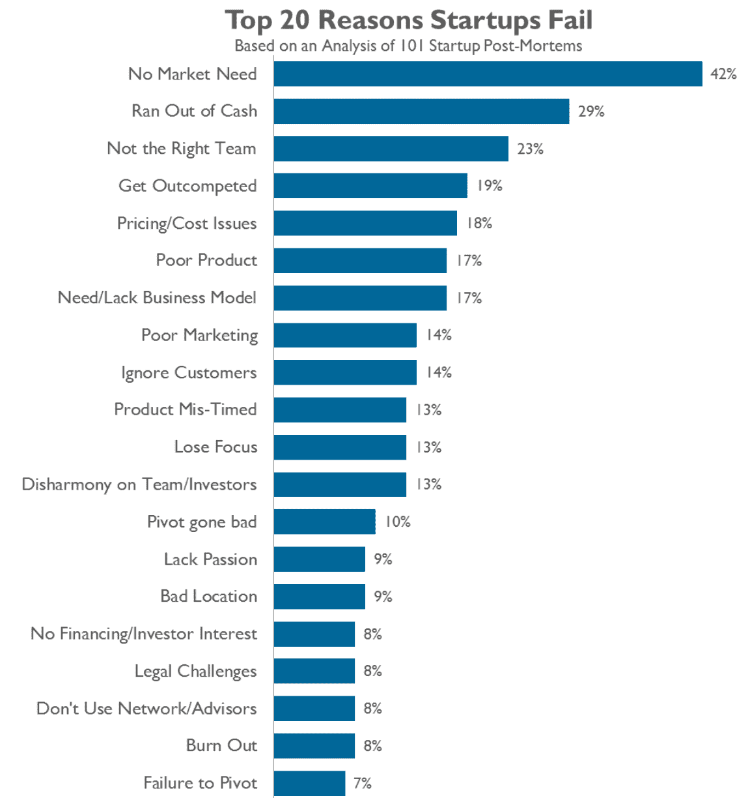
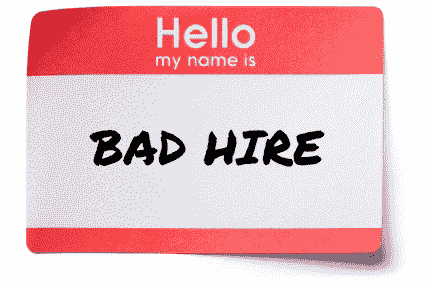
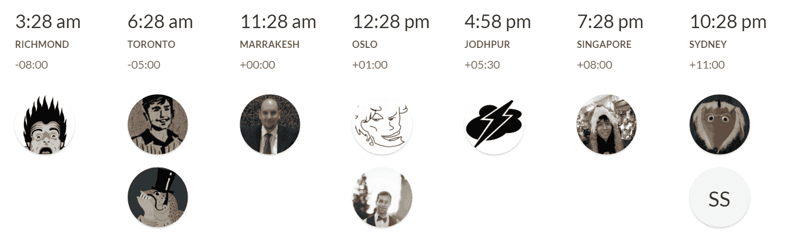

# 我们雇佣最好的，就像其他人一样

> 原文：<http://blog.codinghorror.com/we-hire-the-best-just-like-everyone-else/?utm_source=wanqu.co&utm_campaign=Wanqu+Daily&utm_medium=website>

作为一家初创企业，你会得到的最常见的建议之一是:

> 只雇佣最好的。公司员工的素质将是你成功或失败的最大因素之一。

我在创业活动中一遍又一遍地听到这个建议，以至于我有点厌倦听到它。没有错。抛开世界上其他每一个在你之前听到同样建议的创业公司已经疯狂地竭尽所能从你和其他人手下雇佣所有最优秀的人这一事实，表面上看这是真的。一个由一群不关心工作、不擅长工作的人组成的公司是不会成功的。但是在一个满是给创业公司提建议的人的房间里，没有人愿意谈论那个房间里的大象:

> 当你碰巧在错误的时间，用错误的方法解决错误的问题时，你公司的人有多好也没用。

从统计学上来说，大多数创业公司[都会失败](http://fortune.com/2014/09/25/why-startups-fail-according-to-their-founders/)。

[T2】](https://www.cbinsights.com/blog/startup-failure-post-mortem/)

不管他们是否雇佣了“最好的”,他们都会失败，因为环境在很大程度上超出了他们的控制。因此，在这种情况下，最大限度地招聘最好的员工真的有意义吗？

考虑到这些风险，我认为“雇佣你能找到的最疯狂的、肾上腺素上瘾的、有疯狂想法的、永远不会工作的人”可能是更实际的创业建议。(实际上，现在我想了想，如果那描述了你，并且你有严重的 Linux、Ruby 和 JavaScript 能力，也许你应该给我发电子邮件。)

好的，目标是增加你成功的*机会*，~~不管它有多小~~，因此你应该努力雇佣最好的。似乎很合理，甚至很高尚。但不幸的是，这种对最好的追求伴随着严重的黑暗面。有人能告诉我什么是“最好”吗？用什么标准？根据哪些结果来判断？我们如何衡量这一点？我们当中谁适合判断别人在…什么方面是最好的，确切地说？Best 是一个极端。不是很好，不是很好，不是很优秀，但目标是精英，[业内前 1%的人](http://www.joelonsoftware.com/articles/HighNotes.html)。

> 使用许多平庸的程序员而不是几个优秀的程序员的真正问题是，无论他们工作多长时间，他们都不会做出像伟大的程序员那样好的东西。

追求这种极端意味着**雇佣任何不是最好的人都是不可接受的，甚至是有害的**:

> 在麦金塔分部，我们有一句话，“一个玩家雇佣一个玩家；b 级玩家雇佣 C 级玩家”——意思是伟大的人雇佣伟大的人。另一方面，平庸的人会雇佣不如自己的候选人，这样就能感觉自己比他们优越。(如果你开始走这条不归路，你很快就会和 Z 玩家走到一起；这被称为博佐爆炸。随之而来的是裁员。)——[盖伊·川崎](http://guykawasaki.com/the_art_of_recr-2/)

> 当你可以做得更好的时候，留住一个人是有机会成本的。在一家初创公司，机会成本可能是成功与失败之差。你是否没有尽全力让你的企业成功？作为一名企业家，你流血流汗以求成功。你不应该有一个像你一样表现的团队吗？你雇佣的每一个不是顶级球员的人就像船体上有一个漏洞。最终你会沉沦。乔恩·索伯格

> 为什么我对此如此顽固？因为拒绝一个好的候选人比接受一个差的候选人要好得多。一个糟糕的候选人会花费大量的金钱和精力，并浪费其他人的时间来修复他们所有的 bug。解雇误雇的人可能需要几个月的时间，而且非常困难，尤其是如果他们决定为此打官司的话。在某些情况下，可能完全不可能解雇任何人。坏员工让好员工士气低落。他们可能是糟糕的程序员，但却是非常好的人，或者也许他们*真的需要这份工作*，所以你不忍心解雇他们，或者你不能解雇他们而不惹恼所有人，或者其他什么。这只是一个糟糕的场景。
> 
> 另一方面，如果你拒绝了一个好的候选人，我的意思是，我想在某种存在主义的意义上，这是不公平的，但是，嘿，如果他们真的那么聪明，别担心，他们会得到很多好的工作机会。不要担心你会拒绝太多的人，这样你就找不到可以雇佣的人了。面试的时候，不是你的问题。当然，找到好的候选人很重要。但是一旦你真的在面试某人，假装你已经有 900 多人在门外排队了。不要降低你的标准，不管找到这些优秀的候选人有多难。— [乔尔·斯波尔斯基](http://www.joelonsoftware.com/articles/GuerrillaInterviewing3.html)

我无意批评我引用的任何人。我喜欢乔尔，我们一起创建了 Stack Overflow，他关于面试和招聘的建议仍然是业内最好的。在软件和创业领域，表达这种观点并不罕见。我可以举出二十几篇不同的关于招聘的文章和论文，它们说的是完全相同的事情:志存高远，开始雇佣最好的，或者*不要打扰*。

雇佣非最佳员工的风险如此严重，对你的公司或初创企业的生存来说是一场生死存亡的危机，招聘过程必须变得高度选择性，甚至非常艰难。与其偶然接受一个平庸的申请者，不如每次都拒绝一个优秀的申请者*。如果面试过程中，他们面试的每一个人都毫不含糊地说“哦，我的上帝，这个人非常有才华，我们必须雇用他们”，那么这就是自动拒绝雇用。每次都是。*

 *这种严格程度总是让我不舒服。我不打算撒谎，这是从我自己的自私开始的。我很确定我不会被那些有着传奇般困难的技术面试程序的著名大公司雇佣，因为你知道，他们只雇佣最好的人。我不认为我是最好的之一。更像[暴躁、顽强、直言不讳](https://blog.codinghorror.com/who-needs-talent-when-you-have-intensity/)，以至于大多数时候我醒来都不想和自己一起工作。

如果你的招聘态度是，犯一百次错误总比一次绝对正确好，那么你就会在证据不足的情况下丢掉很多候选人。

也许最糟糕的是，如果面试过程是建立在零怀疑、完全自信的基础上……也许这个候选人感觉不合适是因为他们长得不像你，穿着不像你，思维不像你，说话不像你，或者来自和你相似的背景？你是否无意中最大化了隐藏的偏见？

我曾经共事过的最好的程序员之一是苏珊·沃伦，一位前微软工程师，早在 2004 年她就告诉了我关于像我们这样的人的问题:

> 我认为，围绕技术多样性(以及生活中的大多数其他领域)存在一个真正的问题。我倾向于认为这是 PLU 问题。人们(包括 MVP)倾向于和最像他们的人联系得最好(“像我们这样的人”)。在这种情况下，男性 MVP 会挑选其他男性成为 MVP。这只是人的本性。
> 
> 正如一位回复者所言，多样性是好的。我甚至可以说它是令人敬畏的，令人惊奇的，无价的。但是，如果你仅仅依靠你的自然倾向，就很难达到这个经典的先有鸡还是先有蛋的问题。在这种情况下，如果你想邀请更多的女性 MVP，你需要更多的女性 MVP。如果你想邀请更多的亚裔 MVP，你需要更多的亚裔 MVP，等等。让一个新团体加入的(廉价)方法是通过配额。
> 
> 在我看来，通过配额来建立多样性是不好的，因为它们不公平。教育人们为什么多样性是令人敬畏的，以及如何建立多样性是正确的途径，但也要昂贵得多。

苏珊过去和现在都很了不起。在她手下工作，我学到了很多东西，而让她如此出色的很大一部分原因是她非常不像我。但是在遇到她之前，我怎么能理解呢？事实是，作为人类，我们倾向于选择舒适的，而最舒适的是……嗯，像我们这样的人。这种影响可能令人震惊，因为它是如此微妙，如此无意识——然而，却惊人地强烈:

*   黑人手中持有的棒球卡的售价始终比白人手中持有的少百分之二十。

*   使用屏幕来隐藏试音音乐家的身份，增加了女性从管弦乐队初步试音中脱颖而出的 50%的可能性。

*   丹佛的警察和社区成员被快速展示了一些黑人和白人的照片，一些人拿着枪，一些人拿着像钱包这样无害的东西，并被要求对每张照片尽可能快地按下“拍摄”或“不要拍摄”按钮。警察和社区成员射杀黑人的可能性是普通人的三倍。

不是故意的，从来不是故意的。这就是问题所在。我认为我们的行业需要抛弃这种旧观念，即使*鼓励*在面试过程的每一步拒绝任何没有绝对 100%信心的技术候选人。因为当你这样做的时候，**你会意外地优化隐含偏差**。即使作为一个白人，他可能符合你能想到的关于程序员的所有刻板印象，事实上[在写这篇博文*时穿着一件“我在 Basic 时摇滚”的 t 恤](https://twitter.com/codinghorror/status/644616067847880705)，这也是一直困扰我的，而不是严格性。如果你真的关心编程和技术的多样性，在任何层面上，这种招聘方式对任何人都没有好处，从来没有。多年来。

我知道你在想什么。

> 好吧，杰夫，如果你这么聪明，而且“雇佣最好的”对创业公司来说不是正确的策略，甚至可能对我们的整个领域有害，那么应该做什么呢？

嗯，我不知道，确切地说。我可能问错了人，因为我也非常相信地理多样性和 T2 多样性。以下是当前话语团队的组成情况:

我认为，如果你想在这个领域有更好的多样性，也许一个好的起点就是不要要求你的所有员工都住在旧金山或帕洛阿尔托方圆 30 英里的范围内。外面有一个广阔的互联网世界，到处都是才华横溢、能力各异的程序员。也许把你的视野扩大一点，甚至把视野扩展到美国以外的地方，[如果你能想象出这样的事情](https://ma.tt/2014/12/how-paul-graham-is-wrong/)。

我知道雇佣员工是困难的，即使是在最好的意图和理想的条件下，所以我不想轻视这个挑战。我过去推荐过很多东西，各种各样的方法，你可以试着用，也可以留在桌子上，看你是否合适:

…但我不断想起的一件事，我相信在几乎所有情况下都有持久的价值，那就是[试镜项目](https://hbr.org/2014/04/the-ceo-of-automattic-on-holding-auditions-to-build-a-strong-team):

> 我们所做的最重要的改变是要求每一位最终候选人在合同的基础上与我们一起工作三到八周。候选人和那些如果他们得到这份工作，他们实际上会一起工作的人一起做真正的工作。他们可以在晚上或周末工作，所以他们不必离开目前的工作岗位；大多数人每周花 10 到 20 个小时使用 Automattic，尽管这很灵活。(有些人为了专注于选拔赛而休假一周，这是另一个可行的选择。)目标不是让他们完成一件产品或做一定量的工作；这是为了让我们快速有效地评估这是否是一种互利的关系。在我们评估他们的时候，他们可以自动判断。

我喜欢试镜项目的地方:

*   这是真实的，实际的工作。
*   他们得到报酬。(问问你自己，谁会因为一系列持续多天的密集面试而获得“报酬”？当然不是候选人。)
*   对你的工作进行组织是有益的，这样像这样的小项目就可以由外人接手。如果你不能接纳一个潜在的雇员，你可能也不能很好地接纳一个新雇员。
*   不管你付出多少努力，面试总是时好时坏，要想知道某人是否真的会在某个职位上工作，唯一的方法就是和 T2 一起工作。

每个公司都说他们想雇佣最好的。任何告诉你他们知道如何做到这一点的人要么是在骗你，要么是在骗他们自己。但是我可以告诉你:那些真正雇佣世界上最优秀人才的公司肯定不会按照硅谷其他公司所用的老一套招人。

尝试不同的方法。拓展你的视野。超越我们这样的人，想象一下编程世界在 10 年、20 年甚至 50 年后会是什么样子——并通过雇佣来帮助我们实现这一点。

*我郑重声明，[我真的在 BASIC](https://blog.codinghorror.com/everything-i-needed-to-know-about-programming-i-learned-from-basic/) 做摇滚。

| [广告]打造您的技术团队？ [Stack Overflow Careers](http://careers.stackoverflow.com/products) 帮助你从这个星球上最大的程序员社区中招聘。我们建立我们的网站是考虑到像你这样的开发者。 |* 