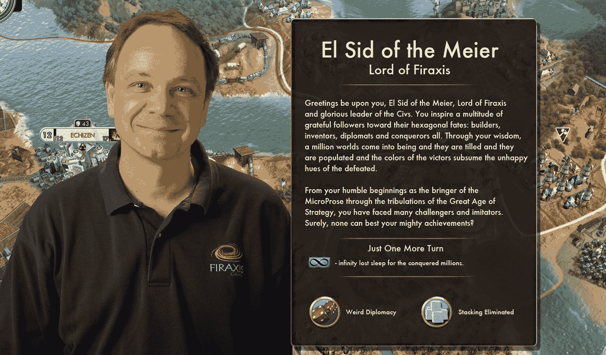
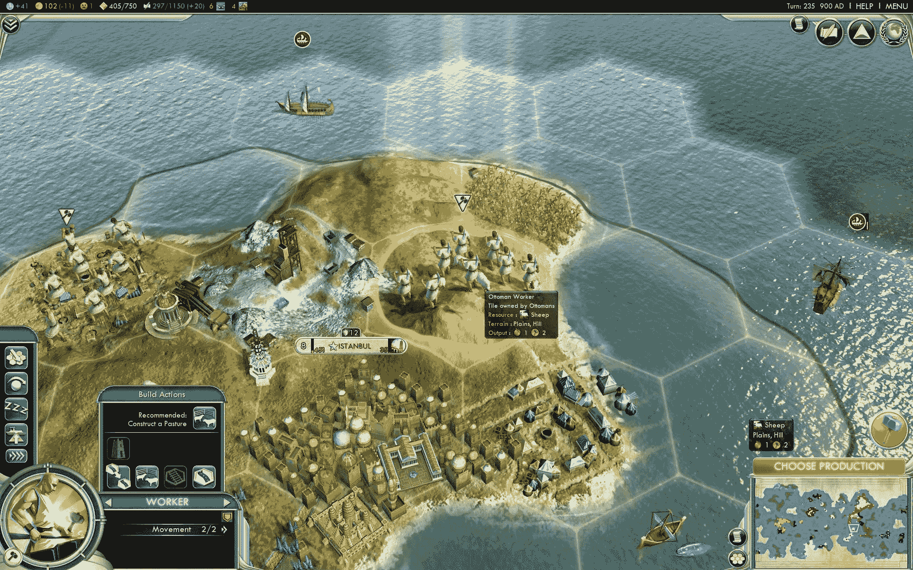
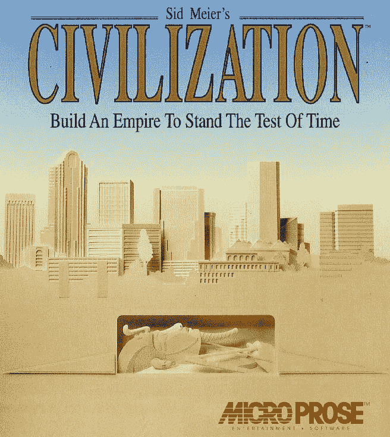
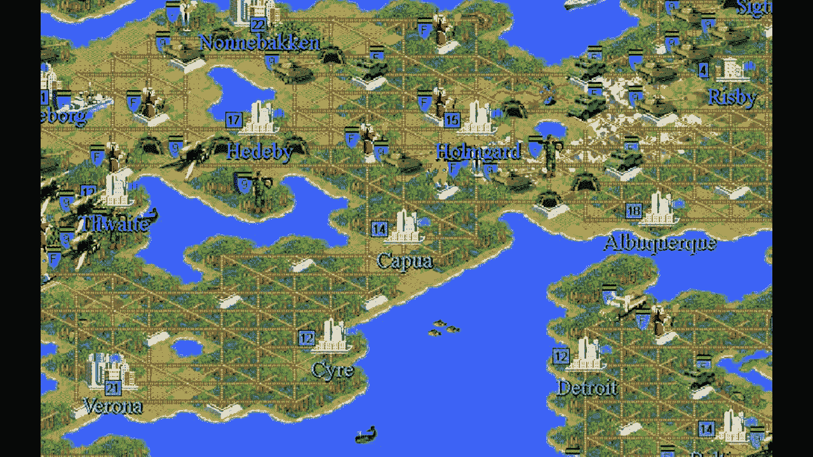
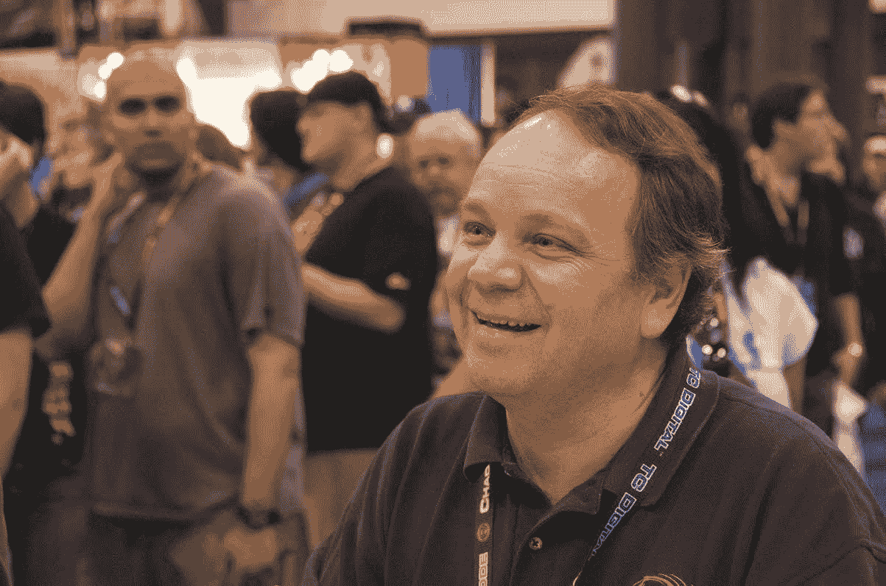

# 创造了百万帝国的人|多边形

> 原文：<https://www.polygon.com/features/2016/3/4/11158134/the-man-who-made-a-million-empires?utm_source=wanqu.co&utm_campaign=Wanqu+Daily&utm_medium=website>

What's Sid Meier really like?

没有多少创造者有如此厚颜无耻的胆量在他们所创造的东西的实际名称上打上他们的名字。约翰·列侬没有把他 1971 年的专辑叫做“约翰·列侬的想象”《达洛维夫人》不叫《弗吉尼亚·伍尔夫的达洛维夫人》到目前为止，詹姆斯·卡梅隆已经设法让他的名字不出现在他所有的电影片名中。

但是很多席德·梅尔的游戏都会在标题中闪现“席德·梅尔”字样。最著名的是席德·梅尔的《文明》系列，在过去的 25 年里已经卖出了 3300 多万套。最近的是 2010 年的 *[席德·梅尔的文明 5](/game/sid-meier-s-civilization-5/2060)* 。这是《T4》有史以来最伟大的策略游戏之一。

我在拉斯维加斯一家酒店的房间和新闻接待处见到了梅尔。在 Civ 成立 25 周年之际，他刚刚完成了一个骰子小组,在那里，他与四位曾与他一起参与 strategy 系列的设计师坐在舞台上，这四位设计师都是在 MicroProse 和他自己的公司 Firaxis 开发该系列的时候。他们愉快地聊着他们制作的游戏。除了说他们喜欢这份工作，并为自己的成就感到自豪之外，他们没有多说什么。这就像看一群人谈论一次精彩的钓鱼之旅。

<q class="right">"I guess I think of that Sid Meier as another person."</q>

这些天，梅尔很少接受采访。几年来我一直试图抓住他，主要是因为我是一个彻头彻尾的文明狂热分子，但也因为他是世界上最有影响力和最成功的游戏开发者之一。

在采访中，他显得小心谨慎。我猜他不太喜欢和媒体交谈。他很友好，时不时会笑，但他很害羞，不爱出风头。一旦采访开始，很明显他不喜欢谈论自己。他大多用简短的回答来回答，而且更多的时候，他会找到一种方法来赞扬他人对他的游戏的各种创新。

他住在马里兰州的科克斯维尔镇。他星期天去教堂。当管风琴师休假或身体不适时，他会代理。在我们面试的时候，他穿着一件 Firaxis 的 t 恤，就像在一个招聘会上摆地摊或发传单一样。

出于某种原因，他让我想起了那种你可能会在家得宝(Home Depot)看到的工作人员，他们安静而高效地确保木材通道井然有序，总是面带微笑，对二级橡木的水分含量说些有用的话。

然而，席德·梅尔是一个讲故事的大师，是他的球员头脑中无数计划和野心的灵感来源。他是一种特殊历史观的策展人。他将过去死去的事件升华为有生命的东西，人们觉得他们可以控制的东西。他是世界的创造者。

<noscript></noscript> 

## 盒子上的名字

当我问他关于他的名字出现在游戏标题中的问题时，他几乎是在道歉。

“我想我把席德·梅尔当成了另一个人，”他说。“这是我在这里这样的地方偶尔碰到的另一个人。这不是一个…我不太认同那个人。”

他解释说，将席德·梅尔列入标题只是很久以前发生的事情。这从来都不是他的主意。因为早期的游戏很成功，没有人想到要改变这个公式。

“它被应用到我引以为豪的一组游戏中，这很棒，我也参与了制作。但这不是…这不是目标。这不像是，‘好吧，有一天我会在一堆游戏上有我的名字，然后我会很开心。’"

现在他对名声很满意，尽管它并不出名。人们偶尔会认出他，他们想谈论他们有多喜欢他的游戏。

“他们过来说，‘我正在和我的儿子和女儿玩这个游戏，我们玩得很开心。’我听说人们有过有趣的经历。有种联系的感觉。我们分享一些东西。我们分享这些知识。尽管我们以前从未见过面，但我们有一些共同之处。"

<noscript></noscript> 

## 这一切是如何开始的

将梅尔的名字放在游戏上的想法来自于他的老商业伙伴比尔·斯蒂利。20 世纪 80 年代初，两人曾在通用仪器公司共事。他们决定成立一家名为 MicroProse 的公司，为迅速发展的家用电脑市场销售飞行模拟软件。斯蒂利是一个健谈、外向的家伙，负责公司的业务和营销工作。Meier 编写了大部分游戏的代码。

像“喷火王牌”、“无声服务”、“T2”、“F-15 攻击鹰”、“T3”这样的游戏很受欢迎。迈耶的名字开始与良好的军事模拟联系在一起。20 世纪 80 年代后期，该公司扩展到系统模拟领域，包括一款关于 17 世纪加勒比海地区海盗行为的游戏。考虑到这种风格的游戏对品牌来说是一个重大的偏离，Stealey 建议在游戏名称中加入 Meier 的名字，以获得他的粉丝的支持。

 <q class="right">

<noscript></noscript> </q> 

席德·梅尔的《海贼》 于 1987 年问世，一炮而红。它将行动与战略结合在一起，包括相互竞争的国家和城市之间的外交关系，这些国家和城市进行贸易并不断发展。

斯蒂尔利喜欢讲一个故事，将梅尔的名字放在游戏上的想法来自已故喜剧演员罗宾·威廉姆斯。两人在一次晚宴上相识，威廉姆斯是他的粉丝。我问梅尔这个故事是不是真的。

“我不记得是这样的。但我并不是说这不可能发生，”他说。“我记得我对比尔说，‘我想做这个海盗游戏，我觉得这会很酷。’他有点像，'嗯，好吧，但我们会把你的名字放在上面，这样玩你的模拟游戏的人就会知道这是同一个人，它不会完全来自 MicroProse 的左场。"

1990 年，迈耶开始开发一款新游戏，模拟从古代到现代的人类历史。文明的部分灵感来自于一款同名的[阿瓦隆山桌游](https://en.wikipedia.org/wiki/Civilization_(board_game))。MicroProse 向阿瓦隆希尔支付了授权费，但实际上，这两款游戏有很大不同。

梅尔和布鲁斯·谢利一起创作了这个游戏，谢利后来加入了《创造帝国时代》系列。*文明*是一个回合制游戏，玩家控制一个建造城市的定居者，然后建造更多的定居者、军事单位和建筑。玩家探索一张地图，建造更多的城市，征服人工智能城市并创建一个帝国。本质上，所有游戏的续作都遵循这一模式，尽管不断增加复杂性和深度。

基于席德·梅尔的《海贼 T1》的成功，斯蒂利决定在片名中保留梅尔的名字。这也将使这款游戏有别于阿瓦隆·希尔的产品。*席德·梅尔的文明*红极一时。到 1996 年续集问世时，该游戏已售出 85 万份。

梅尔不是任何续集的首席设计师，这些续集由包括布莱恩·雷诺兹、索伦·约翰逊和乔恩·谢弗在内的各种开发人员负责。但他始终是开发工作的一部分，他的名字继续被用在标题中，还有控制台版本的 [*、席德·梅尔的文明革命*](/game/sid-meier-s-civilization-revolution/10125) 和衍生产品，如 [*、席德·梅尔的半人马座阿尔法星*](/game/sid-meier-s-alpha-centauri/6469) 以及最近的 [*席德·梅尔的文明:超越地球*](/game/sid-meier-s-civilization-beyond-earth/36938) 。

<noscript></noscript> 

## 一个可重复的公式，有缺陷

在整个系列的发展过程中，MicroProse 和 FIRA xis——Meier 在 1996 年创立的公司——都在玩这个公式。设计创新已被引入，以深化其吸引力，并改善其对世界的模拟坚持。

*Civ 2* 从俯视图切换到等角布局。它还引入了领导委员会，伟大建筑的多媒体描绘和玩家在 AI 对手中拥有“声誉”的概念。

在 2001 年的《文明 3》中，文化扮演了一个中心角色，减轻了之前游戏对军事的关注。一个城市可以通过投资文化建筑和成就来扩大其边界。文明 4(T3)(2005)向修改者开放，并引入了宗教的概念，这赋予了一些基础设施优势。

但是*文明 5* 可能是[迈出了最大的一步](http://www.polygon.com/2012/10/12/3493478/civ-5-gods-kings-the-future-of-the-past)，引入了一种基于每块瓷砖一个单位的六边形战斗方案。在以前的游戏中，军事攻击可以通过装载多个单位，然后选择最好的一个来应对任何特定的挑战。六边形只能携带一个陆基军事单位，玩家必须更加小心地管理军事活动。

在当时，这是一个有争议的决定。一些玩家希望旧系统继续存在。“任何改变都是有争议的，”梅尔说。“实际上，我考虑过在*文明 I* 中使用 hexes，但那会被认为是非常古怪和乏味的，我们担心人们会拒绝这个游戏。这感觉就像是一个棋盘游戏。

“但是我们对我们的球员产生了信心。我们可以改变一些事情，但仍然会很有趣。也许，这个世界已经准备好接受每块瓷砖和六边形一个单位。有些人喜欢它，有些人认为它不是他们想象中的 Civ。”

 <q class="right">

<noscript></noscript> </q> 

*Civ 5* 衍生了两个资料片，显著提升了体验。去年，发行商 Take-Two 宣布这款游戏已经售出超过 600 万份。这一直是 Steam 上最常玩的[游戏之一。](http://store.steampowered.com/stats/)

虽然它在 Metacritic 上拥有 90%的评级，但 T2 的 Civ 5 并不是没有缺点。大多数[臭名昭著的](https://www.reddit.com/r/civ/comments/34ztiw/what_is_arguably_the_worst_civ_5_leader/)，人工智能的对手(如乔治·华盛顿、布迪卡和成吉思汗)经常以看似古怪或完全疯狂的方式行事，即使他们有[精心设计的](http://civilization.wikia.com/wiki/AI_trait_(Civ5))特征。

多年来，迈耶和他的设计师们努力简化他们的用户界面，并将“文化”和“宗教”等复杂的想法融入有意义的游戏设备中。这不是一个小任务。但玩家面对的准人类对手似乎从来都只是“机器人”，缺乏复杂性或微妙性。

“这是个棘手的问题。这是一个难题，”迈耶说。“你的某个部分期望人工智能像理性玩家一样行事。但是你的另一部分希望人工智能能让你的游戏尽可能有趣。这些有时是相互竞争的目标。你如何解决冲突？

<q class="left">"It has to be about the game and not the person whose name is on it."</q>

“我们明白为什么食物导致人。我们明白为什么资源导致单位。我们理解为什么科学导致技术。但是我们并不真正理解人们如何工作，如何编程。人类的数学。这是一个粗略的近似值。这是已经发展的领域之一，但仍有增长空间。”

设计者平衡了玩家对看似理性的对手的需求和他们自己创造一个令人满意的游戏的责任。“你可能会花 90%的时间管理你的文明、军队和其他一切，10%的时间与其他领导人互动，这是外交部分。你不希望那 10%的时间比其他 90%的时间对结果更重要。这是它成为问题的另一个原因。这一切都是为了找到最佳解决方案。”

另一个问题是游戏的获胜状态通常倾向于军事战斗和侵略性扩张。这与其说是一场关于文明的游戏，不如说是一场关于帝国的游戏。一个完全致力于文化和科学的和平文明很难赢得这场游戏。可以说游戏中没有避开军事力量的真实世界文明，但这种体验仍然是一种幻想。

“这取决于你如何定义胜利，”梅尔说。“你可以随心所欲地定义胜利。如果你能忍受只有四个城市，你可以说，“我宣布胜利。”但是游戏定义的胜利可能不完全符合你的游戏风格。那可不容易。像《文明》这样的游戏，你会期待进步、成长和建设。变得更好，将会得到回报。但欢迎你定义自己的胜利。"

<noscript></noscript> 

## 包含在一个循环中

每次有人开始一个新的文明游戏，它都与上一个不同。在现实世界中，地理塑造了文化。在*文明 5* 中，它支配方向。玩家必须利用可用的资源来确保高出生率、快乐的民众和有用的公民。

像它的前辈一样，*文明 5* 提出了一系列的决定。我应该建造一个粮仓来加速我的城市的发展，还是应该创造一个弓箭手来保护自己免受可能的攻击？这些决定相互叠加，并在玩家创造的世界中显现出来。

游戏可以短至几个小时，也可以长达一整天。玩家经常报告说，他们被纳入了一个循环，一直玩到凌晨，这不仅仅是因为游戏在那一刻很有趣，还因为它诱人地带来了我们生活中普遍缺乏的奖品:权力。

<q class="right">"Our role as designers is to kind of fade into the background."</q>

《文明》系列游戏在营造玩家所做的事情真的很重要的幻觉方面是无与伦比的。玩家不仅仅成为他或她创造的文明；文明是玩家的反映。玩*文明 5* 是虚荣心的锻炼。

“这是逃离现实生活的一种很好的方式，”梅尔说。“从某种意义上说，当你在玩的时候，你会觉得你不仅仅是在玩游戏。你可能会学到一些东西或者更好地理解这个世界。你不只是在浪费时间玩游戏。

“激发你的想象力是关键。如果我们能把你从现实生活中拉出来，让你进入这个想象的地方，那就是游戏开始运行的时候了。你在思考，就好像你在游戏中，而不仅仅是在玩。我认为 Civ 几乎是通过迫使你考虑许多不同的事情并做出那些决定来做到这一点的。

“人们记得那些大事件。他们还记得他们经历了一场伟大的战斗，最终占领了那个城市，或者甘地核攻击了他们，或者其他什么。那些时刻在你的记忆中就像你上学的第一天一样清晰，也许，或者任何其他留在你记忆中的事情。”

最后，我问他是否后悔把自己的名字贴在这个系列上，作为一个盒子上的名字对他来说是否是一种负担。

“我对此很满意，”他说。“我认为，一旦 Civ 的名字确定下来，Civ 也会做得一样好。也许对前一两次有帮助。当它开始运行时，知道它背后的设计者是谁可能会有所帮助。

他说，虽然庆祝周年纪念和与老朋友一起出去玩很有趣，但他更感兴趣的是接下来会发生什么。

“我不想把这种(名气)理解为我已经做了我需要做的一切，”他说。“如果我要拥抱那个席德·梅尔，我需要有一个写着我名字的大牌子什么的。作为设计师，我们的角色是淡出背景，让你在游戏中表达你的想法、策略和个性。我认为这必须是关于游戏，而不是名字在上面的人。”