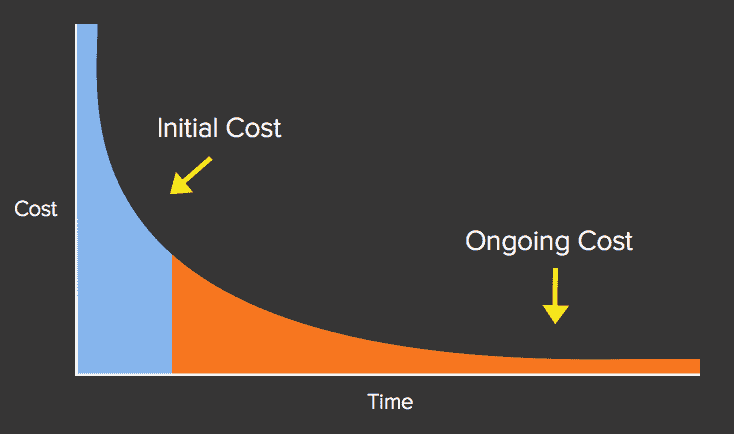

# 特性膨胀的 5 个原因

> 原文：<https://product.hubspot.com/blog/the-5-whys-of-feature-bloat?utm_source=wanqu.co&utm_campaign=Wanqu+Daily&utm_medium=website>

 似乎每个人都知道，一个有一大堆令人讨厌的功能的产品不是什么了不起的东西。有数百篇文章是关于良好的产品管理的主题，以及为什么有效地对抗功能膨胀是如此重要。

你可能有一个很棒的产品团队，由聪明、善意的人组成，他们关心客户，并考虑到产品管理中的经典权衡。也许你就在那个队里。

那么，为什么随着时间的推移，如此多的产品变得功能臃肿——我们如何着手减少我们的产品落入那个陷阱的可能性呢？

作为一个思考练习，我想我应该对特性膨胀做一个简单的 5 个为什么分析，看看它会把我引向哪条路。

#### **1。为什么我们会有功能膨胀？**

因为我们定期添加新功能，但很少删除新功能。最终结果是，随着时间的推移，产品会积累越来越多的功能。这只是简单的算术。我们加的比减的多。

#### **2。** **为什么我们定期添加功能却很少拿出来？**

因为添加功能很容易。作为产品负责人，我们的工作是打造伟大的产品，创造许多快乐的用户。用新特性改进产品是一种常见的方法。我们大多数人都有一长串由客户、潜在客户、我们的销售团队、营销团队、客户团队、创始人等提交的改进想法。我们的大部分时间都花在了根据潜在的影响和可用的资源来计算出这些特性中的哪些特性需要添加，然后添加这些特性。作为产品领导者，我们可能会因为选择了哪些创意而不时受到批评，但不会因为选择了*一些*创意而受到批评。我们*期待*改进产品，增加用户需要的功能。

我想我从来没有见过一个产品团队因为发布了太多新功能而受到批评。

因此，以相对固定的速度，我们不断增加功能。

但是，更有趣的是:为什么我们很少把功能拿出来？

因为去掉特性比加入特性要困难得多。

#### **3。为什么去掉一个特征如此困难？**

因为很难证明去掉一个特性是合理的。通常，没有人要求我们把东西拿出来。有了创意，就有一些人*推动*实现那些特别的功能。他们在倡导，他们在游说，他们给你送纸杯蛋糕和饼干。

但是，我敢跟你赌一美元，没人会给你送烘焙食品来引诱你删除某个特定的功能。有可能的是，如果你正在努力扼杀一部时机已到的电影，你是在作为一个孤独的英雄进行这场高尚的战斗，就像许多孤独的英雄一样，你不太可能因为你的勇敢努力而获得名声、荣耀或纸杯蛋糕。事实上，你很有可能会与公司内部的一些人*(比如你的销售团队)发生冲突，他们不希望你删除东西，因为害怕影响达成交易的可能性。*

#### **4。为什么很难证明去掉一个特性是正确的？**

因为很难说移除一个特性是否值得。

某个地方的一些用户可能*使用*那个特性。有些人甚至可能*喜欢这个功能。有些人可能是因为产品*的功能*才购买的。如果您不保留该功能，有些人可能会威胁取消。*

这就是为什么产品管理如此困难的原因。你试图在不同的时间范围内平衡不同选民的不同需求*。有些事情从长期来看绝对有意义，但在短期内很难解释。*

 *#### **5。为什么很难判断删除一个特性是否值得？**

因为移除一个特性的回报会随着时间的推移而发生，但是移除它的痛苦会在*现在*发生。

此外，该功能不太可能是坏的。这个功能背后的想法已经被搁置了一段时间。它是从一长串其他可能的想法中挑选出来的。如果添加了一个特性，它是有原因的，并且在某些地方对某些人有好处。

> 为了实施，想法必须在残酷的资源争夺战中存活下来。数百人进入，很少人幸存。

还有…

因为我们认为添加该功能所花费的资源是一种沉没成本。在这个过程中，我们在某处了解到沉没成本是*沉没*的，我们不应该让它们影响我们的思考。

那么，现在我们有了一个正在发生的事情的理论，我们如何解决这个问题呢？

对此有几点想法:

作为产品负责人，我们可以利用的数据有限。我们尽最大努力挑选具有最大" [wow to work ratio](http://onstartups.com/tabid/3339/bid/1656/The-Art-Of-Startup-Prioritization-Maximizing-The-Wow-To-Work-Ratio.aspx) (以最少的卡路里消耗获得最大的客户影响和快乐)的创意。我们根据当时掌握的数据和资源做出选择。但是我们的选择并不总是正确的——也不应该被期望是正确的。

所以，首先要做的是接受…

> 我们都会犯错，我们添加的一些功能最终会失败。

而且，既然我们不能总是先验地确定哪些特性会失败，我们如何后验地计算出*？(不要对我的拉丁语印象深刻——我必须查一下)。*

 *回答:用数据！我们生活在这样一个时代，我们大多数人都有大量的数据，关于我们的用户实际上在用我们制造的产品做什么。我们应该对我们添加的特性(尤其是新特性)进行测试，并分析实际的使用情况。

我给你举个例子。你知道设置。我们都知道环境。

> 一个设置被添加到一个产品中，当一个争论是关于它应该以这种方式还是那种方式工作，然后每个人都厌倦了争论，就把它作为一个设置。让用户决定。

我将抵制继续咆哮，为什么大多数设置是毫无创意的妥协。但是，假设您向您的产品添加了一个新的设置，让用户配置[x]。该设置可能会有一个“默认值”,然后为该默认值设置一些可能的覆盖。

你应该测量一下:在一个群组的基础上(添加设置后)，有多少用户*曾经*将默认设置更改为其他设置？我们大方一点，说是 10%。不是 10%，但假设是。就像我说的，我们很慷慨。这意味着对于每一个*认为*他们需要覆盖*希望*获得一些价值的设置的用户，我们为其他 9 个用户增加了一点复杂的生活。更不用说*你的*团队中的所有人，他们将不得不记录、支持和排除该设置的故障。

从长远来看，这值得吗？很有可能不会。

但是，我们不管它，因为我们认为“嘿，沉没成本…我们继续我们的生活…”

但这是一个非常非常大的谬误。

> 一项功能的大部分成本并不在最初的开发阶段，而是在推出后的长尾阶段。

> *
> T3】*

我认为你应该这么做。

确定一个“使用/价值的最低标准”,每个特性都必须通过这个标准才能保持其特性。如果一个新特性在一段时间内没有达到那个水平，那就删掉它。

支持那些努力修剪有意义的地方。承认会有一些短期的痛苦，但是长期的价值是值得的。

创造一种文化，奖励那些像努力增加功能一样努力去掉功能的人。

庆祝成功！

感谢 HubSpot 产品团队 a)出色的表现 b)帮助改进了这篇文章。

****