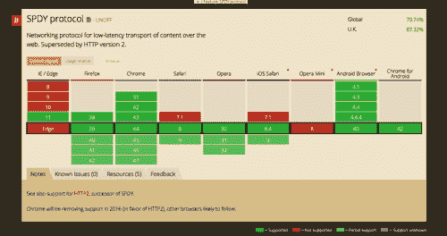
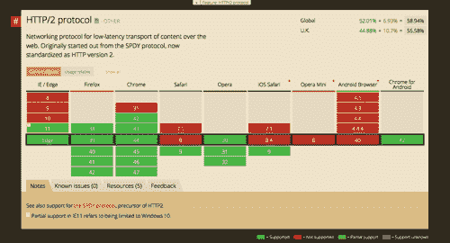
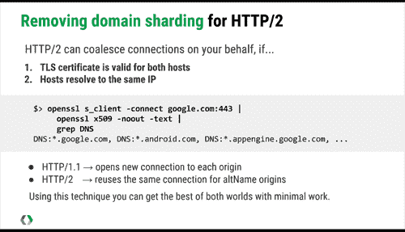

# 为 HTTP2 做好准备:网页设计者和开发者指南——Smashing 杂志

> 原文：<https://www.smashingmagazine.com/2016/02/getting-ready-for-http2/?utm_source=wanqu.co&utm_campaign=Wanqu+Daily&utm_medium=website>

详细介绍 HTTP/2 应用于网页设计者和开发者的基础知识。我们将着眼于新协议的关键特性，浏览器和服务器的兼容性，并详细说明随着 HTTP/2 越来越多地被采用，您可能需要考虑的事情。

超文本传输协议(HTTP)是管理服务器和网站访问者的浏览器之间的连接的协议。自 1999 年以来，我们第一次有了这个协议的新版本，它承诺为每个人提供更快的网站。

在本文中，我们将研究 HTTP2 的基础知识，因为它们适用于 web 设计人员和开发人员。我将解释新协议的一些**关键特性，看看浏览器和服务器的兼容性，并详细说明当我们看到 HTTP2 越来越多地被采用时你可能需要考虑的事情。**

## 进一步阅读关于砸:

通过阅读这篇文章，你会对你的工作流程中短期和长期需要考虑的改变有一个大致的了解。如果你想更深入地研究提出的问题，我还会提供大量的资源。我的目的是为您提供足够的背景知识，以便您在计划迁移到 HTTP2 时能够做出正确的决定。

More after jump! Continue reading below ↓

<aside class="feature-panel">

认识一下 **[图像优化](/printed-books/image-optimization/)** ，Addy Osmani 全新的实用指南，用于在网络上优化和发布**高质量图像**。从格式和压缩到交付和维护:一切尽在一本 528 页的书里。

[Jump to table of contents ↬](https://www.smashingmagazine.com/printed-books/image-optimization/)</aside>

## HTTP 的简史

HTTP 是一个古老的协议，[最初定义于 1991 年](https://www.w3.org/Protocols/HTTP/AsImplemented.html)，最近一次主要修订是在 1999 年发布的 [HTTP/1.1](https://www.ietf.org/rfc/rfc2616.txt) 。1999 年的网站与我们今天开发的网站非常不同。在 [*http2 解释*](https://daniel.haxx.se/http2/) 中，Daniel Sternberg 指出，现在加载一个普通网站的主页所需的数据量是 1.9 MB，显示一个页面需要 100 多个单独的资源——一个“资源”可以是从图像或字体到 JavaScript 或 CSS 文件的任何东西。

当检索显示一个现代网站所需的大量资源时，HTTP/1.1 的性能并不好。正如我们将在本文后面看到的，作为 web 开发人员，我们所知道的许多性能最佳实践都来自于我们对 HTTP/1.1 局限性的处理。

### spy 的

2009 年，谷歌的两名工程师发布了他们正在进行的名为 [SPDY](https://googleresearch.blogspot.co.uk/2009/11/2x-faster-web.html) 的研究项目。这个项目解决了 HTTP/1.1 中的一些问题。SPDY 着手:

*   允许跨单个 TCP 连接的并发请求，称为*多路复用*；
*   允许浏览器对资源进行优先排序，这样对页面显示至关重要的资源可以由服务器首先发送；
*   压缩和减少 HTTP 头；
*   实现*服务器推送*，服务器可以在被请求之前将重要资源推送至浏览器。

此外，SPDY 需要浏览器和服务器之间的加密(HTTPS)连接。

SPDY 不替代 HTTP 相反，它是协议的**隧道，并修改现有 HTTP 请求和响应的发送方式。它**需要服务器和连接到该服务器的浏览器**的支持。有了 NGINX 的支持和 Google 提供的支持 Apache 的包，SPDY 得到了相当多的采用。浏览器支持也很好，所有主流浏览器的现代版本都支持它。**

SPDY browser support information on Can I Use. ([View large version](https://cloud.netlifyusercontent.com/assets/344dbf88-fdf9-42bb-adb4-46f01eedd629/d16c0265-d04a-4d48-8912-9e74fe58111a/01-caniuse-spdy-opt.png))

### HTTP2

我们已经看到 SPDY 取得了一些成功，获得了服务器和浏览器的采用。然而，你可能也发现了，尽管 Internet Explorer 11 受到支持，微软的 Edge 浏览器已经放弃了它。这里发生了什么事？

由于微软实现了对 HTTP 2(HTTP 协议的最新版本)的支持，Edge 中对 SPDY 的支持已经停止。虽然目前其他浏览器仍保持对 SPDY 的支持，但 Chrome 将在 2016 年移除支持，其他浏览器也可能会紧随其后。在本文写作时，Edge、Firefox、Chrome 和 Opera 都支持 SPDY *和* HTTP2。今年晚些时候，随着 Safari 9 的推出，包括 iOS 系统在内的 Safari 也将加入这一行列。

SPDY browser support information on Can I Use. ([View large version](https://cloud.netlifyusercontent.com/assets/344dbf88-fdf9-42bb-adb4-46f01eedd629/8f612102-d6f7-4719-b35b-b211baea64e8/02-caniuse-http2-opt.png))

HTTP2 建立在 SPDY 的成功之上，SPDY 被用作新协议的起点。因此，SPDY 的大部分目标都在 HTTP/2 中得到满足。对 HTTPS 连接[的要求已经被取消](https://http2.github.io/faq/#does-http2-require-encryption)。也就是说，所有的浏览器供应商都决定只为 TLS (https)连接实现 HTTP2。因此，虽然您可能在服务器到服务器的通信中使用带有明文的 HTTP/2，但是我们将 HTTP2 提供给浏览器的用例意味着，在您考虑迁移到 HTTP2 之前，您需要让您的站点运行在 https 上。

HTTP2 规范于 2015 年 2 月定稿；一年过去了，现代浏览器对浏览器的支持非常好。与 SPDY 一样，HTTP2 需要浏览器和服务器级别的支持，并且已经有许多 web 服务器实现。你可以在 [HTTP/2 wiki](https://github.com/http2/http2-spec/wiki/Implementations) 上跟踪这些。W3Techs 在 2015 年 7 月[也发布了一篇文章，详细介绍了采用率](https://w3techs.com/blog/entry/http2_adoption_is_still_low_at_0_4_but_growing_fast_thanks_to_litespeed)。考虑到该协议相对较新，它的采用速度很快。

## 我们必须改变我们的网站吗？

**HTTP/2 与 HTTP/1.1** 向后兼容，所以完全忽略它是可能的，一切将继续像以前一样工作。协议变化对用户来说是完全透明的。本文的许多读者多年来一直使用 HTTP/1.1 以外的协议。如果你有一个 Gmail 帐户，并使用 Chrome 访问它，你将一直使用 SPDY 和 HTTP/2，而对此一无所知。

然而，许多您认为是最佳实践的东西可能对 HTTP/2 下的性能有害。随着时间的推移，随着越来越多的服务器更新为使用 HTTP/2，越来越多的人拥有支持 HTTP/2 的浏览器，您的网站，一度根据最佳实践进行了很好的优化，将开始看起来比针对新协议优化的网站更慢。

## 为了拥抱 HTTP/2，我们需要改变什么？

在本文的其余部分，我们将看看一些常见的最佳实践，随着 HTTP/2 的采用，这些实践**将成为反模式。正如我们所看到的，对于许多网站来说，这种转变将是缓慢的。要迁移到 HTTP/2，您的服务器软件将需要更新以支持该协议——这可能很容易，也可能几乎不可能，这取决于您被托管的方式。**

在对你的网站进行专门的 HTTP/2 修改之前，你还需要考虑你的访问者是否倾向于使用支持它的浏览器。那些吸引大量用户使用最新浏览器的网站的所有者，将比那些日志显示大部分用户使用旧浏览器的网站所有者更快实现这种转变。为了反映这一点，我还会给你一些关于如何在这个过渡时期工作的建议。

### 迁移到 TLS

对于许多网站来说，迁移到 HTTP/2 最困难的事情可能根本不是 HTTP/2，而是要求在安全连接上运行网站。如果你正在开发一个新的网站或者更新一个旧的网站，你的第一步应该是确保你尽快启动或者转移到 https。这不仅对 HTTP/2 很重要，谷歌使用[安全连接作为排名信号](https://googlewebmastercentral.blogspot.co.uk/2014/08/https-as-ranking-signal.html)，浏览器开始将非 https 网站标记为“不安全”。将来你会发现一些强大的 HTML5 特性，如地理定位、[如果没有安全连接](https://code.google.com/p/chromium/issues/detail?id=464874)是无法实现的。

如果你有一个目前只有 http 的网站，那么我的建议是优先考虑转移到 https，然后决定你的 HTTP/2 策略。

### 将多个图像文件转换为精灵

在 HTTP 1.1 中，对于浏览器来说，检索一个大图像比请求许多小图像要有效得多。这是因为多个请求一个接一个地排队。为了解决这个问题，有人建议我们把小图标变成一个[精灵文件](https://developer.mozilla.org/en-US/docs/Web/Guide/CSS/CSS_Image_Sprites)。

产生的 sprite 与一个 HTTP 请求一起返回，防止了多个请求排队的问题。然而，即使访问者在一个只显示其中一个图标的页面上，他们仍然不得不下载一个比他们需要的要大得多的文件才能看到那个图像。

有了 HTTP/2 的**复用能力，这种资源排队不再是问题。在许多情况下，单独提供小图像会更好；你只需要提供访问者所在页面所需的内容。在某些情况下，创建精灵仍然是有保证的；HTTP 请求只是性能的一个方面。将一些图像组合在一个 sprite 中可能会获得更好的压缩效果，从而减少整体下载量，尤其是当所有这些图像都用于正在加载的页面时。然而，雪碧将不再是最好的选择。**

### 使用数据 URIs 内联图像

HTTP/1.1 中多个 HTTP 请求问题的另一个解决方法是使用数据 URIs 在 CSS 中[内联图像。以这种方式嵌入图像会使样式表变得更大。如果您将这与另一种连接资产的优化技术结合起来，那么访问者可能会下载所有这些代码，即使他们从未访问过使用这些图像的页面。](https://css-tricks.com/data-uris/)

由于 HTTP/2 中的 HTTP 请求非常便宜，这种“最佳实践”将会阻碍而不是帮助性能。

### 连接 CSS 和 JavaScript

作为构建过程的最后一步，我们中的许多人会将网站上使用的所有小型 CSS 和 JavaScript 文件连接起来。我们经常希望在开发时将它们分开，以便更容易地管理这些资源——但是我们知道向浏览器交付一个文件比交付五个文件更有效率。我们再次尝试限制 HTTP 请求。

如果你这样做了，那么登陆你主页的访问者可能会下载你的网站所需的所有 CSS 和 JavaScript，即使他们从未使用过其中的大部分。作为开发人员，您可以通过在构建过程中仔细选择并包含网站每个区域的特定文件来解决这个问题，但这可能需要做大量的工作。

串联的另一个问题是，所有内容都需要立即从缓存中清除。你不能给一些永远不会改变的文件一个很长的到期日，而给那些经常改变的部分代码一个较短的到期日。如果在一个页面上使用的一行 CSS 代码被修改了，那么它都将失效。

我想你知道这是怎么回事了！ **HTTP 请求在 HTTP/2** 的世界里很便宜。在开发过程中，根据将要使用的页面来组织资产会好得多。然后你可以只提供访问者需要的代码。下载大量微小的样式表没有关系。你也可以根据事物变化的频率来组织；寿命较长的资产可以得到更长时间的保护。

### 在主机之间分割资源:分片

使用 HTTP/1.1，您会受到打开连接数的限制。如果加载大量的资源是不可避免的，绕过这个限制的一个方法是从多个域中检索它们。这被称为[域分片](https://www.stevesouders.com/blog/2009/05/12/sharding-dominant-domains/)。这可以获得更好的加载时间，然而[本身也会引起问题](https://calendar.perfplanet.com/2013/reducing-domain-sharding/)，更不用说为你的网站准备这个的开发开销了。

HTTP/2 消除了对域分片的需求，因为你可以根据需要请求任意多的资源。事实上，这种技术可能会损害性能，因为它会创建额外的 TCP 连接，并阻碍 HTTP/2 对资源进行优先级排序。

## 现在如何准备 HTTP/2

如果您正在启动一个项目，您希望它能持续一些时间，但是可能由于服务器支持的原因而无法启动 HTTP/2，那么考虑如何为 HTTP/2 做准备是值得的。现在，您可以在构建过程中添加一些东西，这将使以后的切换更加容易。

### 除了精灵和数据 URIs 之外，创建单独的资产

如果您正在创建精灵，请在您的流程中添加这些单独资产的创建和优化，或者如果您认为这样可以最好地增强性能，则添加较小的特定于页面的精灵。当你的网站达到临界点时，这将使你更容易从大精灵切换到小精灵(或者没有小精灵)。

URIs 数据中心也是如此。如果您目前正在 CSS 中使用这些，那么当您放弃这种技术时，请准备好图像。

### 按网站部分组织您的资产

有了 CSS 和 JavaScript 串联，就有了为了开发的方便而进行优化的诱惑，因为无论如何文件都会被压缩在一起。当您切换到 HTTP/2 时，您将**通过仔细管理资源**获得最佳性能，以便只有某个页面需要的东西才被传送到该页面。因此，现在开始以这种方式组织你的发展会有回报的。现在，您仍然可以进行连接，当达到临界点时，您可以停止构建过程的这一部分，单独为资源提供服务。

### 管理域分片

HTTP/1.1 当前的最佳实践是将分片限制为两个主机名。如果 TLS 证书对两台主机都有效，并且主机解析到同一个 IP，有一种方法可以让 HTTP/2 合并连接。因为浏览器实现者要求 HTTP/2 在 HTTPS 上运行，所以有必要获得 TLS 证书来在 HTTP/2 上运行。在 Velocity Conference 上，查看伊利亚·格里戈利克幻灯片的[第 26 张](https://docs.google.com/presentation/d/1r7QXGYOLCh4fcUq0jDdDwKJWNqWK1o4xMtYpKZCJYjM/present#slide=id.g40fbe7d8c_076)幻灯片。

Slide from Ilya Grigorik’s presentation. ([View large version](https://cloud.netlifyusercontent.com/assets/344dbf88-fdf9-42bb-adb4-46f01eedd629/75af4190-f376-48b2-9bab-626052fa4edc/03-domain-sharding-opt.png))

### 还会有更多

最终，我们将获得一系列 HTTP/2 的最佳实践。为了获得最佳性能，这个协议将把很多控制权交还给你，这意味着你需要为每个项目做出决定。我还没有在本文中介绍如何利用 HTTP/2 的新特性，比如服务器推送。这项技术允许您决定哪些资源是优先的，并指示服务器在不太重要的事情之前分发这些资源。

## 什么时候换？

对于不能完全控制所部署的服务器的设计人员和开发人员来说，可能需要等到他们使用的服务器更新后再做决定。已经有托管公司提供 HTTP/2 了——甚至是共享托管服务——所以部署一个支持服务器是你可以推荐给客户的，如果你知道他们会受益的话。

一旦你的网站托管在一个支持 HTTP/2 的服务器上，决定是继续优化 HTTP/1.1 还是优化 HTTP/2 将取决于大多数用户支持的协议。记住 HTTP/2 是向后兼容的——你不需要做任何特别的事情。您需要做出的决定是何时进行优化。

你需要根据你的分析数据来决定。如果越来越多的访问者使用支持 HTTP/2 的浏览器，那么我认为这是为这些用户进行优化的一个合理的转折点。我们中的许多人已经到达了那个点。你应该使用我可以使用的网站上的数据，以及从你自己的分析和你的潜在受众的知识中收集的数据。例如，支持 HTTP/2 的移动设备的用户将最强烈地感受到 HTTP/2 的许多好处。如果您有很高比例的移动流量，这可能是一个迹象，表明要尽快转向 HTTP/2。然而，如果使用 Opera Mini 浏览的用户有很高比例的移动流量，那么这将是推迟迁移到 HTTP/2 的一个原因，因为它目前不支持，尽管在世界上的一些地方有大量的用户。

如果你今天正在构建一个全新的网站，我建议你在构建过程中牢记 HTTP/2 优化。如果在发布时，您觉得由于浏览器或服务器支持的原因，您需要对 HTTP/1.1 做出让步，这可以在构建过程中完成，一旦您觉得时机成熟，就可以切换到 HTTP/2 版本。

## 您的 HTTP/2 行动计划

1.  **使用安全连接启动或立即迁移到 TLS**这应该是您的首要任务。
2.  在构建过程中为 HTTP/2 做好准备。您现在构建的任何网站在其生命周期内都可能受益于针对 HTTP/2 的优化。使用上面的提示创建一个可以为两种协议优化的构建过程。
3.  检查你的统计数据。通过将您网站上的浏览器使用情况与我可以使用上的[支持表进行比较，您可以看到有多少比例的访问者会从 HTTP/2 优化中受益。](https://caniuse.com/#feat=http2)
4.  检查你的主机。当您从切换中获益时，您将需要确保您的服务器支持 HTTP/2。请咨询您的主机提供商或服务器管理员，了解他们的迁移计划。
5.  **推出 HTTP/2 优化。**一旦你的服务器支持 HTTP/2，剩下的就看你的了。停止使用旧的最佳实践，转而使用新的。这将意味着使用不支持 HTTP/2 的浏览器的用户将获得较慢的体验，这就是为什么您的变化背后的驱动因素应该是大多数人受益的转折点。

当您迁移到 HTTP/2 时，测试一下速度的提高，看看哪些技术对您的网站产生了最大的影响，这将会很有意思。当人们迁移网站时，我期待着从真实世界的案例中看到信息。这些信息将帮助我们开发全新一代的最佳实践。

## 了解更多信息

网上有越来越多的关于 HTTP/2 的信息。我在这里列出了一些资源供您参考，其中许多是我在撰写本文时参考的。

 (rb, jb, al, ml)