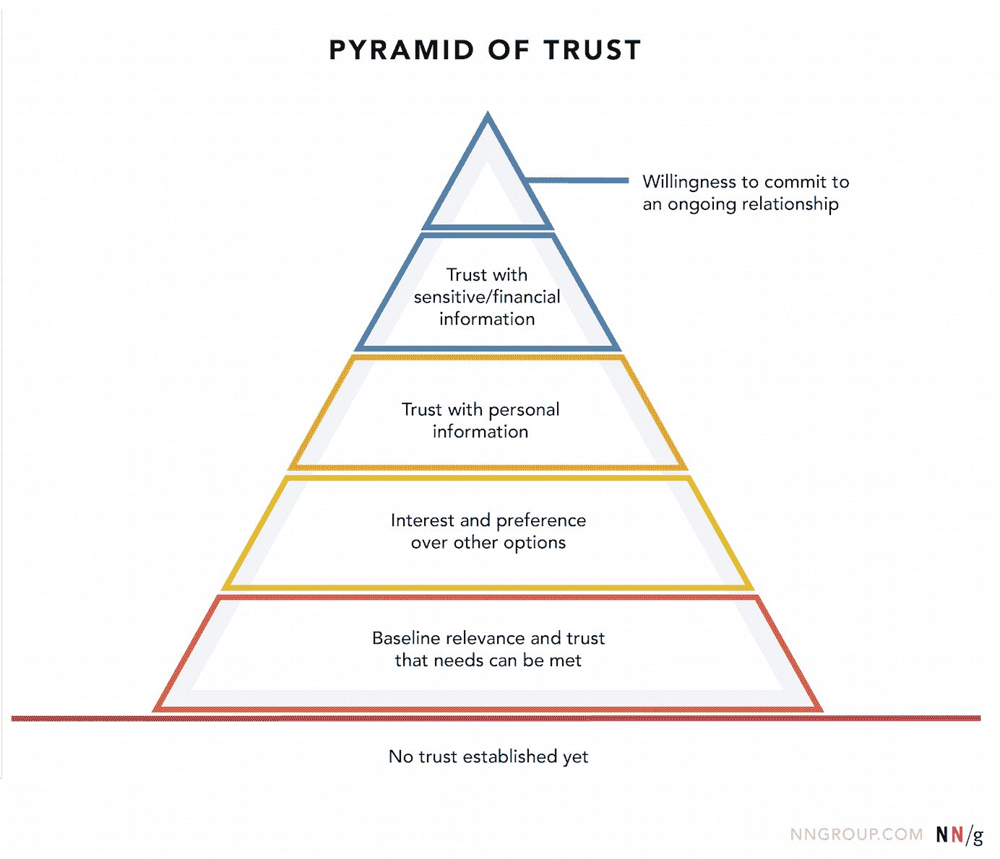
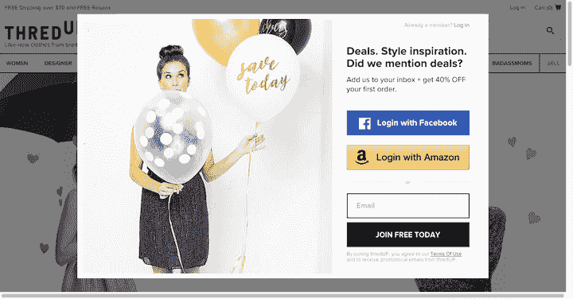
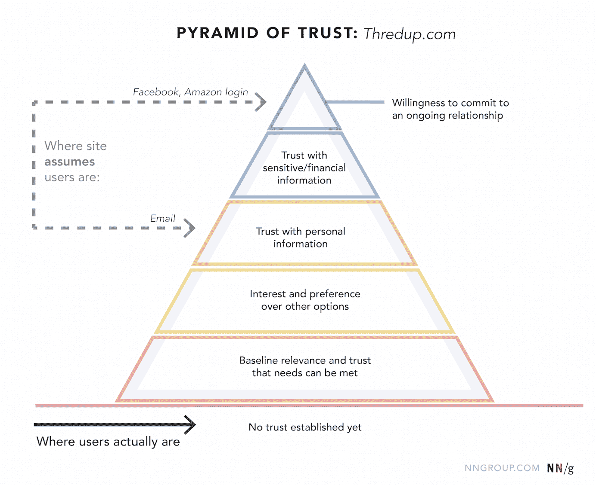
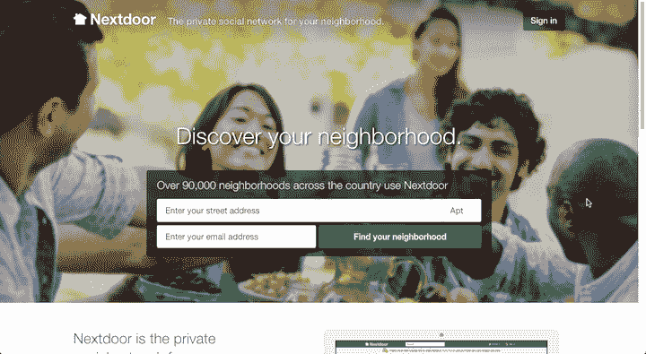
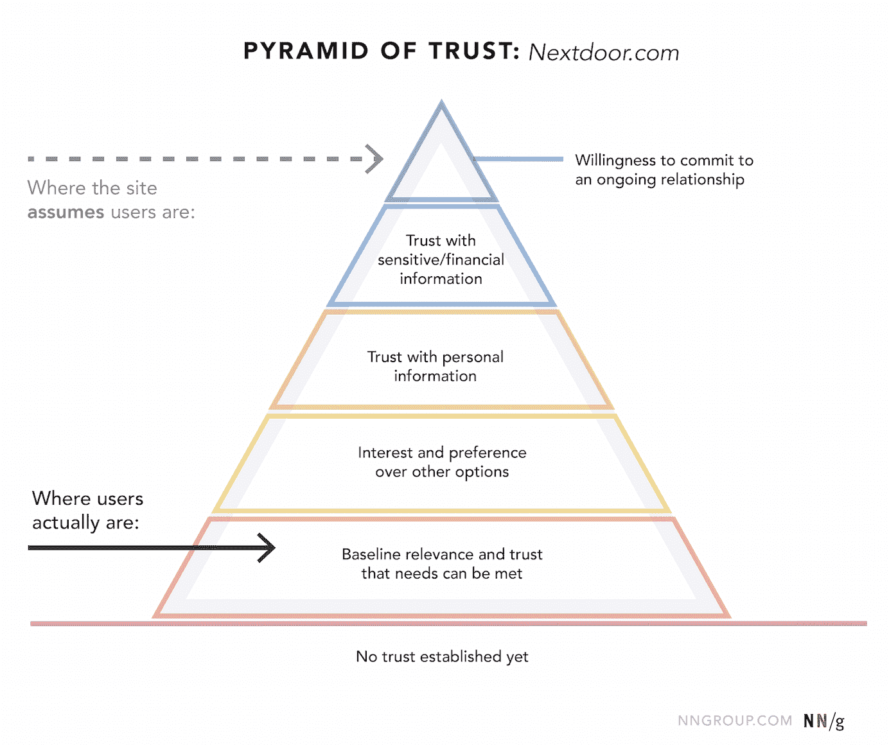

# 信任层级:网站承诺的 5 个体验层次

> 原文：<https://www.nngroup.com/articles/commitment-levels/?utm_source=wanqu.co&utm_campaign=Wanqu+Daily&utm_medium=website>

在创建交易型网络体验的过程中，设计师们承受着持续的压力，要减少与[转化](https://www.nngroup.com/articles/conversion-rates/)的摩擦，推动人们进入漏斗中的下一步，以及[尽可能早地](https://www.nngroup.com/articles/content-behind-forms/)收集用户信息。

但是需求必须满足用户的信任需求。太容易忘记用户的视角了。一个有用的练习是想象你在街上向一个陌生人请求越来越多的帮助。在你要求联系信息或金钱之前，你需要经历哪些步骤来克服最初的怀疑并建立信任？跳过这些步骤，这个人就会走开——或者，在网上，离开这个网站，去别的地方试试。

## 信任金字塔

早在 20 世纪 40 年代，亚伯拉罕·马斯洛就提出了他著名的需求层次理论。他断言，个人必须先满足基本需求，如食物和安全，然后才会继续渴望更高的需求，如爱、尊重或自我实现。

很像马斯洛的需求金字塔，我们可以定义一个信任金字塔。在关系中(无论是两个人之间还是一个网站和一个用户之间)，个人必须先满足**基本的信任需求，然后才能进行**更实质性的互动。

建立信任，无论是与陌生人还是与网站，都是渐进的:随着[关系的进展](https://www.nngroup.com/articles/reciprocity-principle/)，怀疑被克服，舒适程度增加，可以提出新的要求。这种关系经历了不同的承诺阶段，每个阶段都建立在前一个阶段的基础上。较高水平的承诺不可能在较低水平的承诺之前实现。

站点-用户关系从底层开始，通过以下 5 个承诺级别发展，每一个更高的级别都要求满足所有更低的级别:

*Site–user relationships progress through the 5 experiential levels of commitment.*

为了延伸金字塔的比喻，你网站的新访客开始站在沙地上(在图表中标记为“尚未建立信任”)，除非你诱导他们攀爬，否则他们会一直站在那里。

在每个承诺级别，人们都有不同的需求。一旦这些需求以令人满意的方式得到满足，用户将更有可能信任你的网站，尊重你的要求，并进入下一个阶段。

| **承诺水平** | **用户的信任需求** |
| 

1.  **Baseline correlation and trust degree that can meet the demand**

 | 这个网站能帮我实现目标吗？它可信吗？我可以依赖这个信息吗？它是否把我的最大利益放在心上？ |
| 

1.  **Interest and preference for other options**

 | 我是否选择使用此网站来完成此任务？是否优于其他选项？ |
| 

1.  **Trust and Personal Information**

 | 这个网站的服务是否有足够的价值，值得花费时间和精力去注册？我信任该网站提供的我的个人信息吗？我需要来自这家公司的电子邮件吗？ |
| 

1.  **Trust and sensitivity/financial information**

 | 我是否相信该网站会安全地使用和存储我的敏感数据(如信用卡、街道地址)？值得冒这个险吗？ |
|  | *我是否足以与该网站建立持续的联系(例如，重复收费、与其他账户链接)？* |

这些需求并不总是被明确地表达出来；大多数用户甚至没有意识到他们在每个阶段的疑虑。(这就是为什么你不能简单地通过 [*向*询问用户反馈](https://www.nngroup.com/articles/first-rule-of-usability-dont-listen-to-users/)来研究这些问题。你必须*观察*的实际行为。)一开始，**怀疑主义默认是强烈的。虽然这种怀疑有时可以在外部因素的帮助下克服，如口头推荐或评论，但网站本身也必须通过顺利满足用户在各个承诺层面的需求来赢得用户的信任。**

### 平衡网站的需求和用户的信任需求

一个网站要求的信息越多，用户就越需要信任和安慰。在我们急于收集和转换的过程中，跳过前面是如此诱人。但是，结果是，用户对这个网站不感兴趣并放弃它，因为它太放肆了，而且还没有涵盖基本的承诺水平。

网站的请求和用户的信任需求必须保持平衡:**在你解决了所有较低层次的信任需求之前，不要提出更高层次的要求。**

想想[登录墙是如何经常阻止用户](https://www.nngroup.com/articles/login-walls/)的。想象一下，向完全陌生的人询问他们的全名和电话号码。你最好已经建立了舒适，兴趣和信任。在用户有机会弄清楚网站是关于什么之前，要求登录的网站直接跳到第三级。级别 1 & 2 的需求尚未得到满足。这个网站会有我要找的东西吗？它是否把我的最大利益放在心上？是否比其他选择*更好？*营业点必须在登录墙之外解决这些问题。例如，[的描述性标语](https://www.nngroup.com/articles/tagline-blues-whats-the-site-about/)，描述其他人如何为网站担保(例如，[社交证明](https://www.nngroup.com/articles/social-proof-ux/) <u>)</u> 或者精心挑选的[代表性图片](https://www.nngroup.com/articles/image-focused-design/)可以安抚用户，帮助他们跨越第一层和第二层。如果用户还不知道你的网站，那么这个内容就有巨大的压力去解决几个层面的疑问。

*Thredup.com: ‘My email? My Facebook account? You’re way ahead of yourself, Threadup.com. We just met. Who are you?’ This login wall is a modal window that cannot be closed; it remains in a fixed position even when scrolling. The overlay covers up the tagline, navigation categories, and product images. Without those reassurances, many users will not be willing to give up their personal information.*

*In the current Thredup.com design, prospective users are still at level 0 (no trust established yet). But the forced registration via email assumes people are ready for a level-3 request (trust with personal information). The options to login with Facebook or Amazon are even more presumptuous than registering through email, because connecting to an existing account is a level 5-request (it requires willingness to commit to an ongoing relationship). The site would be more persuasive if it gave people a chance to decide whether it meets their level-1 needs for baseline trust.*

*Nextdoor.com: ‘Hi stranger, my name’s Nextdoor. I’ll tell you about myself in a minute, but first, what’s your full home address and email?’ This site relies on a landing page to convince users to jump straight to level 4\. It’s helpful that they have a tagline next to the logo, and a little social proof (’90,000 neighborhoods’), but it’s still a big ask.*

*Potential users on Nextdoor.com are still at level 1\. By requiring a full street address and email, the site assumes people are ready for a level 4 request. Instead, the site could let users search by postal code, so that they can see if their neighborhood is included, and therefore decide if its worth joining (level 2: interest and preference over other options).*

设置障碍将用户拒之门外打破了可用性的另一个原则:人们信任那些让他们感觉在控制中的网站(T2)。网站和应用程序允许用户自己探索，自由浏览或搜索，如果不喜欢，可以很容易地尝试一些东西并返回，所有这些都给人们一种代理的感觉，随之而来的是对系统更大的信心。

## 总结:为了说服用户，针对每个问题建立信任和安慰

承诺的水平从最初的互动开始。没有一个适当的基础，一层一层地，进一步的努力说服或改变是不可靠的，你只能站在信任金字塔下面的沙子里。

在我们的[关于说服性网页设计的全天课程](https://www.nngroup.com/courses/credibility-and-persuasive-web-design/)中，了解更多关于如何建立信任和可信度的信息。

