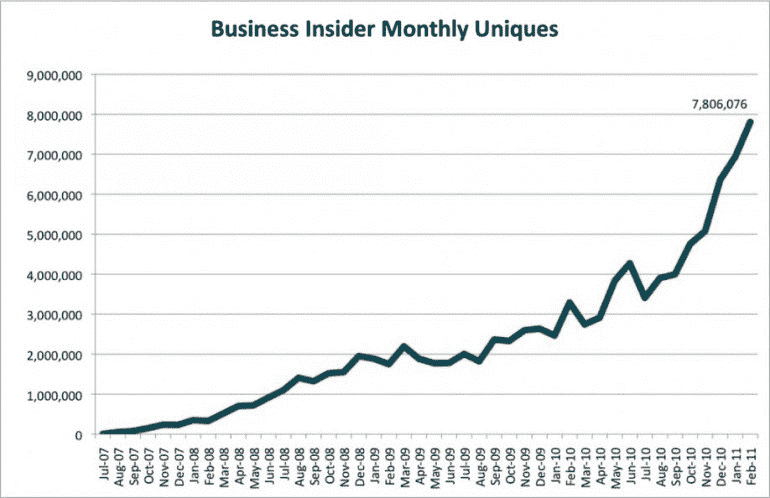
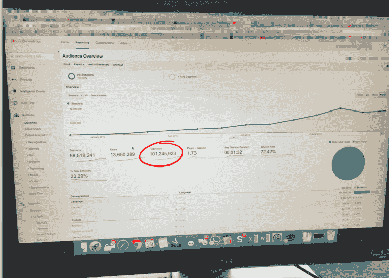
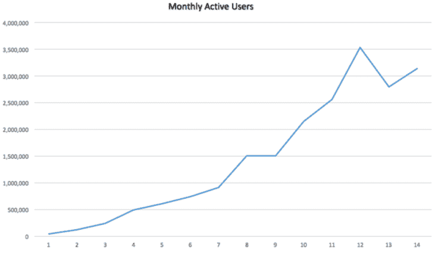
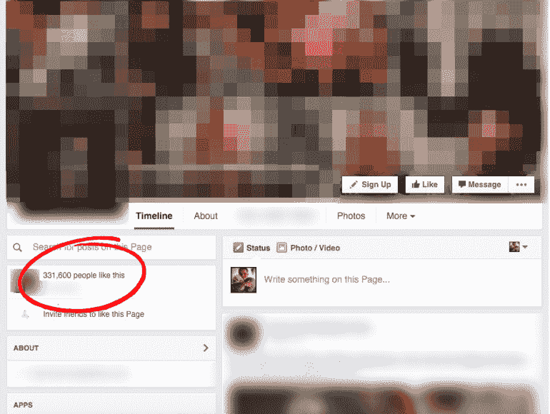
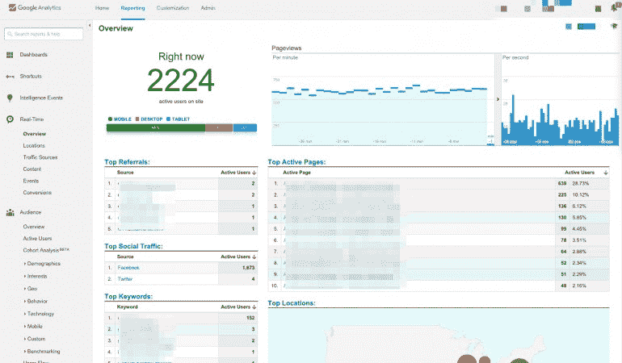
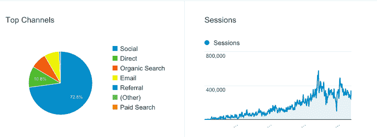

# 荷兰公式:如何在 12 个月内建立一个数百万美元的公司

> 原文如何在 12 个月内建立一家价值数百万美元的公司？UTM _ source = Wanqu . co&UTM _ campaign = Wanqu+Daily&UTM _ medium = website

你有没有梦想过自己开公司，发大财？

你当然有。我也是。但是我很懒。自私地说，我一直希望有人能给我一个入门的公式——一个可以一步一步遵循的配方。我曾梦想向数百万人展示某种路线图。

然而，这些年来我开始意识到没有路线图。建立成功企业的公式并不存在。

直到一周前，我被介绍给威廉，他是我见过的最有趣的企业主之一。

威廉是一个我们都知道但拒绝承认我们在使用的东西的创始人:一个 clickbait 网站。事实上，他已经开始多次。

他最成功的网站价值数百万美元，它们只需要 5000 美元(和威廉几个月的时间)就可以启动，并且是用同样的公式建立的。

顺便说一下，威廉不是他的真名。他要求我保守秘密。但他告诉我的一切，我都告诉你了。

我将从我收到他的第一封邮件开始，正如你将看到的，这封邮件让我大吃一惊…

## 电子邮件

*To: [email protected]
From: A totally random email we had never seen before*

*你好，*

我已经读了几个月的《喧嚣》了，真的很喜欢你们的作品。随着你业务的继续发展，也许我能帮上忙？

我创办了无数网站，其中许多价值数百万美元。我在数字媒体方面没有什么经验，我自己也没有制作我网站上的任何内容。相反，我开发了一个公式，这个公式很大程度上依赖于脸书，它帮助我确定要建立的网站的正确类型，并在网站上线运行后为它们带来大量流量。

举例来说，我最成功的网站之一是大约一年前推出的。

从那以后，我已经有超过 1 亿的浏览量和 1300 万的独立用户。上个月我一个人就有 350 万个 uniques。我没有营销团队，没有销售团队，也没有投资资金。总共有两个人全职受雇于这个网站。一个是编辑，另一个是我的助手。

我真的很相信你们的产品，也很乐意帮助你们。你有需要一些建议的社交团队吗？

我住在附近，所以我很想进来见见团队成员。继续努力。

*最佳，*

威廉

好吧，很明显这是胡说八道。

这个家伙碰巧住在“附近”,有一个赚几百万美元的公式。最糟糕的是，这些数字高得离谱。

对于那些不熟悉网络流量指标的人来说，在推出后一年内超过 1 亿的总浏览量和 350 万的月用户是疯狂的，尤其是在没有投资的情况下。

相比之下， *Business Insider* 花了一年多时间才达到第一个**100 万**月用户(上个月 William 也有 350 万)。

Business Insider 现在每月有 7000 万用户，300 多名员工，最近以接近[5 亿美元的价格出售。](http://fortune.com/2015/09/29/business-insider-axel-springer/)

<noscript>T3】</noscript>

听说过 BuzzFeed 吗？

在推出两年后，BuzzFeed 的月平均用户数仅为 [70 万](http://qz.com/389752/here-is-buzzfeeds-first-pitch-deck-to-investors-in-2008/)。现在它的价值接近[20 亿美元](https://www.inc.com/business-insider/nbc-universal-reportedly-investing-in-buzzfeed.html)。

所以，尽管对威廉的说法有所怀疑，他还是引起了我的注意。如果这个人说的是实话，我不仅想要他的建议，还想要他的故事。

我写了回信，告诉他我很想和他见面。

## 会议

几天后，威廉来到我们办公室。他是个好人，有浓重的荷兰口音和很棒的冲浪式发型。

我们聊了几分钟关于威廉的童年(他 15 岁从阿姆斯特丹的高中辍学成为一名 DJ)、他过去的工作经历(他多年来一直是派对策划人)以及他是如何听说我们的(他去年参加了 [Hustle Con](http://hustlecon.com/) )。

闲聊结束后，我很快就开始了正题。

让我们看看那些交通数字！

威廉登录谷歌分析，瞬间证实了我认为不可能的事情，或者至少是夸大其词。

1 亿多浏览量？检查。

<noscript>T3】</noscript>

上线一年月活用户 350 万？检查。

<noscript></noscript>

威廉转换了 Excel 中的 MAU 数据，为我创建了这个图表

然后我们开始谈论收入。正如我所料，威廉非常透明。

每个月，他向企业投资 3 万美元，获得 22 万美元的利润。广告是他的主要收入来源，考虑到流量，这是有意义的。

虽然一开始每月 22 万美元似乎有点高，但一些简单的数学计算证明这实际上是相当现实的。

2015 年展示广告的平均 CPM(每 1000 次展示的成本)为 [$2.80](http://monetizepros.com/display-advertising/average-cpm-rates/) 。拥有 1 亿多用户，仅一个广告每年就能带来 28 万美元的收入(每月 2.3 万美元)。

考虑到他在每个页面上都有多个广告，在他的电子邮件时事通讯上出售广告空间(这更有利可图)，并且只有两名全职员工要支付工资，威廉的数字加起来就够了。

## 公式

我问威廉的最后一个问题是关于“公式”他最初在电子邮件中提到过这件事，后来又提到过几次，但我需要更多的细节。

他说，这个公式是他在创建最初几个网站后，几乎是无意中创造出来的。在早期，他对数字媒体知之甚少，完全依赖于他对脸书的了解。

他坚信它的有效性，并表示他创建的每一个价值百万美元的网站都是从使用这个公式开始的。

但他也坚持认为是他自己的努力工作导致了他的成功，如果他泄露了配方，他并不太担心会有人模仿。

所以，我问他愿不愿意。

女士们先生们……通往百万富翁的道路:

### 第一步:**选择 10 个利基市场**

这些人必须充满激情，积极参与。威廉举的一些例子有 MMA 迷、电竞迷、看《权力的游戏》的人。

他过去尝试过的一些没有成功的例子包括摔跤迷、嘻哈迷和政治。失败的原因包括缺乏参与和太多现有网站为同一目的服务。

### 第二步:**为每个市场创建一个脸书粉丝页面**

开始做广告，以便购买脸书喜欢的东西。

例如，如果你选择 MMA 爱好者作为你的目标人群，这个页面应该叫做“MMA 爱好者”或者其他不太具体的名字。

威廉在每个利基市场上花费大约 200 美元，但是只要你保持一致，这个数字并不重要。

为什么？因为你在这里所做的一切都是试图确定你的“赢家”，这是任何利基市场产生最高的参与度和最低的喜欢成本。威廉说，如果你能以低于五分钱的价格买到喜欢的东西，这是一个很好的迹象。然而，他最赚钱的网站能够以一分钱的价格购买赞。

### 第三步:**在你的页面上发布别人的内容**

由于这仍然是“测试阶段”，你的内容不需要具有开创性。事实上，如果你想的话，可以直接从类似的页面上窃取。威廉最初就是这么做的。

“当我刚开始做这个的时候，我的英语说得还不够好，无法制作自己的字幕。最重要的是，我并不真正了解我的目标粉丝群体。因此，我会找到类似的脸书粉丝页面，看看哪些帖子做得好，完全复制它们，然后贴在我的页面上。”

### 第四步:**挑选一个获胜者，购买一个域名，然后建立 WordPress 网站**

这是事情开始成形的地方。你已经选择了你要创建内容的市场，现在你所需要的就是你要发布文章的网站。

威廉不太懂网站建设。谢天谢地，这也有一个公式。

“如今建立并运行一个网站非常容易，而且很便宜。去 GoDaddy 买个域名，自带 WordPress 托管。大概一个月 5 美元。GoDaddy 为你安装 WordPress。”

然后，去一个像[www.themeforest.net](https://www.themeforest.net/)这样的网站，挑选一个你喜欢的“主题”。这些东西的价格从 40 美元到 60 美元不等。我通常会在 Upwork 或 Elance 上以低廉的价格雇佣一名开发人员来安装主题，并为网站的发布做好准备。”

### 第五步:**雇佣一名编辑，开始每天发布 2-3 篇文章**

威廉用 Upwork 雇了一个编辑。

这是一个全职职位，但可以远程完成(他最新网站的编辑在纽约)。

一开始，这一切都是为了找到点击量最大的内容类型。

“与我查看其他脸书粉丝页面以了解哪些内容做得好类似，我也会研究其他网站，挑选他们表现最好的文章。然后我把链接发给我的编辑，告诉他们就同样的主题写一篇文章。她会写这篇文章，或者她会把它分配给她的 Upwork 作家之一。”

预期是每天 2-3 篇文章开始，都在脸书的粉丝页面上分享。

一旦你开始制作内容，确保你安装了谷歌分析，这样你就可以看到某些文章的表现。不要只看特定页面的点击量。查看用户在页面上停留的时间，以及他们是否点击了另一个页面或离开了网站。让数据来说明读者喜欢什么。”

### 第六步:**创建(如果他们不存在)或购买(如果他们存在)更有针对性的脸书粉丝页面**

毫无疑问，这是最关键的一步。地基已经打好了，现在该盖房子了。

“当我说‘更有针对性’的脸书粉丝页面时，我指的是你所服务的整个市场中更具体的利基市场。例如，如果你已经为犯罪电视节目的粉丝创建了一个网站，你想开始为《犯罪现场调查》、《法律与 T2 秩序》等的粉丝创建或购买(从现在的所有者那里)页面

虽然我不能透露威廉最成功的网站的名称或它所迎合的市场，但我可以告诉你，这相当于某人不仅拥有《犯罪现场调查》和《法律与秩序》粉丝的粉丝页面，还拥有电视上每一部犯罪剧的粉丝页面。

下面是威廉的一个更“有针对性”的粉丝页面的例子:

<noscript>T3】</noscript>

在这个群里分享的每个链接都指向威廉的网站。它也是这个利基市场中的众多网站之一，因此巨大流量的潜力是显而易见的。

请记住，最初的测试是为了证明这些粉丝是热情和投入的。所以，你最好相信他们正在点击链接。

我问我们是否可以看看实时交通状况，看看这个脸书模型有多强大。

如你所见，网站上 2224 人中有 1673 人是通过脸书到达的(大约 75%)。

<noscript>T3】</noscript>

全年的流量来源看起来相似:

<noscript>T3】</noscript>

### 第七步:**雇佣自由职业者来增加内容生产**

“一旦我控制了脸书的粉丝页面，最重要的事情就是提供足够的内容来满足人们的需求。”

为此，威廉雇佣自由撰稿人。

每个作家支付每篇文章 10 美元，每篇文章必须至少 350 字。目标是每天总共 30 篇文章。

### 第 8 步:**开始向企业投资，以建立一个自我维持的生态系统**

把网站展示广告的钱投资到购买脸书广告上。随着越来越多的人通过这些广告加入脸书的粉丝页面，更多的流量来到网站，更多的广告收入产生，然后投资回脸书广告。

### 第九步:**脸书之后的生活**

没有什么是永恒的，这个策略也不例外。就像 Google Adwords 一样，脸书广告的成本将会增加到这个策略不再有效的程度。因此，在制作内容时，建立一个电子邮件列表并考虑 SEO 是很重要的，当这一天到来时，这两者都将是有益的。或者你可以在这种情况发生之前卖掉你的网站。”

“当这种脸书模式对增长无效时，我的网站通常会值很多钱。”

## 外卖食品

众所周知，脸书刚刚改变了它的新闻订阅算法——并且很可能在未来再次改变。这说明了像威廉那样依赖外部平台来推动流量的危险，很可能意味着这种模式已经迎来了它的全盛时期。

但这个故事不是关于分子式的，对吗？是关于威廉的。

这是关于一个创建网站的人，我们大多数人都忽略了他们，因为他们看起来很低俗，并不是什么值得骄傲的事情。然而，他却因此赚了很多钱，我发现他的职业道德和思维方式非常迷人。我的一部分想要过那样的生活。

与此同时，以机器一样的方式建立企业似乎不是我喜欢做的事情。也许我更有创造力，只是没有产生新想法时那种执行的快感。或者我只是讨厌点击诱饵网站。

不管怎样，威廉的故事证明了你不需要什么天才的想法就能赚到数百万美元。有时候，你需要的只是一个过程。这一切都从第一步开始。

## 获取你将在收件箱中实际阅读的 5 分钟综述

5 分钟或更短时间内发布商业和科技新闻