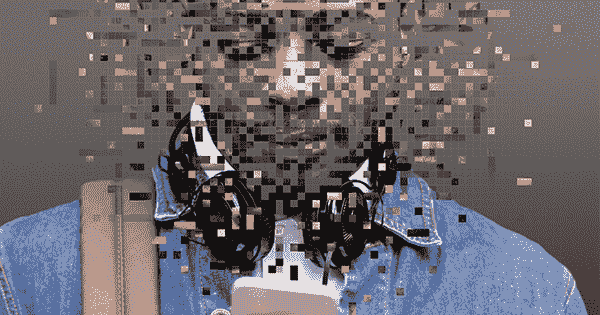

# 美国学者:在自拍时代拯救自我——詹姆斯·麦克威廉姆斯

> 原文：<https://theamericanscholar.org/saving-the-self-in-the-age-of-the-selfie/?utm_source=wanqu.co&utm_campaign=Wanqu+Daily&utm_medium=website>

Bonn studio/Stocksy；照片-插图由大卫·赫比克

2012 年，保罗·米勒，一名 26 岁的记者，也是《The Verge》的前作家，开始担心他的思维质量。他阅读难懂的研究或理解需要持续关注的复杂论点的能力落后了。他发现自己很容易分心，更糟糕的是，对此感到烦躁。他的长期试金石——他的智能手机——开始让他烦恼，让他感到不安全和焦虑，而不是根植于以前滋养他的想法。“如果我丢了手机，”他说，他会觉得“我永远也追不上了。”他意识到他的上网习惯对工作没有帮助，更不用说多任务处理了。他只是把他的注意力到处转移，在这个过程中，变得有点精神错乱。

更微妙的发现接踵而至。当他继续分析他的行为时，米勒注意到他正在将自然语言应用于数字现象。例如，他会提到他的“RSS 提要景观”更令人不安的是，他的观察如何体现为简短的推文，而不是完整的想法——他在考虑字数。当他意识到自己醒着的时候，有 95%的时间都在与数字媒体打交道，而在这个世界里，他“从来不知道有什么不同”，他向编辑提出了一系列有趣且具有规范性的文章。*断网一年会是什么样子？他的编辑买下了这个项目，而住在纽约的米勒则取消了这个项目。*

在最初的几个月里，世界像慢动作一样展开。他经历了“我更专注于当下的能力的切实变化”，回忆起“现在流经我大脑的分心事物越来越少。”他说，互联网“教会你期待即时满足，这让你很难成为一个好人。”断开连接后，他发现了一个更有耐心、更善于思考的自己，一个更愿意留恋那些他曾经远离的复杂事物的自己。“我的注意力持续时间更长，能够更好地处理复杂的阅读，我不需要即时的满足，而且，”他有点不协调地补充道，“我注意到了更多的气味。”他解释说，随着他成为“一个更具反思性的作家”，这种“让你无法集中注意力的无尽循环”减少了这是一个令人鼓舞的开始。

但是如果米勒变得更现实，他周围的人都不会。“人们和我说话感到不舒服，因为他们知道我没有做别的事情，”他说。在他的同龄人世界里，没有小工具的交流被证明是一个陌生的概念。朋友和同事们——有些人认为他可能已经死了——误解或不欣赏米勒的实验。另外，考虑到他实际上已经把自己托付给了线下交流，他们要避开他所要做的就是保持在线。这些行为都没有明显的敌意，所有的都是被动的，但它仍然是一个社会负担，提醒米勒，他的身份不是在真空中茁壮成长的。他的生活质量最终受到了影响。

米勒回忆起这段社会孤立时期的低谷。一天晚上，他和几个朋友一起走向地铁。当他们到达站台时，他的同伴做了他曾经会做的事情:他们拿出智能手机，进入了其他世界。他感到很尴尬，站在讲台上，看着自己空着的手，用智能手机模拟。“我现在称它为我的哑手机，”他说。线下一年结束，他松了一口气。

* * *

**收回控制**

无论是寻找信息、娱乐还是社会参与，我们都会本能地寻求进入其他场所——有时是痴迷，通常是不加批判，总是充满期待。但是，尽管连通性似乎有无限的好处，我们强化屏幕的时间正在阻碍我们的注意力范围。大量的科学研究(例如，“人类的注意力持续时间缩短到 8 秒”)和无数的轶事证明，在数字时代，越来越多的人无法保持专注，这些人不再能够读一本真正的书或进行面对面的交谈，而不会“扑通”——在与人交谈时瞥一眼手机。自然，一些数字福音派坚持认为一切都很好，数字多任务处理是一件好事，磨练我们的大脑来解决高度分散的 21 世纪问题。尽管如此，我们每天都在听到关于注意力相关担忧的新故事(2015 年 11 月 28 日，纽约时报:*:*“我翻开一本书，发现自己一遍又一遍地读着同一段话……”)，因为，唉，它们是真实的。

对互联网的潜在担忧不是它是否会分散我们的注意力，或者是否会让我们的思想适应现代的琐碎工作。最终，它可能会两者兼而有之。更深层次的问题是，当我们意识到我们想要控制我们的大脑和网络之间的交流，我们想要保护我们更深层次的自我意识免受数字媒体对现代生活的支配时，我们可以做些什么。米勒有点反常；大多数人不会担心他们思想的质量。但他也很典型，因为像越来越多的互联网用户一样，他知道数字化生活开始让我们疏远自己。

我们对此所做的可能会回答本世纪最大的问题之一。一份用户友好的行为建议清单——可怜的理查德的实现数字美德的年鉴——会很不错。但是这个问题很难解决。我们困境的本质是，数字世界解除了我们反对它的能力，同时用便利的保证诱惑我们，这一点对 x 世代和千禧世代尤为重要。至关重要的是，我们不仅要识别这一过程，还要充分理解数字媒体是如何利用我们的自我意识，同时抑制我们找回自我的能力。只有当我们抓住这一悖论的内在动力时，我们才能确信世界上的保罗·米勒(Paul Millers)——或其他希望在数字时代保持自己身份的人——能够形成技术关系，在这种关系中，个人决定数字媒体的使用，而不是相反。

* * *

**控制论暴政**

与此同时，另一种方式盛行。以全日制大学生埃里卡为例。她早上醒来做的第一件事就是拿起她的智能手机。她在睡觉时查看收到的短信。然后她浏览脸书、Snapchat、Tumblr、Instagram 和 Twitter，看看“其他人都在做什么”早餐时，她打开笔记本电脑，打开 Spotify 和她的各种电子邮件账户。一到校园，Erica 就面临更多的屏幕时间:幻灯片和在线作业，她尽职尽责地参与的学术内容(她是一名优等生)。一整天，她大约每 10 分钟就在社交媒体上查看一次，甚至在课堂上也是如此。“这有点让人不知所措，”她说，“但你不想感到被冷落。”

几千年来，我们一直担心这种情况。例如，苏格拉底担心书面文字会损害我们复述故事的能力。他在《菲德鲁斯》一书中指出，这种交流方式的彻底转变会让廉价的符号胜过真实的记忆，让传递变得容易胜过内心深处。从那以后，哲学家们一直在思考信息技术对人类身份的影响。但是，苏格拉底新生的技术恐惧症最鲜明的现代表达可能来自 20 世纪德国哲学家马丁·海德格尔，他关于这一主题的论文——尤其是《关于技术的问题》(1954)——为审视我们的现状建立了一个框架。

海德格尔对技术的理解是可怕的。他认为，它通过将所有经验简化为世界运作的原材料，限制了我们对世界的看法。为了防止“对存在的遗忘”，海德格尔敦促我们在非技术空间中寻求慰藉。他从未提供具体如何做到这一点的说明性例子，但正如学者霍华德·艾兰德(Howard Eiland)解释的那样，这需要将司空见惯视为异类，或者找到“熟悉中的一种本质上的陌生感”。说起来容易做起来难。在海德格尔的时代，阻碍这一努力的是这样一个事实:正如当代政治哲学家马克·布利茨所说，技术已经是“我们所属的一个事件”。在这种观点中，一个肯定适合今天的数字通信的观点是，技术以水与水混合的方式注入现实世界的体验，使得几乎不可能将人类和技术的观点分开，在熟悉的事物中找到怪异。按照布利茨的说法，这种融合意味着技术的统治“让我们忘记了对自己的理解。”

保留一个非技术天堂的唯一希望——过去是，现在仍然是一个遥远的希望——是培养海德格尔所说的“接近”接近是一个精神孤岛，我们可以站在上面，确认我们所经历的现象既体现又超越了技术。把它看作一种特权的本体论立场，一种通过一种特殊的智慧或观点来认识世界的方式。海德格尔隐含的希望是，人类区分技术和非技术感知的能力将把我们从“盲目推进技术的愚蠢冲动”中解放出来。

当然，海德格尔不认识任何软件工程师。《你不是小玩意》的作者、公认的虚拟现实之父杰伦·拉尼尔写道，“不参与社会工程，就无法与信息技术合作。”他警告说，那些负责“当下设计”的人，“把我们拉进了一种生活模式，这种模式逐渐降低了我们每个人作为个体存在的方式。”当我们的生活变得“被软件定义”时，我们就“陷入了别人最近漫不经心的想法中”小说家査蒂·史密斯将这一思想运用到脸书身上，并得出结论说:“其中的一切都被缩小到了其创始者的大小。…的确是马克·扎克伯格的作品！”虽然强调数字设计的想法可能会忽略我们的利益，但它们不是随机的。他们通常更看重商业而非创造力，更看重集体数据而非个人表达，最明显的是，更看重麻木而非亲近。在这些方面，他们为拉尼尔所说的“控制论极权主义”奠定了基础。

如果说从柏拉图到海德格尔到拉尼尔的思想家们强调了过度使用技术的威胁，那么像保罗·米勒和埃里卡这样的人——生于数字世界的数字原住民——必须更充分地适应它。对我们的数字心理最具思想性的分析——除了拉尼尔的书，还有尼古拉斯·卡尔的*The shalls、*斯文·伯克尔茨的*改变话题、*雪莉·特克尔的*reclaming Conversation、*和威廉·鲍尔斯的 *Hamlet 的 BlackBerry*——都把年轻一代(在很大程度上也包括我们其余的人)描绘成对技术麻木，往往不自知。总的来说，这些作品表明，如果我们还没有越过卢比孔河进入数字化提交，留下被掏空的一代人的小玩意，那么我们已经在路上了。如果这听起来很戏剧化，那就去参观大学校园，参加公开讲座，去健身房，乘坐公共交通工具，或者下次你在红绿灯前停下来时四处看看，你会意识到，唉，他们是对的。这就引出了一个关键问题:

数码机器的秘密是什么？

* * *

**永远存在的诱惑**

当我审视自己与数字技术的关系时，我倾向于认为我可以从容地离开它。我的模拟过去——我带着打字机去上大学——一直伴随着我，成为数字时代的生命线。但对于 x 世代和千禧一代来说，相似的过去要少得多。甚至对于许多老用户来说，过去的许多事情早已被遗忘。不存在生命线，没有稳定的参考点，没有可利用的替代方案。只剩下数字化的瞬间。那个时刻用一个特别引人注目的承诺诱惑了我们:让我们当下并且永远当下；同时注意这里和那里。这种普遍的人类欲望本身是不可抗拒的。但是，当旨在实现这一承诺的工具也适合我们的手，并对我们的拇指作出反应时，那么它需要巨大的努力来逃避永远存在的诱人逼真性。

但是屏住呼吸一会儿，你会突然想到——这个想法是荒谬的。一个真正的自我不可能同时出现在两个地方，更不用说五六个地方了——至少不会以任何有意义的方式出现。我们开始意识到这种局限性的一个迹象是，今天的重度使用者的集体情绪状态表明:他们是一个残骸。正如《高等教育纪事报》最近报道的那样，大学生——几乎所有人都被绑得紧紧的——是人类历史上最焦虑的成年人之一。“技术焦虑比比皆是，”亚历克西斯·马德里加尔在《T2 大西洋月刊》中写道。甚至*科技时报*也强调了无处不在的“持续出现在社交媒体上的压力和焦虑”这个不幸的消息到处都是。

然而，正如我与 Erica 的谈话所证实的那样，焦虑也有其积极的一面，它暗示了我们可能会如何面对我们的数字困境。当埃里卡和我交谈时，一种低沉的数字焦虑的嗡嗡声是显而易见的。她想完全参与谈话。在很大程度上，她是。正如国务院所说，我们进行了一次深思熟虑的讨论，涵盖了一系列重大问题。但是当她的手机正面朝上放在我们之间的桌子上时，这种技术手段意味着在别处——同时在这里和那里发出声音——离她的手只有两英寸。在告诉我她觉得骑自行车去校园有多满足——“当我骑自行车时，我被迫关注我周围的世界”——之后，埃丽卡通过做一些体现无处不在的数字焦虑的事情来完成她的想法。她伸手去拿电话，停顿了一下，控制住自己，然后猛地把手抽了回来，做了个鬼脸，好像她刚碰到了一个热熨斗。

这是一个引人注目的策略。我们笑了。我们在理论上讨论的挑战现在就在我们眼皮底下出现了。是的，我们同意了，很难*不*看那个东西！是的，我们也同意，我们感到技术罪，因为我们知道在内心深处，分散注意力会破坏一些重要的东西——在这种情况下，是对话。我们残留的感受力是我们数字困境的一线希望。埃里卡的告诫来自内心，代表着在数字文化中恢复认同感的机会，因为它证实了我们的意识，即我们不仅将自己拱手让给虚假的数字承诺，而且我们对由此产生的行为一点也不满意。我们不想被一个设备所奴役。我们想重新获得一定程度的控制。这样做将需要一些你可能意想不到的东西——迎合数字生活承诺要结束的体验:压力。

* * *

**压力下的自我**

如果有一个因素能让我们抵制主流范式——技术或者其他——那就是强烈锚定的身份。但这种身份正是数字生活所威胁的。为了达到接近，为了理解为什么米勒在模拟时代结束了孤独，我们必须欣赏数字设备如何侵蚀我们自我意识的细节。数字生活强调方便、快捷、匿名、可交换、控制、愉悦和娱乐，承诺让我们轻松度过每一天。让我们轻松度过一天听起来棒极了。但是这种便利的代价是妥协的自我。数字技术通过消除(或至少承诺消除)我们生活中的某种压力模式，同时削弱了我们原本用来抵抗其统治的武器。从这个意义上说，压力就像是身份认同的氧气。由于数字技术从房间里吸取了它，我们已经精疲力尽而没有注意到，更不用说去反击了。

我所说的压力，并不是指任何戏剧性的或特殊的事情。平凡的活动符合条件。无聊、与朋友争吵、坠入爱河、抵制诱惑、藐视传统、学习一门手艺、与伴侣分手、演奏乐器、发表演讲、阅读福克纳、背诵一首诗——这些日常的模拟努力是无价的，因为它们迫使我们面对不适。当我们面对这些挑战时，我们可能会失败，反击，变得沮丧，成功，发脾气，冷静下来，感到自信，吃得过多，吃得不足，去跑步，遭受不安全感，等等。通过这些经历，在面对真正挑战的诚实尝试中，我们最终发展出一种锚定的成人身份，能够对抗我们的数字恶魔。

日常生活为培养性格塑造行为提供了无尽的机会，一旦这些行为成为习惯，就会培养我们的反抗武器，而不是用它们来换取互联网的便利。这些习惯中有四个对保持锚定身份至关重要:花时间独处，参与有意义的对话，建立友谊，在社区内从事一项活动。想象一下，如果可以的话，一种身份可以在数字文化的最小干扰下发展，你会开始理解这四种压力对希望与数字化生活建立更健康关系的人的好处。

* * *

**独处而不独处**

我们从孤立开始。独自一人，虽然不舒服，但能让我们反思自己的所爱和所惧。我们从出生开始就经历爱和恐惧，但到了青春期，我们终于有了认知能力来考虑*为什么*我们对古典吉他感到兴奋，但对蛇感到厌恶，这种意识使我们能够将自己的私人偏好印在内心深处。如果我们能够忍受独处，不受干扰，我们会听到我们意识的低语，告诉我们我们是地球上唯一能够回答这个关键问题的人，“成为你是什么感觉？”我认为，没有什么比这个问题更能证明隔离的价值了。

但是孤立只能是暂时的。花时间独自思考和感受是另一种压力体验的前奏:交谈。与今天的敲敲打打的短信族的期望相反，正确的对话不仅仅是内容的功能交换。正如雪莉·特克尔(Sherry Turkle)所写的，她的*回收对话*的副标题是*数字时代谈话的力量*，真正的谈话是我们投资的东西，以获得“自我认识、同理心和社区体验的回报”它要求我们将一个脆弱的自我引入社交空间，掷出口头骰子，并希望建立联系。无论多么具有挑战性，交谈都有助于人们“发现他们对自己隐藏的东西”在这方面，它要求我们通过强迫我们对无脚本交流的模糊和尴尬有耐心来寻求压力。(如果你认为谈话没有压力，想想你试图避免多少看似无伤大雅的谈话。)

这种自我和社会之间的紧张关系——独处时间和与他人相处时间之间的紧张关系——让我们想到了身份保护的第三个要素:友谊。从随意的关系到浪漫的亲密关系，其定义的共性是，你有可能会透露比你敢在脸书上发布的更多的信息。它是关于提供进入内在自我的特权。用最简单的话来说，友谊来自于一方愿意冒险自我表露和另一方愿意回报。结果可能会以遭到拒绝的灾难而告终。但是，如果一切顺利，如果回报接踵而至，贝内特·赫尔姆在*爱情、友谊和自我*中所相信的“是什么让我们成为人”的基础就奠定了

最近关于友谊最有趣的发现之一是，它在特定的社会环境中发展得最好——一个运动队，一个宗教团体，一个兄弟会，一个乐队，一个俱乐部，一个帮派，一个邪教，任何其他人可以证实你特殊承诺的团体。这就把我们带到了身份保护的最后一个要素——参与集体活动。在《超越你头脑的世界:成为注意力分散时代的个体》一书中，马修·b·克劳福德指出，西方人对个人主义的痴迷导致了对“共享世界”的“疏忽性视而不见”这种不假思索的短视产生了一种唯我论，自我认为它以某种方式解释了自己的启示。对一个人稚嫩的自我绽放的这种过度信任抹去了所有的意识，用 Crawford 的话说，“我们理所当然地*欠对方一定程度的关注和道德关怀。”相反，一切都是为了你。*

作为对这种只顾自己的解毒剂，克劳福德建议参与一项有技巧的努力，最好是与其他爱好者合作进行。这样一种社会安排要求个人去教导和被教导，去领导和被领导，去谦卑和被谦卑，同时把个人降低到传统和专业知识的更大要求。通过这种方式，关系——单独由时间产生，由谈话培育——被赋予了应有的深度。因此，一个完全成形的自我可以在接近的领域中保护自己，通过指示它将如何参与数字世界，而不是屈从于它的帝国设计。

* * *

**数字裁军**

以上所述的四个习惯，对于打造一个完整的自己是必不可少的。它们提供了让你成为你自己的原始体验。当完全形成时，它们保护我们作为个体免受数字冲击，因为它们引导我们走向威廉·鲍尔斯在*哈姆雷特的黑莓*中所说的“令人满意的沉浸”到我们的“内在自我”这是保罗·米勒在他的实验陷入黑暗之前庆祝的那种沉浸感。但数字生活最隐秘的一点是，虽然它承诺增强那些体现身份的习惯，但却削弱了它们的力量，让我们在不知不觉中容易受到数字媒体的诱惑。这是一个阴险的过程。数字技术发誓要通过让一切变得更快更容易来提高我们的生活质量，尽管它窃取了这种质量，但留给焦虑的用户的只是沉迷于下一个新事物的机会。

这种裁军是如何发生的很复杂，但它始于厌倦。现代生活的大部分是乏味的。戴维·福斯特·华莱士深刻理解并表达了这种厌倦的本质。在一次著名的凯尼恩学院毕业典礼演讲中，他回忆起在一天地狱般的工作后站在杂货店的长队里:“商店里灯光昏暗，充斥着令人窒息的音乐或公司流行音乐，这几乎是你最不想去的地方。”华莱士在他的小说《苍白的国王》中坚持认为，学会处理这种情况会让生活变得有意义。目标是“找到死记硬背、琐碎、无意义、重复、无意义的复杂的另一面。一句话，不可容忍。”

这款神奇的智能手机——在华莱士于 2008 年去世后正式问世——似乎已经实现了让它的主人变得无懈可击的令人钦佩的目标。谁会对这种在这里和那里之间提供持续连接的装置感到孤独和厌倦呢？此外，当它迷人的干扰随着每一声叮铃在多巴胺中冲刷我们的大脑时，面对杂货店排队的单调乏味，我们怎么可能抗拒它呢？有充分的理由，拿起智能手机已经成为对抗无聊的终极默认举动。

但这并不能真正解决任何问题。如果强调这种体验的无聊被外包给一个应用程序，也就是说，如果这种体验的压力被消除，那么孤独就不算孤独。孤独和无聊的基本事实是，当你通过自己意识的特质参与其中时，这一刻就成为了你的。当你拥有它的时候。尽管孤独令人不舒服，但它肯定是一种彻底专注于自我的努力，因为只有在单调和分心之间的安静空间里，我们才能做出持久的选择，关于我们是谁，我们相信什么，我们想成为谁，我们想支持什么，以及——与我们的目的最相关的——我们想抵制什么。再说一遍，戴维·福斯特·华莱士:

> 如果你真的学会了如何思考，如何集中注意力，那么你就会知道你还有其他选择。实际上，你有能力体验一种拥挤、喧闹、缓慢、消费者地狱式的情形，这种情形不仅有意义，而且神圣，燃烧着与照亮星星的力量相同的力量——同情、爱和所有事物的地下统一。神秘的东西并不一定是真的:唯一绝对真实的是，你可以决定如何看待它。你可以有意识地决定什么有意义，什么没有意义。你可以决定崇拜什么。

每当我们允许社交媒体为我们做出崇拜什么的关键选择时，我们就把自己的身份托付给了软件。我们避开了法国哲学家加斯东·巴什拉所说的“我存在于世界上的秘密”的力量，只为了一个廉价的 Twitter 卷轴。尽管数字分散注意力有望缓解无聊，但它从存在主义等式中移除了身份发展的基本前提——个人独自面对一切。当智能手机将我们的意识转移到其他地方时，每次我们拿起它以避免孤立的压力时，我们最隐私的选择突然不再是好奇的头脑未被发现的野心，而是数据驱动的云的商业设计。

这种注意力分散的后果不仅限于拿着 800 美元解闷药的个人。在特克尔的评估中，一个不愿意独自陷入无聊的兔子洞的自我，是一个允许虚拟联系取代交谈成为所有社会关系基础的自我。数字技术的拥护者长期以来一直称赞网络交流的广泛迷宫。互联网及其卫星设备确实产生了前所未有的连通性，但分析我们在该网络中互动的批评者对随之而来的讨论远没有那么乐观。数字技术可能会促进热情的外联，但它无法产生压力，否则会激发实际的对话。发短信或网上聊天，甚至交换电子邮件，可以让用户避免面对面交流时的尴尬。正如一位受访者告诉特克尔的，一些对话在数字空间进行时变得“更干净、更平静、更深思熟虑”。其他的——比如和恋人分手——可以完全避免。事实上，千禧一代经常通过停止发短信来结束一段关系。在这两种情况下，激动人心的时刻——也就是激发对话的情绪出现的时刻——都被数字距离驱散了。

当你自己编辑文本或电子邮件时，你可以控制信息。当你面对面射击时，你不会。任何事情都可能发生。意识到从你嘴里说出来的话可能会让你惊讶——你的伴侣发给你的东西也是如此——提醒我们，对话中的魔法比两个精心策划的脸书页面之间发生的任何事情都要多。

不难看出对话的消亡是如何贬低人际关系的。触觉对话需要我们感同身受，以测试友谊的水。但是当自我拒绝对话时，同理心就会消失。尤其是数字原住民已经将网上的虚拟友谊视为真实的东西。但是他们这样做的时候并没有意识到是谁在策划这些关系，或者这些关系会对他们的同理心产生什么影响。正如杰伦·拉尼尔提醒我们的那样，为在线互动设定模式的工程师对随之而来的关系没有任何投入。他指出，“当我们(技术专家)部署对现实生活有影响的学习或友谊之类的计算机模型时，我们依赖的是信念。”千禧一代似乎毫无疑问地接受了在数字空间建立的虚拟关系的合法性。但是拉尼尔问他们:“你能告诉我们为了让幻觉为你所用，你已经让自己的人格意识退化到什么程度了吗？”

数字替代抹黑的最后一项身份塑造努力是参与追求共同卓越的社区。在线社区的追随者(尤其是在线教育的倡导者)声称，虚拟会议以民主的方式拓宽了社区体验的渠道。他们向所有想进来的人敞开大门。这种说辞可能会鼓舞人心，但它忽略了在线社区如何将参与者与健康社区的关键方面隔离开来，例如专业知识的层次和在共享的物理空间中学习的机会，在同龄人的实际注视下，他们可以直接体验你的表达。

没有什么比在线论坛上糟糕的对话更能凸显真实社区和人工社区之间的重要区别了。修辞上的污秽在网上溃烂，不是因为人们是天生的巨魔，而是因为这个社区，可以说，脱离了人类的环境。从“我”的位置参与虚拟社区的个人无法判断他在不断变化的人才等级中的相对位置。笔记本电脑前的孤独者不是评估他的弱点或分享他的优势，而是坐在后面，抨击，并用克劳福德所谓的“赢得的独立判断”来交换往往成为不劳而获的咆哮。在虚拟论坛中如此流畅地流动的尖酸刻薄源自数字化文化，它通过诱惑我们进入其领域，使我们能够绕过基本的人类互动，这种互动永远不会让保罗·米勒(Paul Miller)站在地铁站台上，与所谓的朋友一起，盯着他的赤手空拳。

* * *

**恢复**

面对数字裁军，如果不是因为它，人与数字的关系正在向一些技术专家所说的“第四次工业革命”靠拢。根据世界经济论坛领导人克劳斯·施瓦布的说法，这种转变承诺将“物理世界、数字世界和生物世界”合二为一。华尔街和硅谷对此兴奋不已。但对于任何关心数字时代人类自主命运的人来说，这一预测即使被夸大了，也是发人深省的。随着这场革命的逼近，我们既要理解数字裁军的机制，又要恢复应对它的能力。这并不是说我们应该致力于废除数字媒体或者完全脱离——一点也不是。相反，我们必须学会像数字化人类生活一样积极地使数字生活人性化。

没有一个解决方案能够恢复人与数字关系的公平。尽管如此，无论我们追求什么手段，都必须容易获得(而且便宜)，提供信息、娱乐和社会参与的便利，同时促进将自我锚定在社会中的身份建设体验。柏拉图可能不同意，但今天最适合实现这些目标的工具是一个如此简单的物体，以至于我几乎可以感觉到人们对这种解决现代困境的怀旧方法的回应:书。在自拍的时代拯救自我，可能比找回丢失的严肃阅读艺术要简单得多。

还有什么活动如此巧妙地平衡了不分心的孤立和积极的社会互动？在一个方面，阅读首先需要自我，在面对他人的叙述时剥光自己的意识，去面对文本。(卡夫卡称阅读为“我们内心冰冻之海的一把斧头。”)从另一方面来说，阅读将我们从自我拉出来，进入各种各样的思想社区，在这些地方，移情和阐释汇聚在一个参照点上。任何曾经分享过对一本书的热情的人都明白爱默生对友谊的定义是一种你和另一个人“看到相同的真理”的现象即使来自孤立调查的解释最终发生冲突，乔治·艾略特的说法仍然成立，即阅读是“扩大经验和扩大我们与同伴接触的一种方式”。对于那些面对数字暴政越来越感到无助的人来说，这本书可能不是弱者的终极武器，但它是我所能想象的最有效、最容易获得的出发点。

不是每个人都同意。一些文学评论家已经把文学的灯关掉了。在 1988 年一篇名为“书生气的终结？”乔治·斯坦纳想知道我们 500 年的习惯是否已经到达终点，最终被剥夺了“某种‘经典阅读’所依赖的空间和休闲经济学”也就是说，一些有希望的迹象表明，阅读——就像慢餐和黑胶唱片——正在卷土重来。在我采访的几十个关于网络习惯的人中，只有一个——一个 71 岁的老人——清理了他的书架，接受他所谓的“数字化信息革命”

其余的人仍然对阅读抱有特别的崇敬，他们中的大多数人希望自己能多读书。许多年轻人正在积极寻求一个正式的数字文化休息时间，以培养一种文学心态。《这是一种可分享的生活》一书的合著者切尔西·鲁斯特罗姆告诉我，千禧一代“感觉彼此之间真的很疏远，但不知道为什么”，他们正在参加“数字排毒务虚会”，为更多的沉思努力做准备。珍贵的少数千禧一代已经阅读了，就好像生活依赖于它一样，他们有机会——是的，因为互联网——将他们的文学热情转化为与不受传统规范束缚的一代人相关的批评。30 岁的乔纳森·拉塞尔·克拉克(Jonathan Russell Clark)是 Lit Hub 的特约撰稿人，也是一名出版发行广泛的书评家，他告诉我，作为一名年轻的评论家，他最重要的目标是展示自己对阅读书籍的热爱，以此来激励新读者。“责任在我们身上，”他说，指的是年轻一代的评论家有责任激发人们对严肃阅读的兴趣。

很难说这些趋势会如何发展。但是，随着数字生活的迷雾逐渐散去，我们变得越来越紧张，越来越冷漠，越来越唯我主义，越来越与全球联系在一起，越来越在自己焦虑的熔炉中寻找解决方案，有必要重申一下阅读对寻找自我的作用。一本实体书，将我们从弹出式广告和当散文变得乏味时点击遗忘的诱惑中解放出来，代表了一个身份在数字暴政中发现海德格尔的接近所需要的一切。它让人们沉浸在内心体验中，参与到热烈的讨论中，在更大的社区中保持谦逊，并肯定对体验人类同胞意识的不可避免的追求。这样，书才能拯救我们。

重印、复制或其他用途需要许可。