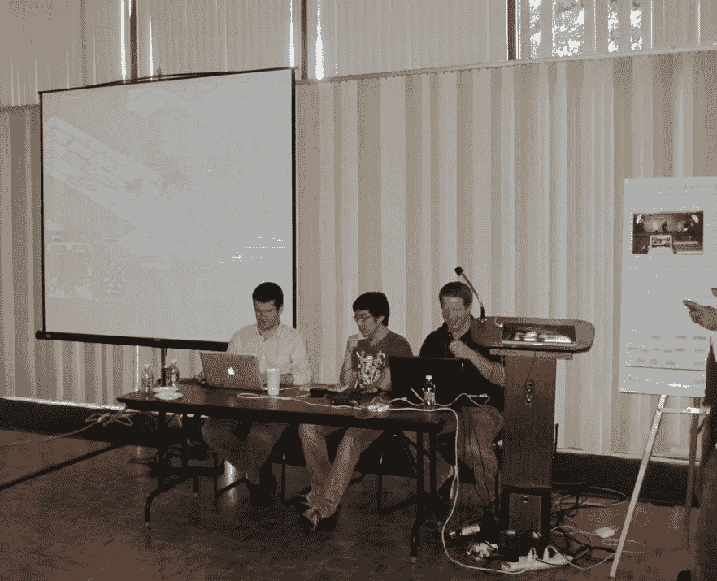
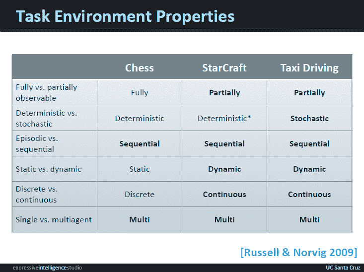

# 星际争霸的深度思维挑战

> 原文：<http://gamasutra.com/blogs/BenWeber/20160314/267956/DeepMind_Challenges_for_StarCraft.php?utm_source=wanqu.co&utm_campaign=Wanqu+Daily&utm_medium=website>

[AlphaGo](https://en.wikipedia.org/wiki/AlphaGo) 最近与 9 段职业围棋手 Lee Sedol 对弈。人工智能[在与人类对手的前三场比赛中赢得了](https://twitter.com/demishassabis/status/708567021122772992?ref_src=twsrc%5Etfw)，在五局三胜的比赛中取得了胜利。随着这一挑战的完成，DeepMind 团队正在寻找新的问题，以用作该系统的试验台。DeepMind 的联合创始人戴密斯·哈萨比斯[表达了对星际争霸作为一项挑战的兴趣](http://fortune.com/2016/03/11/go-deepmind-starcraft/)。

为星际争霸:育雏战争构建专家级 AI 仍然是一个未解决的研究挑战。表现最好的机器人在 ICCup 上获得了 D+评级，考虑到在这个系统上的比赛水平，这是令人印象深刻的，但仍然远远达不到专业团队中 B 队成员的技能。我在 2010 年开始了 AIIDE StarCraft [AI 竞赛](http://eis-blog.soe.ucsc.edu/2010/10/starcraft-ai-competition-results/)，目标是让更多的研究人员相互评估他们的机器人，以及评估机器人与人类玩家的挑战。[竞赛](https://webdocs.cs.ualberta.ca/~cdavid/starcraftaicomp)现在被组织成一年一度的赛事，有一个人机对抗展览。表现最好的机器人要打败专业玩家还有很长的路要走。

AIIDE 2010 人机表演赛

在讨论星际争霸中的挑战之前，我想简单讨论一下我是如何理解 AlphaGo 的工作原理的。该系统由 DeepMind 提供支持，该系统使用卷积神经网络和一种 Q 学习形式。AlphaGo 通过使用蒙特卡罗树搜索来评估棋盘状态，从而扩展了这一点。神经网络使用来自专家玩家的例子来引导，然后使用强化学习来自我训练。AlphaGo 的突破之一是在知识表示上。该系统使用自动编码器来创建知识表示，大大优于手工制作的解决方案。关于 DeepMind 的更多细节可以在谷歌的[出版页面](https://deepmind.com/publications.html)上找到。

星际争霸是一个伟大的人工智能试验台，因为它提出了许多执行现实世界任务所必需的挑战。作为我的[论文](http://alumni.soe.ucsc.edu/~bweber/bweber-dissertation.pdf)的一部分，我根据拉塞尔和诺维格的任务环境属性对星际争霸进行了分类。此分析的结果如下图所示，真实属性以粗体突出显示。星际争霸和出租车驾驶等现实世界活动的唯一区别在于，星际争霸是一个确定性的环境。这个例子将国际象棋列为传统的人工智能挑战，但是国际象棋和围棋的所有属性都是相同的。

以下是我看到的将 DeepMind 应用于星际争霸的主要挑战。

战争迷雾:星际争霸是一个不完美的信息环境。您只能查看地图上您当前放置了单位的区域。这就是为什么环境被称为是部分可观测的，而像国际象棋和围棋这样的游戏，其完整的游戏状态在任何时候都是可见的，则被称为是完全可观测的。为了应对这一挑战，DeepMind 需要在战略和战术层面上处理对手可能采取的行动空间。一个专业的人工智能需要能够预测对手在追求什么建造顺序，以及识别对手可能在哪里发动战术打击。

**决策复杂度:**星际争霸有一个巨大的状态空间。分析通常是根据决策复杂性进行的，决策复杂性是指在任何给定时间可以执行的不同操作的数量。在星际争霸中，你可以有数百个单位，每个单位可以执行不同的任务，这导致了巨大的决策复杂性。人类玩家通过遵循最初的建造顺序和使用小队将单位组合在一起来降低决策的复杂性。DeepMind 将需要开发新的知识表示，使系统能够使用不同的抽象级别有效地推理可能的行动空间。

《星际争霸》有一个不断发展的元游戏，新的建造顺序随着时间的推移变得流行，然后随着新的建造顺序的发展而逐渐消失。这是星际争霸的一个特性，也适用于围棋，因为围棋的策略已经随着时间而演变。专家级星际争霸游戏的一个关键区别是每一季都会轮换使用地图，不同的地图更适合不同类型的游戏。例如，当我在 2010 年还是一个大型育雏战争观众时，Flash 能够利用奖励早期扩张的宏观有利地图。DeepMind 需要开发适应新地图库的能力，这可以通过引导学习或通过识别地图的共同模式来完成。

**Cheese:** 为了在星际争霸中表现出色，你需要为对手的各种战术做好准备。其中一些技巧被称为“奶酪”,因为它们是试图轻松取胜的全押方法。例如，加农炮冲刺是试图快速战胜毫无准备的对手的一种常见方式。一个专家玩家需要能够处理来自玩家的各种各样的攻击性战术，以便持续获胜。一般来说，高水平的玩家不太可能使用这些技术，但他们通常在多场比赛中使用，以便给对手惊喜。本质上，这意味着人工智能需要处理对手可能正在做的许多不同的边缘情况。为了克服这一挑战，DeepMind 应该针对各种不同的对手技能水平进行训练，以确保覆盖可能的战略和战术空间。

模拟环境:星际争霸是闭源的，这使得运行模拟相当具有挑战性。AlphaGo 使用的技术之一是强化学习，这涉及到大量的模拟。为了让 DeepMind 克服这个限制，很可能需要开发状态空间的新抽象。

**实时:**星际争霸是一款实时策略游戏，要求玩家实时执行各种动作。高水平的星际争霸游戏性的一个方面是每分钟大量的动作(APM)。为了让你的单位发挥最大效用，高 APM 是必要的。例如，风筝能让玩家对敌方单位造成伤害，同时对攻击单位造成最小伤害。为了让 DeepMind 有效地运行，该系统需要在精确计时的情况下实时执行任务的能力。一种可能性是结合其他人工智能技术，如行为树或有限状态机与深度学习。

将 DeepMind 应用于星际争霸将会带来许多有趣的研究挑战。我认为这对 Deep Mind 来说是一个巨大的挑战，因为星际争霸是一个拥有许多现实世界属性的试验台。以下是我期望在可能击败 Flash 或 Jaedong 的 DeepMind 版本中看到的主要突破:

*   处理世界国家不确定性的新机制。
*   降低游戏决策复杂性的新颖抽象。
*   追踪进化元游戏的新自举方法。
*   使用其他人工智能技术处理实时动作的扩展。

星际争霸可能很难解决，因为有竞争力的玩家大多转移到新的标题。但是，在 ICCup 上仍然有一个活跃的竞技社区可以用于训练。

onta nion 等人对 RTS 游戏人工智能现状的概述可在[这里](http://richoux.fr/publications/ecgg15_chapter-rts_ai.pdf)找到。