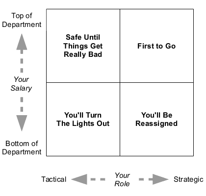

# blog.kdgregory.com:裁员

> 原文：<http://blog.kdgregory.com/2016/03/layoffs.html?utm_source=wanqu.co&utm_campaign=Wanqu+Daily&utm_medium=website>

你在你们公司的裁员名单中排在第几名？每个公司都有一个，即使它只是首席执行官头脑中一个模糊的想法。环顾四周，你应该能够确定自己的大致位置。例如，在我的 20 人部门中，我认为自己是第三名。也许是第二，也许低至第五。但不管怎样，他是第一个离开的人。

让我在这里停下来，强调一下，被解雇并不意味着你没有能力，或者不如那些留下来的人。

裁员是对资金枯竭前景的一种冷静理性的回应。有时它们发生在危机之前，有时发生在公司濒临破产的时候。但不管是哪种情况，被解雇仅仅意味着你的技能被认为没有你的工资和福利有价值。我意识到当你是被解雇的那个人时，这并不是什么安慰。

在 30 多年的职业生涯中，我被解雇过三次。第一次是在我第二份工作六个月后，发生在我休假回来的那个星期一。我当时在一家制造实验室仪器的中西部公司的子公司工作，大约一年前，这家公司刚刚被独立收购。不管出于什么原因，母公司决定整合其总部的业务。我们都被召集到大会议室，并被告知我们已经没有工作了。第三次类似:我在一家大型电信公司的子公司工作，这家公司太晚才知道翻盖手机已经过时了。

从这两个例子中没有什么可以学到的，也没有什么可以做的；你只需要做好准备。如果你幸运的话，他们会给你一笔可观的遣散费。

我的第二次裁员更有趣。这发生在互联网泡沫破裂的末期。我们已经经历了三轮裁员，以及寒假期间的强制休假。新年伊始，我和我的部门副总裁坐下来，说“我知道我现在是裁员名单上的第一名，让我们谈谈吧。”六个月后(在我获得一大笔留任奖金后)，第四轮机会来了，他说“你是对的。”

我是怎么知道的？像许多事情一样，你被解雇的可能性可以用四象限图来表示:

左边的轴是薪水:你越贵，你成为的目标就越大。你可能会说这没有考虑生产率，但我认为这是不相关的。如果你在一家重视生产力的公司，那么每个人都会有生产力；顶端和底端之间有 10 倍差距的想法是一个神话。如果你在一家不重视生产力的公司，不管你认为自己的生产力有多高，你都只是机器中一个已知成本的齿轮(说真的，你在这样一家公司做什么？).

底部的轴，战略对战术，是我认为更有趣的一个。战略工作是面向未来的:塑造你的下一个产品或下一个版本。战术工作就是现在:运营、漏洞修复、响应客户的即时需求。当一家公司被迫做出选择时，他们每次都会将战术置于战略之上。在我第二次失业的情况下，我不是收入最高的人，但我的工作完全着眼于未来；这让我名列榜首。

那么，当你知道自己即将被解雇时，你会怎么做呢？

浅显的答案是你更新了你的简历，但这在几个方面是错误的。首先，当然是你的简历应该*总是*是最新的，以防完美的工作落到你的头上。第二，如果你换了工作，你可能会从一个裁员名单的首位移动到另一个的首位，而没有抵消终身职位的好处(是的，这不是一个简单的四象限图；从来都不是)。最后，因为只有在裁员迫在眉睫的时候，知道自己在名单上的位置才重要。

如果你在一家顺风顺水的公司，地平线上没有风暴，就没什么理由去在意。是的，总有可能发生黑天鹅事件，让公司陷入危机，但这不值得我们为此彻夜不眠。

如果你为一家确实面临明显财务困难的公司工作，你应该考虑一下你的选择。也许你从一个战略位置过渡到一个更具战术性的位置。或者，还是那句话，什么都不做。我为一家风险投资的创业公司工作，这意味着我们要么盈利，要么倒闭。但是我正在做我被雇来做的工作，我很享受这份工作，而且我已经准备好面对失业的可能性。

如果你为一家已经裁员并且看起来还会裁员的公司工作呢？也许是时候和你的经理(或者更好，你经理的经理)进行一次坦诚的谈话了。谈谈你在裁员名单上的位置，以及你可以采取什么措施来降低你的职位或缓解你的离职。

就我而言，我已经在考虑搬到费城和我现在的妻子在一起。如果我不在的话，也许我和副总裁的谈话把我提到了名单的最顶端。但这意味着我们都为六个月后发生的事情做好了准备。