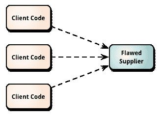
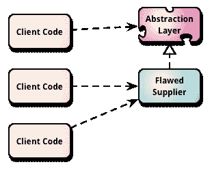
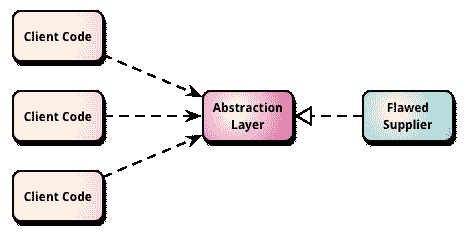
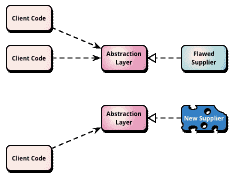
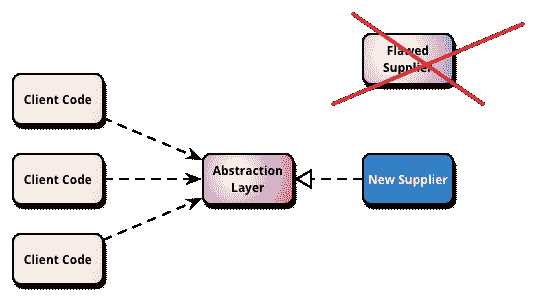

# BranchByAbstraction

> 原文：<http://martinfowler.com/bliki/BranchByAbstraction.html?utm_source=wanqu.co&utm_campaign=Wanqu+Daily&utm_medium=website>

“抽象分支”是一种以渐进的方式对软件系统进行大规模变更的技术，它允许您在变更仍在进行中时定期发布系统。

我们从软件系统的不同部分依赖于我们希望替换的模块、库或框架的情况开始

我们创建了一个抽象层，它捕获了客户端代码的一部分和当前供应商之间的交互。我们更改客户端代码的这一部分，完全通过这个抽象层来调用供应商。

我们逐渐将所有客户代码转移到抽象层，直到抽象层完成了与供应商的所有交互。当我们这样做的时候，我们抓住机会通过这个抽象层来提高供应商的单元测试覆盖率。

我们构建了一个新的供应商，它使用相同的抽象层来实现一部分客户端代码所需的特性。一旦我们准备好了，我们就切换客户机代码的这一部分来使用新的供应商。

我们逐渐替换掉有缺陷的供应商，直到所有的客户代码都使用新的供应商。一旦不需要有缺陷的供应商，我们可以删除它。一旦我们不再需要它来进行迁移，我们也可以选择删除抽象层。

我上面的描述描述了一个常见的情况，但是有很多可能发生的变化。有时你不能只为某些客户更换供应商，你必须一次全部更换。有时，您可以将供应商的特性分解成不同的子组件，并一次一个子组件地执行整个过程。

尽管存在这些差异，但有一个共同的主题。使用抽象层允许多个实现在软件系统中共存。使用一个抽象和多个实现的概念来执行从一个实现到另一个实现的迁移。确保系统始终正确构建和运行，以便您在进行更换时可以继续使用[连续交付](/delivery.html)。寻找尽可能多的方法来逐渐改变。

## 进一步阅读

[Jez Humble 描述了](http://continuousdelivery.com/2011/05/make-large-scale-changes-incrementally-with-branch-by-abstraction/)他的团队如何使用抽象分支来为 Thoughtworks 的持续交付工具“Go”替换对象关系映射框架(ibatis 到 hibernate)和 web UI 框架(velocity/JsTemplate 到 Ruby on Rails)。

Paul Hammant 提供了使用抽象分支的更多细节，特别是作为版本控制分支的替代方法。

史蒂夫·史密斯[描述了一个变体](https://www.continuousdeliveryconsulting.com/blog/application-pattern-verify-branch-by-abstraction/)，它涉及到验证两个实现返回相同的结果给请求。

## 承认

Thanks to Paul Hammant for his detailed suggestions as well as being an important primary source.