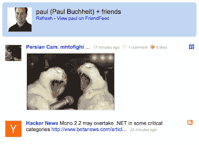

# 保罗·布赫海特:用代码交流

> 原文：<https://paulbuchheit.blogspot.com/2009/01/communicating-with-code.html?utm_source=wanqu.co&utm_campaign=Wanqu+Daily&utm_medium=website>

有些人可以通过精彩的演讲或巧妙的幻灯片演示来推销他们的想法。

我不能。

也许这就是为什么我对通过精彩的演讲和华而不实的幻灯片推销的想法持怀疑态度。也可能是因为太容易忽略那些杂乱的细节，或者被那些看似非常重要，其实并不重要的细节所困扰。我也对无休止的争论感到厌烦。

期间我们做了很多错事

[2.5 years of pre-launch Gmail development](http://paulbuchheit.blogspot.com/2009/01/overnight-success-takes-long-time.html)

，但有一点我们做得很对，那就是始终拥有实时代码。Gmail 的第一个版本是在一天之内完成的。它给人的印象不是很深——我所做的只是把谷歌群组(新闻组搜索)代码(我之前的项目)和我的电子邮件塞进去——但它是实时的，人们可以用它(搜索我的邮件...).从那天开始直到发布，每一个新功能都立即上线，大多数新想法都尽快实现。这导致了大量的变动——我们重新编写了大约六次前端，三次后端——但这意味着我们对所有的功能都有了直接的体验。在我们尝试之前，许多功能看起来都是很棒的想法。其他的事情看起来会是很大的问题或者很令人困惑，但是一旦它们出现了，我们就忘记了所有的理论问题。

这个过程的伟大之处在于，我不需要向任何人推销我的想法。我只会写代码，发布特性，然后观察响应。通常，每个人(包括我)最终都会讨厌它(尤其是我的想法)，但我们总能从经历中学到一些东西，并且能够很快转移到其他想法上。

这一过程中最引人注目的例子是内容定向广告的创建(现在被称为“AdSense”，或者可能是“内容的 AdSense”)。将基于关键字的广告定位到网络上任意内容的想法已经在公司流传了很长时间——这是“显而易见的”。不过，也是“明显不好”。大多数人认为，这需要某种奇特的人工智能来充分理解内容，以便有针对性地投放广告，即使我们有这种能力，也没有人会点击广告。我想他们可能是对的。

然而，我们需要一种让 Gmail 赚钱的方式，Sanjeev Singh 一直在谈论使用相关广告，尽管这显然是一个“坏主意”。我仍然持怀疑态度，但认为这可能是一个有趣的实验，所以我连接到广告数据库(我向你保证，随机工程师不再能做到这一点！)，复制了所有的 ads+关键字，并用一些 unix shell 命令做了一点排序和过滤。然后，我破解了我和马特·卡茨为安全搜索编写的“成人内容”分类器，将其连接到 Gmail 原型，然后将广告数据加载到分类器中。我对分类器的修改(这完全破坏了它最初的功能，但这是一个独立的代码分支)把它从将页面分类为“成人”，改为根据哪个广告最相关来分类。最终的广告显示在 Gmail 原型用户界面的一个小方框中。代码相当丑陋和粗糙，但更重要的是，它只花了几个小时编写！

然后，我在大约 100 名谷歌用户中发布了这个功能，然后回家睡觉。当我第二天回来时，得到的回应并不是我认为的“积极的”。有人可能用了“亵渎神明”这个词。不过，我喜欢这些广告——它们很有趣，而且经常与主题相关。一封来自寻找丢失太阳镜的人的电子邮件得到了一个新太阳镜的广告。午餐菜单上有一则香醋广告。

更重要的是，我不是唯一一个发现广告惊人地相关的人。突然间，内容定向广告从一个最低优先级的项目(没有员工，不会做)转变为一个最高优先级的项目，一个非常有才华的团队成立来构建这个项目，并且在大约六个月内推出了一个现场测试版。谷歌的内容定向广告现在是一项收入数十亿美元的大业务(我认为)。

当然，我的原型中没有一个代码接近真正的产品(谢天谢地)，但这些代码做了一些花哨的论点做不到的事情(至少不是我的花哨的论点)，这表明这个想法和产品有真正的潜力。

我认为，这个故事的要点是，你应该考虑少花点时间说话，多花点时间做原型，尤其是如果你不太擅长说话或 powerpoint 的话。你的代码可能是一个非常有说服力的论点。

另一点是，让新想法，尤其是坏想法，尽可能快速简单地原型化是很重要的。随着产品的增长，这可能会特别困难。当只有大约 100 名用户，并且他们都为谷歌工作时，我很容易将随机破碎的功能塞进 Gmail，但当有 1 亿用户时，就没那么简单了。

对 Gmail 来说幸运的是，他们最近找到了一个相当聪明的解决方案，让数千名谷歌工程师能够添加新的用户界面功能:

[Gmail Labs](http://gmailblog.blogspot.com/2008/06/introducing-gmail-labs.html)

。这也是谷歌的“20%时间”的来源——如果你想要创新，关键是人们能够致力于未经批准且通常被认为是愚蠢的想法。“20%”的真正价值不在于时间，而在于它给了我们一张“许可证”，让我们去做那些“不重要”的事情。(也许我应该在某个时候写一篇关于“20%时间”的文章...)

在已有产品上实现原型和创新的最佳方式之一是通过 API。Twitter 可能是最好的例子来证明这一点。有成千上万个不同的 Twitter 客户端，每天都有新的客户端出现，我相信大多数 Twitter 消息都是通过这些第三方客户端之一输入的。

公共 API 让每个人都可以尝试新的想法，创造使用你的产品的新方法。这是非常强大的，因为无论你和你的同事有多聪明，在你的公司之外总会有更聪明的人。

在 FriendFeed，我们发现

[our API](http://code.google.com/p/friendfeed-api/wiki/ApiDocumentation)

不仅仅是实现伟大的应用程序，它还揭示了伟大的应用程序开发人员。

[Gary](http://blog.friendfeed.com/2008/06/welcome-gary-burd-to-friendfeed.html)

和

[Ben](http://blog.friendfeed.com/2008/09/introducing-benjamin-golub-another-new.html)

在我们雇佣他们之前，我们都在用我们的 API 编写 FriendFeed 应用程序。招人的时候不用猜哪些人“聪明能干成事”，直接野外观察就可以了:)

在我的

[previous post](http://paulbuchheit.blogspot.com/2009/01/overnight-success-takes-long-time.html)

，我让人们描述他们“理想的 FriendFeed”。从那以后，我一直在为我的“理想的 FriendFeed”想点子。不幸的是，我很难知道我有多喜欢一个仅仅基于文字或模型的想法——我真的需要尝试一下。因此，本着原型制作的精神，我利用业余时间编写了一个简单的 FriendFeed 接口，原型制作了我一直在思考的一些东西。这个界面不是“FriendFeed 的未来”，它只是一个想法的集合，有些是我喜欢的，有些是我不喜欢的。它有一点很酷(从原型的角度来看),那就是它完全是用运行在 web 浏览器中的 Javascript 编写的——它只是一个使用 FriendFeed 的 JSON APIs 获取数据的网页。这也意味着其他人复制和修改相对容易——你甚至不需要服务器！

如果你想尝试一下，你可以看看

[everyone that I'm subscribed to](http://paulbuchheit.github.com/xfeed.html#paul)

(假设他们的订阅是公开的)，或者如果你是 FriendFeed 用户，你可以通过访问

**http://paulbuchheit.github.com/xfeed.html#YOUR_NICKNAME_GOES_HERE**

。完整的源代码(只有几百行 HTML 和 JS)是

[here](http://github.com/paulbuchheit/paulbuchheit.github.com/blob/master/xfeed.html)

。在这个原型中，我正在尝试将条目、评论和赞都视为简单的“消息”，只显示来自用户朋友的评论(这可能有点混乱)，并按时间倒序排列。正如我提到的，这个界面并不是“FriendFeed 的未来”，它只是我在玩的一些想法的集合。

如果您对原型开发感兴趣，请随意使用这段代码并按照自己的方式进行。一如既往，我很乐意看到你的原型行动！