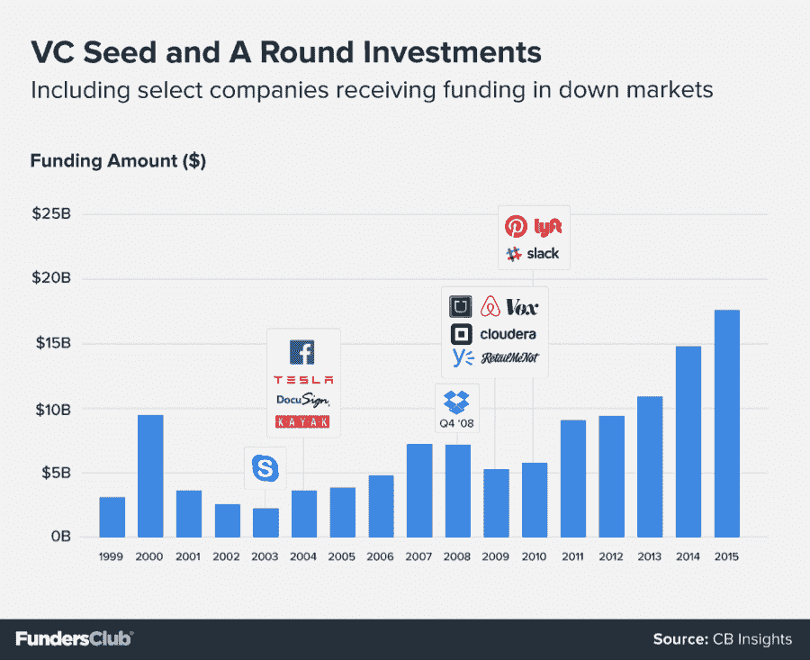
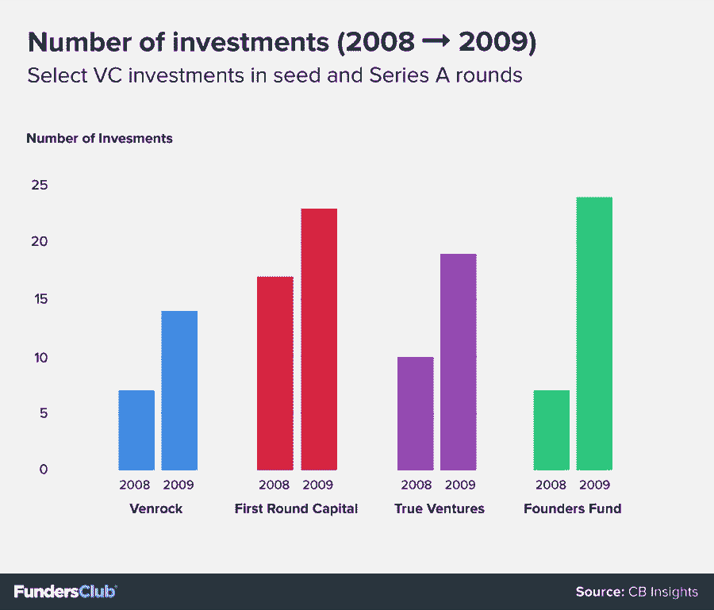
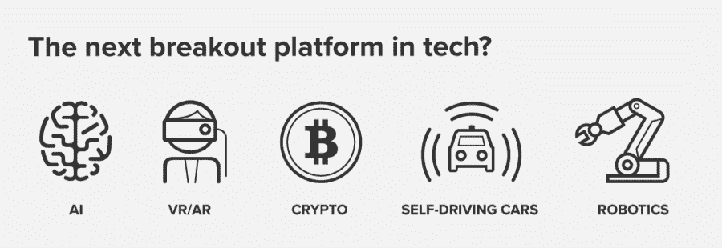

# 投资创业公司的最佳时机？一直都是。资助者俱乐部

> 原文：<https://fundersclub.com/blog/2016/03/30/the-best-time-to-invest-in-startups-always/?utm_source=wanqu.co&utm_campaign=Wanqu+Daily&utm_medium=website>

亚历克斯·米塔尔和克里斯托弗·施泰纳 2016 年 3 月 30 日

保持平衡的投资组合长期以来一直是金融行业的标准做法，理由很充分。再平衡迫使投资者卖出表现优异的资产，买入更多表现不佳的资产。这可以测试情绪偏见，因为大多数人不喜欢买狗和卖赢家。但是几十年的数据证明了这个策略。风险投资需要支撑再平衡的同样的毅力和纪律。

投资初创企业的市场表现与股票或债券市场不同，但正如传统市场一样，风险生态系统会经历高峰和低谷。当市场充斥着 IPO、收购和华而不实的估值时，人们往往会涌入天使投资和风险投资。但是，如果只在高峰期投资，投资者不仅会错过以较低估值收购初创公司的机会，还可能会错过早期投资下一个 Airbnb、脸书、Dropbox 或优步的机会——所有这些公司都在风险投资疲软期筹集了种子资金和 A 轮融资。

**稳扎稳打，不要担心短期预测**

虽然这种立场看起来很初级，但它受到许多风险投资者的蔑视，这些投资者在经济增长时期拿着满满一拳头的现金冲进来，但在经济放缓时期却温顺地消失了。虽然有些人在争论风险投资现在是否处于撤回状态，但 2015 年第四季度风险投资下降 30%的事实表明这是真的。

大多数风投似乎理解趁价格低时买入的理论。《华尔街日报》报道称，2016 年第一季度，风险投资公司以超过 15 年的最高速度增加了资金。然而，他们一直不愿在不确定的环境中扣动扳机，开出支票，2015 年第四季度和 2016 年第一季度资本部署乏力就证明了这一点。

那么，对于那些可以忽略羊群效应的创业投资者来说，这可能是一个机会。

长期稳定投资在任何类型的资产市场都很重要，但在风险领域更是如此。股票牛市可能会带来 50%的上涨——错过一半上涨的市场计时者可能会让他们的投资组合永远落后于标准普尔 500 这样的基准。但对于创业投资者来说，完全退出市场可能会带来更大的灾难。即使是最好的风险投资基金也是围绕三到五次大的胜利建立起来的，或者，在某些情况下，当脸书或谷歌获胜时，只有一次。事实证明，在华尔街把握市场时机几乎是不可能的。鉴于风险投资会带来高度非线性的回报，甚至比传统金融市场更高，为创业公司选择时机就更难了。

Twitter 和 Oculus 的早期支持者、Spark Capital 的普通合伙人莫·科伊夫曼(Mo Koyfman)指出:“风投们押注新兴趋势，投资期限为 7-10 年。"试图在这种背景下把握市场时机是徒劳的."

甚至一些最有经验的投资人和有限合伙人也会在这个领域犯错误。哈佛的捐赠基金是同类基金中规模最大的，2004 年，由于风险投资公司没有投资谷歌，其投资组合在后繁荣时期的市场中苦苦挣扎，该基金退出了 Accel Partners 的有限合伙人职位。一年后，Accel 向前哈佛学生马克·扎克伯格投资了 1270 万美元。大学捐赠基金错过了在自己的基金上下注并获得至少 700 倍回报的机会。普林斯顿和麻省理工学院的捐赠基金，从各方面来看都是多产的，在脸书投资之前也退出了 Accel。

风投公司 Venture Investment Associates(VIA)董事总经理克里斯·多沃斯(Chris Douvos)表示:“在短期动荡时期袖手旁观，就像因为外面风大而不种果树一样。”风投公司是包括首轮资本(First Round Capital)在内的领先风投基金的有限合伙人。

**宝石通常在低迷时期出现**

在过去的 25 年里，初创企业市场出现了三次示范性高峰:1999 年至 2000 年，2008 年初，以及最近的 2014 年至 2015 年第三季度。在这些牛市的背后，一些天使投资者、风投和有限合伙人退缩了，而世界上一些最有趣的公司找到了它们的早期支持。

第一次科技繁荣后的萎靡一直持续到 2005 年。在此期间，除了脸书，Kayak 在 2004 年 3 月获得了价值 1000 万美元的 A 轮融资，Tesla 在一个月后获得了价值 750 万美元的 A 轮融资，在此之前，Skype 在 2003 年 1 月获得了 Bessemer 的小规模 A 轮融资。这些公司开始为早期投资者定义他们的空间和净收益。

2008 年经济危机后，许多投资者再次变得胆怯，但这可以说是风险市场有史以来较好的时期之一。考虑:

Dropbox——600 万美元 A 轮，2008 年 10 月。
Twilio——60 万美元的种子，2009 年 3 月。
Airbnb——60 万美元种子，2009 年 4 月。
优步——25 万美元的种子，2009 年 8 月。
Square——1000 万美元 A 轮，2009 年 11 月。

就连创业加速器 Y Combinator 的联合创始人保罗·格拉厄姆也对事情的发展方向表示了担忧。“2009 年冬天是 YC 那一批，宝洁公司警告说，演示日可能不会有任何投资者签支票，”Y Combinator 前合伙人、现任天使投资人 Garry Tan 回忆道。"到目前为止，YC 最大的成功发生在繁荣时期，这再合适不过了."

谭指的是 2009 年 4 月从红杉资本获得 60 万美元种子资金的 Airbnb。谭还提到了红杉资本在 2008 年秋天雷曼兄弟(Lehman Brothers)倒闭和华尔街纾困开始后不久为其投资组合公司做的一次演示。红杉资本为此次活动准备的幻灯片记录了它所认为的启动资金黑暗期延长的经济原因。甲板上有一幅墓碑的图片，上面写着“R.I.P. Good Times ”,这已经成为硅谷传说的一部分。接下来的几年，风险投资放缓，但情况从未像红杉资本预测的那样糟糕。

红杉宣扬末日论，但它也在其他人疲于奔命的时候抓住机会投资伟大的公司。就在 2008 年 10 月 RIP Good Times 发布会一周后，红杉完成了 Dropbox 的首轮融资。根据 CB Insights 的数据，与 2008 年相比，红杉资本 2009 年投入种子和 A 轮融资的资金确实减少了——从 1.36 亿美元减少到 4800 万美元——但它只减少了一笔资金:2009 年为 13 笔，而 2008 年为 14 笔。作为一名训练有素、经验丰富的投资者，红杉资本在 2009 年危机后保持了自己的位置，并保持了投资速度。

一些精英风险投资者在回调时提高了投资率

一些精明的投资者甚至在这段时间加大了向初创公司投资的力度。首轮资本于 2009 年 11 月参与了 Square 1，000 万美元的首轮融资，并于 2010 年 10 月领导了优步的种子轮融资。在危机期间，首轮资本的早期投资活动从 2008 年的 17 笔投资和 2，300 万美元增加到 2009 年的 23 笔投资和 6，500 万美元。Venrock 的表现类似，从 2008 年的 12 笔早期投资中的 8300 万美元增加到 2009 年的 14 笔早期投资中的 1.16 亿美元。

当时其他积极的种子和 A 轮投资者包括 True Ventures，该公司在 2009 年增加了 50%的支出。它在 2008 年末参与了 Fitbit 的 A 系列，并在 2009 年参与了 Puppet Labs 和 PayNearMe 的系列。2008 年，创始人基金削减了 7 笔早期投资，2009 年，这个数字增加了两倍多，进入了 24 轮种子和 A 轮融资。其中有:Twilio、Yammer 和 bit.ly。

“我们相信伟大的公司在繁荣时期和萧条时期都会出现——在周期的两端，坚持我们的投资模式(和战略)尤为重要，”首轮合伙人乔希·科佩尔曼在最近给有限合伙人的一封信中写道。

对风险投资者和天使投资者来说，几乎没有什么宏观信号可用，市场的弹性也远不如股票或债券。但风险市场的显著放缓是那些对初创企业投资感兴趣的人可以获得的少数买入指标之一。最优秀的风险投资基金明白这一点，它们的投资模式就证明了这一点。这是传统市场的散户投资者似乎永远不会接受的常识。

在这些低迷时期蓬勃发展的公司学会精益运营，着眼于效率和现金保值。圣路易斯 culturing Capital 的联合创始人兼普通合伙人布莱恩·马修斯(Brian Matthews)表示，他的公司“继续以正常速度投资，但我们最近告诉我们的投资组合公司，要密切关注他们的现金消耗。”

燃烧缓慢的公司有时间进行精心构思的产品进化，在某些情况下，还有时间进行利润丰厚的转型。2010 年 2 月和 4 月，当 Accel 和 Andreessen Horowitz 投资 Slack 的种子和 A 轮融资时，风险投资市场仍相对平静。当时 Slack 是一家游戏公司。当然，从那以后，它就成了价值超过 10 亿美元的团队的生产力软件制造商。

风险投资永远是关于本垒打，就像 Slack 一样，从来都不容易识别。但在低迷的市场中，发现异常者和他们背后的团队会变得更容易，因为中等公司和想要的企业家退出了舞台。创业投资者也是如此:愚蠢的钱离开了，聪明的钱挖了进来。

“我记得在 2007 年，许多投资者不再关注种子期公司，我们在那一年投资了 Dropbox、Lending Club 和 Zoosk，”Pejman Nozad 说，他是硅谷多产的天使投资人之一，现在是 PejmanMar Ventures 的管理合伙人。“不管市场状况如何，总有真正的企业家在解决真正的问题。”许多主要的 LP 都同意诺扎德的观点。

在今年早些时候对 73 名有限合伙人进行调查后，[professional Ventures 发现](http://www.bothsidesofthetable.com/2016/03/01/what-do-lps-think-about-what-is-going-on-in-the-venture-capital-markets/?utm_campaign=Other:%20From%20The%20Investors:%20Venture%20Capital&utm_content=31156537&utm_medium=social&utm_source=twitter)82%的人希望在面临风险投资低迷时保持目前的投资规模。同样令人信服的是，8%的有限合伙人希望加快风险投资的步伐。这使得只有 10%的有限合伙人想要退出。这些是 2004 年错过脸书的风险投资者。

**撤回投资的投资者可能会错过定义一代的技术平台**

出于任何原因退出风险市场都会使投资者失去另外两种调节效应的好处:新技术平台的兴起和采用；和真正的多样化，在风险行业中，这是一种独特的时间依赖性。

至于后一项，大多数投资者知道如何分散传统资产。这可以简单到购买专注于国内外股票、债券、房地产、大宗商品等的 ETF。分散风险投资组合并不那么简单。创业趋势往往会呈波浪式发展，持续几个季度或几年。例如，在 2010 年和 2011 年的大部分时间里，Groupon 的模仿者和闪购网站构成了交易流的很大一部分。虽然手机游戏初创公司可能会在一段时间内受欢迎，但虚拟现实公司可能会在几个季度后取代它们。只有在所有这些过程中保持活跃，投资者才能接触到特定领域中最好的公司。

也许更重要的是，很难预测一个新的技术平台何时会从好奇变成主食。委内瑞拉经济学家卡洛塔·佩雷斯(Carlota Perez)通过研究追溯到 1771 年工业时代初期的所有重大技术范式转变来解析这一主题。

她用一条 S 曲线将一项技术断断续续的早期(那时它只是梦想家和先行者的领地)与大规模采用的时期区分开来。S 的底部相当平坦，有一个不温不火的向上曲线——她称之为安装阶段——而 S 的中间，即转折点，突然出现，导致部署阶段的快速增长。我们目前正在就几项技术谈判 S 的下半部分:人工智能、VR/AR、自动驾驶汽车、加密货币和机器人技术。很可能其他几项不在大多数风投舌尖上的技术也在绕过这条曲线。

但是准确预测这些平台何时会失控是一个室内游戏。运气发挥着作用，但风险投资不应该是纯粹的碰运气游戏。这应该是一种努力，在这种努力中，纪律将胜出，常规投资将在不同领域以及不同年份(借用葡萄酒界的一个术语)中发挥作用。这种跨时间配置资本并投资于不同时期成长起来的公司的结构是风险投资的一部分。风险投资公司在三年期内分配资金，并连续运行一系列基金，以被动地确保这种时间暴露的影响。好的有限合伙人不仅希望行业多元化，还希望葡萄酒多元化。这就是为什么尽管一只基金已经收购了三家 AR 公司，却在两年后选中了一家，而这家公司成为了这个领域的先锋。

“我喜欢预测未来可能发生的事情，但我不需要确定投资的结果，”德雷珀咨询公司和 DFJ 的创始合伙人蒂姆·德雷珀说。德雷珀支持 Cruise Automation，该公司最近被通用汽车以 10 亿美元收购。

大多数投资者喜欢认为他们遵循了沃伦·巴菲特(Warren Buffett)经常重复的格言，“当别人贪婪时要恐惧，当别人恐惧时要贪婪，”但数据告诉我们，大多数人并没有这么做。当全球经济和股市下跌时，通常会出现所谓的优质投资，因为投资者涌入蓝筹股:美国国债、黄金和宝洁(Procter & Gamble)和可口可乐(Coca-Cola)等守旧派股票。

同样的事情也可能发生在风险投资领域。如果更多聪明的初创公司投资者希望在这些不景气的市场中保持活跃，那么买入拥有最佳团队的最佳公司的机会可能不会明显变得更便宜。随着 Y Combinator 2016 年冬季班进行最后的演示日推介，投资者实际上已经看到了一些这种情况。科斯拉风险投资公司的基思·拉布瓦并不是一个盲目恭维的人，他称这是 YC 有史以来最好的一批。FundersClub 的投资委员会继续遇到对当前市场定价过高的初创公司，这可能会阻碍公司未来的融资。也就是说，高估值本身并不是自动放弃投资的理由。

如果投资者从所有这些事情中一无所获，他们至少应该知道，促使新来者关注初创企业投资的各种趋势——不断膨胀的后期估值、收购集群、一两次火爆的 IPO 应该与如何衡量当前的机会没有任何关系。早期创业至少需要五到七年的时间，退出环境才会对他们产生影响，到那时整个经济周期可能已经过去了。未来是未知的，只有一个好的策略。幸运的是，这很简单:识别最好的创业公司，投资，然后重复。