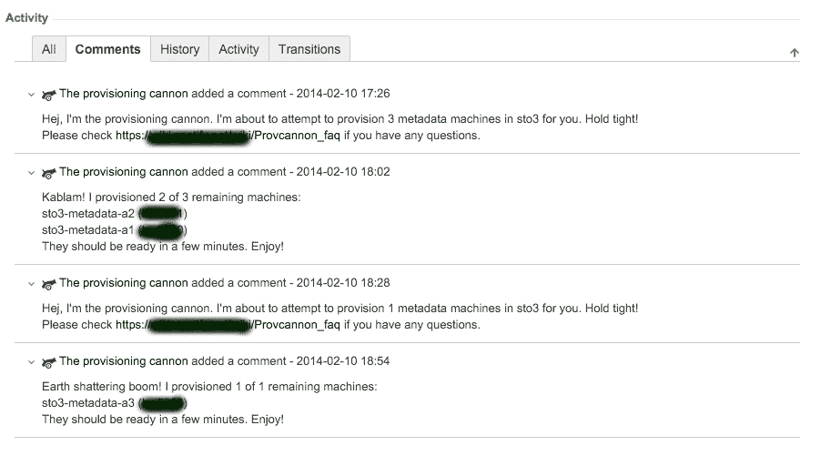
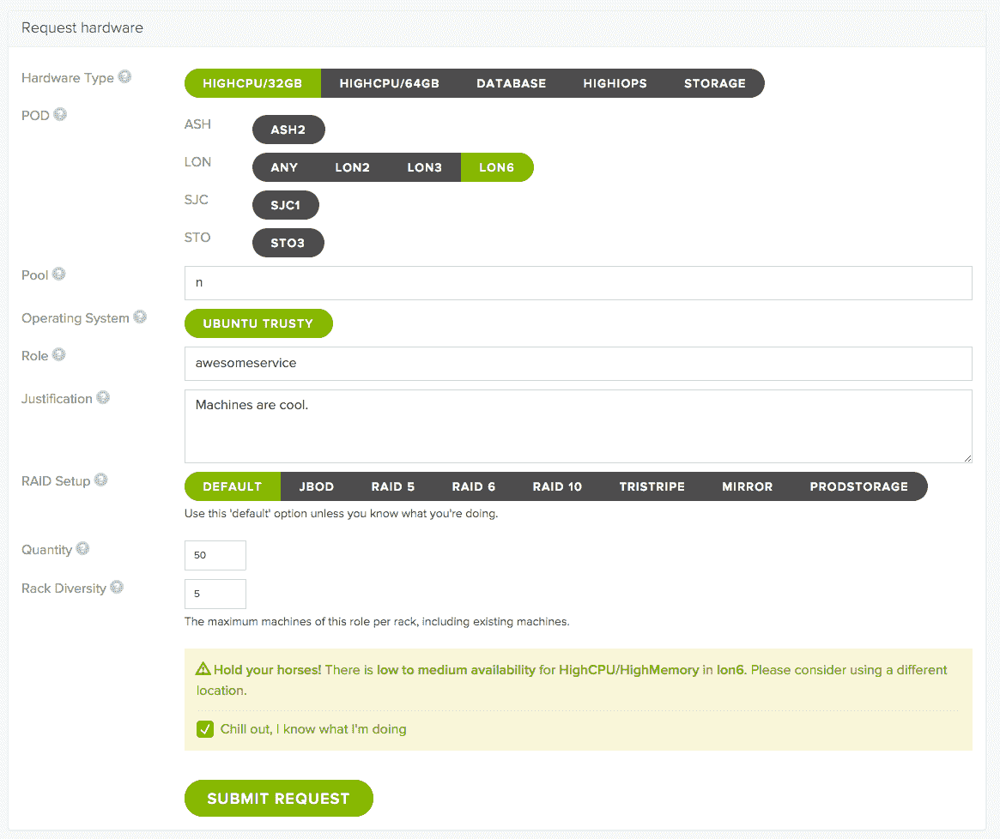
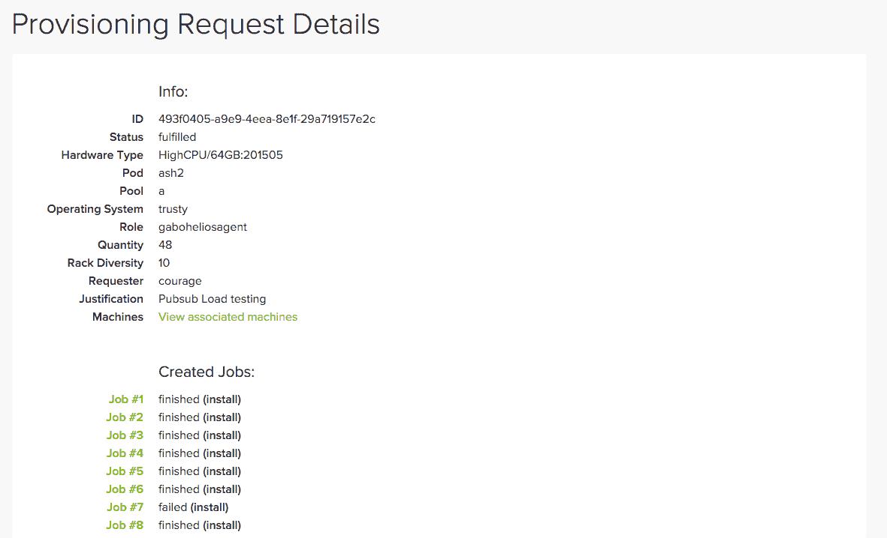
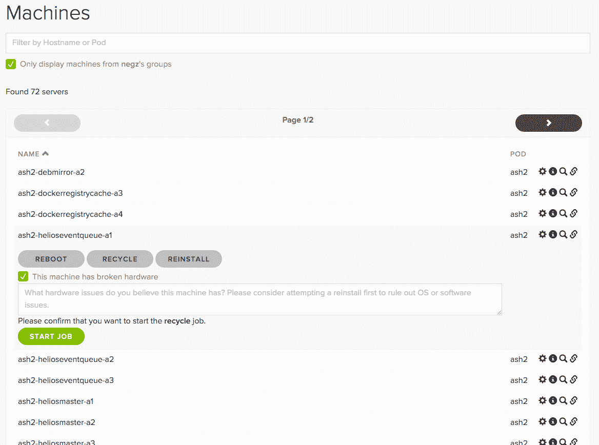
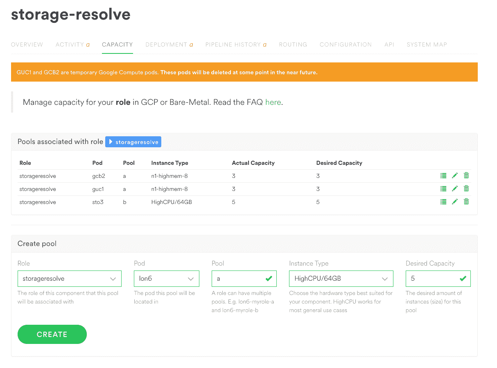

# 在 Spotify 管理机器- Spotify 工程:Spotify 工程

> 原文：<https://labs.spotify.com/2016/03/25/managing-machines-at-spotify/?utm_source=wanqu.co&utm_campaign=Wanqu+Daily&utm_medium=website>

# 在 Spotify 管理机器


2016 年 3 月 25 日 Nic Cope 发布

## 介绍

当您登录 Spotify，浏览您的 [Discover Weekly](https://labs.spotify.com/2015/11/18/what-made-discover-weekly-one-of-our-most-successful-feature-launches-to-date/) 播放列表，并播放一首曲目时，您正在与我们约 12，000 台服务器中的一些服务器进行互动。

Spotify 历来选择在我们自己的私有物理服务器(即机器)上运行我们的核心基础设施，而不是利用亚马逊网络服务(AWS)等公共云。我们的设备由一组最少的硬件配置组成，位于全球四个数据中心。虽然我们大量利用 [Helios](http://github.com/spotify/helios) 进行基于容器的持续集成和部署(CI/CD ),但每台机器通常都有一个单独的角色，即大多数机器运行一个微服务的单个实例。

在 Spotify，我们相信每个团队都有“运营责任”。构建微服务的人员部署微服务，并管理部署微服务的机器。可以想象，让数百名工程师可靠地管理数千台机器是一件复杂的事情。

在本帖中，我们将讲述 Spotify 机器管理基础设施的历史。我们将提供一些技术实现的细节，以及这些实现如何影响我们工程师的生产力和快乐。

## 2012 年及更早——史前

当 Spotify 还是一家规模较小的公司时，拥有一个传统的集中化运营团队是可行的。这支队伍一直忙于救火和处理天底下的每一项作战任务。尽管如此，这是一个聪明的运营团队——一个不想手动管理快速增长的机器车队的团队。

Spotify 上第一个用来管理机器的工具是古老的 ServerDb。ServerDb 跟踪机器的硬件规格、位置、主机名、网络接口和唯一的硬件名称等细节。每台机器还有一个“服务器数据库状态”，例如“正在使用”、“已损坏”或“正在安装”。它最初是一个简单的 SQL 数据库和一组脚本。机器使用[全自动安装程序](http://fai-project.org/) (FAI)安装，通常使用 [moob](http://github.com/spotify/moob) 管理，它提供串行控制台访问和电源控制。我们的[大量使用的](https://labs.spotify.com/2013/02/25/in-praise-of-boring-technology/) DNS 区域数据是手动管理的，需要手动推送才能生效。一旦安装了基本的操作系统，所有的机器都由[傀儡](https://puppetlabs.com/)管理。

这些年来，电池组的各个部分都被更换了。FAI 被替换为[补鞋匠](http://cobbler.github.io/)和 [debian-installer](https://www.debian.org/devel/debian-installer/) 。后来，debian-installer 被我们自己的[鸭](https://github.com/spotify/duck)取代。虽然配置过程的许多步骤是自动化的，但这些步骤可能容易出错，需要人工监督。这可能会使调配 20 台新机器成为一项不可预测且耗时的任务。工程师们通过在 JIRA 项目中制造问题来请求新的产能，而完成请求可能需要几周甚至几个月的时间。

## 2013 年末–木卫一部落

Spotify 一直喜欢敏捷团队(用 Spotify 的说法是团队)。2013 年末，运营团队成为新成立的基础设施和运营(IO)组织的一部分。围绕操作中的特定问题空间组建了新的小组。我们的团队接管了 Spotify 机器的供应和管理。

从一开始，我们设想了一个完全自助的机器管理服务，但是团队被繁忙的工作淹没了。我们被对新机器的请求淹没了，并且不断地在机器摄取上进行追赶——在 ServerDb 中记录新安装的机器的过程。我们决定从小处着手，拼凑一些最小可行产品(MVP)来自动化主要的痛点，以便争取时间来做更大的事情。我们从三个方面开始努力。

### DNS 推送

DNS 推送是我们最早的胜利之一。最初，运营团队必须手动编辑区域文件，将它们提交给版本控制，然后在我们的 DNS 主服务器上运行脚本来编译和部署新的区域数据。随着时间的推移，我们逐渐自动化这个过程。首先，我们构建了一个工具来从 ServerDb 自动生成大部分区域数据。然后，我们添加了集成测试和同行评审，这给了我们对变更质量的高度信心。此后不久，我们咬紧牙关，自动推进。创建 Cron 作业是为了自动触发上述过程。最后，我们解决了一些松散的问题，比如为新的 ServerDb 子域自动创建区域。

### 机器摄入

当我们的团队取得所有权时，ServerDb 已经成为一个由 PostgreSQL 支持的 RESTful web 服务。它通过解析由我们的数据中心团队手工整理的 CSV 文件记录了数百台机器。这些文件包含机架位置和 MAC 地址等数据，技术人员很容易误读这些数据。我们还为每台服务器分配了一个女性名字形式的静态唯一标识符，这是一个包含数千台服务器的不断缩小的名称空间。

我们的目标是完全自动化摄取，这样在机器被装上机架后就不需要人工干预了。我们首先将我们的网络引导基础设施从 Cobbler 切换到 [iPXE](http://ipxe.org/) ，它可以根据机器的 ServerDb 状态做出引导决定。“使用中”的机器启动到它们的生产操作系统。处于“installing”状态的机器和 ServerDb network 未知的机器引导到一个由 Duck 生成的 Linux 环境中，我们称之为 pxeimage，在这里它们分别运行一系列脚本来安装或接收它们。

为了在没有人工干预的情况下进行摄取，我们放弃了基于女性姓名的机器命名方案，转而使用机器独特的、可通过编程发现的序列号。未知机器运行一个侦察脚本，确定它们的序列号、硬件类型、网络接口等，并自动向 ServerDb 注册它们。

### 资源调配请求

在史前的某个时候，一个善良的灵魂写下了“prov Gun”——供应枪。Provgun 是一个脚本，它读取 JIRA 发出的“供应请求”,并执行完成该请求所需的命令。供应请求指定位置、角色、硬件规格和机器数量。例如“在伦敦安装 10 台具有 fancydb 角色的高 IO 机器”。Provgun 将在 ServerDb 中找到可用的机器，为它们分配主机名，并请求通过 ServerDb 安装它们。

ServerDb 使用 [Celery](http://www.celeryproject.org/) 任务将任务外包给 [ipmitool](http://linux.die.net/man/1/ipmitool) ，指示目标机器通过网络引导到 pxeimage。在安装并重新启动到新的操作系统后，Puppet 将根据机器的角色应用进一步的配置。

我们问的第一个问题是“我们能把 provgun 放在 cron 循环中吗？”比如我们的 DNS 推送。不幸的是，provgun 非常乐观，不知道它运行的命令实际上是否有效。我们担心天真地循环所有开放的供应请求并启动安装会增加而不是减少繁忙的工作。

我们的解决方案是 prov Cannon——供应加农炮。provcannon 是 provgun 的 Python 重新实现，它监控每个安装以确保成功。这种监控允许我们使用指数补偿来重试失败的安装，并为始终不可安装的机器选择替换。我们将 provcannon 配置为每天迭代两次所有未完成的配置请求。



*The Provisioning Cannon in action.*


### 影响

通过专注于自动化 DNS 更改、机器接收和配置请求，我们将 Spotify 工程师获取容量的周转时间从数周缩短至数小时。DNS 更新从让我们大多数人非常紧张的事情变成了一个我们几乎不再考虑的过程。同样重要的是，我们的团队从枯燥和容易出错的工作中解脱出来，专注于进一步改善我们的工程师同事的周转时间和体验。

## 2014 年中期——呼吸空间

在部署了我们最初的权宜之计几个月后，队伍中的事情变得平静了。Spotify 的资深工程师对新机器更快的周转时间感到满意，但习惯了 AWS 和类似平台的新人不太喜欢等几个小时。我们的部分基础设施不可靠，我们只能自动安装。重启有故障的机器并将多余的机器“回收”到可用的池中，仍然需要我们阅读一期 JIRA 杂志并运行一个脚本。我们决定是时候执行我们的宏伟目标了——一个自助式门户网站和 API，供 Spotify 工程师按需管理机器。

### 萝卜

从堆栈的底部开始，我们首先构建了一个服务——Neep——来代理安装、回收和电源循环机器等工作。Neep 在每个数据中心运行在接入带外管理网络的特殊机器上。由于芹菜的操作问题，我们围绕 [RQ](http://python-rq.org/) 构建了 Neep 作为一个轻量级的 REST API 一个简单的基于 Redis 的作业队列。出于实用的原因，我们选择了[金字塔](http://www.pylonsproject.org/)作为我们受祝福的网络框架；我们继承了 ServerDb 作为一个金字塔式的服务，想要一个最小的技术集。

```
{
  "status": "finished",
  "result": null,
  "params": {
  },
  "target": "hardwarename=C0MPUT3",
  "requester": "negz",
  "action": "install",
  "ended_at": "2015-07-31 17:45:53",
  "created_at": "2015-07-31 17:36:31",
  "id": "13fd7feb-69d7-4a25-821d-9520518a31d6",
  "user": "negz"
}

```

Neep 工作的一个例子。

provcannon 的大部分逻辑可以在管理机器安装和回收的 Neep 作业中重用。从 Neep 的角度来看，这些工作实际上是一样的。Neep 只需将机器的 ServerDb 状态设置为“installing”或“recycling ”,以请求 pxeimage 安装新的操作系统或清理旧的操作系统，并触发网络引导。为了消除外壳的复杂性，我们用 OpenStack 的 [pyghmi](https://github.com/openstack/pyghmi) IPMI 库替换了对 ipmitool 的调用。

### （同 suddenionosphericdisturbance）电离层的突然骚扰

最初，我们通过修改 provcannon 来触发 Neep 任务，从而测试 Neep 的性能。一旦我们解决了新堆栈中的一些错误，就该把它们结合在一起了，于是希德诞生了。

如今，Sid 是工程师在 Spotify 上请求和管理机器的主要界面。这是另一个金字塔 REST 服务，它将来自 ServerDb 的机器库存数据、来自 Spotify 内部微服务数据库的角色所有权数据以及 Neep 中的机器管理作业联系在一起，允许 Spotify 的团队管理他们的服务容量。它扩展了 provcannon 的部分逻辑，即寻找和分配最合适的机器来满足供应请求。Sid 迷人的[Lingon](https://github.com/spotify/lingon)UI 在其 API 之上构建起来轻而易举，已经取代 JIRA 成为供应请求接口。



*A Sid provisioning request being made.*




*A fulfilled Sid provisioning request.*




*Managing machines in Sid.*


### 影响

Sid 和 Neep 并不是 Spotify 现代机器管理体系中唯一的改进。DNS 区域数据生成已重建。我们在安装时定期应用自动生成的操作系统快照，而不是执行耗时的傀儡运行。这些改进的最终结果是，调配或回收容量的请求在几分钟内即可完成，而不是几小时。其他小组已经围绕 Sid 的 API 构建了工具来自动管理他们的机器群。作为 Spotify 供应堆栈的代言人，Sid 是 IO 中最受好评的服务之一。到目前为止，Sid 已经满足了 3，500 个配置请求。它已经发布了 28，000 份 Neep 工作，以安装、回收或动力循环机器，成功率为 94%。考虑到数据中心中单个机器固有的不可靠性，这还不错。

## 2015 年中期–最先进的技术

2015 年，Spotify [决定](https://news.spotify.com/us/2016/02/23/announcing-spotify-infrastructures-googley-future/)开始从我们自己的物理机器迁移到[谷歌的云平台](http://googlecloudplatform.blogspot.com/2016/02/Spotify-chooses-Google-Cloud-Platform-to-power-data-infrastructure.html) (GCP)。这种范式转变促使我们设想一种方法，让许多工程师团队能够管理大量云计算容量，而不会影响到彼此。

### Spotify 池管理器

为了避免[“不是在这里发明的”](https://en.wikipedia.org/wiki/Not_invented_here)陷阱，我们小组评估了谷歌的容量管理产品。我们想要一个工具，可以强化 Spotify 的观点和模式，以便为工程师提供一个简单而明显的途径来获得计算能力。我们觉得开发者控制台很强大，但是太灵活了。很难将工程师引向我们喜欢的设置。[部署管理器](https://cloud.google.com/deployment-manager/overview)也很强大，可以强制执行我们的意见，但是在一次试用中，我们的工程师发现它很难使用。

在向谷歌提供反馈后，我们开始构建 Spotify Pool Manager。SPM 是一个相对较轻的层，它将谷歌强大的计算引擎 API 封装在 Spotify 术语中，并提供合理的默认值。工程师只需指定他们想要的角色的数量和位置。SPM 在幕后使用 Google 的实例组来确保一定数量的实例存在。池可以随意扩大或缩小。



*Spotify Pool Manager managing pools.*


SPM 是一个无状态的金字塔服务，主要依靠 Sid 和 Google 云平台来完成繁重的工作。虽然 Sid 有一个独立的网络界面，但我们正在将 SPM 与 Spotify 的内部微服务管理仪表板紧密集成。

### 物理池

Spotify 不会在不久的将来摆脱物理机器，所以我们在 Sid 的后端构建了池支持。虽然 Sid 的供应请求模型为我们提供了很好的服务，但它可能会鼓励对单个机器的过多依赖。让工程师管理他们的物理机器容量，类似于谷歌的实例组，这将向他们介绍自动替换故障机器和我们过渡到 GCP 时的随机主机名等范例。Sid 的池支持允许 SPM 管理 Google 计算实例和物理机，无论后端如何，用户体验都是一样的。

## 摘要

在过去几年里，Spotify 的机器管理基础设施是迭代开发优点的一个很好的例子。作为一个由[站点](https://www.spotify.com/au/jobs/view/ozhp2fw1/) [可靠性](https://www.spotify.com/au/jobs/view/oeig2fwy/)和[后端](https://www.spotify.com/au/jobs/view/o7kF1fwR/) [工程师](https://www.spotify.com/au/jobs/view/oNGh2fww/)组成的小团队，我们已经能够通过构建足够的自动化来解放我们自己进行迭代，从而显著提高我们同事的生产力。我们已经将新机器的周转时间从数周缩短到几分钟，并大幅减少了在 Spotify 管理机器所需的支持交互量。