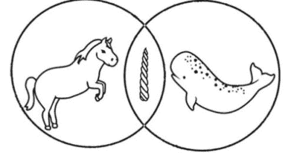

# 投资者说你的市场规模小的真正原因

> 原文：<http://blog.elizabethyin.com/post/142183040665/the-real-reason-why-investors-say-your-market-size?utm_source=wanqu.co&utm_campaign=Wanqu+Daily&utm_medium=website>

[Originally posted by kaliciawinchester](https://tmblr.co/Zgnz-q1yCF3pW)

当投资者说你的市场规模很小时，这是非常令人讨厌的。所以，你做了所有这些额外的研究——你寻找 Gartner 的摘录和关于预计市场规模的文章，等等。–你带着研究回来说你的市场要大得多。

可惜无效。投资者通过。你走开的时候觉得他/她是个傻瓜。这可能是真的，但重要的是要了解这里到底发生了什么。

首先，停止研究。没用的。

当一个投资者说你的市场很小时，他/她为什么会错过，以下是实际原因:

**1。你处于多个市场的“中间”,看起来并没有针对任何市场。**

市场趋势变化很大，有时在两个现有市场之间会出现一个新市场。但是，因为你的公司是早期的，投资者还不知道市场之间的市场是否会存在。

一个很好的例子是 500 家创业公司支持的对讲机。

当我第一次见到他们时(那时我还是一名企业家)，在我的内心深处，我在想，“天哪，他们到底在解决什么问题？这是客户服务、营销和销售的奇怪组合。”

事实证明，几年后，营销人员希望与他们的客户建立更紧密的关系，而这种更紧密的关系实际上是营销、销售和客户服务的奇怪结合。现在公司做的真的很好！但是当他们刚开始的时候，这一点都不清楚。

在这种情况下，我经常看到企业家试图通过计算和添加所有相邻市场的市场规模来增加他们的市场规模(例如，营销自动化加上销售自动化和客户服务软件的市场规模)。

[*Found on Pinterest*](https://www.pinterest.com/ECEPDNZ/i-love-venn-diagrams/)

其实你真正需要做的恰恰相反。仅选择一个市场——比如营销自动化——并谈论个性化营销的趋势。有助于这一点的是直面现有的恐龙产品，并说你会因为 a、b 和 c 的原因推翻现有的产品。例如，Marketo 很烂，因为你需要花 10 天时间学习他们的软件，只是为了向你的客户发送非个性化的电子邮件；我们通过使产品内部的双向交流变得容易来解决这个问题，这是未来的方向。

**2。你的产品/业务听起来不够差异化/投资者对辨别差异化的空间一无所知。**

某些垂直行业的公司更容易遇到这种问题(例如，广告技术、安全技术、时尚等)。).正如我作为一名软件投资者对太阳能电池板或制药一无所知一样，并不是所有的软件投资者都非常了解大多数垂直行业，足以理解你在说什么。

如果你不需要专业知识就能看出你公司的与众不同之处，那么你需要在很多人身上练习和测试你的信息。

然而，如果你确实需要专业知识来理解你的竞争优势，那么你需要找到合适的投资者与之交谈。

一个很好的经验法则是，如果你不能在街上向一个随机的人展示你的与众不同之处，你需要一个专业的投资者。

[Originally posted by 29only29](https://tmblr.co/Zj9Ayo1kAJHtu)

在过去(即 5 年前或更早)，很难知道该联系哪些投资者，因为投资组合并不总是在线，也没有针对投资者的搜索引擎。如今，AngelList 可以帮助你按类别筛选投资者，并在你的空间中寻找投资者。

现在，真正困难的部分是，如果你正在处理一个没有太多投资者的类别。例如，时尚和美容是一个没有很多投资者的行业，尽管这是我们在 500 Startups 中积极改变的事情。解决这个问题的最好方法之一是与你所在领域的许多比你走得更远的企业家交谈。请他们向投资者介绍自己。请他们在您的空间中会见其他特定的人。这可能需要大量的工作，但绝对必要。在你的空间里形成更紧密/更深入的关系。

投资者对你/你的团队没有信心。

最后，不幸的是，市场规模“太小”通常是投资者对你/你的团队看法的一种解释。

如果你身处一个拥挤的市场，这一点尤其正确。如果你身处一个拥挤的市场，你不仅需要很好地传达上述观点，还需要让人们相信你是一个真正可靠的领导者。不幸的是，由于模式匹配，许多不符合典型模式的天才领导者很难让投资者相信这一点。

内向的企业家、非主流种族的企业家、女性企业家等。往往不符合这些模式，不得不去说服投资者，他们可以在拥挤的市场中获胜，他们有正确的领导能力来获胜。

请记住，投资者心目中的“赢”不是以 3000 万美元卖出。一个投资者希望它的赢家做 100 倍以上(显然，这在大多数情况下不会发生，但这是投资者正在寻找的)。他们正在考虑如何成为一家价值 1 亿至 100 亿美元的公司，在种子阶段，他们唯一需要相信的是，你和/或你的团队是否是走到这一步的合适人选。