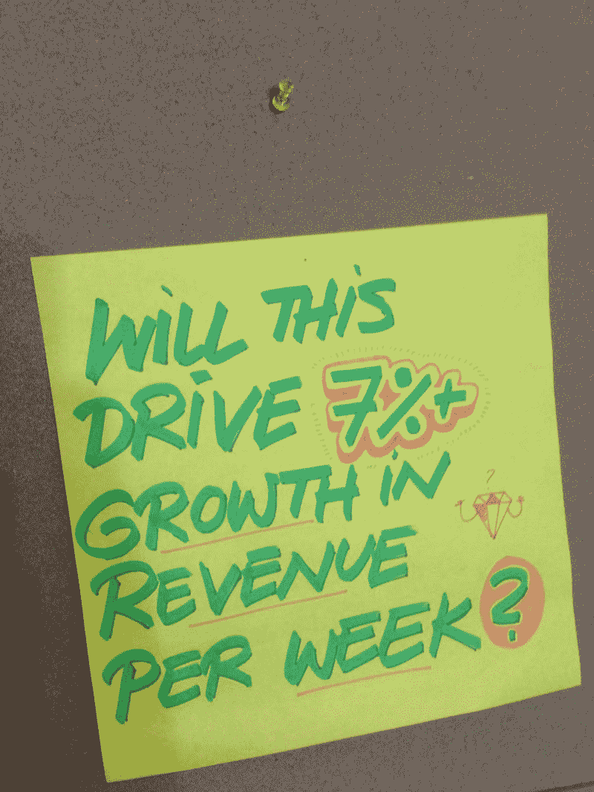

# Y Combinator 和一个重要的指标——在 30 天内学会编码！

> 原文：<http://learn.onemonth.com/y-combinator-and-the-one-metric-that-matters?utm_source=wanqu.co&utm_campaign=Wanqu+Daily&utm_medium=website>

[Mattan Griffel Follow](https://learn.onemonth.com/author/onemonth/) Co-founder of One Month. Faculty at Columbia Business School. I write about startups, technology, and philosophy.

# y 组合子和一个重要的度量

<time class="post-date">2014 年 8 月 13 日</time> 2 分钟阅读

<iframe src="https://www.youtube.com/embed/tfpTCFNoa6w?feature=oembed" frameborder="0" allow="accelerometer; autoplay; encrypted-media; gyroscope; picture-in-picture" allowfullscreen="">视频</iframe>

我写增长黑客已经有一段时间了，我想写一写我用一个月的时间通过 Y Combinator 进行增长黑客的经历。

Y Combinator 被称为加速器有一个很好的理由:它极大地加速了你的初创公司的成长。

那么 Y Combinator 做了哪些事情让它的创业公司成长如此之快呢？

他们强迫你专注于一个指标——增长——并一周接一周地观察它。

根据保罗·格拉厄姆的观点，成长是创业的唯一要素。其他一切都源于成长。这就是为什么他们不接受处于创意阶段的公司。Y Combinator 不是一个建造的地方，而是一个成长的地方。这就是为什么每次你见到保罗·格拉厄姆，他都会问…

> “你上周长了多少？”

当你排除所有其他因素时，事情就简单多了。在 Y Combinator 工作期间，你每周至少要增长 7%。理想情况下，我们在这里谈论的是收入，但如果你是预收入，那么用户增长或某种参与度指标是好的(理想情况下，尽可能深入[精益营销漏斗](http://www.growhack.com/2012/10/25/introducing-the-lean-marketing-funnel/#.U855zWRdUz0))。

这听起来很简单。只要让你团队中的每个人都去脸书，你就能达到目标。啤酒时间到了。

问题是，一周又一周，标准提高了，你必须不断达到更高的数字。最重要的是，**几个星期后，你会开始用尽容易获得的渠道**像朋友的朋友。这将迫使你**开始考虑长远，专注于一致的获取渠道**和杠杆(比如提高你的现场转换率)。

### 成长的压力

一周又一周增长的压力被这样一个事实所缓解，即终点就在眼前:演示日已经过去 12 周了，你想要一个如下所示的增长图:

这是一种错觉，因为一旦你拿到了钱，你现在必须向投资者报告，这是一种额外的责任。但那是以后的事了。

只关注增长指标的好处是它不会说谎。你要么在成长，要么没有。

大多数创业公司都在做一些事情，比如重新设计他们的应用程序，开发新的产品功能，以及其他一些无关紧要的事情。通常，这是因为他们害怕当他们试图成长时，他们的梦想会破灭，所以他们试图建立最好的产品来上市。保罗·格拉厄姆说…

> “当你对某些人有一点点价值的时候，就开始吧。”

一旦你开始关注增长数字，公司的决策就开始到位了。我们应该雇用一名实习生吗？发布新产品特性？换个新 logo？除非它能帮你实现本周 7%的增长。

在 YC，我们的墙上有一个大标语，上面写着:“**这会帮助我们增长 7%吗？**

它是一个持续的提醒，当有人有新的功能想法或建议时，我们总是指向它。

诚然，这是一种短期思维，从长远来看，这种心态对一家初创公司是否健康还存在争议，但我认为长期思维是一家健康初创公司的奢侈品。一旦你确定增长得到控制，你就可以担心这些事情了。考虑一家用户数量正在下降的初创公司的标志是没有意义的。

### 你需要 YC 成长吗？

你一定要在 YC 做这个吗？显然不是。你可以让自己负责，但他们创造的环境让这一切变得更容易。合伙人不断提醒你关注真正重要的事情。你正在和你那批人中所有其他雄心勃勃的创业公司竞争，并试图比他们发展得更快。你在一个偏僻的地方，很少有分心的事。

因此，如果你在一家初创公司，**选择一个增长指标，并首先关注这个指标**。把它放在白板上让每个人都看到，并让你的整个公司对此负责。

