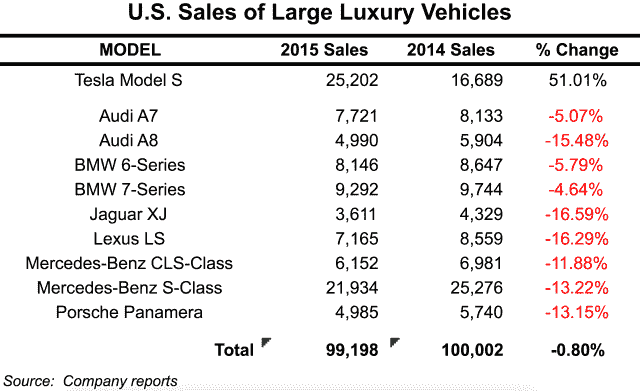

# 这是本·汤普森的特斯拉战略

> 原文：<https://stratechery.com/2016/its-a-tesla/?utm_source=wanqu.co&utm_campaign=Wanqu+Daily&utm_medium=website>

让我们从警告开始:不，特斯拉没有在三天内卖出 276，000 辆 Model 3； [1](#fn1-2095 "Elon Musk <a href="https://twitter.com/elonmusk/status/716343274730991616">has promised</a> an update on first week reservations tomorrow") 这是只需 1000 美元定金即可全额退款的预购订单数量。是的，特斯拉有过延迟交付汽车并且价格高于预期的历史。此外，鉴于特斯拉去年仅交付了略高于 5 万辆的汽车，无论特斯拉的扩张速度有多快，几乎可以肯定的是，这第一周的预订将需要数年才能实现，即便如此，特斯拉也只会控制汽车市场的一小部分。

这样一来，我们能对特斯拉和首席执行官埃隆·马斯克的成就感到惊讶吗？近 30 万人愿意拿出 1000 美元，尽管事实上他们在几年内都没有机会买车；令人震惊的是，其中 11.5 万人甚至在知道汽车长什么样之前就交了定金。一个朋友在早上 6:45 排队预约，在他前面有 123 个人。无论你如何衡量，这都是一个几乎前所未有的现象；唯一可能的比较就是苹果和它的 iPhone。

排长队和粉丝承诺看都不看就订购新产品并不是特斯拉和苹果的唯一共同点:两家公司都被怀疑涉嫌不理解颠覆理论；然而，这两者都证明了颠覆理论并没有解决所有问题，尤其是在消费市场方面。

#### iPhone 和颠覆

早在 2013 年，我就写过【Clayton Christensen 犯了什么错，特别是关于苹果和 iPhone:

> 克里斯滕森的理论是基于从企业而非消费者做出的购买决定中提取的例子。这很重要的原因是低端颠覆理论假设:
> 
> *   买家是理性的
> *   每一个重要的属性都可以被记录和测量
> *   模块化供应商可以在对购买者重要的所有属性上变得“足够好”
> 
> 所有这三个假设在消费市场上都失败了，这也是克里斯滕森的理论最终失败的原因…

我的结论是，与当时的传统观点相反，iPhone 不太可能遭遇低端颠覆，这不仅被证明是正确的，事实上苹果还扩大了其全球市场份额。现在，随着 iPhone SE 的推出，苹果正在将高端市场扩展到发展中国家的消费者可以接受的价位，这些消费者非常想要一部 iPhone，但却没有能力支付高端产品的价格。

正是后一点——高端方法可以以较低的价格推动增长——似乎与 Model 3 特别相关。

#### 特斯拉的总体规划

在周四的 [Model 3 介绍](https://vimeo.com/161138986)中，马斯克提到了特斯拉的“秘密总体规划”，这是他在 2006 年的一篇博客文章中向[展示的。马斯克写道:](https://www.teslamotors.com/blog/secret-tesla-motors-master-plan-just-between-you-and-me)

> 特斯拉汽车公司的最初产品是一款高性能电动跑车，名为特斯拉跑车。然而，一些读者可能没有意识到我们的长期计划是制造各种车型，包括价格合理的家用汽车…实现这一目标的关键是不折不扣的电动汽车，这就是为什么特斯拉 Roadster 被设计成在正面对决中击败保时捷或法拉利等汽油跑车。此外，它的能效是普锐斯的两倍…
> 
> 特斯拉的战略是进入高端市场，那里的客户愿意支付溢价，然后尽可能快地进入市场，以更高的单位产量和更低的价格推出每一款后续车型……第二款车型将是一款运动型四门家用车，价格大约是特斯拉跑车 89，000 美元价位的一半，第三款车型将更加实惠。
> 
> 为了与一家快速成长的科技公司保持一致，所有自由现金流都被投入到 R&D，以降低成本，并尽快将后续产品推向市场。当有人购买特斯拉 Roadster 跑车时，他们实际上是在帮助支付低成本家用汽车的开发费用。

抛开“运动型四门家用车”比马斯克承诺的价格高出 25，000 美元这一事实不谈，这一战略似乎已经奏效:特斯拉在绕道制造 Model X 跨界车的过程中，降低了成本，最终宣布了价格实惠的 Model 3。

然而，仔细观察就会发现，马斯克在总体规划的资金方面描绘了一幅过于乐观的画面:尽管从 2009 年开始，特斯拉的汽车一直在盈利销售，但该公司每年仍会损失大量资金。现实情况是，该公司的大量研发成本是通过发行股票和承担债务来支付的，而不是高端机型的利润。

#### 低端教条

鉴于特斯拉的财务状况，人们不禁要问，为什么该公司没有简单地从低端开始；事实上，克里斯滕森增长与创新论坛(Forum for Growth and Innovation)的研究人员去年指出，进入电动汽车市场的更好方法正是如此。摘自《哈佛商业评论》一篇题为[特斯拉并不像你想象的那样具有破坏性](https://hbr.org/2015/05/teslas-not-as-disruptive-as-you-might-think)的文章:

> 很明显，特斯拉不是颠覆者。这是一种经典的“持续创新”——根据克里斯滕森的定义，这种产品以更高的价格提供越来越好的性能……因为这是一种持续创新，理论预测竞争对手将会出现。我们的分析得出结论，除非特斯拉扩展到目前更喜欢电动汽车而不是燃气汽车的人群之外，否则竞争不会发生——但如果它通过创造更多品种(如 SUV)和更实惠的汽车来扩张，竞争将会非常激烈。

相反，研究小组建议电动汽车的更好路线是“邻里电动汽车”，这几乎与特斯拉完全相反:文章将它们描述为“一种低速车辆，类似于加大马力的高尔夫球车。”

如果你没有听说过社区电动汽车，不要感到难过:这篇文章的侧栏中提到的全球电动汽车在 17 年里只卖出了 5 万辆，尽管它们的价格大约是 S 型车的十分之一。与此同时，特斯拉仅在去年就卖出了 5 万多辆 S 型车；它相对于竞争对手的增长率尤其令人印象深刻。这张关于美国大型豪华汽车的表格来自该公司 2016 年 2 月[致投资者的信](http://files.shareholder.com/downloads/ABEA-4CW8X0/667903065x0x874449/945B9CF5-86DA-4C35-B03C-4892824F058D/Q4_15_Tesla_Update_Letter.pdf):

[T2】](https://i0.wp.com/stratechery.com/wp-content/uploads/2016/04/Screen-Shot-2016-04-05-at-9.08.36-PM.png?ssl=1)

有人可能会认为，这张表中的其他汽车公司会受到激励做出回应，不是吗？然而，特斯拉并没有被击败，他们肯定不会出售美化的高尔夫球车:

事实是，HBS 增长与创新论坛团队是正确的:特斯拉是*而不是*颠覆性的。相反，他们的错误是克里斯滕森在 iPhone 上犯下的错误的重复；首先，他们不明白为什么人们会购买特斯拉，其次，他们认为颠覆是进入新市场的唯一可行策略。

#### 最佳的力量

谈到 iPhone，我认为相对于市场上的手机，苹果的智能手机是过时的:iPhone 有效地将它之前的手机简化为通用电脑上的应用程序，证明了更高的价格是合理的，即使它使更便宜的现有产品过时。 [4](#fn4-2095 "Yes, smartphones were disruptive to PCs, as <a href="http://www.newyorker.com/reporting/2012/05/14/120514fa_fact_macfarquhar">Christensen later acknowledged</a>; this, though, does not explain why Nokia and Blackberry in particular were so devastated")

这对特斯拉来说不太适用:归根结底，Model S 仍然在做着与传统的宝马或奔驰相同的工作。它只是做得更好:Model S 加速更快，它有更多的存储空间，它有创新的功能，如有限的自动驾驶和一个巨大的触摸屏界面，你不必在加油站停下来。不过，最重要的是，这是一辆特斯拉。

马斯克“总体规划”的真正回报是，*特斯拉*意味着一些东西:是的，它代表可持续发展和保护环境，但更重要的是*特斯拉*也意味着惊人的性能和硅谷的酷。诚然，特斯拉对高端的关注帮助他们降低了成本，但正是马斯克坚持制造“不折不扣的电动汽车”，最终导致 27.6 万人预订了 Model 3，其中许多人甚至没有看到这辆车:毕竟，这是一辆特斯拉。

#### 从干净的石板到免费通行证

上个月《连线》杂志写了一篇题为[通用汽车如何击败特斯拉成为第一款真正面向大众市场的电动汽车](http://www.wired.com/2016/01/gm-electric-car-chevy-bolt-mary-barra/)的文章:

> 电动汽车行业已经采取了老式的竞赛形式……但现在看来，谁将是赢家已经相当清楚了。也不是特斯拉。
> 
> 通用汽车在 2015 年 1 月首次推出了雪佛兰 Bolt 概念车，宣传这款车可以行驶 200 英里，售价仅为 3 万美元(扣除 7500 美元的联邦税收抵免)。除非出现任何不可预见的延误，第一批螺栓将于 2016 年底在通用汽车位于密歇根州的猎户座装配厂下线。正如通用汽车负责电动汽车的执行总工程师帕姆弗莱彻(Pam Fletcher)最近带着自信的笑容对我说的那样:“谁想成为第二？”

对通用汽车来说是好事，但我担心该公司和《连线》错过了剧情；正如文章指出的，Bolt 的乐观目标是每年 5 万辆，我敢打赌:最终该公司仍在销售一款相对缓慢且丑陋的雪佛兰。品牌和声誉远比成为一个产品类别的“第一名”重要，在这个产品类别中，市场上的所有车型都达不到预期——除了特斯拉。

为此，电动汽车对特斯拉的意义在于，全新的动力传动系统使得对汽车的彻底反思成为可能，这让特斯拉有机会制造出最好的汽车:一切从头开始。不仅如此，特斯拉缺乏汽车制造经验实际上是一个优势:公司的使命、内部激励和底线都依赖于正确使用电动汽车。

iPhone 也是一个有用的对比:人们认为微软在移动领域输给了苹果，但现实是智能手机需要对通用电脑进行彻底的重新思考:这是一个全新的开始。更重要的是，微软从根本上受制于 Windows 在个人电脑上如此成功的事实:该公司永远无法像苹果那样协调他们的使命、激励和底线。

平心而论，特斯拉和苹果取得的成就并不容易，持续的成功也无法保证，特别是在较低的价格点上。不过，我认为，特斯拉就像之前的苹果一样，比看起来更能掌控自己的命运。在一篇名为 [Best](https://stratechery.com/2014/best/) 的文章中，我写道:

> 正如几乎所有其他消费行业所显示的那样，只要高端产品和其他产品之间有明确的界限，用户群中的一些人就会为最好的产品支付额外费用。这是苹果未来的关键:他们不需要每隔一年(或五年)就推出全新的产品；他们只需要在他们的类别中不断创造最好的东西。很简单，对吧？

事实上，这非常困难；事实上，在许多观察者看来，苹果的软件质量在过去几年里已经下降了。然而，该公司长期以来一直是“最好”的代名词，他们有时间来做好它，数百万新客户迫不及待地购买他们的第一部 iPhone 如果 Model 3 晚些时候上市，价格超过承诺，特斯拉可能也会得到类似的优惠。毕竟还是会是特斯拉。

### *相关*