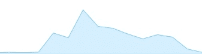

# 事后分析:苹果应用商店的高效推广|永恒风暴软件博客

> 原文：<https://eternalstorms.wordpress.com/2016/02/01/post-mortem-the-mac-app-stores-get-productive-promotion/?utm_source=wanqu.co&utm_campaign=Wanqu+Daily&utm_medium=website>

从 1 月 21 日到 1 月 28 日，苹果公司在其应用商店上开展了一项促销活动:**获得生产力**。
我很幸运地被邀请加入 Mac 应用商店，使用 [Yoink](http://eternalstorms.at/yoink) ，我的应用改进并简化了 Mac 上的拖放操作。

我想我应该分享一下我在这次促销活动中的经历，以及幕后发生的一些事情。

## 被邀请

事情始于 1 月初，当时我收到了一封来自苹果公司一位非常友好的人的电子邮件，询问我是否有兴趣出售 Yoink，以便在 1 月晚些时候进行促销。我在回应之前没有想太多，我很乐意参与——毕竟，当苹果要求你参与一部宣传片时，你就参与了那部宣传片，这是毫无疑问的。

这并不是该应用第一次参与促销活动。【2013 年 2 月，Yoink 参加了 Mac 应用商店为期三周的名为“完成任务”的生产力推广活动(Yoink 是第三周“利用”的一部分):

  Yoink 在 Mac App Store 的 2013 年促销活动“把事情做完——利用”(图片鸣谢:【macrumors.com】T2)

值得庆幸的是，Yoink 在那次推广中做得非常好，我认为这可能有助于让苹果公司考虑在这次推广中使用它。

如果你想知道，我没有任何访问或连接到苹果应用商店的权力。
然而，如果我有一个实质性的更新要发布，我会提前通过 iTunes Connect 联系他们(*很少*，请注意)，告诉他们有什么新内容以及更新中使用了什么技术。我不建议你每次更新都联系他们——我敢肯定，那只会对你不利。

## 得寸进尺，或者:尝试将 ScreenFloat 包含在内

我意识到我应该指望我的幸运星在这次促销活动中得到一个应用程序。
问题是，我真的相信我的另一个应用程序——[screen float](http://eternalstorms.at/ScreenFloat),它可以截屏并把它们放在所有窗口的前面，这样无论你在做什么，它们都是可见的参考——会非常适合“提高工作效率”的主题。
在我给苹果的邮件中，我提到了 ScreenFloat，用一句话描述了它，并问它是否会被考虑。
他们做到了，但这款应用显然没有成功。因为这正是我所期待的，所以没有造成任何伤害，而且据我所知，他们并不觉得这太过分。恰恰相反；他们似乎非常感谢这个建议。
我没有收到为什么不包括它的信息，但我有一个猜测:
我想他们决定不包括 ScreenFloat 的原因可能是它缺乏本地化——screen float 本地化为英语和德语，而 Yoink 有英语、德语、日语、简体中文、韩语、葡萄牙语(巴西和欧洲)、法语和意大利语。或者可能它已经有一段时间没有收到更新了(虽然这些天我正在开发 2.0 版本)。

## 阻止更新

你可能知道，当你在 App Store 上发布一个更新时，它当前的评论消失了，星级是所有版本的平均值，新版本的星级为零。当苹果联系我时，我正准备发布 Yoink 的更新，我知道我必须推迟发布更新，因为如果我发布了，应用程序旁边不会显示星星，我认为这确实有所不同——有星星的应用程序看起来比没有星星的更有吸引力:

.png") 苹果应用商店上没有星星的 Yoink 列表

.png") 苹果应用商店 Yoink 星上市

我通常不喜欢对我的应用程序进行更新(因为我经常修复错误，我不喜欢知道我已经内部修复了错误的版本仍然供用户使用)，但在这种情况下，我不得不破例。

总之，这是塞翁失马焉知非福，因为它给了我一些额外的时间来测试即将发布的更新，并确保新的 Force Touch 集成按预期工作。

## 促销的效果

我对晋升的结果非常满意。话说回来，当苹果把你的应用(以及其他开发者的)放在(潜在的)所有 Mac App Store 用户面前时，销售肯定会受到很大影响。苹果漂亮地号召用户行动起来(见本文的第一张图片)——一个漂亮的横幅，上面有流行应用的图标和标语“限时价格”。我知道这让*我*按下购买按钮。

### 对销售的影响

不出所料，我注意到促销期间销售额大幅上升。我不喜欢分享数字(这是我需要克服的，其他开发者也分享了他们的数字，这总是很有帮助)，但下面是 iTunes Connect 销售之前、期间和之后的曲线:

  Yoink 在促销前、促销中和促销后的销售曲线图

同样参与推广的 PCalc ( [Mac](https://itunes.apple.com/app/pcalc/id403504866?mt=12&at=1001l8pT&ct=blog) / [iOS](https://itunes.apple.com/app/pcalc-the-best-calculator/id284666222?mt=8&at=1001l8pT&ct=blog) )开发者詹姆斯·汤姆逊也在推特上分享了自己的曲线[。](https://twitter.com/jamesthomson/status/693483408811528192)

### Mac 应用商店排名

当推广开始时，Yoink 当时还没有进入美国最高付费类别的前 100 名。1 月 21 日，该应用开始上升，升至第 43 位，并于 1 月 22 日达到第 13 位。它在那个地方徘徊，直到一周后促销活动结束。
在包括中国、日本、德国和奥地利在内的几个国家，它上升到了收入最高的前十名。

### 复习

我没有看到评论数量的显著增加——然而，我在竞选期间收到的评论都是在中国写的——我把这归因于一个事实，即随着 Yoink 最近的更新，我把它本地化为简体中文。我以前在那个国家没有得到很多关于 Yoink 的评论，所以这是一个安全的赌注。

### 支持请求

令人惊讶的是，支持请求(通过邮件、twitter 或 facebook)并没有达到我预期的数量，我认为这是一个很好的迹象，表明 Yoink 工作得相当好。没有得到支持请求可能意味着两种情况:没有人购买它，或者软件或多或少工作正常，没有大的问题。
关于销量，我认为支持请求没有大幅增加是件好事。

### 赞助商推文

.png")

正如我在 twitter 上提到的，我尝试了推广推文。我投入了 200 欧元(约 215 美元)，我认为可以肯定地说，这是我迄今为止接触人们最昂贵的方式。另一方面，针对性是一流的。

.png") 推文浏览量提升(最高:14.500 左右)

我精心挑选了 100 个我认为与 Mac 社区相关的 twitter 账户(开发者、应用账户、博客、记者)，选择了我认为与 Yoink 相关的兴趣，然后让它飞起来。
我达 55.813 人，产生 4.142 次“预约”，转化率 7.4%。花 215 美元，我可以在网站上获得 170，000 以上的浏览量，但那里的互动率要低得多。
到底什么是“订婚”？点击推文，点击你的个人资料，点击图片，点击链接，一个“赞”或转发。所以 7.4%的参与率本身或多或少是没有意义的。
根据 Twitter，我收到了 35 次直接点击链接。三十五。那就是 0.06%的订婚率。确实是相当昂贵的广告。

.png") 推广推文——约定

最搞笑的是，一些“喜欢”这条推文的人最后把我封为“垃圾邮件”。我收到的两封回信中有一封是这样的:

 垃圾邮件，有人吗？

由于我在 twitter 上有一个广告，我最终上了几个专门屏蔽我的名单。当然，这些很可能是 Twitter 用户，他们从来没有打算购买我的软件，也没有伤害感情，我只是觉得这很有趣。似乎 twitter 上的一些用户没有意识到有广告，以为我给他们发了垃圾邮件。

#### 赞助推文的链接

一开始，我在 Mac App Store 上发了一条推文，上面有一个指向 Yoink 的链接，后来我发现这不是一个好主意。
我这篇推文所针对的大多数用户都在他们的 iOS 设备上使用 Twitter，当你在 iOS 上打开一个 Mac App Store 链接时，你会收到这样的消息:

iOS 应用商店中的 Yoink

当你点击“了解这个应用的更多信息”时，它确实会把你带到这个应用的网站，但这是大多数用户不愿意做的另一个点击。我改了链接，直接带他们去 Yoink 的[网站](http://eternalstorms.at/yoink)，只损失了大约 4000 次浏览。我的错。(我对“iOS 应用商店中的 Mac 应用页面”进行了雷达改进[此处](//24435661))。

我不喜欢直接链接到我的应用程序。我宁愿链接到销售，所有应用程序显示的推广页面。然而，据我所知，这是不可能的(我也为它申请了雷达)。这肯定是可以在未来的促销活动中改进的地方。

也许赞助的推文可能提高了一些用户对 Yoink 的认识，但我认为这不值得。或许更有针对性的受众会有所帮助。

## TL；速度三角形定位法(dead reckoning)

被苹果公司重点介绍有助于你为你的应用程序获得新客户，我会在他们邀请我的任何时候再做一次。
赞助推文？相当昂贵，但几乎没有效果(就我而言，请注意，这是我第一条赞助的推文，我可能没有把它作为目标。下一次，我可能会去赞助一个受欢迎的博客。

## 时事通讯

如果你喜欢这篇博文，也许你想 [**加入永恒风暴软件简讯**](http://eepurl.com/bJZg9T) ，在那里我每月给你写一次*最多*关于我的应用和我的博客上发生的事情:)谢谢。

### 像这样:

像 装...

### *相关*