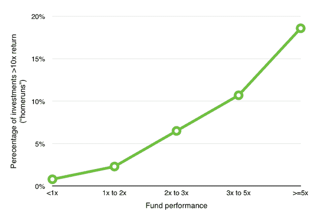
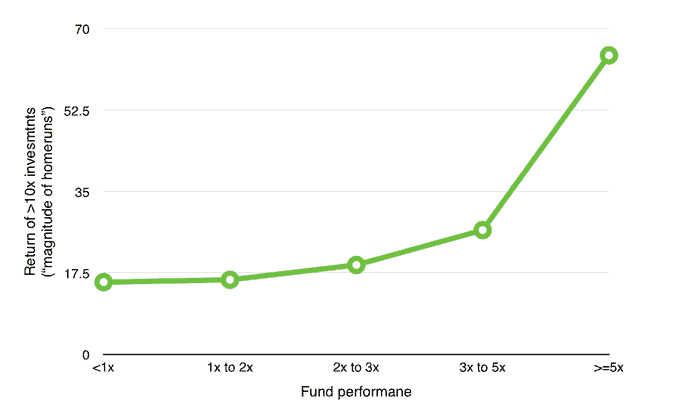
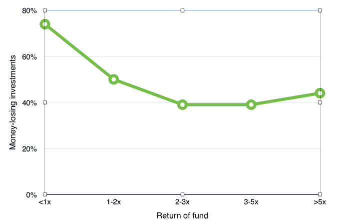
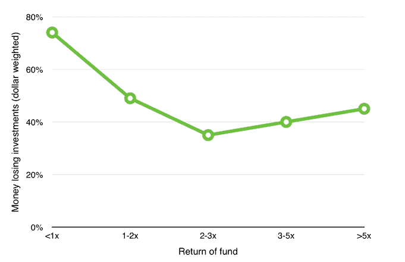

# 风险投资中的贝比·鲁斯效应

> 原文：<http://cdixon.org/2015/06/07/the-babe-ruth-effect-in-venture-capital/?utm_source=wanqu.co&utm_campaign=Wanqu+Daily&utm_medium=website>

> “如何击出全垒打:我尽全力挥棒，尽量把球击出...你握球棒越用力，你就越能挥棒穿过球，球就会飞得更远。我全力以赴。我撞大了或者我错过大了。”
> 
> ——贝比·鲁斯

对于刚接触风险投资的人来说，最难理解的一个概念就是所谓的“贝比鲁斯效应”:

> 建立一个能带来优异表现的投资组合需要你用期望值分析来评估每一项投资。引人注目的是，各个领域的领先思想家——包括赌马、赌场赌博和投资——都强调同一点。我们称之为贝比·鲁斯效应:尽管鲁斯多次三振出局，但他仍是棒球史上最伟大的击球手之一。
> 
> —“贝比·鲁斯效应:频率与幅度” [pdf](http://turtletrader.com/pdfs/babe-ruth.pdf)

贝比鲁斯效应出现在许多投资领域，尤其是风险投资领域。正如彼得·泰尔[观察到的](http://25iq.com/2014/07/13/a-dozen-things-ive-learned-from-peter-thiel/):

> 实际(风险投资)回报的偏差令人难以置信。风险投资越了解这种不对称模式，风险投资就越好。糟糕的风投往往认为虚线是平的，即所有公司都是平等的，有些公司只是失败、原地打转或成长。事实上，你会得到一个幂律分布。

贝比鲁斯效应很难内在化，因为人们通常倾向于避免损失。著名的行为经济学家[证明了](http://en.wikipedia.org/wiki/Loss_aversion)人们对一定规模的损失的感觉比他们对相同规模的收益的感觉要糟糕得多。亏损的感觉很糟糕，即使它是总体上成功的投资策略的一部分。

在讨论这个话题时，人们通常会引用轶事案例，因为很难获得全面的风险投资业绩数据。许多风险投资基金中备受尊敬的投资者(有限合伙人)霍斯利·布里奇，好心地与我分享了自 1985 年以来他们投资的数百只风险投资基金的投资回报分布的匿名历史数据。

正如预期的那样，回报高度集中:约 6%的投资(占投资金额的 4.5%)产生了约 60%的总回报。我们再深入挖掘一下数据，看看是什么把好的风投基金和差的风投基金区分开来。

*本垒打:*不出所料，成功的基金有更多的“本垒打”投资(定义为回报>10 倍的投资):

(对于所有显示的图表，X 轴是风险投资基金的表现:优秀的风险投资基金在右边，糟糕的基金在左边。)

伟大的基金不仅有更多的本垒打，他们有更大规模的本垒打。以下图表显示了“全垒打”(> 10 倍)投资的平均表现:

优秀基金的本垒打大约是 20 倍，但优秀基金的本垒打几乎是 70 倍。正如比尔·格利所说:“风险投资甚至不是一种家庭经营的业务。这是一项大满贯业务。”

*删除线:*此图表上的 Y 轴是亏损投资的百分比:  这是同一图表，Y 轴以每笔投资的美元投资进行加权:

不出所料，很多投资都赔钱。风险投资是一项有风险的业务。

请注意，曲线是 U 形的。不良基金损失惨重，或者好基金比不良基金损失更少，这都不足为奇。有趣且令人惊讶的是，优秀的基金比优秀的基金更容易亏损。最好的风投基金确实体现了贝比·鲁斯效应:他们努力摇摆，要么大获成功，要么错失良机。没有很多三振出局，你就不可能有大满贯。