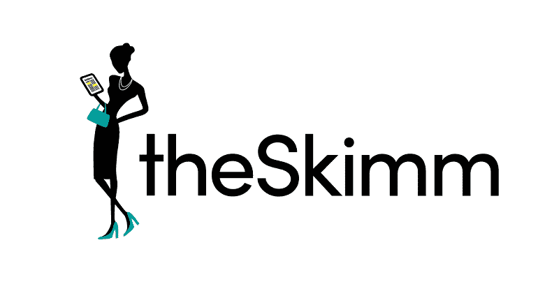
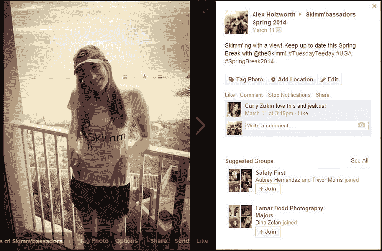
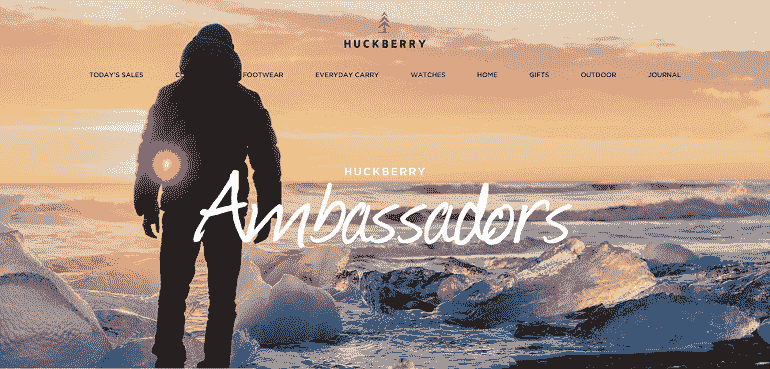
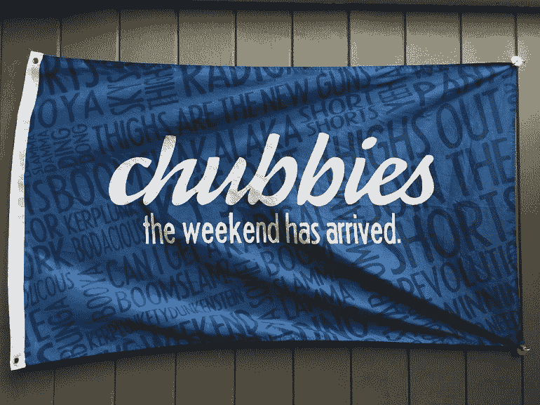
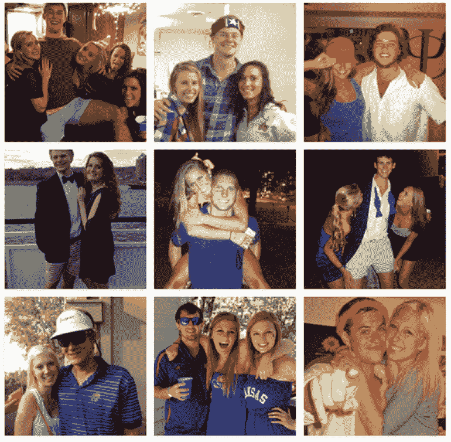
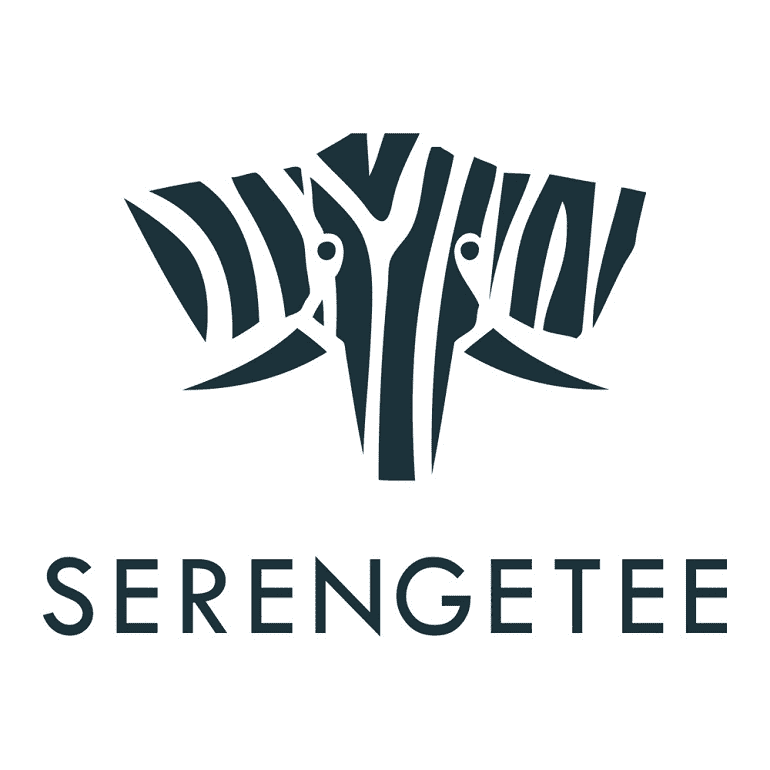
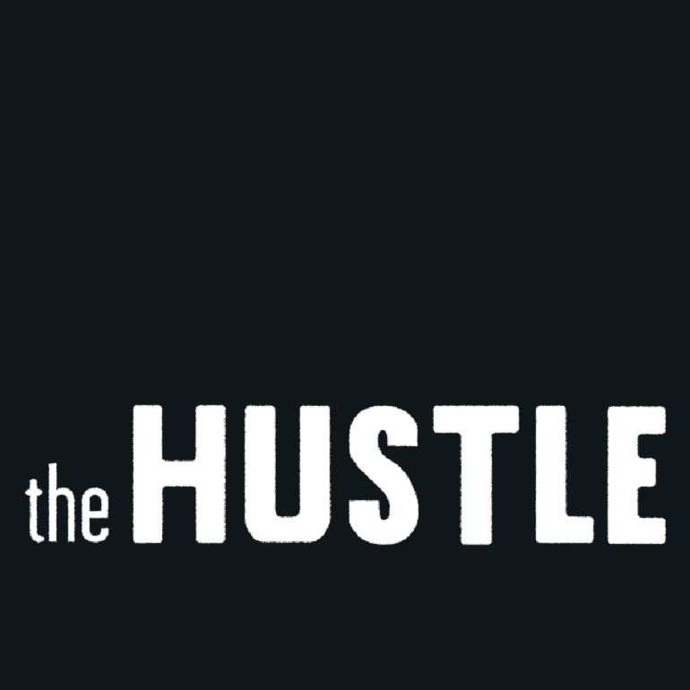
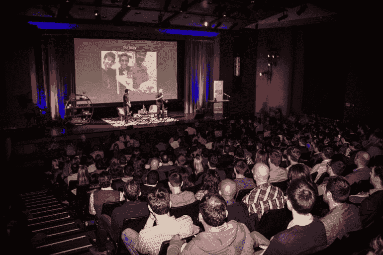

# 为什么建立社区是新的“增长黑客”——骗局

> 原文：<http://thehustle.co/why-building-community-is-the-new-growth-hack?utm_source=wanqu.co&utm_campaign=Wanqu+Daily&utm_medium=website>

我们最近启动了一个 T2 大使项目。我们的目标是建立一个强大的社区，在那里我们最大的粉丝可以给我们反馈，我们可以奖励他们的忠诚。我们也希望这些大使将有助于我们公司的发展。

我们都不是专业的“社区建设者”,所以我们的策略是围绕那些已经成功创建了大使计划的公司。

我们认为把我们的笔记保密是自私的…

享受吧。

<noscript>T3】</noscript>

theSkimm 是一份每日电子邮件简讯，为您提供开始新一天所需的一切。他们把最新的新闻分解成容易理解的花边新闻…这使得他们更容易跟上时事。

#### 大使是做什么的？

喜欢阅读 theSkimm 的人分享他们独特的推荐链接，当有人订阅时，他们可以获得积分。他们需要收集 10 封电子邮件才能成为正式的“逃债大使”

#### 大使们得到了什么回报？

*   10 封电子邮件= Skimm 手提包
*   25 封邮件= T 恤
*   50 封电子邮件= Skimm 简讯喊出
*   100 封邮件=雨伞
*   150 封邮件=手机壳
*   200 封邮件=葡萄酒吸管杯

theSkimm 鼓励 Skimmbassadors 穿着他们的赃物在镇上。

<noscript>T3】</noscript>

> “这将是我们鼓励自拍的唯一场合”

额外好处:

*   秘密脸书小组的邀请:斯金纳大使可以与世界各地的其他斯金纳大使联系
*   邀请加入秘密 LinkedIn 群:任何人都可以在 Skimmbassador 网络中分享职位空缺
*   提前获得少量实习和工作机会
*   合作额外津贴:为一个 Skimmbassador 企业家提供奖学金，或者提前接触他们的品牌合作伙伴

#### 成功了吗？

theSkimm 在三年内迅速将他们的电子邮件列表扩大到 100 万电子邮件订户。他们为启动第一天的大使计划贡献了最大的增长因素。

他们目前有 12，000 多名大使，分为两个脸书小组:一个针对大学生，另一个针对其他所有人。

我们了解到:theSkimm 的读者喜欢赃物，喜欢向他们的朋友和家人展示 theSkimm。他们也喜欢在网上与其他对他们感兴趣的话题感兴趣的“浏览者”联系。

<noscript>T3】</noscript>

Huckberry 是一份双周刊网络杂志，以会员价为您提供独特的服装和装备，以及产品背后的故事。

#### 大使是做什么的？

大使们在网站上有一个专门的页面，上面有个人简介、照片、社交频道和他们最喜欢的装备。该计划于 2015 年初启动。

除了作为 Huckberry 在当地的亲善大使，大使们还在整个合作过程中的不同时间通过他们的社交渠道和个人网站分享他们的 Huckberry 页面。

该团队试图在许多创意品牌项目中加入形象大使，例如加州人迪伦·戈登(Dylan Gordon)，他与设计师 Iron & Resin 一起拍摄了哈克贝里的胶囊 collab 还有为艺术家系列拍摄泰·威廉姆斯的冲浪者尼克·拉瓦基亚。这些大使只是“碰巧”拥有严肃的摄影技巧…

Huckberry 的大使计划被视为品牌的增长渠道和灵感来源。哈克贝里还依靠大使来为他们所在城镇的当地活动争取支持和刺激。

#### 大使们得到了什么回报？

哈克贝里为他们的大使提供了不同的激励措施，包括装备、对特殊项目的支持和社会推广。由于哈克贝里对他们选择谁作为大使是有选择性的，他们可以送出更多的礼物来获得个性化的体验。

#### 成功了吗？

2015 年，Huckberry 的 Instagram 同比增长 84%，这在一定程度上归功于他们与 Instagram 大使的交叉推广。他们的计划仍然相当新，目前他们正在通过网站流量、新注册人数和社交增长来衡量成功。他们告诉 The Hustle，他们的首要目标是创建一个由冒险家、创意者和运动员组成的紧密团结的家庭，他们的工作让人感觉是哈克贝里文化的真实体现。

我们学到的:保持个人化。创建一个由钦佩哈克贝里品牌和生活方式的人组成的紧密团结的家庭。

<noscript>T3】</noscript>

Chubbies 是一个针对社交媒体蓬勃发展的年轻男性的短裤系列(他们的话，不是我们的)。

#### 大使是做什么的？

Chubbies 每周发布挑战，鼓励大使们开展外联和创作内容。

> “最近，我们的大使接管了得克萨斯州韦科的 BSR 电缆公园，当他们在水上公园度过了不可思议的一天时，我们得到了一些真正不可思议的照片和[视频内容](https://www.facebook.com/chubbies/videos/vb.212377122105873/1149566238386952/?type=2&theater)；双赢多吗？他们还领导了照片和视频拍摄，举办了节日欢呼马拉松，并组织了大型聚会，让来自全国各地的大使们聚在一起，相互认识。”<cite>梅森，胖子的内容大师</cite>

> “没有社会职位要求或强制性活动，但当大使对某项活动有好主意时，我们会尽一切努力实现它。”

Chubbies 大使还协助新产品，并就公司如何改进提供反馈。

#### 大使们得到了什么回报？

Chubbies 大使获得奖励，赢得他们的每周挑战，包括运动衫，t 恤，定制的运动装备，乌鱼假发，和尤物色调。

大使收到一个折扣代码，他们可以使用现场购买。Chubbies 还在社交媒体渠道上向 150 万人强调了大使的内容。他们的 [Instagram](https://www.instagram.com/p/BBWTQzlOqKV/?taken-by=chubbies) 几乎都是用户直接提交的内容。

#### 成功了吗？

Chubbies 现在在全国有 400 名大使。

目标是帮助他们的顾客过上更充实的生活，给世界带来更多乐趣。这很方便地创造了一个热情的粉丝群体，并在他们的大学校园里传播这个消息。

<noscript>T3】</noscript>

> “该计划对品牌发展的贡献不可低估，我们感到非常兴奋，因为我们只希望该计划的影响力能够扩大。”<cite>梅森，胖子的内容大师</cite>

我们学到的:突出你们大使的工作。鼓励他们创造与你的品牌一致的内容。让一切都是双赢。

<noscript>T3】</noscript>

Serengetee 使用世界各地的布料制作口袋衬衫。每件衬衫的一部分收入将捐给该面料的生产国的慈善机构。

#### 大使是做什么的？

Serengetee 称他们的大使为“学生代表”，他们的目标是传播 Serengetee 的信息。学生代表通过积分系统获得奖励。这就像一个街机，在那里你可以得到所有的票，并在学期结束时兑换成你想要的任何东西。

要获得积分，您需要:

*   在社交媒体上发布自己穿着 Serengetee 服装的照片
*   向你的朋友或家人出售衬衫，记录你的折扣代码
*   独立+作为区域参加各种比赛
*   每个人都必须在学期结束时创建一个推广 Serengetee 的“代表项目”。Jeremy Uniszkiewicz 创作了一个名为[什么是 Serengetee 的视频？](https://www.youtube.com/watch?v=CIIwtWA2Pv0&feature=youtu.be)，解释公司的情况。凯西·戴利创建了一个 [Tumblr 简介](http://serengeteepocketportfolio.tumblr.com/)，突出了她与 Serengetee 合作的经历。

#### 大使们得到了什么回报？

*   折扣:从他们的商店购买任何东西都有 15%的折扣
*   免费赠品:达到一定的积分后，你可以获得免费的 t 恤或配饰
*   免费危地马拉之旅:如果你的 rep 项目恰好是最好的 rep 项目，你就有可能赢得一生一次的危地马拉之旅，与 Serengetee 的创始人杰夫和瑞安一起旅行
*   代表队长:在你的代表任期结束后，你可以升级为代表队长，在那里你可以通过与 Serengetee 分享你的经验来帮助其他 Serengetee 代表。
*   推荐信:代表队长经常为学生代表写大学、工作和奖学金申请的推荐信。

#### 成功了吗？

自 2012 年创办公司以来，Serengetee 的学生代表人数已增至 2500 人。

大学代表在美国被分成八个区域。他们有校园代表领导-他们是大学生-管理每个区域。高中代表有两个区域，东部和西部，相互竞争。它通过为同一事业而战，在每个地区内创建社区。

像吉米·塔特罗这样的社交媒体影响者开始支持 Serengetee，这给了他们大量的新粉丝。

创始人说他们的校园代表项目对他们来说是一个很大的增长因素。

我们学到的:在社交渠道上分享你的品牌时，大学和高中学生是你最大的财富。

<noscript>T3】</noscript>

Hustle 是一份电子邮件简讯，面向对商业、设计和技术感兴趣的精明的前瞻性思考者。我们寻找、探索和发现鼓舞人心的故事的原创内容。

在研究了其他成功的启动程序后，这是我设置的地方。

#### 大使是做什么的？

喜欢阅读我们网站内容的人分享他们独特的网址，并邀请他们的朋友订阅我们的电子邮件列表。你需要收集四封电子邮件才能成为这项运动的官方大使。

#### 大使们得到了什么回报？

4 推荐=邀请到我们的私人社区，在这里您可以与来自世界各地的其他 Hustle 大使联系。

每月问答:我们在私人小组中与感兴趣的企业家进行亲密对话。我们的第一个问答环节是与 Hustle 的创始人 Sam & John 进行的。我们的第二个问答环节是杰克·史密斯，他在 25 岁之前联合创立了两家 1 亿多美元的创业公司。

Hustle Network:在这里你可以列出你的技能，并为同行提供帮助。作为回报，你可以向团队中的任何一个骗子寻求帮助。一旦我们达到 1，000 人，这将变得特别有用，因此每个人只需一封电子邮件就可以获得支持。

*   10 次推荐= T 恤
*   25 推荐=帽衫
*   50 次推荐=免费获得 [Hustle Con 2016](http://www.hustlecon.com/) 门票

<noscript>T3】</noscript>

这是一张来自 Hustle Con 2015 的图片，这是我们的旗舰会议，门票平均价格为 300 美元。赢得门票的大使有机会与我们的团队和 2500 名其他与会者一起玩，此外还可以看到 15 位初创公司创始人的演示。

#### 成功了吗？

自一月份推出以来，我们已经收集了几千封电子邮件，我们的社区超过 100 人(活跃且不断增长)。在这里加入运动[。](http://ambassadors.thehustle.co/#amb)

## 外卖食品

每个大使项目都是不同的。如果你建立了自己的大使计划，找出是什么激励你的顾客(或读者)传播你的品牌。然后创建一个项目，给他们这样做的能力，并在过程中支持他们。

## 获取你将在收件箱中实际阅读的 5 分钟综述

5 分钟或更短时间内发布商业和科技新闻