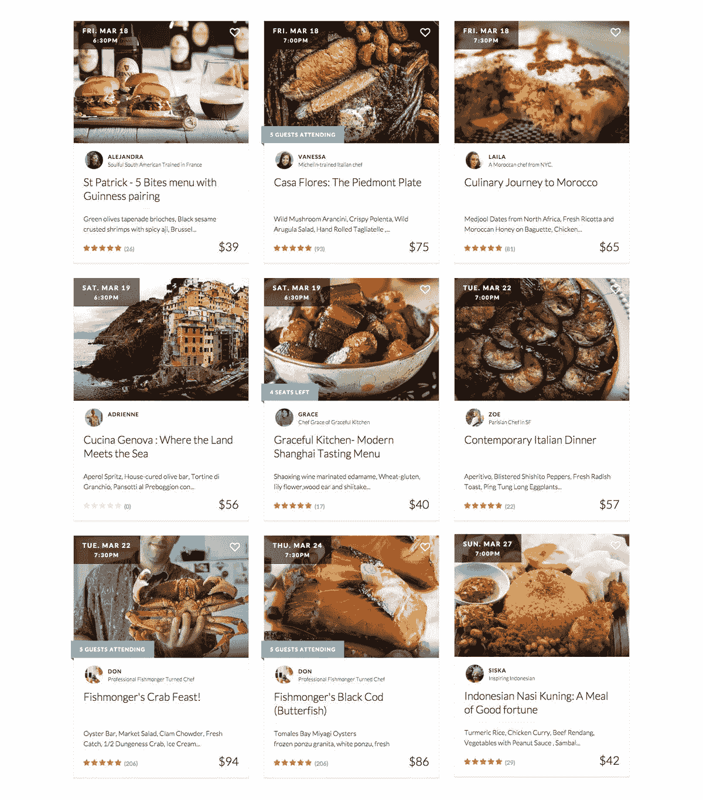

# 为什么没有一个餐饮应用程序是“食物的 Airbnb ”(迄今为止)食客

> 原文：<https://www.eater.com/2016/3/31/11293260/airbnb-for-food-apps-eatwith-feastly?utm_source=wanqu.co&utm_campaign=Wanqu+Daily&utm_medium=website>

这顿晚餐是由布鲁克林的一名厨师做的一顿日本风味的六道菜大餐。样本菜单包括“毛豆酱蒸丝豆腐”和“大石汤酿土豆球”等菜肴，甜点是烤绿茶焦糖布丁。对于纽约市的一个夜晚来说，57 美元的价格实在是太便宜了。我注册了其中一个有限的位置，并收到了一封电子邮件，告诉我晚宴的完整地址，以及一张便条——全部大写——鞋子不得入内。但是，在晚餐的那天早上，厨师取消了这个活动。她写道，取消预订是她“真诚的遗憾”,因为她没有达到举办这顿饭所需的最低预订数量。

不幸的是，由于客人不多，我们不得不重新安排晚餐的时间 T3】

我用来安排这顿饭的 EatWith 服务只是众多同类服务中的一个。他们允许厨师推广私人晚餐，通常有六个或更多的客人，如果一切顺利，比在餐厅厨房赚更多的钱。与此同时，食客们得到了一顿美味佳肴的承诺，也许还能与厨师互动，并有希望在餐桌上结交新朋友。

我希望第二次尝试会更好。第二份晚餐 69 美元，价格更高。当晚的活动将是一次“K 城”美食之旅，有三道菜，如热蔬菜*紫菜包饭*、 *galbijjim* ，当然，还有各种泡菜可供选择。以前的客人留下了一致的好评，如“一个奇妙的主人创造了完美的奇妙之夜”或简单的“太棒了！”一位评论者写道，“帮自己一个忙，当你遇到全新的人，分享一份完全令人惊叹的菜单时，进入一个非常有趣的环境。”评论者，我试过了。但是，我又一次收到了一张纸条，上面写着，“不幸的是，由于客人数量较少，我们将不得不重新安排这场晚宴。”

简而言之，这就是 EatWith 等应用和服务面临的问题(以下统称为“与陌生人吃饭应用”，或“EWSAs”)。他们不仅需要一大批想当厨师的人来推销他们的服务和餐桌；他们也需要有人参加用餐。

<picture class="c-picture" data-cid="site/picture_element-1668355291_6430_152821" data-cdata="{&quot;asset_id&quot;:6259261,&quot;ratio&quot;:&quot;*&quot;}"><source srcset="https://cdn.vox-cdn.com/thumbor/2MKDjgiPz19apqeSfF2BaZWdkZw=/0x0:730x560/320x0/filters:focal(0x0:730x560):format(webp):no_upscale()/cdn.vox-cdn.com/uploads/chorus_asset/file/6259261/eatwith_chef.0.jpg 320w, https://cdn.vox-cdn.com/thumbor/5BF19jExQzxsLZMoJzRvllnTQpk=/0x0:730x560/520x0/filters:focal(0x0:730x560):format(webp):no_upscale()/cdn.vox-cdn.com/uploads/chorus_asset/file/6259261/eatwith_chef.0.jpg 520w, https://cdn.vox-cdn.com/thumbor/zOMoj4QIDoCb_v5xKECuVSN7YZ8=/0x0:730x560/720x0/filters:focal(0x0:730x560):format(webp):no_upscale()/cdn.vox-cdn.com/uploads/chorus_asset/file/6259261/eatwith_chef.0.jpg 720w, https://cdn.vox-cdn.com/thumbor/fFB2KG-sdDkhCqwo4xClUdFOdAQ=/0x0:730x560/920x0/filters:focal(0x0:730x560):format(webp):no_upscale()/cdn.vox-cdn.com/uploads/chorus_asset/file/6259261/eatwith_chef.0.jpg 920w, https://cdn.vox-cdn.com/thumbor/v7O7q8ekYund78GYVZB56Kexi5E=/0x0:730x560/1120x0/filters:focal(0x0:730x560):format(webp):no_upscale()/cdn.vox-cdn.com/uploads/chorus_asset/file/6259261/eatwith_chef.0.jpg 1120w, https://cdn.vox-cdn.com/thumbor/EWgoikxbu4aEwX5IUR8BUzhbrTg=/0x0:730x560/1320x0/filters:focal(0x0:730x560):format(webp):no_upscale()/cdn.vox-cdn.com/uploads/chorus_asset/file/6259261/eatwith_chef.0.jpg 1320w, https://cdn.vox-cdn.com/thumbor/VmcYUr1LFCehG8TkbfajPV_x4Js=/0x0:730x560/1520x0/filters:focal(0x0:730x560):format(webp):no_upscale()/cdn.vox-cdn.com/uploads/chorus_asset/file/6259261/eatwith_chef.0.jpg 1520w, https://cdn.vox-cdn.com/thumbor/AIVzkGr_LswAqVLcEQRmFMTUGL8=/0x0:730x560/1720x0/filters:focal(0x0:730x560):format(webp):no_upscale()/cdn.vox-cdn.com/uploads/chorus_asset/file/6259261/eatwith_chef.0.jpg 1720w, https://cdn.vox-cdn.com/thumbor/P-0xQh-G3QnvsqEmF0etJoqmBO8=/0x0:730x560/1920x0/filters:focal(0x0:730x560):format(webp):no_upscale()/cdn.vox-cdn.com/uploads/chorus_asset/file/6259261/eatwith_chef.0.jpg 1920w" sizes="(min-width: 1221px) 846px, (min-width: 880px) calc(100vw - 334px), 100vw" type="image/webp">![An EatWith host finishes plating. [Photo: EatWith/Facebook]](img/d1925b9381e6617f0ff90a8521e33ea0.png)</picture>

一台 EatWith 主机完成电镀。[图片:[伊特维斯/脸书](https://www.facebook.com/EatWith/photos/pb.421664834552512.-2207520000.1459271581./1014560075262982/?type=3&theater)

#### 现实

EWSAs 希望城市居民不要再坐在酒吧的凳子上紧张地查看手机，不要再订购那么多外卖，多做一些现实生活中的联系。正如 Feastly 的创始人诺亚·卡雷什(Noah Karesh)所说，“我们把餐桌视为原始的社交网络。”像许多可以被挤入“共享经济”的行业一样，EWSAs 通常被称为“食物的 Airbnb”这些公司从每张票的价格中提成(有时还会向厨师收取签约费),食客可以吃到普通餐馆无法提供的冒险食物。对典型厨房的高压力/长时间工作环境不感兴趣的想要成为厨师的人可以在自己家里舒适地扮演厨师。

第一批 EWSAs 在 21 世纪初开始成为头条新闻。关于 GrubWithUs、Kitchenly、Grouper、EatWith、HomeDine、left Swap 等公司的文章来自食品和技术领域。尽管获得了超过 600 万美元的风险投资，GrubWithUs 还是在 2013 年倒闭了。HomeDine 和 Kitchenly 类似，不再存在。(不知何故，剩余互换——开始是一个笑话——仍然存在。)这些只是突然出现的公司中的一部分。在变得像 Airbnb 一样富有的承诺的诱惑下，越来越多的公司开始加入进来。许多 EWSAs 消失的速度几乎和它们来的速度一样快。

<picture class="c-picture" data-cid="site/picture_element-1668355291_2141_152822" data-cdata="{&quot;asset_id&quot;:6235491,&quot;ratio&quot;:&quot;*&quot;}"><source srcset="https://cdn.vox-cdn.com/thumbor/NLZSfu4elMZ0hBBeltJLxT1jE_4=/0x0:1440x1637/320x0/filters:focal(0x0:1440x1637):format(webp):no_upscale()/cdn.vox-cdn.com/uploads/chorus_asset/file/6235491/ew-event-listings.0.jpg 320w, https://cdn.vox-cdn.com/thumbor/_-FQclrW8gpKjnEGLoaci40f56w=/0x0:1440x1637/520x0/filters:focal(0x0:1440x1637):format(webp):no_upscale()/cdn.vox-cdn.com/uploads/chorus_asset/file/6235491/ew-event-listings.0.jpg 520w, https://cdn.vox-cdn.com/thumbor/1kk0G_o-Q_FnPB6noWTf5M46y4Q=/0x0:1440x1637/720x0/filters:focal(0x0:1440x1637):format(webp):no_upscale()/cdn.vox-cdn.com/uploads/chorus_asset/file/6235491/ew-event-listings.0.jpg 720w, https://cdn.vox-cdn.com/thumbor/9AZzSnQO6ubpjotZn6uU6plVI6c=/0x0:1440x1637/920x0/filters:focal(0x0:1440x1637):format(webp):no_upscale()/cdn.vox-cdn.com/uploads/chorus_asset/file/6235491/ew-event-listings.0.jpg 920w, https://cdn.vox-cdn.com/thumbor/JHWXHYyyhd5EEpMiF3_lvRveJuM=/0x0:1440x1637/1120x0/filters:focal(0x0:1440x1637):format(webp):no_upscale()/cdn.vox-cdn.com/uploads/chorus_asset/file/6235491/ew-event-listings.0.jpg 1120w, https://cdn.vox-cdn.com/thumbor/Cx948IAd2Sj2ZlBG02fHbk1r3Hc=/0x0:1440x1637/1320x0/filters:focal(0x0:1440x1637):format(webp):no_upscale()/cdn.vox-cdn.com/uploads/chorus_asset/file/6235491/ew-event-listings.0.jpg 1320w, https://cdn.vox-cdn.com/thumbor/q69OCw7q1GyA3QnNyXOeVnc4o-8=/0x0:1440x1637/1520x0/filters:focal(0x0:1440x1637):format(webp):no_upscale()/cdn.vox-cdn.com/uploads/chorus_asset/file/6235491/ew-event-listings.0.jpg 1520w, https://cdn.vox-cdn.com/thumbor/6181lIRKj3Td-jnReISZ6E3F6Go=/0x0:1440x1637/1720x0/filters:focal(0x0:1440x1637):format(webp):no_upscale()/cdn.vox-cdn.com/uploads/chorus_asset/file/6235491/ew-event-listings.0.jpg 1720w, https://cdn.vox-cdn.com/thumbor/ilNIGpAD_PZHDqjLJ_brtW6kKrc=/0x0:1440x1637/1920x0/filters:focal(0x0:1440x1637):format(webp):no_upscale()/cdn.vox-cdn.com/uploads/chorus_asset/file/6235491/ew-event-listings.0.jpg 1920w" sizes="(min-width: 1221px) 846px, (min-width: 880px) calc(100vw - 334px), 100vw" type="image/webp"></picture>

eatwitch 的列表页面。

EWSAs 的一些问题源于同样的心态，这种心态用“在酒吧喝酒”取代了“晚餐和电影”，成为首选的第一次约会活动。已经有了像 Meetup 或个别脸书团体这样的兴趣特定的网站来帮助结交新朋友。但是，他们不会在那些仅仅因为喜欢食物和愿意与陌生人共进晚餐而聚在一起的人之间做出选择，而是专注于实际的兴趣或爱好。想去捉鬼，然后在当地酒吧吃点小吃吗？有一群像你这样的人！如果你是一个想避开通常的旅游陷阱的美食爱好者，世界各地的城市里有很多专门从事冒险饮食的团体。

而且很难说留下来的公司经营得好不好。即使在大城市，也不总是有很多饭菜可供顾客选择。如果一个潜在的用餐者找到了他们想尝试的 EWSA，比如说，今晚或明天，他们可能不愿意提前三、四或五个晚上计划(或旅行 40 分钟)只是为了测试新产品。对于用餐者和厨师来说，在 Eventbrite 或类似网站上发布这些事件可以像求助于 EWSA 一样有效。但对于希望获得 Airbnb 规模利润的公司来说，这涉及到大量的小规模削减和更少的总体控制。

在 3 月最后一周的一个周四，EatWith 应用程序为即将到来的周末提供了五种不同的晚餐。尽管每位主持人被一致评为四星半或五星，但他们每个人至少还有五个座位。这些是为规模从 5 人到 12 人不等的晚宴准备的。十有八九，其中许多会在最后一刻被取消。

虽然“盛宴”经常只在一两天之外才有饭吃，(有些是“只在等候名单上”)，但大多数都在旧金山。在最近的一个周一，芝加哥没有预定餐，纽约有一餐，DC 有两餐，洛杉矶有四餐，所有这些城市的其余餐都是“应要求提供”——也就是说，基本上，如果你已经有一群朋友想一起吃饭，厨师会为你做这顿饭。

#### 梦想

让 EWSAs 进入 2016 年的持久原则是，人们希望结交朋友，人们喜欢尝试新的食物，还有很多优秀的厨师和厨师正在寻找额外的收入。把这三样东西放在一起，感觉是显而易见的。

对于一些厨师来说，这是有效的。凯文·舒德住在旧金山，他在餐馆工作已经有十年的经验，但现在为盛宴服务是他的主要收入来源。只需“一周几次晚餐和一点餐饮服务”，他就能挣得和他当厨师长时一样多。由于大多数后勤人员的工资低得可怜，Schuder 觉得一项服务可以让他削减管理费用，给员工更高的工资，并真正专注于食物，“对顾客也有好处。”

一周只有几次盛宴和一些餐饮服务，他挣的钱和他当厨师长时一样多。T3】

然而，他确实认为餐馆仍有一席之地。“一致性对帮助厨师建立技能很重要，”Schuder 说。仅仅因为这些晚餐只能同时为 24 个人服务，并不意味着厨师们在生产线上面临的挑战和多任务不再适用。"如果有人没有这种自律，他们不会通过盛宴来学习."

这也是 Feastly 和 EatWith(以及其他服务——自制或约瑟芬只是众多服务中的两个——专注于像千层面、饼干等独立食物)在将厨师添加到他们的名册之前筛选他们的原因之一。就像一家餐馆(现在)靠 Yelp 评论生存和死亡一样，这些企业也需要他们的声誉。食客们希望感觉无论他们选择什么厨师，这顿饭每次都会是赢家。

目前，Feastly 仍然只存在于美国的几个主要城市。但是如果他们走出这个领域，有一个领域对 EWSAs 有很大的潜力:国际社会。Karesh 说他们有“成千上万的人”从各地申请成为厨师。他讲述了这如何能给贫穷国家的人们带来收入，为女性提供机会，以及食物如何不仅仅“为我的身体提供燃料，还为我的联系感提供燃料”,这令人信服——即使这一切都是从一个网站开始的。

如果 EWSAs 没有在国外取得很大进展，他们至少可以展示居住在美国的外国厨师的鲜为人知的美食。来自缅甸的盛宴厨师 Ma Hmwe(虽然本文联系了来自多个服务部门的多名厨师，但所有回复的人碰巧都来自盛宴)在旧金山的缅甸餐馆工作了多年，然后“离开成为一名市政司机”，正如她的简历所述。今天，她继续做饭，只是因为她喜欢这样做，喜欢她的国家的美食。她指出，她经常花几个小时完全从零开始做饭，这在其他餐厅很难找到，因为那里的食材可能是提前制作并冷冻的。来吃她的饭的人来自许多不同的文化，许多人是第一次尝试缅甸食物。所以她以精确和细心地表现它而自豪。

<picture class="c-picture" data-cid="site/picture_element-1668355291_435_152823" data-cdata="{&quot;asset_id&quot;:6259179,&quot;ratio&quot;:&quot;*&quot;}"><source srcset="https://cdn.vox-cdn.com/thumbor/bYuHrB6qu35jmIx8ioiF_9XjlI4=/0x0:960x640/320x0/filters:focal(0x0:960x640):format(webp):no_upscale()/cdn.vox-cdn.com/uploads/chorus_asset/file/6259179/feastly-chef.0.jpg 320w, https://cdn.vox-cdn.com/thumbor/DagIcP026E7GREmCjECyjUIl0tM=/0x0:960x640/520x0/filters:focal(0x0:960x640):format(webp):no_upscale()/cdn.vox-cdn.com/uploads/chorus_asset/file/6259179/feastly-chef.0.jpg 520w, https://cdn.vox-cdn.com/thumbor/rPkcW0oOUbYXhf8eRqZ8OVrc5cw=/0x0:960x640/720x0/filters:focal(0x0:960x640):format(webp):no_upscale()/cdn.vox-cdn.com/uploads/chorus_asset/file/6259179/feastly-chef.0.jpg 720w, https://cdn.vox-cdn.com/thumbor/Qeo7H0ziqeDFqpb8hTpQWt_6LsU=/0x0:960x640/920x0/filters:focal(0x0:960x640):format(webp):no_upscale()/cdn.vox-cdn.com/uploads/chorus_asset/file/6259179/feastly-chef.0.jpg 920w, https://cdn.vox-cdn.com/thumbor/YzewUqsUMB6nrX-X-9ZmxZKHkeM=/0x0:960x640/1120x0/filters:focal(0x0:960x640):format(webp):no_upscale()/cdn.vox-cdn.com/uploads/chorus_asset/file/6259179/feastly-chef.0.jpg 1120w, https://cdn.vox-cdn.com/thumbor/Dc9odYmcel3ZfXullr5c_MpBpcw=/0x0:960x640/1320x0/filters:focal(0x0:960x640):format(webp):no_upscale()/cdn.vox-cdn.com/uploads/chorus_asset/file/6259179/feastly-chef.0.jpg 1320w, https://cdn.vox-cdn.com/thumbor/aKdbeCgOYwxdInKN9RNP5H43ePk=/0x0:960x640/1520x0/filters:focal(0x0:960x640):format(webp):no_upscale()/cdn.vox-cdn.com/uploads/chorus_asset/file/6259179/feastly-chef.0.jpg 1520w, https://cdn.vox-cdn.com/thumbor/ZpV2rUb5kmFuQf_oPkbAu5KVfMk=/0x0:960x640/1720x0/filters:focal(0x0:960x640):format(webp):no_upscale()/cdn.vox-cdn.com/uploads/chorus_asset/file/6259179/feastly-chef.0.jpg 1720w, https://cdn.vox-cdn.com/thumbor/8bvUeeuHdM61ogHVmj2GcNyWTMk=/0x0:960x640/1920x0/filters:focal(0x0:960x640):format(webp):no_upscale()/cdn.vox-cdn.com/uploads/chorus_asset/file/6259179/feastly-chef.0.jpg 1920w" sizes="(min-width: 1221px) 846px, (min-width: 880px) calc(100vw - 334px), 100vw" type="image/webp">![A chef cooks a dinner with Feastly. [Photo: Feastly/Facebook]](img/e836a670e6af9fe59917fe005355e600.png)</picture>

一位厨师精心烹制了一顿晚餐。[图片:[盛宴/脸书](https://www.facebook.com/Feastly/photos/pb.305738242778998.-2207520000.1459271169./1043674005652081/?type=3&theater)

对于那些想在实际的餐馆里举办一次不太合适的宴会的厨师来说，Karesh 相信 EWSAs 是一个完美的场所。Feastly 的一位厨师喜欢制作基于昆虫的食物，“这不是一个你可以做的餐馆商业模式，但他们在我们的平台上工作。”但像这样方便用餐的弹出式模式已经存在了很长时间，而且越来越受欢迎。去年，曼哈顿的蓝山餐厅举办了一次活动，整个菜单都是由原本会被扔掉的食物做成的。地下晚餐俱乐部像剃刀、闪亮的刀子做任何事情，从在纽约的 L-train 主办晚餐或在伦敦以最黑暗的食物为特色的黑色宴会。有人让弹出窗口工作(陌生人，在任何情况下，对于体验来说都是次要的)，**问题是 EWSAs 是否能做一些普通弹出窗口不能做的事情**。

至于与你可能毫无共同之处的陌生人共进晚餐的麻烦，Karesh 认为有人注册的事实是一个共同点。“每个人都在那里，因为他们对这个事件感兴趣，”Karesh 说。这种更广泛的共性可能是“与你通常不会在种族、性别和年龄方面交往的人交往”的关键

#### 未来

但是除了 EWSAs 市场仍然过度饱和——这使得食客很难可靠地找到食物，厨师很难接触到足够多的食客——还有一些潜在的监管问题。尽管 Airbnb 至少为房东提供了一些财产损失保险，但对于普通 EWSA 人来说，情况并非如此。与此同时，卫生部门通常认为任何以现金为交换条件的餐饮服务机构都需要和普通餐馆一样的许可。大多数 EWSA 厨师都没有这些许可证。 Schuder 认为 EWSAs 是在“**法律灰色地带**运作的，虽然这可能有一天会成为政治家们关注的问题，但今天已经不重要了。事实上，跳过官僚主义在很多方面都是有益的。在他的帮助下，旧金山的一家名为 Citizen Fox 的餐馆开始起步，目前仍在等待着在他们的固定地点开业。(舒德将这种停滞归因于城市监管问题。)快两年了。“餐饮业有时发展非常缓慢，厨师们有新的想法；他们想快速行动。”

过去，监管机构只会在“共享经济”类型的企业规模大到足以扰乱现状的时候，才会对它们进行打击，比如优步和 Airbnb。因此，到目前为止，EWSAs 仅取得了一些小的成功，这可能对这一特定领域有益。

尽管有各种挑战和迹象表明这可能是一个永远不会真正起飞的想法(更不用说成为下一个 Airbnb 了)，但这个想法继续保持着初创企业的想象力。因为如果它把人们联系在一起，并有机会在这个过程中获得收入，那么它没有理由不成为一个可行的业务。它必须工作。然而，也许 EWSAs 永远是用户的更好模式——无论是厨师还是食客——而不是商业本身的赚钱机器。如果有一家初创公司因为运营一个只为用户服务的网站或应用程序而感到成功，或许 EWSAs 最终会胜出。但是他们会赚到钱吗？这还不太确定。