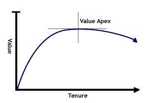
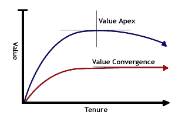

# 向上或向下:解决 IT 人员流动危机——每日 WTF

> 原文：<http://thedailywtf.com/articles/Up-or-Out-Solving-the-IT-Turnover-Crisis?utm_source=wanqu.co&utm_campaign=Wanqu+Daily&utm_medium=website>

如果你在 IT 行业的很多公司工作过，你可能已经注意到最有才华的软件开发人员不会在一个地方呆太久。另一方面，最没有才华的人深深扎根于组织中，经常建立糟糕代码的滩头阵地，没有一个理智的开发人员敢靠近，同时确保他们自己的工作安全，并搞砸足够的时间不被解雇。

本月早些时候，布鲁斯·f·韦伯斯特恰当地将这种现象命名为“死海效应”。今天，我将讨论一个克服它的方法。简而言之:拥抱流动，鼓励分离，甚至不要想说“职业，而不是工作。”哦对了，是就业 2.0。

### 重温克拉瓦斯系统

就像许多 2.0 主义和“创新”的经营方式一样，解决我们人事危机的“不成功便成仁”的方法并不新鲜。保罗·d·克拉瓦斯在世纪之交第一次实现了它。当然不是本世纪，而是上个世纪。

以下是“Cravath 系统”的工作原理。引入大量新员工，让他们与导师一起组队，提供真正的工作，给他们一个选择:要么获得大量丰富的经验然后离开，要么努力工作争取更高的职位。每当你听到有人渴望“成为合伙人”，他无疑是在一家采用这种模式的公司工作。

自 20 世纪初成立以来，Cravath 系统已经扩展到数以万计的不同行业的不同公司，从会计到城市规划。Robert T. Swaine 在他 1947 年的书《Cravath 公司和它的前身》中描述了使用它的结果:

> 在每年吸收大量人员并保持当前人员在办公室不断上升的“克拉瓦特系统”及其任期哲学下，人员不断离开……通常很难留住最优秀的人员足够长的时间来决定他们是否应该成为合伙人，因为受过克拉瓦特训练的人员总是很受欢迎，通常薪水很高。

听起来熟悉吗？如果我们“黑盒子”我们当前的过程和 Cravath 系统，它们实际上是一样的:许多不同技能的新员工进来，大多数有才华的员工出来。然而，不知何故，我们的箱子被“残渣”弄脏了，而他们的却是一台运转良好的机器。这有一个很好的理由:我们需要*培养*顶尖人才，而不是为了*留住*顶尖人才而争斗。

### 现实核查

我们不要忽视房间里的大象:员工会辞职。不管你说什么，不管你给什么样的福利，不管你怎么努力，他们都会离开你。只是“什么时候”的问题。

几乎在我做过的每一份工作中，提前两周通知就像是一次尴尬、不舒服的分手。“真的，”我会一遍又一遍地说，“不是你的问题，是我的问题。”似乎没有人明白这是“正是那个时候”。更糟糕的是，他们经常拒绝我提供的全面培训替代者的机会，有时甚至会当场终止我的雇佣关系。这确实是他们的损失:当我离开时，我会带走他们付钱让我自学的所有机构知识，而不是为我的继任者提取这些知识。

我(和你们中的许多人)有这些类似的辞职经历的原因是因为许多雇主——尽管他们自己也曾是雇员——不愿意接受雇员辞职的事实。有些人甚至不顾一切地试图改变事实。我已经数不清我听过多少次“我们提供职业，不仅仅是工作”和“我们更像一个家庭而不是一个公司。”有趣的是，这些公司往往拥有最成熟的死海周期。

员工——尤其是最有才华的员工——不会“四处约会”,也不会从一个地方搬到另一个地方，去寻找一家完美的公司，在那里养老。他们已经获得了马斯洛层次结构的前四个等级，正在寻找自我实现:人类最大限度地发挥自己能力并努力做到最好的本能需求。

这一点值得重复。无限期保留是不可能的；员工总是辞职。关键部分是理解为什么，以及如何利用这种不可避免性对每个人都有利。

### 为什么有经验的人会先辞职

布鲁斯很好地解释了为什么没有技能的人不会辞职:

> 他们倾向于感激自己有一份工作，对管理的要求也较少；即使他们觉得工作场所不愉快，他们也最不可能在其他地方找到工作。他们倾向于巩固自己，成为关键系统的维护专家，承担其他人不想要的责任，因此组织不能让他们离开。

然而，熟练员工辞职的原因有点复杂。几乎在每一份工作中，员工为公司带来的总价值(生产率与成本的比率)都有一个峰值。我称之为价值顶点。

在第一天的第一分钟，员工的价值实际上为零。随着员工熟悉新环境，并开始运用自己的技能和过去的经验，他的价值会迅速增长。当员工掌握业务领域并与同事和管理层分享他的想法时，这种增长会呈指数级增长。

> 

然而，一旦一个员工分享了他所有的外部知识，学习了所有关于业务的知识，并且应用了他所有的过去的经验，成长就停止了。那个员工，在那个特定的工作岗位上，已经成为了他所能成为的一切。他已经达到了价值的顶点。

如果那个员工继续做同样的工作，他的价值就会开始下降。曾经“我们今天无法实施的新鲜的新想法”变成了“我们永远不会去做的老一套无聊的建议”。以前对类似问题的解决方案是以“是的，我们也参与了那个项目”来迎接，或者简单地以“那是五年前的事了，我们都听说过这个故事”来拒绝。这导致了自我实现的丧失，最终削弱了动力。

熟练的开发人员明白这一点。越过价值顶点通常会引发一种与生俱来的“或许是时候离开了”的感觉，过一段时间后，会导致不可避免的怨恨和对工作的总体厌恶。没有什么——甚至没有一个现场按摩师团队——可以减轻这种损失。

另一方面，没有技能的人倾向于有一条稍微不同的曲线:价值趋同。他们最终陷入了平庸的境地，并无限期地呆在那里。他们的价值没有减少的唯一原因是因为他们囤积和创造了大量的制度知识。

> 

### 塑造价值顶点

有一个完整的迷你行业在帮助公司延伸价值顶点。只要在谷歌上搜索“员工保留”，就会出现无数的结果和广告，从书籍到研讨会到顾问。这些不同产品的价值主张很简单:现在花点钱留住员工更长时间，从而在以后的流动成本中节省更多的钱。

但是，价值顶点只能拉伸到此为止。在某种程度上，留住员工的成本——无论是通过加薪、激励计划，还是创建一个有免费食物、免费玩具和丰富的休闲时光的梦幻岛——都超过了流动成本。无论一个公司在这方面花了多少钱——太少、太多或刚好够——都不能改变价值顶点存在的事实。

拉伸之后，只有两种方法可以进一步优化价值顶点:加速价值增长曲线，并尽可能接近顶点。这两者都是通过 Cravath 系统完成的。

### 放弃的文化

我们都经历过经理和高层如何回避我们总有一天会辞职的事实。为什么应该记录一个过程，给出的理由几乎总是“因为你明天可能会被公共汽车撞上”(或者不那么可怕的“中彩票”)。因为两者都不在合理概率范围内，所以这种过渡性文档通常是半吊子的，带有可以理解的“如果我被公共汽车撞了，你会有更多的事情要担心”的态度。但是想象一下，如果文档的理由是不同的:

> 我需要你详细记录这一过程，以便在你离开一年后，任何雅虎人都能理解。

我从来没有遇到过一个经理或上级这样说。事实上，许多人觉得这比“被公共汽车撞了”更有说服力。但事实并非如此；这只是现实。为什么不接受？

当然，如果一家公司信奉辞职文化，这种理由甚至永远都不需要给出。如果他们对员工直言不讳，说一些大意如下的话，“我们知道你不会在这里退休；事实上，两到三年后，我们知道你会准备好换一份不同的工作。但在那之前，我们想确保你觉得你在这里做得很出色，并且带着一些扎实的经验离开。当然，有几个架构师和管理职位可供选择，但是在被考虑之前，你真的需要证明你的承诺。显然，这条路并不适合所有人。”

想象一下，如果你在第一天被告知*，事情会有多大的不同。几乎你做的每一项任务都会考虑到你的继任者。你不仅会为解决问题感到自豪——当然，还会因为这些解决方案获得丰厚的 ROR(简历回报)——而且你还会为知道在你之后的那个人会轻松地接手你的工作而感到自豪。就像你的前任为你做的一样。*

 *好处不止于此。有辞职文化的公司没有*前员工*；他们有*校友*。这远不止是语义上的区别。校友关系是积极的；人们可以引以为豪的东西；并且为双方的进一步机会敞开大门。让我们面对它；我们已经对以前的工作场所感到好奇，并试图通过以前的同事保持联系。如果公司能以某种方式促成此事，事情会简单得多。

校友关系也有助于新员工的流动。虽然前员工不太愿意推荐他们“分手”的公司，但校友们会向需要类似经历的同事推荐。此外，当校友带着从其他组织获得的经验回来继续任职时，也不会有挫败感。

对于咨询公司或服务公司来说，与校友保持稳固的关系是寻找新业务的绝佳途径。作为一个供应商，有谁能比一家拥有第一手工作经验的公司更值得推荐呢？

但也许辞职文化最重要的好处是，它有效地清除了非熟练员工的残余。当一个人在几个周期后没有提升或退出时，谁是最薄弱的环节就变得非常明显。每个人——甚至是某个人——都知道他们已经不受欢迎很久了。如果作为“那个家伙”的尴尬没有导致他自己离开，并且在被要求辞职后他仍然没有得到它，那么当他不可避免地被解雇时，肯定没有人会想念他。

### 给家里带来改变

显然，这篇文章已经描绘了一些难以置信的大致轮廓，最大的轮廓是熟练和非熟练开发人员之间的明显二分法，以及组织之间缺乏区别。虽然这不会改变价值顶点存在的事实，但它确实改变了它的形状。一般来说:

*   **位置越高，曲线越长**。高层的变化往往要慢得多。例如，一个部门团队的基本“重构”可能需要一年多的时间来实现。
*   **技能越大，曲线越短。**雄心和技能是相辅相成的，有雄心的人往往希望迅速改变，但如果没有改变，他们很快就会失去动力。
*   公司越大，曲线越短。大型团队通常不接受新人的想法，从而浪费了很大一部分贡献(即过去的经验)。此外，晋升往往基于任期，而不是技能。
*   公司越小，曲线越长。另一方面，小公司更容易接受变化，允许一个人长期贡献过去的经验。
*   公司对技能要求越低，曲线就越长。不是所有的公司都需要顶尖人才。例如，只需要古老 COBOL 应用程序维护者的公司可能最适合更接近价值收敛的曲线。

需要记住的重要一点是，技能不是衡量整体价值的标准。在人生的某个阶段，我们中的许多人不再从职业中寻找自我实现。例如，许多人觉得拥有一个家庭比事业能提供更多的自我实现，并选择不每周工作 60 小时来满足那些紧迫的最后期限。这没什么不好。

也就是说，我们仍然需要给我们的行业带来这些变化。显然，我们不可能在一夜之间实现 Cravath 系统。对于许多公司来说——尤其是那些真的不需要熟练开发人员的公司——一个成熟的 Cravath 系统永远不会是一个很好的选择。

但是有一件事我们所有人都能做。事实上，就在此时此刻，让我们一起努力吧。员工们，勇往直前，对自己说:

> 我知道我会辞职，这没什么不好。

现在轮到你们了，雇主/经理们:

> 我知道我的员工会辞职，这没什么不对。

一旦我们都接受了这一点，事情就会变得更好。最终，我们将加入法律行业、会计行业和许多其他行业，我们也将拥有运转良好的机器。但首先要做的是:我们需要接受戒烟，而不是害怕它。

[广告]

[BuildMaster](https://inedo.com/BuildMaster?utm_source=tdwtf&utm_medium=footerad&utm_term=2018&utm_content=Self_Service&utm_campaign=Buildmaster_Footer)

允许您创建自助式发布管理平台，允许不同的团队管理他们的应用程序。

[Explore how!](https://inedo.com/BuildMaster/download?utm_source=tdwtf&utm_medium=footerad&utm_term=2018&utm_content=Self_Service&utm_campaign=Buildmaster_Footer)*