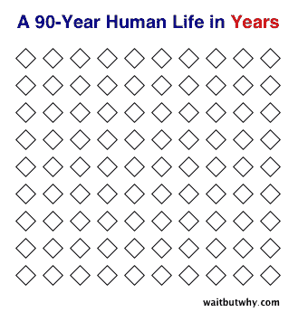
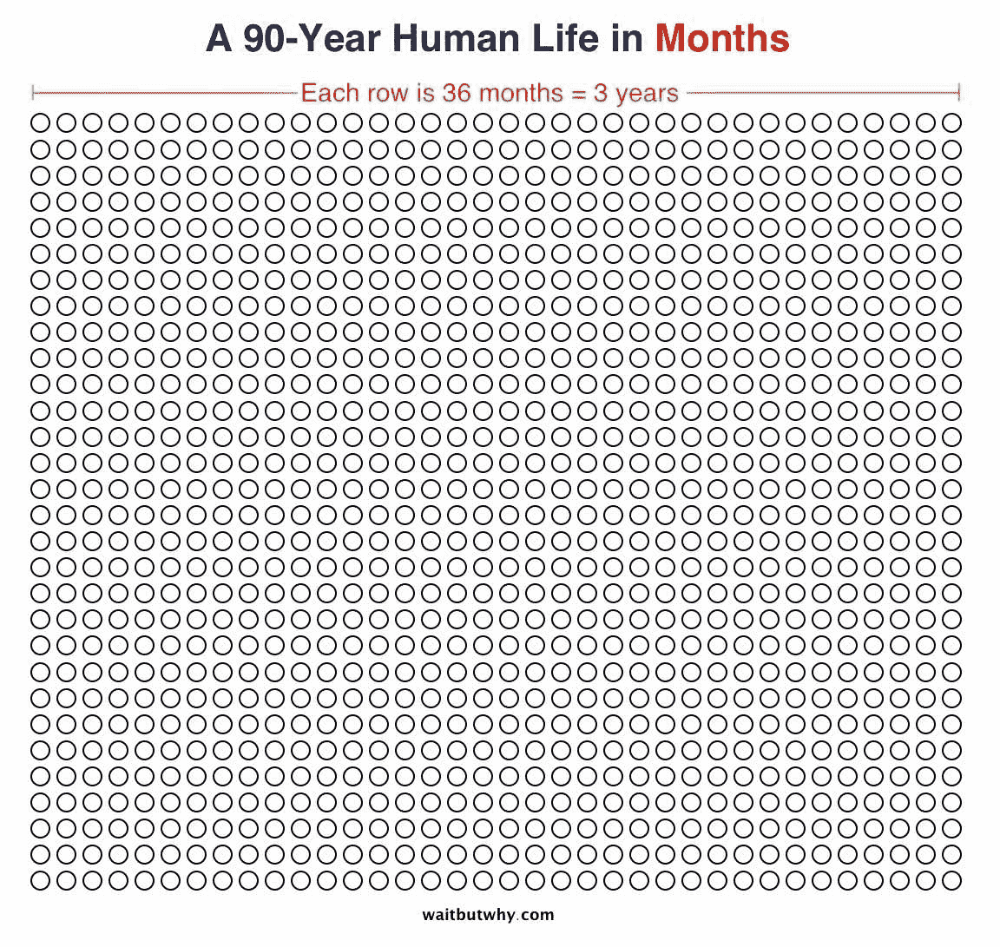
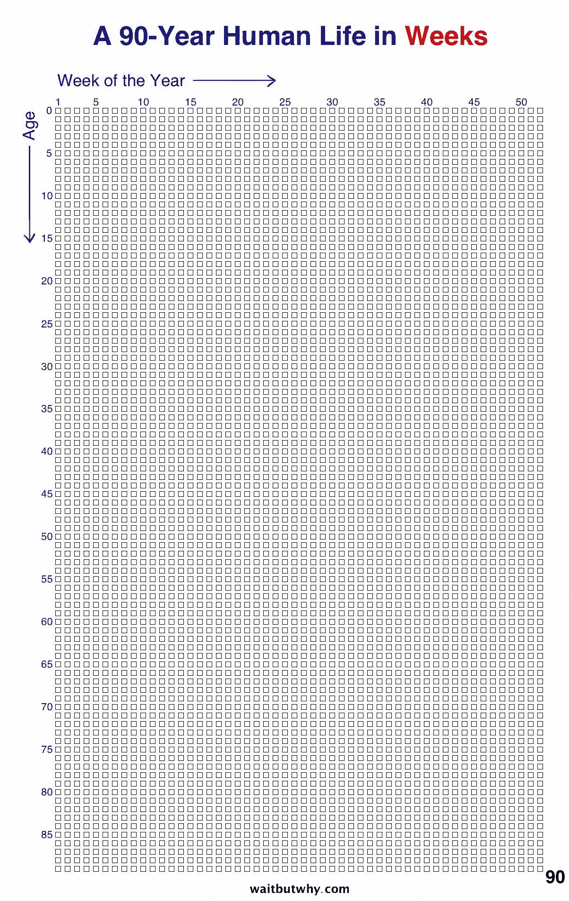
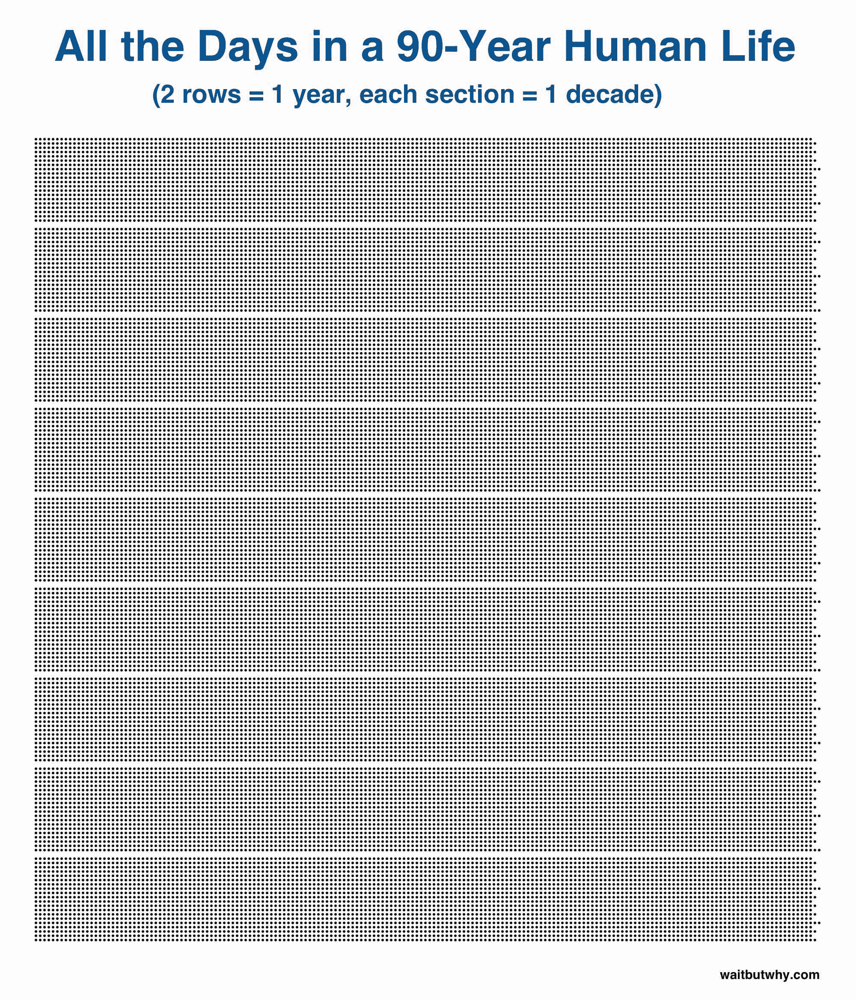
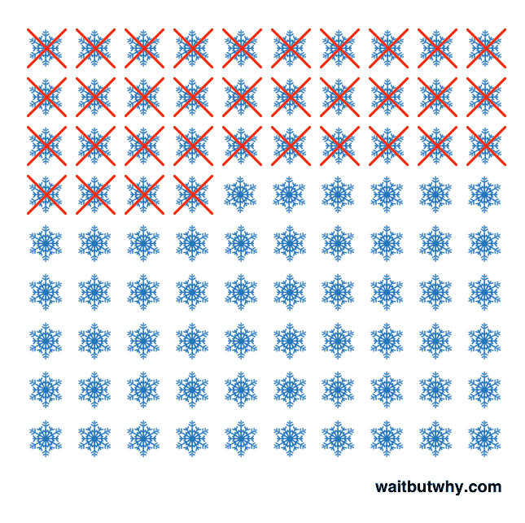
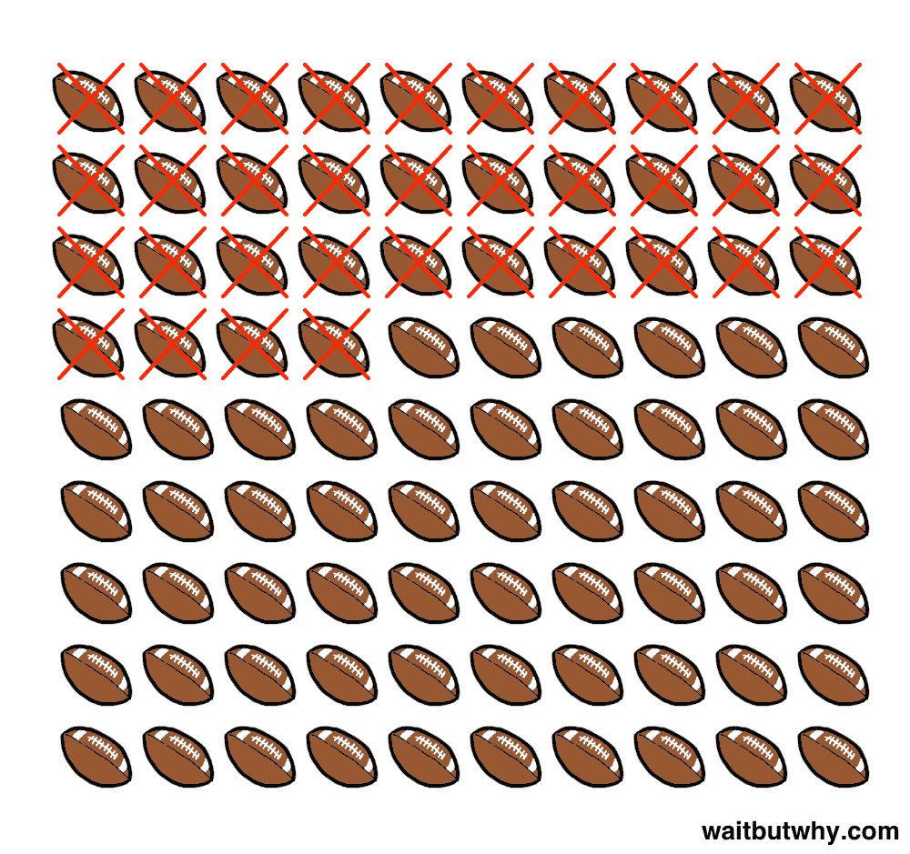
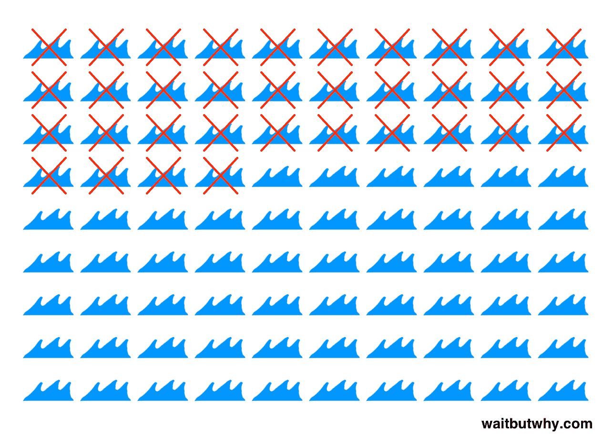
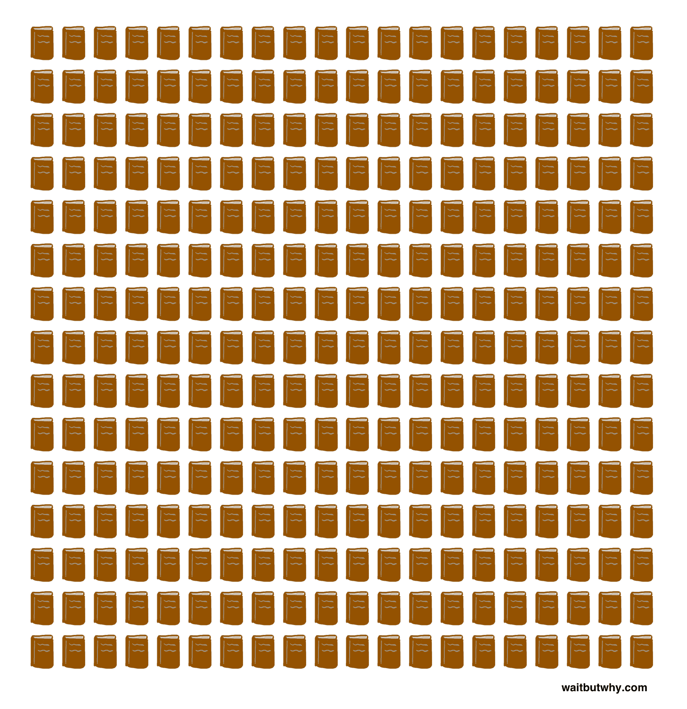
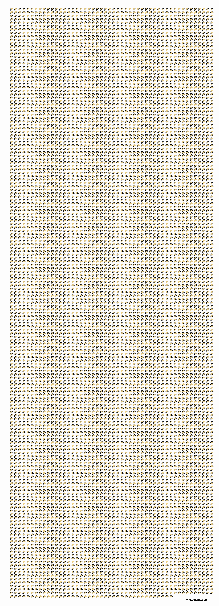

# 尾端——等等，但是为什么

> 原文：<http://waitbutwhy.com/2015/12/the-tail-end.html?utm_source=wanqu.co&utm_campaign=Wanqu+Daily&utm_medium=website>

**我们把这个帖子做了一个花哨的 PDF，供打印和离线查看。[在这里买。【T7](https://gum.co/wbw-tail-end)**

在去年的一篇文章中，我们直观地展示了人类的寿命。按年份:

[T2】](https://waitbutwhy.com/wp-content/uploads/2015/12/Years.jpg)

按月:

[T2】](https://waitbutwhy.com/wp-content/uploads/2015/12/Months.jpg)

按周计算:

[T2】](https://waitbutwhy.com/wp-content/uploads/2015/12/Weeks.jpg)

在写这篇文章的时候，我也做了一个日图，但是看起来有点多，所以我把它省略了。但是去他妈的。

[T2】](https://waitbutwhy.com/wp-content/uploads/2015/12/Days-large-e1449796562773.jpg)

日图和周图一样让我震惊。这些点中的每一个都只是一个星期二或星期五或星期天，但是即使一个幸运的人活到 90 岁，在一张纸上安排他们生命中的每一天也没有问题。

但是自从做了《生活在几周之后》,我一直在想别的事情。

你可以用活动或事件来衡量你的生活，而不是用时间来衡量。以我自己为例:

我 34 岁了，所以让我们超级乐观地说，我会一直画简笔画，直到我 90 岁。如果是这样，我还剩下不到 60 个冬天:

[T2】](https://waitbutwhy.com/wp-content/uploads/2015/12/Winters.png)

可能还剩下 60 只左右的超级猫头鹰:

[T2】](https://waitbutwhy.com/wp-content/uploads/2015/12/Superbowls.png)

海洋是冰冷的，把我的身体放入其中是一种糟糕的生活体验，所以我倾向于限制自己每年大约一次海洋游泳。虽然看起来很奇怪，但我可能只会在海里多呆 60 次:

[T2】](https://waitbutwhy.com/wp-content/uploads/2015/12/Ocean.png)

不算等待，但为什么研究，我每年读大约五本书，所以即使感觉我将来会读不完的书，我实际上不得不在所有的书中只选择 300 本来读，并接受我将永远结束而不知道其余的书发生了什么。

[T2】](https://waitbutwhy.com/wp-content/uploads/2015/12/books.png)

我在波士顿长大，一直去看红袜队的比赛，但如果我再也不搬回那里，我可能会继续以目前的速度每三年去看一次红袜队的比赛——这意味着这一小排 20 人代表我剩余的芬威参观次数:

[T2】](https://waitbutwhy.com/wp-content/uploads/2015/12/sox.png)

在我的一生中，已经有八次美国总统选举，还有大约 15 次。我已经见过五位在任的总统，如果这种速度继续下去，我会再看到九位。

[T2】](https://waitbutwhy.com/wp-content/uploads/2015/12/presidents.png)

我大概一个月吃一次披萨，所以我还有大约 700 次吃披萨的机会。饺子让我的未来更加光明。我大约一个月吃两次中餐，我倾向于每次吃六个饺子，所以我有一大堆饺子可以期待:

[T2】](https://waitbutwhy.com/wp-content/uploads/2015/12/dumplings-small.png)

但这些事情不是我一直在想的。我刚刚提到的大多数事情在我生命中的每一年都以相似的频率发生，这使得它们在时间上分布得相当均匀。如果我已经走过了人生的三分之一，那么我也已经经历了这个活动或事件的三分之一。

我一直在思考的是生活中非常重要的一部分，与所有这些例子不同，它并没有在时间中均匀分布——它的[已经完成/即将完成]比例与我的人生历程完全不一致:

关系。

我一直在想我 60 多岁的父母。在我人生的前 18 年里，我至少有 90%的时间和父母在一起。但是自从我去上大学，然后搬出波士顿后，我可能平均一年只见过他们五次，平均每次两天。一年 10 天。在我童年的每一年中，大约有 3%的时间是和他们一起度过的。

已经 60 多岁了，让我们继续保持超级乐观的态度，说我是一个非常幸运的人，父母都活到 60 多岁。那会让我们多共处 30 年。如果一年十天的事情成立，那还有 300 天可以和爸爸妈妈在一起。比我 18 岁时和他们在一起的时间还少。

当你面对现实时，你会意识到尽管你还没有走到生命的尽头，但你很可能已经接近生命中最重要的人的尽头。如果我列出我将和我父母中的每一个度过的总天数——假设我尽可能幸运的话——这变得非常清楚:

[T2】](https://waitbutwhy.com/wp-content/uploads/2015/12/parents-small.png)

原来，高中毕业的时候，我已经用完了 93%的面对面家长时间。我现在享受着最后 5%的时光。我们在尾端。

我的两个姐姐也有类似的经历。在和他们分别在一所房子里住了 10 年和 13 年后，我现在和他们住在全国的另一边，每年和他们每个人在一起的时间可能只有 15 天。希望这样的话，我们还能剩下 15%的时间。

老朋友也是如此。在高中，我一周大约有五天坐在一起和同样的四个人玩红心大战。在四年里，我们大概聚集了 700 次集体聚会。现在，我们五个人分散在全国各地，有着完全不同的生活和日程安排，每十年大概有 10 天同时呆在同一个房间里。该组处于最后的 7%。

那么我们该如何处理这些信息呢？

抛开我对科技进步能让我活到 700 岁的秘密希望，我在这里看到三点启示:

和你爱的人住在一起很重要。我和住在我的城市的人在一起的时间可能是和住在其他地方的人在一起的时间的 10 倍。

优先级很重要。你与任何人见面的剩余时间很大程度上取决于那个人在你的生活优先列表中的位置。确保这个清单是你自己制定的——而不是无意识的惰性。

优质的时间很重要。如果你和你爱的人在一起的时间只剩下最后的 10%,当你和他们在一起的时候，把这个事实放在你的脑海里，把这段时间当成它的本来面目:珍贵。

___________

如果你喜欢等待但是为什么，注册 **[等待但是为什么电子邮件列表](#)** ，我们会在新帖子出来的时候马上发给你。

如果你有兴趣支持 Wait But Why， **[这里是我们的 Patreon](https://www.patreon.com/waitbutwhy)** 。

你可以在 这里购买这篇文章 **[的 PDF。](https://gum.co/wbw-tail-end)**

___________

**更多需要反思的事情:**

**[驯服猛犸象:为什么你不应该在乎别人怎么想](https://waitbutwhy.com/2014/06/taming-mammoth-let-peoples-opinions-run-life.html)**

**[生活是一幅画，你却活在一个像素](https://waitbutwhy.com/2013/11/life-is-picture-but-you-live-in-pixel.html) 。**这么明显，这么难记。

[**宗教为不宗教**](https://waitbutwhy.com/2014/10/religion-for-the-nonreligious.html) **。**每个人都需要一个成长框架。