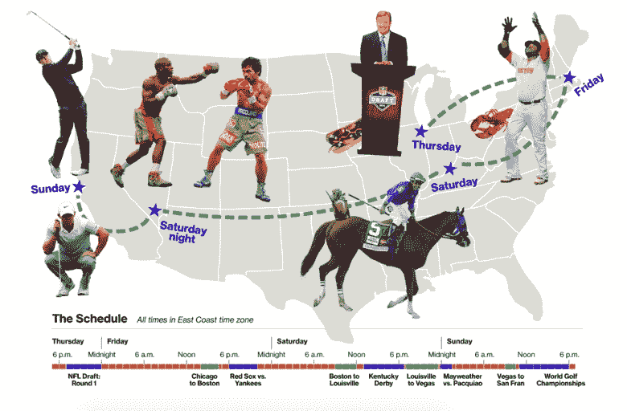

# 彭博的 20 人图形团队如何可视化新闻数字日

> 原文：<http://digiday.com/publishers/bloomberg-graphics-team/?utm_source=wanqu.co&utm_campaign=Wanqu+Daily&utm_medium=website>

上个月，华盛顿特区的地铁系统经历了前所未有的情况:它关闭了一整天，使得 70 万人无法方便地去上班。一大群人吵着要搭车，包括在城市的自行车系统和打车应用程序上。

随着通勤混乱吞噬了这座城市，彭博图形 lept 开始行动。该团队制作了一个名为[“虚拟交通堵塞:重温华盛顿地铁关闭的痛苦”的互动图形。"](http://www.bloomberg.com/graphics/2016-metro-shutdown/)对于其中两张地图(一张显示早上通勤期间的交通状况，另一张显示首都自行车共享网站上有多少辆自行车可用)，该团队提取了可公开访问的数据，并将其叠加在一张地图上。

<noscript></noscript>

A screenshot of Uber’s surge pricing. (Source: Bloomberg)

但对于第三张地图，突出了优步的飙升价格，图形团队没有将数据插入他们的软件的奢侈，因为优步只在个人要求搭车时公开分享其价格信息。因此，图形记者大卫·英戈尔德和亚当·皮尔斯在四个小时内从 20 个地址手动请求了几十次乘坐，并做了笔记，以观察价格会攀升到多高。

“这是一种低技术和原始的获取数据的方式，”英戈尔德告诉 Digiday。“但读者并不关心，他们只关心获得故事。”

英戈尔德是在[彭博图形](http://www.bloomberg.com/graphics)工作的 20 人之一，记者和插画师分布在包括伦敦、纽约特区和香港在内的四个分社。该团队相互合作，并与彭博的记者合作，创造原创的图形和互动，以及补充故事和扩大彭博的吸引力的图形。

最近的插图主题包括健康、科学、政治、体育和流行文化。该团队也没有被授权专门发布与彭博上发布的故事直接相关的图片。他们可以自己追踪头条新闻和热门话题。

“世界上正在发生的事情就是我们所追求的，”英戈尔德说。“当没有任何大的商业故事时，我们的内容也可以填补空白。”

所有彭博记者都有一个名为“烤面包机”的内部工具，可以快速制作简单的图表，但如果他们的报道涉及更复杂的数据，通常会直接使用彭博的图表。“通常情况下，记者们很高兴看到他们的故事被可视化地讲述，”彭博特区的图形记者克洛伊·怀特阿克(Chloe Whiteaker)说。

从那里，图形团队从数据中提取洞察力，为互动提供信息，这可能需要几天甚至几周的时间。有时候，这些数据是从他们自己创造的算法中提取出来的，这让他们比越来越多专注于视觉新闻的新贵更有优势。英戈尔德说:“如果你是唯一拥有数据的人，那么与竞争对手竞争就更容易了。”

英戈尔德说，该团队最初的重点是“让数据变得美丽”。他们越来越多地在图片中加入自己的额外报道，这样人们不仅可以从他们的作品中学习，还可以分享。我们的目标是达到最少一个大的外卖，这将通知和娱乐读者，反过来，他们会感到有必要在社交网站上分享或嵌入图片。

<noscript></noscript>

“How to Have the Greatest Weekend in Sports” (Source: Bloomberg)

图形团队与主页编辑有着“良好的关系”，他们的作品经常被放在彭博主页的显著位置。流量来自彭博自有和运营网站之外的各种平台，包括脸书、Twitter、Reddit，甚至黑客新闻主管。大约一半的流量来自移动设备。有时，这些图片会在广播网上讨论，或者在彭博电视上播放。

因此，图形团队将彭博展示给了通常不会阅读该网站的人。英戈尔德说，他们的成功给了团队“很大的回旋余地”。有时候问题越复杂越好。

“人们很懒，”英戈尔德半开玩笑地说。“我们已经完成了寻找洞见的工作。”

https://digiday.com/?p=171870